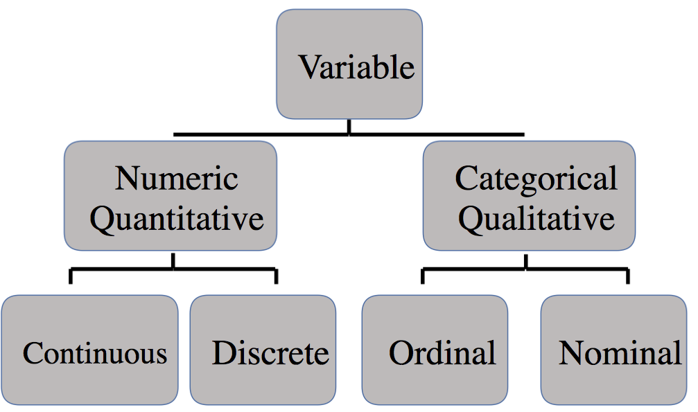

# (PART) Data and Description {-}

# Data

> *Nothing exists except atoms and empty space; everything else is opinion.*
>
>---Democritus

<br>

We cannot effectively convert the raw material of knowledge into a useful product without first understanding the raw material. Therefore, learning statistics naturally begins with learning the types and structures of data.

## Learning objectives {#lo2}

```{block, type='learncheck', purl=FALSE}
- Understand the organization of rectangular data
- Identify the unit of analysis within a dataset
- Identify and distinguish types of variables
- Identify and distinguish types of dataset structures
```

## Rectangular Data

Most data are rectangular, often represented using a standard spreadsheet organized by rows and columns. A rectangle of data is commonly referred to as a **dataset**.

```{r generic-table, include=FALSE}
generic <- tibble(ID = c("Unit of Analysis", "Unit of Analysis", "Unit of Analysis"),
                  Variable_1 = c("Datum", "Datum", "Datum"),
                  Variable_2 = c("Datum", "Datum", "Datum"))
```

```{r print-generic, echo=FALSE}
kable(generic, format = 'html', caption = "Generic rectangular data")
```

<br>

A rectangular dataset has three components. Not all datasets will fit the below description because many datasets are not organized in a tidy manner. The elements of tidy data will be covered in a later chapter.

- **Unit of analysis or observation:** The generic entity or subject a row of data refers to. The unit of analysis uniquely identifies each row of a dataset. If we have a dataset of 50 states and some variables measured in 2020, then our unit of analysis is states. If you were told a specific state, then you could find the row in the dataset. If we have 50 states measured in 2019 and 2020, then the unit of analysis is state-year because you will need to know the state and year to find a specific row.
- **Variable:** A measured characteristic of the unit of analysis. State unemployment rate is a variable for a state unit of analysis.
- **Datum:** The intersection of a variable (column) and a unit of analysis (row) resulting in a cell. The datum is a particular piece of information. A cell could contain something like 4.8 as the unemployment rate for Georgia in 2020.

## Types of variables

The variables in a given dataset can be of several types. Types of variables are important to learn because the types of variables one is dealing with has consequences for data applications, such as description, visualization, and inference.

A variable provides us raw information about the units of analysis. If statistics is a discipline to convert raw information into something useful, then it stands to reason that we should want to know what type of information a variable provides us, especially the specificity of that information. 

For example, suppose you ask two strangers to report their annual income. What options do they have for answers? If virtually any value, then you know to a precise degree the income each earns and can compute the precise difference between the two incomes. What if their choices are either more or less than $50,000? Then, you have a coarse understanding of how much they earn. If they provide different answers, you can only conclude whether one makes more than the other but not by how much. If they provide the same answer, then the two are grouped together even though it is highly unlikely they earn equal incomes. This makes a serious difference for statistical analysis.

<br>
<center>
```{r vartypefig, echo=FALSE, fig.cap="Variable Types"}

```
</center>
<br>

All variables belong to one of two broad types: qualitative (or categorical) and quantitative (or numeric).

- **Qualitative** variables take on values that have no intrinsic numerical meaning. They are expressed in words.
- **Quantitative** variables take on values that do have intrinsic numerical meaning.

### Qualitative variables

Qualitative variables can be further differentiated into two types: nominal and ordinal.

- **Nominal** variables take on values that differ in name only.
- **Ordinal** variables take on values that can be ranked relative to each other but the difference between rankings has no numerical value.

The values that categorical variables take on are commonly referred to as levels. Categorical variables can contain virtually any number of levels, though the number of levels is usually limited. 

A variable such as sex contains two levels: male and female. The variable sex is nominal, as its values have no numerical meaning and the two levels have no ranking. Race, state, country, political party, and any variable coded as yes/no such as unemployed, married, and below the federal poverty line are all examples of nominal variables.

If you have ever participated in a customer satisfaction survey, then you have almost surely contributed data to an ordinal variable. Those scales that provide some number of options from "disagree" to "agree" are called Likert scales. Your answer has no intrinsic numerical value but it can be ranked against the answers of others. One respondent can be said to be more satisfied than another but not by how much. Moreover, one can only trust the results insofar as respondents have the same understanding or frame of reference--the service that satisfied one respondent may not have satisfied another. Other ordinal variables, such as education degree and income level do not have this issue.

### Quantitative variables

Quantitative variables can be further differentiated into two types: discrete and continuous.

- **Discrete** variables take on countable or indivisible values.
- **Continuous** variables take on infinitely divisible values (at least in theory).

The distinction between discrete and continuous can be more difficult to discern but also less consequential for analysis. It is often the case that analytical models treat the two variables the same. However, for a purpose such as data visualization, the distinction can be informative.

Any variable that is a count of persons, places, events, or things is a discrete variable, usually taking on integer values (e.g. 0, 1, 2, 3,...). By contrast, a continuous variable can contain values with an infinite number of decimal places. Even so, continuous variables take on a limited number of decimal places because either we measure phenomena with finite precision or it simply becomes impractical to include so many decimal places.

### Index variables

Index variables are continuous variables but warrant separate discussion. An index variable is a composite measure of multiple variables. They can be used to make a continuous variable out of multiple categorical variables or simplify multiple quantitative variables into one. Purposes such as ranking colleges, measuring poverty beyond income, and determining political ideology make use of index variables.

Index variables mask underlying information. This can be helpful or harmful. In either case, it is important to consider how an index variable is constructed. Doing so can offer insight or uncover problems.

An instructive example familiar to readers is college rankings. U.S. News and World Report [describes](https://www.usnews.com/education/best-colleges/articles/ranking-criteria-and-weights) how rankings are determined. 

What makes a college good? According to these rankings, five percent of what makes a college good is the percent of undergraduate alumni giving a donation as a proxy of student satisfaction. Another 20% is based on the opinions of administrators at peer institutions.

Are these choices wise? This is difficult to say and besides the point. The point is that index variables involve choices made by people and are not naturally occurring data. They are synthetic materials of knowledge and worthy of our discernment. 

## Dataset structures

Just as the type of variable one is dealing with impacts the kinds of visualizations or analyses one should use, so too does the structure of a dataset. Datasets come in three varieties depending on their unit of analysis.

- Cross-sectional
  - Pooled cross-sectional
- Time series
- Panel or longitudinal

**Cross-sectional** data is a snapshot in time measuring some size sample of units. One column serves as the identifier of the unit of analysis, such as the name or ID number of the unit. Notice in Table 2.2 that all one needs to know is the country in order to identify a specific row.

```{r cross-sec-fig, echo=FALSE}
gapminder %>% 
  filter(year == 2007 & continent == 'Americas') %>% 
  head(n=3) %>% 
  kable(format = 'html', caption = "Cross-section example")
```

**Pooled cross-sectional** data could be considered a fourth structure but is simply multiple cross-sections stacked atop each other. The critical quality of pooled cross-sectional data is that each cross-section contains *different* units measured at different times, not the same units measured at different times. Notice in Table 2.3 that the countries included from 2002 are not the same as those included from 2007.

```{r pooled, echo=FALSE}
gapminder %>% 
  filter((year == 2007 & continent == 'Americas') | (year==2002 & continent=='Africa')) %>% 
  head(n=7) %>% 
  arrange(year) %>% 
  kable(format = 'html', caption = "Pooled cross-section example")
```

**Time series** data measures one unit over multiple time periods. The unit of analysis in time series data is time, as it uniquely identifies each row. Notice in Table 2.4 that one country is tracked over multiple years.

```{r timeseries, echo=FALSE}
gapminder %>% 
  filter(country == 'Argentina') %>% 
  tail(n=7) %>% 
  kable(format = 'html', caption = "Time series example")
```

**Panel** (or longitudinal) data measures the same units over multiple time periods. The unit of analysis is pair of unit and time period. Notice in Table 2.5 that in order to identify a specific row, you would need to know the country *and* year. One could also think of panel data as numerous time series.

```{r panel, echo=FALSE}
gapminder %>% 
  filter(continent == 'Americas', year >= 1997) %>% 
  head(n=6) %>% 
  kable(format = 'html', caption = "Panel example")
```

<br>

> **To learn how to examine data in R, proceed to Chapter \@ref(r-data).**

## Key terms and concepts {#kt1}

```{block, type='learncheck', purl=FALSE}
- Unit of analysis
- Variable
- Types of variables: qualitative, quantitative, nominal, ordinal, discrete, continuous, index
- Data structures: cross-sectional, pooled cross-sectional, time series, panel
```