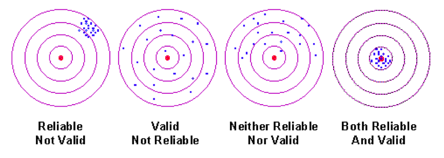

# Measurement and Missing

> *"Will he not fancy that the shadows which he formerly saw are truer than the objects which are now shown to him?*
>
>---Plato

<br>

Once we know the types and structure of our data, we need to understand how the data relates to reality before drawing conclusions from it. Variables and the data they contain are measured representations of reality. They are shadows on the allegorical cave discussed in Plato's *Republic*. We should not immediately assume these shadows are good representations of reality.

## Learning objectives

```{block, type='learncheck', purl=FALSE}
- Assess the measurement validity of variables
- Assess the measurement reliability of variables
- Explain the difference between accuracy and precision
```

## Credible analysis

Measurement validity and reliability are the foundations of credible analysis, the components of which are depicted in Figure 3.1. Without the two, we have little or no basis to make conclusions from data.

<center>
```{r credfig, echo=FALSE, fig.cap="Components of credible analysis"}
include_graphics("images/credible.png")
```
</center>

<br>

This book will address the remaining building blocks in subsequent chapters.

### Measurement validity & reliability

```{block, type='announcement', purl=FALSE}
The following discussion of measurement validity and reliability pertains mostly to data we did not generate ourselves via a survey or other instrument, but rather data generated by someone else that we may want to use for our purposes (i.e. administrative data). When we set out to measure a concept ourselves, it affords us the chance to consider additional aspects of validity and reliability that are not covered here.
```

**Measurement Validity**: Does the variable accurately represent what it claims to represent? Are the values accurate representations of the intended concept/phenomenon?

**Measurement Reliability**: Does the way the variable is measured generate the same value given the same reality? Given two real and identical conditions, will my data contain identical values?

One way to visually represent the concepts of measurement validity and reliability is with the concentric circles of a target or a dart board. At the center of the target is the true concept of interest represented by a variable.

At the center of a yes/no variable such as poverty is perhaps economic stress or eligibility for means tested government welfare programs. The proximity of a variable's measurement to the center concept is the variable's measurement validity.

In addition to its proximity to the center of the target, there is also the issue of whether, given the same condition, repeated measures measures will result in the same value. If so, then the data points on the target should be clustered in close proximity. 

If two cars are speeding in different towns at 80 mph, should we think a dataset recording instances of speeding would report these two cars differently? If not, then we believe the variable to have measurement reliability. If we think the two towns procedures or equipment result in different speeds for two cars traveling at the same speed, then we believe the variable to be unreliable.

The combination of validity and reliability presents four scenarios depicted in Figure 3.2 below.

<center>
```{r, echo=FALSE, fig.cap="Representation of measurement validity and reliability"}

```
</center>

Let us consider an example for each of the four combinations of measurement validity and reliability.

First, consider a before-tax earnings as a measure of labor income. Provided payments are not made under the table, this measure should be valid, as its purpose is to quantify labor income for official government use. As well, the collection of earnings data is reliable; two individuals with equal labor income can be expected to have equal before-tax income reported on their W-2.

What if we used self-reported income as a measure of labor income? Self-reported income is unlikely to be a valid measure because a non-trivial number of respondents may be inclined to provide inflated answers. Nor is there reason to expect exaggerations to follow a mathematical formula that results in equally invalid response given equal true income. Therefore, self-reported income is also an unreliable measure of income.

How about before-tax earnings as a measure of total wealth? This measure is likely to be invalid because wealth includes assets like property and investments. Gross earnings is arguably a reliable measure because it at least captures income in a reliable fashion, and two individuals with equal income might be expected to have somewhat similar levels of wealth, though it is possible for those with high wealth to strategically lower their income.

Lastly, what if we used income as a percentage of the federal poverty line (FPL) as a measure of poverty? Depending on how we define poverty, income relative to FPL may or may not be a valid measure. Let us suppose households earning 100% of the FPL are highly likely to be impoverished and in need of assistance. In this case, we have a valid measure. However, two households of equal impoverishment are unlikely to have equal income relative to the FPL. Costs of living differ across regions, jobs provide various levels of health coverage, and households have various needs with respect to medicine or nutrition. Therefore, this may not be a reliable measure. Key to this measure remaining valid is that the lack of reliability does not result in systematic over- or under-reporting of poverty. 

#### Why this matters

Let us consider another example where an agency needs to allocate resources to state governments according to the number of persons who are homeless in each state. Suppose the *true* count of homeless persons for two states is the same. The four combinations of measurement validity and reliability are depicted in Figure 3.3.

<center>
```{r, echo=FALSE, fig.cap="Comparing measurement validity and reliability"}
include_graphics("images/measure_lines.png")
```
</center>

Though techniques to count the number of homeless persons are improving, one way to count has been to designate a specific day of the year (January 1st) where staff and volunteers conduct a census of homeless people. As a measure, this is known to be invalid and unreliable.

In the case where a valid and reliable measure is taken, the two states receive equal and appropriate amounts of resources. If an invalid and reliable measure is used, the two states receive equal resources, but the amount of resources is less (or more) than what it should be. If a valid and unreliable measure is used, on average, the amount of resources provided is appropriate, but the two states receive different amounts. If an invalid and unreliable measure is used, the two states receive different amounts and the amount of resources provided is systematically less (or more) than what it should be.

The moral of this story is that when you collect data you did not generate yourself for your own purpose, take the time to consider if those data are valid and reliable measures for your intended purpose and what the consequences could be if they are not.

## Missing data

It is not uncommon to encounter missing values in a data. Respondents skip or choose not to answer survey questions, administrators fail to contact respondents, entities that reported data last year may have dissolved or consolidated with another entity this year. Many reasons can lead to missing data. The key is to consider why data are missing and if it should affect your conclusions.

Using the previous example of self-reported income, suppose there are numerous missing values in the responses. Should we assume they are missing at random, or that there is some underlying reason or pattern? Perhaps those with no or low income do not wish to report. If we were to dismiss these missing values, and draw conclusions from the non-missing values, we may severely overestimate the income of the target population.

### Types of missing data

Missing data come in two flavors:

- **Explicit:** data that we can see are missing in the data; cells containing a value that denotes missing
- **Implicit:** data that we would expect to be included based on data structure but are not; no obvious sign of missing

Table 3.1 shows an example of data that are explicitly missing denoted by `NA`. Missing data is denoted in a variety of ways. For example, instead of `NA`, the cells could have been left empty, or filled with a period, or some other symbol. If data were obtained from an organization that regularly produces publicly available data, datasets are usually accompanied by a legend that explains what symbols denote missing. 

```{r, echo=FALSE}
crossgap <- gapminder %>% 
  filter(year == 2007 & continent == 'Americas') %>% 
  head(n=3)

crossgap[1,4] <- NA
crossgap[2,6] <- NA

kable(crossgap, format = 'html', caption = "Example of explicitly missing data")
```

```{block, type='announcement', purl=FALSE}
Beware ambiguous missing values. For instance, some survey questions are dependent on previous questions. You do not want to conclude that a value is missing because a respondent chose not to answer when they were never asked the question. Or perhaps a value is missing when it should actually equal 0 or vice versa. If missing data are consequential to your analysis, then you may need to investigate further into how the data were collected or coded in order to eliminate such ambiguity.
```

Table 3.2 shows an example of implicitly missing data. Argentina is observed in 1997, 2002, and 2007, but Bolivia is observed only in 1997 and 2007. What happened to the 2002 observation for Bolivia? This sort of entry and exit from the dataset is common in panel data where the same units are observed over multiple time periods. 

```{r, echo=FALSE}
gapminder %>% 
  filter(continent == 'Americas', year >= 1997) %>% 
  head(n=6) %>%
  filter(country!='Bolivia' | year!=2002) %>% 
  kable(format = 'html', caption = 'Example of implicitly missing data')
```

Note that the missing Bolivia observation was easy to spot because the dataset is extremely small. If we were dealing with a large dataset, this would not have been so obvious. A quick way to check whether there may be implicitly missing observations is to check the number of observations in your data. If you are under the impression that your data contains all 50 states for 10 years, then you should have 500 observations. If not, some states or years must be missing.

> **To learn how to work with missing data in R, proceed to Chapter \@ref(r-missing-data).**

## Key terms and concepts

```{block, type='learncheck', purl=FALSE}
- Measurement validity
- Measurement reliability
- Measurement precision
- Implicitly missing data
- Explicitly missing data
```
