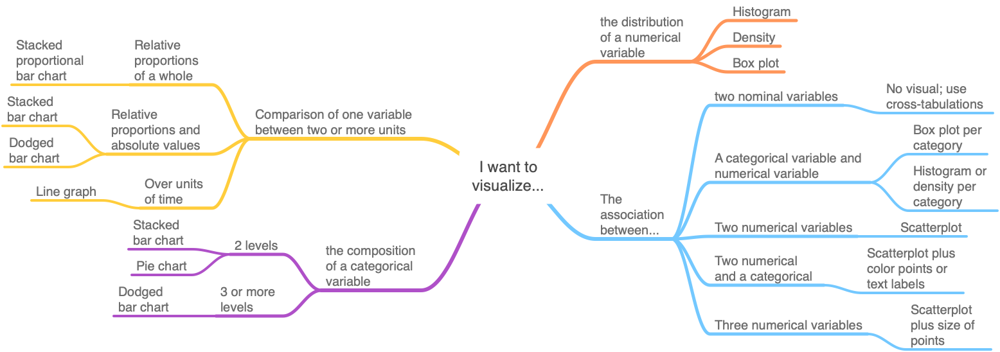

# Data Visualization

> *"The pen is mightier than the sword, especially if it draws a graph."*

## So many choices

The world of data visualization is incredibly diverse and detailed. You could spend a substantial amount of time learning how to construct the best visualization given particular data and the the intended message. Such depth is far beyond the scope of this book. For more coverage on data visualization, I recommend the following resources:

- [Flowing Data](https://flowingdata.com)
- [Data Viz by Kieran Healy](https://socviz.co/index.html#preface)

Figure \@ref(fig:flowdata) below provides a sense of deciding between many options.

```{r flowdata, echo=FALSE, fig.cap='A detailed data viz flowchart'}
include_graphics('_bookdown_files/flowdata_viz.jpg')
```

At a basic level, most choices of visualization can be determined based on:

- The kind of description we want to convey, and
- the kinds of variables we are working with.

This decision tree for visualizations is depicted in Figure \@ref(fig:vizflow) below.

```{r vizflow, echo=FALSE, fig.cap='Basic data viz decisions'}

```

The above flowchart contains variations on six visualizations that cover most needs:

- Histogram or density plot
- Box plot
- Pie chart
- Bar chart or dot plot
- Line graph
- Scatter plot

Sections that follow briefly explain each of these six visualizations.

## Distribution

### Histogram

You have already seen several histograms. A histogram visualizes the the distribution of a single variable by counting the number of occurrences for values that fall within a certain range. The frequency of occurrences within each range is represented by a vertical rectangle. 

Figure \@ref(fig:gradmedhist) shows the median earnings of those employed full time for different graduate degree majors. We can see that most graduate degrees result in a median pay for graduates of between 60 and 80 thousand dollars. There are a few graduate majors for which the median pay is above 100 thousand dollars.

```{r gradmedhist, echo=FALSE, fig.cap='Histogram of full-time median earnings for different graduate school majors', cache=TRUE}
ggplot(college_grad_students, aes(x = grad_median)) +
  geom_histogram(bins = 30, fill = 'steelblue', color = 'white') +
  labs(x = 'Median earnings', y = 'Count of graduate majors') +
  theme_classic()
```


These rectangles are called `bins` and the range each rectangle covers is called a `binwidth`. We can specify the number of bins and/or the binwidth. If we have more than 150 observations of a continuous variable, we may want to specify as many as 100 bins but should experiment with this number depending on the particular distribution of the variable. If we have less than 30 observations, we should not use a histogram. If we have more than 30 but less than 150 observations, we should experiment with some number of bins between 30 and 100. Regarding binwidth, if our variable is discrete, then our binwidth should equal the natural integer width. For example, if our variable is a count of weeks, then our binwidth should equal 1 so that each bin contains one week.

### Density

A density plot is simply a variation of the histogram that requires many observations to work well. We should not use a density plot unless we have at least 1,000 observations. Instead of rectangular representations of the frequency of values, the density plot uses a smooth line, as if one traces a line over the tops of the rectangles of a histogram. One key difference between a density plot and histogram is that the height of a density plot is based on proportions of occurrences for values relative to the total number of observations, whereas a histogram counts the number of occurrences of values. 

Figure \@ref(fig:gradmeddens) is a density of the same data as in the histogram. These data have only 173 observations. This is why the proportions on the y axis are so small. Nevertheless, the density provides us the shape of the distribution.

```{r gradmeddens, echo=FALSE, fig.cap='Density of full-time median earnings for different graduate school majors', cache=TRUE}
ggplot(college_grad_students, aes(x = grad_median)) +
  geom_density(fill = 'steelblue', color = 'white') +
  labs(x = 'Median earnings', y = 'Proportions of college majors') +
  theme_classic()
```

### Box plot

A box plot (or box-and-whiskers plot) is similar to the histogram and density plot, but a box plot tries to combine a complete view of a distribution and several visual markers denoting some of the descriptive measures covered in Chapter \@ref(descriptive-statistics). Figure \@ref(fig:gradmedbox) shows the median pay data. 

```{r gradmedbox, echo=FALSE, fig.cap='Box plot of full-time median earnings for different graduate school majors', cache=TRUE}
ggplot(college_grad_students, aes(x = grad_median)) +
  geom_boxplot(fill = 'steelblue') +
  labs(x = 'Median earnings') +
  coord_flip() +
  theme_classic() +
  theme(axis.line.x = element_blank(),
        axis.text.x = element_blank(),
        axis.ticks.x = element_blank())
```

The line in the middle of the box denotes the median of the variable's distribution. The top and bottom edges of the box denote the 75th and 25th percentiles, respectively. Therefore, the length of the box denotes the IQR of the variable's distribution. The whiskers of a boxplot extend 1.5 times the length of the box (IQR). This 1.5*IQR is a standard threshold to identify extreme values also known as outliers. If a variable contains values beyond this threshold, a box plot will single them out with dots beyond the end of the whisker.

## Compostion of a category

Suppose we deemed a graduate degree for which 5% or more of its graduates are unemployed to be a "high" unemployment degree, and those with an unemployment rate less than 5% as a "low" unemployment degree. We have 173 graduate degree majors. Suppose we want to visualize the composition of this categorical unemployment variable.

### Pie charts

Pie charts are much derided. This derision is due to the fact that pie charts are often misused. Pie charts are acceptable if you want to show the composition of one categorical variable for which there are no more than 3 levels, though preferably no more than 2 levels. We should *never* use pie charts to compare the composition of a categorical variable between two groups or time periods. Figure \@ref(fig:emppie) shows the composition of our unemployment variable.

```{r, include=FALSE}
gradschool <- college_grad_students %>% 
  mutate(unemp_cat = if_else(grad_unemployment_rate >= 0.05, "high", "low"))

gradschool$unemp_cat <- as.factor(gradschool$unemp_cat)
```

```{r, include=FALSE}
bp_emp <- ggplot(gradschool, aes(x = "", fill = unemp_cat)) +
  geom_bar()

bp_emp
```

```{r, include=FALSE}
pie <- bp_emp + coord_polar("y", start=0)
```

```{r, include=FALSE}
blank_theme <- theme_minimal()+
  theme(
  axis.title.x = element_blank(),
  axis.title.y = element_blank(),
  panel.border = element_blank(),
  panel.grid=element_blank(),
  axis.ticks = element_blank(),
  plot.title=element_text(size=14, face="bold")
  )
```

```{r emppie, echo=FALSE, fig.cap='Graduate degrees with high/low unemployment', cache=TRUE}
pie + blank_theme +
  theme(axis.text.x=element_blank())+
  labs(fill = 'Unemployment')
```

### Bar chart

Bar charts can be used to present the same information as a pie chart. Moreover, bar charts are easier to interpret, can handle any number of levels, can present data as proportions or total counts, can be used to compare across groups or time, and are easier to make. In short, bar charts are better than pie charts, and we should choose bar charts unless someone forces us to use a pie chart for some reason.

The figures below show the three general types of bar charts. Figures \@ref(fig:empbar) and \@ref(fig:empbar2) show the composition of our unemployment variable in terms of absolute counts. Figure \@ref(fig:empbar) is commonly referred to as a `stacked` bar chart, while Figure \@ref(fig:empbar2) is referred to as `dodged`. Figure \@ref(fig:empbar3) shows the composition in terms of proportions. That is, we can see that slightly over 75% of graduate degrees have low unemployment.

```{r empbar, echo=FALSE, fig.cap='Graduate degrees with high/low unemployment', cache=TRUE}
bp_emp +
  labs(y = 'Count of degrees',
       fill = 'Unemployment') +
  theme_classic() +
  theme(axis.line.x = element_blank(),
        axis.text.x = element_blank(),
        axis.ticks.x = element_blank(),
        axis.title.x = element_blank())
```

```{r empbar2, echo=FALSE, fig.cap='Graduate degrees with high/low unemployment', cache=TRUE}
bp_emp2 <- ggplot(gradschool, aes(x = unemp_cat)) +
  geom_bar(fill = 'steelblue')

bp_emp2 +
  labs(y = 'Count of degrees',
       fill = 'Unemployment') +
  theme_classic() +
  theme(axis.line.x = element_blank(),
        axis.ticks.x = element_blank(),
        axis.title.x = element_blank())
```

```{r empbar3, echo=FALSE, fig.cap='Graduate degrees with high/low unemployment', cache=TRUE}
bp_emp3 <- ggplot(gradschool, aes(x = "", fill = unemp_cat)) +
  geom_bar(position = 'fill') 

bp_emp3 +
  labs(y = 'Proportion of degrees',
       fill = 'Unemployment') +
  theme_classic() +
  theme(axis.line.x = element_blank(),
        axis.text.x = element_blank(),
        axis.ticks.x = element_blank(),
        axis.title.x = element_blank())
```

## Comparing between units

### Bar chart

If we want to compare one variable across multiple groups or units that are not time, then a bar chart is a good choice.

Suppose we wanted to compare the median pay between two or more graduate degrees.  

```{r, include=FALSE}
gradschool_spia <- college_grad_students %>% 
  filter(major %in% c('Public Administration', 'Public Policy', 'Political Science And Government', 'International Relations'))
```

```{r spiapay, echo=FALSE, fig.cap='Comparison of median pay between degrees in public and international affairs', cache=TRUE}
ggplot(gradschool_spia, aes(x = reorder(major, -grad_median), y = grad_median)) +
  geom_col(fill = 'steelblue') +
  coord_flip() +
  theme_classic() +
  labs(y = 'Median pay') +
  theme(
    axis.title.y = element_blank(),
    axis.line.y = element_blank(),
    axis.ticks.y = element_blank()
  )
```

### Dot plot

Dot plots serve the same purpose as bar charts, but are more appropriate for variables that measure something we would not naturally stack up for counting purposes. That is, money is stackable--we could imagine each bar as a stack of cash. By contrast, unemployment rates are not somethings we would stack on top of each other.

```{r spiaemp, echo=FALSE, fig.cap='Comparison of unemployment rates between degrees in public and international affairs', cache=TRUE}
ggplot(gradschool_spia, aes(x = grad_unemployment_rate, y = reorder(major, -grad_unemployment_rate))) +
  geom_point(color = 'steelblue', size = 3) +
  theme_classic() +
  scale_x_continuous(limits = c(0,0.1)) +
  labs(x = 'Unemployment rate') +
  theme(
    axis.title.y = element_blank(),
    axis.line.y = element_blank(),
    axis.ticks.y = element_blank()
  )
```

### Line graph

If we want to compare values of a variable across units of time (i.e. change over time), then a line graph is probably the most common choice, though a bar chart or dot plot work too. 

The graduate degree data is cross-sectional, so there is no good way to make a line graph. I trust you have seen one before.

## Association

Associations involve two or more distributions. We can visualize multiple distributions using a scatter plot if both variables are continuous or discrete with many values, or we can use a histogram or box plot if we want to visualize how the distribution of a continuous variable changes for each level of a categorical variable.

### Categorical and numerical

Suppose we wanted to visualize the association between attaining a graduate degree or not and median pay. Whether to attain a graduate degree is a categorical variable with two levels. Therefore, we can use a box plot to visualize the distribution of median pay for employees with undergraduate degrees in the 173 majors in our data and the distribution of median pay for employees with a graduate degree in those same majors. Figure \@ref(fig:gradpaydiffbox) below does just that.

```{r gradpaydiffbox, echo=FALSE, fig.cap='Median pay for undergraduate and graduate degrees of the same group of majors', cache=TRUE}
ggplot(gradschool) + 
  geom_boxplot(aes(x='Undergraduate', y = nongrad_median), fill = 'steelblue') +
  geom_boxplot(aes(x = 'Graduate', y = grad_median), fill = 'steelblue') +
  labs(y = 'Median pay') +
  theme_minimal() +
  theme(
    axis.title.x = element_blank(),
    axis.ticks.x = element_blank(),
    panel.grid.major.x = element_blank()
  )
```

Overlaying histograms for each level could work too as is done in Figure \@ref(fig:gradpaydiffhist).

```{r gradpaydiffhist, echo=FALSE, message=FALSE, fig.cap='Median pay for undergraduate and graduate degrees of the same group of majors', cache=TRUE}
ggplot(gradschool) + 
  geom_histogram(aes(x = nongrad_median), fill = 'steelblue', color = 'black', alpha = 0.4) +
  geom_histogram(aes(x = grad_median), fill = 'pink', color = 'black', alpha = 0.4) +
  labs(x = 'Median pay') +
  theme_minimal()
```

### Scatter plot

The most common visualization for associations is the scatter plot, which you saw several times in Chapter \@ref(descriptive-statistics). It is also common to overlay a simple regression line for the two variables, thus providing a reader the full scatter of the two distributions as well as a tracing of how the two variables move in tandem, *on average*.

Suppose we wanted to visualize the relationship between median pay of graduate degrees and the total number of people with that graduate degree. Do more people tend to enroll in the programs that pay the most?

```{r gradpayenroll, echo=FALSE, message=FALSE, fig.cap='Graduate degree median pay and total number of people with degree', cache=TRUE}
ggplot(gradschool, aes(x = grad_median, y = grad_total)) +
  geom_point(color = 'steelblue', size = 2) +
  geom_smooth(method = 'lm', se = FALSE, linetype = 'dashed', color = 'black') +
  scale_y_log10(label=scales::comma_format()) +
  labs(y = 'Total degrees',
       x = 'Median pay') +
  theme_minimal()
```

The logic of visualization choice discussed in this chapter applies regardless of what particular software one uses. To learn how to generate most of these graphs in R, proceed to Chapter \@ref(r-visualization).