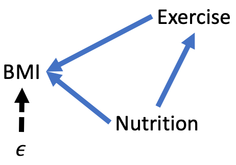
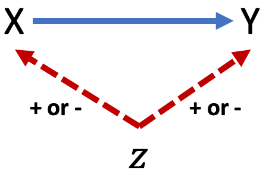

# Causation and Bias

> *"All models are wrong but some are useful."*
>
>---George Box

Our regression toolbox has grown considerably over the previous three chapters. We can now set out to answer a multitude of research questions that require us to accommodate different types of variables that may share linear or nonlinear relationships. Nevertheless, a model is a simplified version of our complex world. In this sense, all models are wrong. The goal is to make modeling choices that prevent our model from being *so* wrong that they are useless for decision-making.

## Learning objectives {#lo9}

- Explain the difference between using regression to predict an outcome versus explain an outcome and the consequences each has on model choices
- Explain internal and external validity
- Explain the criteria to validly claim a causal relationship
- Use a directed acyclical graph (DAG) to represent a regression model
- Identify confounders and colliders in a DAG
- Identify the number of backdoor paths in a DAG and each are open or closed
- Given a DAG, identify the variables one would need to control for to close any backdoor paths
- Determine whether a regression model plausibly eliminates omitted variable bias
- Predict the direction of omitted variable bias

First, let's consider the two possible goals of regression:

- **Explain** the change in an outcome due to a change in a set of explanatory variables
- **Predict** the value of an outcome given values for a set of explanatory variables

The usefulness of a model with the sole goal of prediction is how well it predicts the outcome. That may sound obvious and cyclical but it is an important point. Which variables we choose to include and their linear or nonlinear relationships is a secondary concern of prediction, if at all. If we don't care *how* variables affect the outcome and only care about predicting the outcome with the greatest accuracy and precision possible, then we can throw together whatever model we want to achieve that without much concern for what the model actually means.

Models with the goal of prediction are common within the field of forecasting, which will be introduced in Chapter \@ref(forecasting). Sometimes, we care about good prediction and *how* some explanatory variables impact the outcome. Then we are back in the realm of explanation where we have to take special care about which variables are included and excluded from our model as well as how they relate with each other.

The focus of this chapter is explanation using regression. Many scenarios within program evaluation or policy analysis involve explaining whether and to what extent one variable impacts another we care about changing. Ultimately, our concern is causality. It is one thing to conclude two variables are associated with each other; it is an entirely different thing to conclude that a change in one variable *causes* the other to change. If we propose to spend millions of dollars on a program to help people, or decide to cut a program that does not, we should be as certain as about this causal claim as statistics allows us to be.

Sufficient understanding of causality or causal inference warrants its own course. It does not involve regression models that much different from what you have learned so far or will learn by the end of this book, but it does involve a broader and deeper understanding of research design and knowing how to identify threats to internal and external validity. Let us revisit the figure of credible analysis first shown in Chapter \@ref(measurement-and-missing).

<center>
```{r credfigrepeat, echo=FALSE, fig.cap="Components of credible analysis"}
include_graphics("images/credible.png")
```
</center>

Chapter \@ref(measurement-and-missing) covered measurement validity and measurement reliability. Now, let us define internal validity and external reliability.

- **Internal validity:**  the credibility of the theoretical assumptions applied to the causal connection established between the explanatory variable(s) and its (their) effect on the outcome.
- **External validity:**  can results of the analysis be applied beyond the subjects included or context involved?

In other words, is there reason to believe our results are critically mistaken and are those affected or the context in which they were affected so unique or limited that we can not generalize to other potential targets or contexts?

## Causality

Three conditions must be met to credibly claim a causal relationship. We will address each in turn.

- The explanatory variable is correlated with the outcome
- The change in the explanatory variable occurred prior to the change in the outcome
- No alternative explanation exists to which the change in the outcome could be attributed instead of the explanatory variable

Correlation between the explanatory and outcome variables is perhaps the most straightforward condition to satisfy. We have not yet covered inference and how to identify statistically significant results. For now, suffice it to say that if we run a regression and the estimate for our explanatory variable is statistically significant, then we have established correlation between the explanatory and outcome variables that is unlikely to be random.

The second condition is succinctly referred to as **temporal precedence**. In order for something to be a cause, it must occur prior to its alleged effect. Otherwise, perhaps it is our supposed outcome that is having an effect on the cause, similar to what was considered in Chapter \@ref(categorical-variables-and-interactions) with the mandatory jail for drunk driving. This is also known as **reverse causality**. 

Reverse causality could still be argued even when it seems clear the cause occurred prior to the effect. For example, the mere availability of a scholarship may cause students to reach higher levels of academic achievement. If we were to claim receipt of the scholarship caused a rise in the likelihood of completing college, which obviously occurred prior to graduation, this may not be accurate. Perhaps by virtue of motivating oneself to perform better in school would result in a higher likelihood of graduation whether the scholarship was received or not. Then again, the student would not have been as motivated if not for the scholarship. Perhaps the *availability* of the scholarship would meet temporal precedence more convincingly.

As may be evident by now, something as seemingly simple as before-and-after can become complex if the causal pathway is considered carefully. Credible causal claims require subject matter expertise as much as quantitative skills. For temporal precedence, do your best to ensure your explanatory variable was measured or occurred prior to when your outcome was measured or occurred. 

The remainder of this chapter concerns the third and most difficult condition to satisfy:  no plausible rival or alternative explanation for our causal claim. Since we do not have the luxury of delving deep into causal modeling, what can MPA students learn that will serve them well when they need to consider whether the possibility of alternative explanations has been reasonably eliminated? My answer to this is the **directed acyclical graph**.

## Directed acyclical graphs

Directed acyclical graphs (DAGs) are visual representations of causal pathways. Constructing a DAG involves theory, existing research, or theory. A DAG requires us to state our assumptions clearly, thus allowing us and others to evaluate the internal validity of our model. 

Figure \@ref(fig:dagbasic) below shows a basic DAG. This model involves three variables, X, Y, and Z. Y denotes the outcome and X denotes the variable of primary interest for which we intend to estimate a causal effect. Z denotes any other variables in the model. The arrow from X to Y indicates our claim that X causes changes in Y. X also causes Z to change, and Z causes Y to change. In this example, the claim is that X has a direct effect on Y and an indirect (mediated) effect on Y through Z.

<center>
```{r dagbasic, echo=FALSE, fig.cap='A basic DAG'}
include_graphics('images/dag_basic.png')
```
</center>

Any DAG follows a few rules and conventions:

- Only one-directional arrows (directed)
- No arrow from Y back to X (acyclical)
- Solid arrows used for relationships between observable variables or variables specifically observed in our data
- Dashed arrows used for relationships between unobservable variables (e.g. ability, attitudes, propensities for certain behaviors) or variables unobserved in our data

Underlying every regression with the goal to explain a causal relationship is a DAG. Consider the following regression model

\begin{equation}
BMI = \beta_0 + \beta_1Exercise + \epsilon
(\#eq:dagreg)
\end{equation}

Figure \@ref(fig:dagreg) below shows the DAG that corresponds with Equation \@ref(eq:dagreg). The central claim is that exercise causes BMI to change. Therefore, there is a solid arrow from exercise to BMI. Also, note that because $\epsilon$, by definition, represents all other unobserved factors that affect BMI, there is a dashed line from $\epsilon$ to BMI. Lastly, this DAG makes the assumption that no variables contained in $\epsilon$ affects exercise, nor does exercise affect any variables contained in $\epsilon$

<center>
```{r dagreg, echo=FALSE, fig.cap='DAG representation of a regression model'}
include_graphics('images/dag_reg.png')
```
</center>

With this basic set-up, we can begin to learn how to evaluate a DAG in order to determine if our regression model credibly eliminates alternative explanations of our causal claim. 

### Evaluationg DAGs

We will review two aspects of evaluating DAGs for causal claims:

- Identifying backdoor paths
- Adjusting regression models based on the presence of confounding or colliding variables

A backdoor path is any indirect path from X to Y no matter the direction of the arrows that connect it. For example, Figure \@ref(fig:dagbasic) has one backdoor path: X --> Z --> Y. Figure \@ref(fig:dagreg) has no backdoor paths between exercise and BMI.

#### Confounders {-}

Identifying backdoor paths allow us to then identify whether confounding or colliding variables are present in our model. Figure \@ref(fig:dagconf) below shows a variation on the simple DAG with one backdoor path. The backdoor path still runs from X to Z to Y, but now the direction of the arrows connecting this path are different. Specifically, the backdoor path is X <-- Z --> Y. 

<center>
```{r dagconf, echo=FALSE, fig.cap='Example of confounder variable'}
include_graphics('images/dag_confound.png')
```
</center>

The variable Z in this case is a **confounder**. Any variable in a backdoor path with arrows directed away from it toward X and Y is a confounder. This representation means Z affects X and Y. If as Z changes, X and Y change, then we may incorrectly attribute the effect of Z on Y to the effect of X on Y because it appears to us that as X changes, Y changes. And it does, but it is really Z that is causing changes. 

This example of a confounder is sometimes referred to as spurious correlation. For example, ice cream sales and crime are spuriously correlated due to both increasing because of temperature. It would be mistake to claim an increase in ice cream sales causes an increase in crime.

#### Colliders {-}

Figure \@ref(fig:dagcoll) below shows another variation of the simple DAG with one backdoor path between X and Y that goes through Z. The direction of the arrows are such that this backdoor path can be written as X --> Z <-- Y. In this case, Z is a **collider**. Any variable on which the arrows connecting X and Y converge is a collider. 

<center>
```{r dagcoll, echo=FALSE, fig.cap='Example of collider variable'}
include_graphics('images/dag_collide.png')
```
</center>

Z is just some variable that is affected by both X and Y. Changes in Z do not cause changes in X or Y. Therefore, if we estimate how much Y changes in response to a change in X, Z has nothing to do with that causal estimate.

### Backdoor criterion

For any theoretical model we intend to estimate via regression, we can now identify backdoor paths and whether there are confounding or colliding variables along those backdoor paths. How do we use this information to eliminate plausible alternative explanations and confidently claim a one-unit change in X causes Y to change by $\beta$? We need to satisfy the **backdoor criterion**.

The backdoor criterion is satisfied if all backdoor paths between X and Y are closed. We know if a backdoor path is open or closed depending on the presence of confounding or colliding variables.

- A confounder variable opens a backdoor path
- A collider variable closes a backdoor path

If a backdoor path is open, we can close it by controlling for the confounder variable or any other variable along the backdoor path between X and Y. For instance if were were to identify a backdoor path of the following form

X <-- Z --> A --> Y

where A is some fourth variable in our model, then controlling for Z or A will close this backdoor path. If a set of control variables in our regression model closes all backdoor paths, then we have satisfied the backdoor criterion and we can consider our estimate of X on Y to be a causal estimate.

Consider the simple backdoor path again where Z is a collider variable.

X --> Z <-- Y

This backdoor path is already closed. We don't need to control for anything in our model because of this backdoor path. In fact, **controlling for a collider opens a backdoor path**. Therefore, we should not control for Z in our model, as doing so opens a backdoor that was already closed. 

This is a valuable insight provided by the use of DAGs. If we already have the data, it costs us virtually no time or effort to include a variable in our model we think may affect our outcome Y, and it can be quite tempting to throw variables into a regression model for not much more reason than we have it in our data. However, a DAG forces us to consider all of the relationships between the variables in our model. If an explanatory variable is a collider, then including it may threaten our ability to make causal claims. Sometimes, deliberately excluding a variable from a regression model is the right choice and DAGs give us a fairly simple way to make and explain that choice.

Consider another backdoor path where Z is a collider and A is a confounder

X --> Z <-- A --> Y

A opens this backdoor path but Z blocks A's confounding. Controlling for Z would open this backdoor path. We can control for A in our regression without reopening the backdoor path, but it is not necessary.

### DAGs and regression

Let us relate this new information to making choices about regression models. Referring back to Equation \@ref(eq:dagreg) and Figure \@ref(fig:dagreg), recall that $\epsilon$ represents all other variables we do not observe or cannot include in our regression model but affect our outcome, BMI. Based on the DAG for this regression model, there are no backdoor paths. Therefore, whatever estimate we get for $\beta_1$ is causal estimate.

However, Figure \@ref(fig:dagreg) is probably incorrect. There are likely variables contained in $\epsilon$ that affect exercise. If that is the case, then our DAG should be drawn like Figure \@ref(fig:dagregovb) below. Now we have a backdoor path of the form

Exercise <-- $\epsilon$ --> BMI

where $\epsilon$ is a confounder. Therefore, this backdoor path is open, and because we do not observe the variables in $\epsilon$, we do not currently have the means to close it.

<center>
```{r dagregovb, echo=FALSE, fig.cap='Counfounding error term'}
include_graphics('images/dag_regovb.png')
```
</center>

The issue illustrated by Figure \@ref(fig:dagregovb) is commonly referred to as **omitted variable bias** (OVB) and it is the bane of analysts' attempts to estimate causal relationships. To have omitted variable bias means we have failed to satisfy the third criterion of causality. There is a variable out there we have not controlled for which causes our explanatory variable of interest and our outcome to change. Therefore, we cannot trust our estimate of the effect of our explanatory variable on our outcome because it may be due to the omitted variable. In other words, an omitted variable is biasing our estimate, $b_1$ to be systematically above or below the population parameter $\beta_1$.

Our next task then is to identify the set of variables that would eliminate the arrow from $\epsilon$ to exercise. If we can credibly break the link between $\epsilon$ and our explanatory variables, then we can credibly claim there is no omitted variable bias in our model.

For the sake of this example, suppose healthy eating is the key omitted variable. Healthy nutrition gives us the energy to exercise and obviously affects our BMI. Suppose we collect a variable that measures the extent to which a person's diet is healthy. Now, we have a new DAG, as depicted in Figure \@ref(fig:dagregnut).

<center>
```{r dagregnut, echo=FALSE, fig.cap='Eliminating OVB'}

```
</center>

To close the backdoor path in this DAG, we need to control for nutrition in our regression model. Equation \@ref(eq:dagreg2) shows our new regression model. If our theory informing our new DAG is correct, then our estimates of $\beta_1$ and $\beta_2$ are unbiased.

\begin{equation}
BMI = \beta_0 + \beta_1Exercise + \beta_2Nutrition + \epsilon
(\#eq:dagreg2)
\end{equation}

The DAG in Figure \@ref(fig:dagregnut) may still be fail to be sufficiently convincing to those who have expertise in public health or related fields. In that case, we would continue the process of identifying and controlling for variables until we credibly break the link between $\epsilon$ and all explanatory variables in our model. 

Isolating causal effects is hard, and careers can be made by successfully doing so. Regardless of whether an unbiased causal estimate can be obtained for a particular question, knowing whether or not threats exist and what could be done about it is valuable, especially for managers or consumers of statistical analyses who have expertise concerning the potential causal pathways involved.

## Direction of OVB

Fortunately, we can salvage estimates that suffer from omitted variable bias to make causal conclusions in some cases. Again, doing so requires us to have knowledge about the variables involved and their causal pathways.

We will cover this more thoroughly in the following chapters, but a statistically significant result means we can confidently conclude the association between X and Y is not equal to zero. In other words, our regression results provide an estimate so much less or greater than zero that it would be highly unlikely to see these results if the true association were equal to zero.

That is the issue with OVB: it causes our estimate to be lower or higher than what it should be. Therefore, OVB may lead us to conclude statistically significant results when otherwise there would not be statistically significant results in the absence of OVB; our estimate would not be sufficiently far from zero to confidently conclude a relationship.

However, if we can predict the direction of the OVB--whether it is pushing our estimate below or above what it should be--then we may be able to salvage our results. For instance, suppose we obtain a statistically significant estimate of 10 that we suspect is biased due to an omitted variable. If we can credibly claim the OVB causes our estimate to be lower than what it should be, then we still have useful results; our result would be even greater than 10 if not for OVB. Similarly, if our estimate were -10 and we suspect the OVB causes our estimate to be greater than what is should be, then we would have an even lower estimate in the absence of OVB.

The moral of this section is that when you or someone identifies a variable that may cause OVB, all is not lost. If OVB works against the estimate's value relative to zero, then it actually lowers the likelihood of significant results that you still obtained. However, if OVB works with the estimate's value relative to zero, then it increases the likelihood of finding the significant results you found when there may not be a significant relationship.

How can we postulate the direction of OVB? Figure \@ref(fig:dagovbdirect) below shows a simple confounding scenario where our estimate of the effect of X on Y is biased due to an omitted variable Z. If X and Y move in the same direction because of a change in Z, then OVB is positive. If X and Y move in opposite direction because of a change if Z, then OVB is negative.

<center>
```{r dagovbdirect, echo=FALSE, fig.cap='Predicting direction of OVB'}

```
</center>

## Usefulness

Just because you cannot claim a causal relationship does not mean you do not have useful results. It is worth reiterating the value of prediction. Regardless of whether we have a model that eliminates OVB, if it accurately predicts an outcome we would like to preempt, then it could be useful. Sure, we would like to know the underlying causes of an outcome, but the ability to accurately predict the likelihood of an outcome still allows policy or programs to intervene. 

If I have a model that is biased but accurately predicts students who will drop out of college, I will use that model to provide assistance to those likely to drop out. In addition to making a difference by helping my target population, perhaps I will gain insights into the underlying causes I have failed to include in my model.

## Key terms and concepts {#kt9}

- Internal validity
- External validity
- Establishing correlation
- Temporal precedence
- Reverse causality
- DAG
  - confounder
  - collider
  - backdoor path
  - backdoor criterion
- Omitted variable bias
