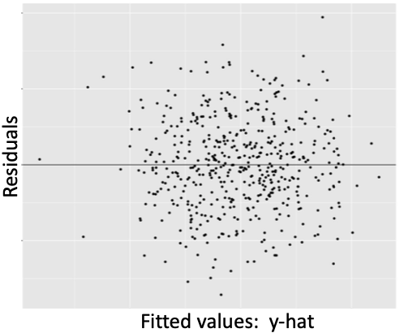
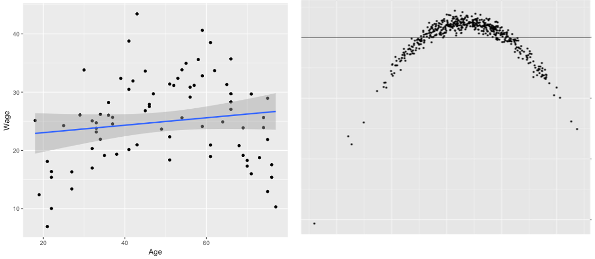

# Regression Diagnostics

> *"The hardest assumption to challenge is the one you don’t even know you are making."*
>
>---Douglas Adams

As previous chapters explained, the regression model we choose to use for explaining or predicting an outcome and the inferences we make involve several assumptions based on sound statistical theory. However, this is not to suggest that those assumptions cannot be violated. Bad choices regarding the inclusion or exclusion of explanatory variables, small sample size, and statistical oddities in our data can cause necessary assumptions to break down. If so, we may make or accept invalid conclusions.

Recall the credible analysis figure depicted below. Whether one's role is a producer or consumer of a quantitative analysis, expertise on the subject in question can make significant contributions to every level of Figure \@ref(fig:credfigrepeat2). Understanding how variables are measured helps us evaluate measurement validity and reliability. Understanding the causal pathways between variables helps us evaluate internal and external validity. Understanding inference, probabilities of error, and the context of the results can help us make valid statistical conclusions like whether we have statistical and or practical significance. Analysts and managers alike can involve themselves in this process and work together to ensure an analysis is as credible as possible.

<center>
```{r credfigrepeat2, echo=FALSE, fig.cap="Components of credible analysis"}
include_graphics("images/credible.png")
```
</center>

<br>

This chapter covers some remaining assumptions and diagnostics that a credible quantitative analysis should include. While running diagnostics may primarily fall within the role of an analyst, those managing an analysis can ask good questions or identify potential issues if they at least know what else can go wrong.

## Learning objectives {#lo13}

- Determine whether and which classical regression assumptions may be violated based on a residual versus fitted plot (RVFP)
- Explain why and when multicollinearity may be a problem and propose potential solutions
- Distinguish between outlier, high-leverage, and high-influence observations in regression
- Identify influential observations using a residual vs. fitted plot (RVLP)

## Classical assumptions

The estimates we obtain from regression are the best linear unbiased estimates possible *if* certain assumptions hold. If they do not, then our estimates could be biased or they could render our hypothesis tests invalid, creating a higher chance of Types I and II error than we chose that our significance level establishes. Fortunately, these assumptions can be remembered with an apt acronym: LINE.

For the assumptions of regression to hold, the relationship between the outcome and explanatory variables must be **Linear** (or modeled correctly as nonlinear), the observations must be **Independent** of each other, the data points must be **Normally** distributed around the regression line, and the data points should have **Equal** variation around the regression line. A key tool used to evaluate these assumptions is a **Residual vs. Fitted Plot** (RVFP). An RVFP is a simple transformation of the regression line plot. Figure \@ref(fig:genericreg) below shows a generic regression line fit to data with the outcome and predicted outcome on the y axis. An RVFP rotates the predicted outcome to the x axis, resulting in a horizontal line. This allows the distance between the observed and the fitted outcome to be vertical. Thus, the residuals of the regression are plotted on the y axis. Figure \@ref(fig:genericrvfp) shows a generic RVFP.

<center>
```{r genericreg, echo=FALSE, fig.cap="Generic regression line through data", fig.width=5}
include_graphics("images/genericreg.png")
```
</center>

<center>
```{r genericrvfp, echo=FALSE, fig.cap="Generic residual vs. fitted plot", fig.width=5}

```
</center>

Note that the residuals in the RVFP above appear to be randomly positioned; there is no discernible pattern in the scatter plot. No pattern in the RVFP is a visual indication that the classic regression assumptions are not violated. 

Certain patterns in the RVFP signal violations of certain assumptions. For example, Figure \@ref(fig:rvfplinear) below shows a clear case that the linear assumptions is violated due to age and wage sharing a quadratic relationship.

<center>
```{r rvfplinear, echo=FALSE, fig.cap="Fitting linear model to quadratic data", fig.width=5}

```
</center>

The RVFP can also be used to check whether residuals are normally distributed around the regression line and whether the residuals have equal variance. Figures \@ref(fig:rvfpnormal) and \@ref(fig:rvfpequal) below show examples where each is clearly violated.

<center>
```{r rvfpnormal, echo=FALSE, fig.cap="Violation of normally distributed risiduals", fig.width=5}
include_graphics("images/rvfp_normal.png")
```
</center>

<center>
```{r rvfpequal, echo=FALSE, fig.cap="Violation of equal variation", fig.width=5}
include_graphics("images/rvfp_equal.png")
```
</center>

There is not a direct visual check for the assumption that observations are independent of each other. However, signs that normality or linearity have been violated could be due to violation of independence. 

Independent observations is a very strong assumption. It states that the units in our data share absolutely no relationship with each other; the information pertaining to one unit has absolutely no bearing on the information gathered for another. Consider all the scenarios in which this assumption is likely violated: individuals in the same household or community, governments in the same state/province, states/provinces in the same country. Random sampling ensures independence, but random sampling is often unfeasible or not applicable to a research question. 

Other than controlling for the variable(s) by which observations are related covered in Chapter \@ref(causation-and-bias), there are statistical methods to account for dependence across observations, but they are beyond the scope of this book. A competent analyst should know at least a few such methods. As with any of the above assumptions, a manager who is knowledgeable in statistics knows to ask questions regarding independence.

## Multicollinearity

Multicollinearity involves whether two or more explanatory variables in our regression are strongly correlated. If the correlation between two or more explanatory variables is strong enough, it can result in Type II error (i.e. false negative) for one or more of the variables sharing the strong correlation.

Recall that multiple regression isolates the effect of one variable on the outcome by holding all other explanatory variables constant at their mean. This requires variables to vary while holding others constant. If the values of two variables move in near perfect tandem, then regression will find it difficult to isolate the effect of one while another is held constant.

It is as if regression creates a traffic intersection with each variable having its own lane and stoplight. To investigate the isolated effect of one variable, regression turns the stoplight for that variable green and sets the stoplights for the other variables to red, letting them idle at their mean. But suppose two variables have decided not to move unless the other is allowed to move. Thus, when one gets the green light to go, it does not move, and regression estimates an effect that is less likely to be statistically significant than should be the case.

Calculating the correlation coefficient covered in Chapter \@ref(descriptive-statistics) can give us a sense of whether multicollinearity may be an issue. As a general rule of thumb, if two variables have a correlation coefficient greater than 0.8 or less than -0.8, then multicollinearity could be a problem. Once a regression is run, if one or more variables that you thought should reject the null fail to do so, this could be due to multicollinearity with another explanatory variable in the model.

The solution to multicollinearity is somewhat subjective. If one variable is integral to the original purpose of your analysis, then consider dropping the other variable causing the problem. However, dropping a variable from your model should not be done lightly. The inclusion of a variable implies a theoretical claim that it affects the outcome. By dropping that variable because it is correlated with another explanatory variable, you may be introducing omitted variable bias because the dropped variable may be a confounder as discussed in Chapter \@ref(causation-and-bias). Instead, you could combine the collinear variables into a single index variable, which were discussed in Chapter \@ref(data). For instance, if the collinear variables are numerical, you calculate the average between them as a more holistic measure of the construct they both represent and include that in your regression model instead.

## Influential Data

Regression is an extension of correlation, which is fundamentally based on the mean. As is any measure based on the mean, regression estimates are sensitive to extreme values in our data. Depending on our sample size, one or a few extreme values can substantially impact our regression estimates. We should be aware of influential observations and consider whether our conclusions or recommendations should differ depending on whether influential observations are included.

One must be more specific when communicating extreme values in regression, as there are three varieties:

- Regression Outlier: an observation with a extreme residual
- High-leverage observation: an observation with an extreme value with respect to a particular variable; an outlier in the distribution of the explanatory variable
- High-influence: a regression outlier with high leverage

Figure \@ref(fig:influential) below provides a visual example of an influential observation in regression. Note the plot point in the far upper-right corner in the left panel. This plot point has an extreme positive residual and it imposes high positive leverage because it is positioned far from the center of the poverty distribution. As a result, this plot point pulls the slope of the regression line upward. The right panel visualizes the same regression with the influential observation removed. The regression line is noticeably flatter and fits the data better.

<center>
```{r influential, echo=FALSE, fig.cap="Regression with and without a high-influence observation", fig.width=5}
include_graphics("images/influential.png")
```
</center>

Figure \@ref(fig:influential) provides an obvious case. The primary question is how do we decide an observation is high-influence? As is the case when identifying outliers of a single distribution, there is no definitive rule for identifying high-influence observations in regression. Furthermore, whether to exclude a high-influence observation is subjective and depends on the context. Either way, influential observations should be noted in a report.

A key tool used to investigate possible high-influence observations is a residual vs. leverage plot (RVLP). This is similar to an RVFP in that it is a simple transformation of the standard regression scatter plot that allows us to identify outliers, high-leverage, and high-influence observations more effectively. Figure \@ref(fig:rvlp) below shows an RVLP for the regression of poverty and murder rates.  

<center>
```{r rvlp, echo=FALSE, fig.cap="Residual vs. leverage plot", fig.width=5}
include_graphics("images/rvlp.png")
```
</center>

The software used to produce this RVLP also adds something called Cook's distance to the plot, denoted by the red dashed line. Cook's distance is a measure commonly used to identify influential observations. One rule of thumb is that any observation with a Cook's distance greater than 1 should be investigated. Here, we see that observation 51 in our data has a Cook's distance greater than 1.

<br>

> **To learn how to run regression diagnostics in R, proceed to Chapter \@ref(r-regression-diagnostics).**

## Key terms and concepts {#kt13}

- Violations of regression assumptions
- Multicollinearity
- Regression outlier
- High-leverage observation
- High-influence observation
- Excluding observations from a regression model
