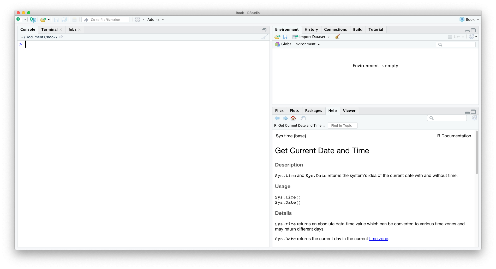

# (PART) R Chapters {-}

# R Chapter Introduction

This section contains what are referred to as R Chapters, each of which corresponds to a chapter in the previous section. Chapters in the previous section focus on concepts that are applicable regardless of statistical software. R Chapters present those concepts in ways to practically apply them via a short series of exercises using R.

Each R Chapter begins with a list of learning objectives followed by a what you need to set up in terms of packages and data to complete the chapter. Each chapter then guides you through a few exercises that require you to operate R. Periodically, they will ask you to interpret your results and/or connect what you have done to the concept it was meant to help you understand. By the end of each chapter, you will have at least one document to save and upload to eLC. That document will contain code and answers to questions. 

Once you upload your R Chapter work to eLC, a document will become available that contains my answers to those same exercises. My answers are not necessarily definitive; they are intended to provide almost immediate feedback. You should compare your work to my own, making note of any differences and attempting to make sense of them. R Chapters will sometimes be incorporated into class discussion, but feel free to ask specific questions about your R Chapter during class too.

## What is R and RStudio

R is a programming language for statistical computing. RStudio is a user interface for R. These two programs are analogous to a smart phone. Your phone has base code you never interact with directly but is what allows your phone to work. Similarly, you should never have to launch and interact with R on your computer. Instead, you interact with this code, doing all the cool things it allows you to do through what you see on the screen. RStudio is like the screen of your phone.

## Installing R and RStudio

First, download and install R [here](https://cloud.r-project.org/).

- **Windows user:** click on "Download R for Windows", then click on "base", then click on "Download R #.#.# for Windows."
- **MacOS user:**, click on "Download R for (Mac) OS X." What you click on next depends on what version of macOS you are using. Under "Latest release," you will see a link such as "R-#.#.#.pkg" with a description to the right that indicates which versions of macOS it is compatible with, such as macOS 10.13 (High Sierra) and higher. If you are using an older version of macOS, scroll down to the header "Binaries for legacy OS X systems" where you can find the link that will work with your version. If you do not know which version of macOS you are using, click on the apple symbol in the top-left of your screen, then click on "About This Mac." The resulting window will display your version of macOS.

Second, download and install RStudio [here](https://www.rstudio.com/products/rstudio/download/).

- Click on the download link beneath the "RStudio Desktop" version that is "FREE."
- The website should automatically provide a link under step 2 to download the version of RStudio recommended for your computer.

## RStudio orientation

```{block, type='learncheck', purl=FALSE}
**Exercise 1**  Launch RStudio
```

Upon launch, you should see three panes:

```{r, echo=FALSE}

```

- Console pane (left) is where you can tell R what to do. It also displays the results of commands. **Only use the console for installing packages.**
- Environment pane (top right) displays all the data in your current R session. A session is the time between launching and closing R.
- Files pane (bottom right) allows you to navigate your files, displays plots, provides a list of installed packages, allows you to search for help, and displays file exports.

You will usually see a fourth pane while working in RStudio -- the source editor pane. 

```{block, type='learncheck', purl=FALSE}
**Exercise 2** You have two options here: 1) See that plus sign (+) icon in the very top left of RStudio? Click on that and you will see a list of options. In this course, we will use either R Scripts or R Markdown documents. For this R Chapter, select R Script. 2) In the RStudio menu bar at the top of your screen, go to `File -> New File -> R Script`. Either way, a new pane will open. **This is the pane where you will tell R what to do 99% of the time because it allows you to write code that you can save.**
```

### R Packages

Many tasks in R require you to install R packages that augment its functionality. Extending the smartphone analogy from before, your phone comes with base programs (e.g. calendar, weather), but others develop third-party applications to augment the functionality of your phone. This is also the case with R, which has an active community that develops useful third-party apps called packages.

#### Install Packages{-}

Just like your phone, you have to first install a R package to use it. In your phone's case, you go to your app store and download an application that will then show up on your screen. 

Installing packages via RStudio is essentially the same. To install R packages, we type the following generic code **into the console pane** (bottom-left).

```{r installdemo, eval=FALSE}
install.packages("name_of_package")
```

Where `"name_of_package"` is replaced with the actual name of the R package we want to install. This code accesses R's "app store" and downloads it to your computer. You only need to install a R package once. The package is saved on your computer where R can find it.

> Remember to include quotes around the name of the R package when installing it.

```{block, type='learncheck', purl=FALSE}
**Exercise 3** We will almost always need to use a package called `tidyverse`. In your **console pane** (bottom-left) of RStudio, type `install.packages("tidyverse")`, then click `Enter` on your keyboard. This will begin the installation. Monitor the console pane while `tidyverse` installs. RStudio may ask you some Yes/No questions during the process. Answer all questions in the affirmative by typing `Yes` then clicking `Enter`.
```

#### Load Packages {-}

When an application is installed on your phone, you still have to launch it (i.e. click on it) to use it. The same goes for using a R package. Each time you launch RStudio, you need to load the package(s) that contain the functions you plan to use. Closing RStudio is like shutting off your phone. When you open your phone, an application isn't running in the background unless you previously launched it. 

Therefore, you should load needed R packages each time you open RStudio. And because you want your code to work each time you or someone else tries to run it, you should include this in your saved code. This means you should load R packages in the source editor pane (top-left) whether it be an R script of R markdown document. The following generic code is used to load a package.

```{r loaddemo, eval=FALSE}
library(name_of_package)
```

> You need not use quotes around the name of the R package when loading it. Quotes are only needed to install.

```{block, type='learncheck', purl=FALSE}
**Exercise 4**  You should have a script open in the source editor (upper-left) pane. Type `library(tidyverse)` in the script. Click `Run` or `Cmd+Enter` to execute this line of code. The console pane (bottom-left) will provide information about the loading.
```

> You must load a package before using any functions included in that package or else you will receive the following error message, `Error: could not find function`. Remember this crucial fact. 

I will tell you what packages are needed for certain tasks, but remember that you need to install and load the package to use it.

## Save and Upload

Save your R script using your last name (`lastname_rch16.R`) and upload to eLC. You can save an R file like any other software. Either click on the floppy disk icon in the menu at the top or use the navigate the menu bar to `File -> Save As`. Once you upload, answers will become available on eLC.

## Additional Resources

There are many resources that provide orientations to R. Below are a two that I consider particularly helpful and accessible.

- Chapters 1-3 of [Getting Used to R, RStudio, and R Markdown](https://rbasics.netlify.app/index.html)
- [BasicBasics of RYouWithMe](https://rladiessydney.org/courses/ryouwithme/01-basicbasics-0/) by R-Ladies Sydney
