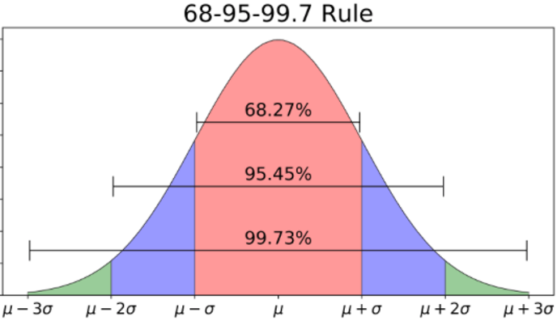

--- 
title: "Data Applications in Public Administration"
subtitle: "Using R to Learn Concepts and Skills"
author: "Alex Combs"
date: "Last updated on `r format(Sys.time(), '%d %B %Y')`"
site: bookdown::bookdown_site
documentclass: book
bibliography: bib/packages.bib
biblio-style: apalike
link-citations: yes
colorlinks: yes
lot: false
lof: false
description: "Companion text for PADP 7120"
url:  'https://alex-combs.github.io/data-apps-text/'
github-repo: "alex-combs/data-apps-text"
always_allow_html: yes
---

# Preface {-}

This is a collection of lecture and presentation notes intended as a resource for students enrolled in my sections of PADP 7120: Data Applications in Public Administration. Distributing this resource beyond those enrolled in PADP 7120 is discouraged. This resource is not peer-reviewed. All opinions and errors are my own. I do not benefit monetarily from this resource in any way.

The objective of this resource is to help students in PADP 7120 become as competitive as possible in their desired job markets via competency in statistics and statistical programming software. It aims to teach students key concepts in statistics and applications of those concepts using R with a level of theoretical and technical detail that is appropriate for those pursing a Masters in Public Administration.

## Style and Structure {-}

Rather than provide thorough coverage of complex theory, I take some liberty to present stylized facts for the benefit of the reader. When using R, it is often the case that multiple options exist to achieve a desired result. I provide what I consider or understand to be the best option.

Chapters are organized along two tracks. The first track covers statistical concepts and is self-contained. The second track applies the concepts in the first track using R. The chapters in the applied track are referred to as R Chapters, each of which corresponds to a chapter in the first track. For example, the `R Data` chapter corresponds to the `Data` chapter in the first track.

The conceptual track is divided into four sections:

1. Data and description
2. Regression models
3. Inference
4. Advanced topics

Examples and exercises are presented using R. Students who intend to use a personal computer to complete exercises in the R chapters need to download and install the following software:

- [R](https://cloud.r-project.org)
- [RStudio](https://rstudio.com/products/rstudio/download/)

```{r bookpacks, include=FALSE}
library(tidyverse)
library(knitr)
library(arsenal)
library(forecast)
library(fpp2)
library(lubridate)
library(readxl)
library(plm)
library(broom)
library(car)
library(gvlma)
library(gapminder)
library(Ecdat)
library(carData)
library(openintro)
library(fivethirtyeight)
library(moderndive)
library(DAAG)
library(Stat2Data)
library(data.table)

write_bib(c(.packages()), here::here("bib", "packages.bib"))
```

```{r set-options, include=FALSE, purl=FALSE}
# Set output options
if (is_html_output()) {
  options(width = 80)
}
if (is_latex_output()) {
  options(width = 75)
}
options(digits = 7, bookdown.clean_book = TRUE, knitr.kable.NA = "NA")
opts_chunk$set(
  tidy = FALSE,
  out.width = "\\textwidth",
  fig.align = "center",
  comment = NA
)

# To get kable tables to print nicely in .tex file
if (is_latex_output()) {
  options(kableExtra.auto_format = FALSE, knitr.table.format = "latex")
}
```

## Supplemental Resources {-}

Students may desire alternative coverage of the topics covered in this course. Below is a list of free texts and websites that teach statistics and/or R.

- **Traditional statistics texts**
  - [OpenIntro Statistics](https://www.openintro.org/book/os/) by David Diez, Mine Cetinkaya-Rundel, and Christopher Barr
  - [Quantitative Research Methods for Political Science, Public Policy and Public Administration (With Applications in R) - 3rd Edition](https://open.umn.edu/opentextbooks/textbooks/quantitative-research-methods-for-political-science-public-policy-and-public-administration-with-applications-in-r-3rd-edition) by Hank Jenkins-Smith and Joseph Ripberger
  
- **R-centric statistics texts**
  - [Statistical Inference via Data Science](https://moderndive.com/index.html) by Chester Ismay and Albert Y. Kim
  - [R for Data Science](https://r4ds.had.co.nz) by Garrett Grolemund and Hadley Wickham
  - [Data Visualization: A practical introduction](https://socviz.co/index.html#preface) by Kieran Healy
  - [Forecasting: Principles and Practice](https://otexts.com/fpp2/) by Rob J. Hyndman and George Athanasopoulos
  
- **Other R resources**
  - [R Markdown from RStudio](https://rmarkdown.rstudio.com/lesson-1.html)
  - [R Markdown: The Definitive Guide](https://bookdown.org/yihui/rmarkdown/) by Yihui Xie, J.J. Allaire, and Garrett Grolemund
  - [Pimp my RMD](https://holtzy.github.io/Pimp-my-rmd/#text_formating) by Yan Holtz
  - [Data Carpentry: R for Social Scientists](https://datacarpentry.org/r-socialsci/)

<br>

***

<br>

<p xmlns:dct="http://purl.org/dc/terms/" xmlns:cc="http://creativecommons.org/ns#" class="license-text"><span rel="dct:title">Data Applications in Public Administration</span> by <a rel="cc:attributionURL dct:creator" property="cc:attributionName" href="https://alex-combs.github.io/web-work/index.html">Alex Combs</a> is licensed under <a rel="license" href="https://creativecommons.org/licenses/by-nc-nd/4.0">CC BY-NC-ND 4.0</a></p>

<!--chapter:end:index.Rmd-->

# Introduction {#intro}

> *"Data, data everywhere, and not a thought to think."*
>
>---John Allen Paulos

## Why statistics

> Statistics converts raw information (i.e. data) into something useful. 

Bottom line:  we need statistics to make evidence-based decisions. A lack of knowledge in statistics leaves us more vulnerable to misinformation and disinformation.

## Professional standards

The [Network of Schools of Public Policy, Affairs, and Administration (NASPAA)](https://www.naspaa.org) is the accrediting authority for MPA programs. NASPAA promotes the following universal competencies:

- to lead and manage in the public interest;
- to participate in, and contribute to, the policy process;
- to analyze, synthesize, think critically, solve problems and make evidence-informed decisions in a complex and dynamic environment;
- to articulate, apply, and advance a public service perspective;
- to communicate and interact productively and in culturally responsive ways with a diverse and changing workforce and society at large. 

Statistics can help develop all of the above competencies.

## Statistics in Public Administration

The use of statistics is ubiquitous in public administration. Agencies and nonprofits use statistics to identify and describe their clients as well as assess their needs. Agencies like the Government Accountability Office (GAO) and watchdog organizations use statistics to monitor performance and guard against fraud. Service-oriented organizations like schools and hospitals use statistics to evaluate services and communicate to stakeholders. The Congressional Budget Office (CBO), Office of Management and Budget (OMB), and employees at every level of government use statistics to manage finances and forecast trends.

## Using R

The goal of this course is not for you to become an expert in R, a data scientist, or even a data analyst. Rather, the goal is to train you enough in R so it becomes a realistic alternative to inferior spreadsheet software like Excel and enable you to perform statistical tasks that may be expected of someone with an MPA. 

MPA students may be reluctant to learn something referred to as a statistical computing language (i.e., R), and its relevancy to their career goals may not be clear. I firmly believe that not training you to use statistical software in a course such as this would be doing you a disservice. Demand for those competent in statistical software like R continues to rise. Even if you plan to pursue a managerial role with minimal analytic tasks, chances are high that you will supervise or work with those who conduct such analyses. You will need to interpret their findings, applying your own managerial and/or subject matter expertise toward making an evidence-based decision. People in both roles -- consumers and producers of statistical analyses -- need to be able to communicate with the other. The best way to become a competent consumer of statistical information is to learn the basics of producing it.

In addition, R is free! There are many free resources that teach R, and R is popular across many disciplines. If you study statistics and data applications for a semester, you might as well spend part of that semester learning software like R. There is only upside in doing so with respect to employment prospects.

<br>

> **Proceed to Chapter \@ref(r-chapter-introduction) for an orientation to R.**


<!--chapter:end:01-intro.Rmd-->

# (PART) Data and Description {-}

# Data

> *Nothing exists except atoms and empty space; everything else is opinion.*
>
>---Democritus

<br>

Data are like the atoms of knowledge. We cannot effectively convert this raw material of knowledge into a useful product without first understanding the raw material. Therefore, learning statistics naturally begins with learning the types and structures of data.

## Learning objectives {#lo2}

- Understand the organization of rectangular data
- Identify the unit of analysis within a dataset
- Identify and distinguish types of variables
- Identify and distinguish types of dataset structures

## Rectangular Data

```{r generic-table, include=FALSE}
generic <- tibble(Variable_1 = c("Datum (Unit of Analysis)", "Datum (Unit of Analysis)", "Datum (Unit of Analysis)"),
                  Variable_2 = c("Datum", "Datum", "Datum"),
                  Variable_3 = c("Datum", "Datum", "Datum"))
```

```{r print-generic, echo=FALSE}
kable(generic, caption = "Generic rectangular data")
```

<br>

Rectangular data is organized by rows and columns. A rectangular dataset has three components. Not all datasets will match the below description because datasets are not always organized correctly.

>
- **Unit of analysis:** The entity or subject a row of data refers to. The unit of analysis uniquely identifies each row of a dataset. If we have a dataset of 50 states and some variables measured in 2020, then our unit of analysis is states. If you were told a specific state, then you could find the row in the dataset. If we have 50 states measured in 2019 and 2020, then the unit of analysis is state-year because you will need to know the state and year to find a specific row.
- **Variable:** A measured characteristic of the unit of analysis. State unemployment rate is a variable for a state unit of analysis. In this example, state name is a variable as well as the unit of analysis.
- **Datum:** The intersection of a variable (column) and an observation (row) resulting in a cell. The datum is a particular piece of information. A cell could contain something like 4.8 as the unemployment rate for Georgia in 2020.

## Types of variables

The variables in a given dataset can be of several types. Types of variables are important to learn because it has consequences for data applications, such as description, visualization, and inference. Different types of variables offer different levels of information.

For example, suppose you ask two people to report their annual income. What options do they have for answers? If virtually any value, then you know to a precise degree the income each earns and can compute the precise difference between the two incomes. What if their choices are either more or less than $50,000? Then, you have a coarse understanding of how much they earn. If they provide different answers, you can only conclude whether one makes more than the other but not by how much. If they provide the same answer, then the two are grouped together even though it is highly unlikely they earn equal incomes. This makes a serious difference for statistical analysis.

<br>
<center>
```{r vartypefig, echo=FALSE, fig.cap="Variable Types"}
include_graphics('images/variables.png')
```
</center>
<br>

All variables belong to one of two broad types: qualitative (categorical) or quantitative (numeric).

>
- **Qualitative** variables take on values that have no intrinsic numerical meaning. They are naturally expressed in words.
- **Quantitative** variables take on values that do have intrinsic numerical meaning. They are naturally expressed using numbers.

### Qualitative variables

Qualitative variables can be further differentiated into two types: nominal and ordinal.

>
- **Nominal** variables take on values that differ in name only. There is no way to rank a value as more or less than another value.
- **Ordinal** variables take on values that can be ranked relative to each other but the difference between rankings has no numerical value.

The values that categorical variables take on are commonly referred to as **levels**. Categorical variables can contain virtually any number of levels, though the number of levels is usually limited. 

If our unit of analysis is individuals, a variable such as assigned sex contains two levels: male and female. The variable sex is nominal because its values have no numerical meaning and the two levels have no ranking. Race, state, country, continent, political party, and any variable coded as yes/no such as unemployed, married, or participated in some program are all examples of nominal variables.

If you have ever participated in a customer satisfaction survey, then you have contributed data to an ordinal variable. Those scales that provide some number of options from "disagree" to "agree" are called Likert scales. Your answer has no intrinsic numerical value but it can be ranked against the answers of others. One respondent can be said to be more satisfied than another but not by how much. Moreover, one can only trust the results insofar as respondents have the same understanding or frame of reference--the service that satisfied one respondent may not have satisfied another. Other ordinal variables for which there is a commonly understood scale, such as education level (high school, associate, bachelor, post-graduate) and income level (more or less than the federal poverty line) do not have this issue.

Qualitative variables can be **aggregated** to a higher unit of analysis such that they become quantitative variables. For example, the U.S. Census records race at the individual level (nominal). This information is then used to report the percentage of a state's population by race, such as Georgia's population being about 32% Black or African American. What is categorical variable at the individual level is now a quantitative variable at the state level.

### Quantitative variables

Quantitative variables can be further differentiated into two types: discrete and continuous.

>
- **Discrete** variables take on countable or indivisible values.
- **Continuous** variables take on infinitely divisible values (at least in theory).

Any variable that is a count of persons, places, events, or things is a discrete variable, taking on integer values (e.g. 0, 1, 2, 3,...). The count of homeless people in a city, students in a classroom, hospital beds, or nonprofit volunteers are all discrete variables. 

> Many discrete variables can be treated as if continuous without any consequences. All of the examples above could likely be treated as conitnuous in an analysis.

When should we care that a variable is discrete? Chapter \@ref(descriptive-statistics) and chapters on inference will discuss how statistics relies heavily on the **normal distribution**, also referred to as a bell curve. If a discrete variable can take on integer values only, and especially if only a few values are possible, then that variable is unlikely to be normally distributed. 

Rare discrete events, such as plane crashes or government defaults are not normally distributed. Application of basic statistical procedures to such variables may be inappropriate, requiring methods outside to scope of this course.

In many cases, if a variable is numeric, then it is continuous or can be treated as such. Continuous variables can contain values with an infinite number of decimal places. Still, continuous variables are recorded in data with a limited number of decimal places because either we measure phenomena with finite precision or it simply becomes impractical to include so many decimal places. For example, age is usually recorded in discrete years, but we could record continuously to the zeptosecond (a trillionth of a billionth of a second). 

> Many discrete variables become continuous because we calculate averages, proportions, or rates from them. 

The number of students in the classroom is discrete (e.g. 20, 25, etc.), but the average number of students in classrooms (i.e. total students/number of classrooms) is continuous. This is how we can have values such as 22.5 for pupil-to-teacher ratio. The number of homeless people in a city is discrete but the proportion of the city's population that is homeless (count of homeless/population) is continuous. 

### Index variables

Index variables can be ordinal or (usually) numerical but warrant separate discussion. 

>An index variable is a composite measure of multiple variables. 

They can be used to make a continuous variable out of multiple categorical variables or simplify multiple quantitative variables into one quantitative measure. Purposes such as ranking colleges, measuring multidimensional poverty (i.e. factors beyond income), and determining political ideology make use of index variables.

Index variables mask underlying information. This can be helpful or harmful. In either case, it is important to consider how an index variable is constructed. Doing so can offer insight or uncover problems. An instructive example familiar to readers is college rankings. U.S. News and World Report [describes](https://www.usnews.com/education/best-colleges/articles/ranking-criteria-and-weights) how rankings are determined. 

What makes a college good? According to these rankings, five percent of what makes a college good is the percent of undergraduate alumni giving a donation as a proxy of student satisfaction. Another 20% is based on the opinions of administrators at peer institutions. Are these choices wise? This is difficult to say and besides the point. The point is that index variables involve choices made by people and are not data that are observed directly. They are synthetic materials of knowledge and warrant careful consideration.

## Dataset structures

Just as the type of variable one is dealing with impacts the kinds of visualizations or analyses one should use, so too does the structure of a dataset. Datasets come in three varieties depending on their unit of analysis.

- Cross-sectional
  - Pooled cross-sectional
- Time series
- Panel or longitudinal

**Cross-sectional** data is a snapshot in time measuring some size sample of units. One column serves as the identifier of the unit of analysis, such as the name or ID number of the unit. Notice in Table 2.2 that all one needs to know is the country in order to identify a specific row.

```{r cross-sec-fig, echo=FALSE}
gapminder %>% 
  filter(year == 2007 & continent == 'Americas') %>% 
  head(n=3) %>% 
  kable(caption = "Cross-section example")
```

<br>

**Pooled cross-sectional** data could be considered a fourth structure but is simply multiple cross-sections stacked atop each other. The critical quality of pooled cross-sectional data is that each cross-section contains *different* units measured at different times, not the same units measured at different times. Notice in Table 2.3 that the countries included from 2002 are not the same as those included from 2007.

```{r pooled, echo=FALSE}
gapminder %>% 
  filter((year == 2007 & continent == 'Americas') | (year==2002 & continent=='Africa')) %>% 
  head(n=7) %>% 
  arrange(year) %>% 
  kable(caption = "Pooled cross-section example")
```

<br>

**Time series** data measures one unit over multiple time periods. The unit of analysis in time series data is time, as it uniquely identifies each row. Notice in Table 2.4 that one country is tracked over multiple years.

```{r timeseries, echo=FALSE}
gapminder %>% 
  filter(country == 'Argentina') %>% 
  tail(n=7) %>% 
  kable(caption = "Time series example")
```

<br>

**Panel** (or longitudinal) data measures the same units over multiple time periods. The unit of analysis is pair of unit and time period. Notice in Table 2.5 that in order to identify a specific row, you would need to know the country *and* year. One could also think of panel data as numerous time series.

```{r panel, echo=FALSE}
gapminder %>% 
  filter(continent == 'Americas', year >= 1997) %>% 
  head(n=6) %>% 
  kable(caption = "Panel example")
```

<br>

> **To learn how to examine data in R, proceed to Chapter \@ref(r-data).**

## Key terms and concepts {#kt1}

- Unit of analysis
- Variable
- Types of variables: qualitative, quantitative, nominal, ordinal, discrete, continuous, index
- Data structures: cross-sectional, pooled cross-sectional, time series, panel

<!--chapter:end:02-data.Rmd-->

# Measurement

> *"Will he not fancy that the shadows which he formerly saw are truer than the objects which are now shown to him?*
>
>---Plato

<br>

Once we understand the structure of our data and the types of variables contained within, we need to understand how the data relates to reality before trying to draw conclusions. Variables and their values are measured representations of reality. They are shadows on the allegorical cave wall. We should not assume these shadows are necessarily good representations of reality.

Measurement validity and reliability are the foundations of credible analysis, the components of which are depicted in Figure \@ref(fig:credfig) below. Without the two, we have little or no basis to make conclusions from data. As they say, garbage in, garbage out. No amount of fancy statistical techniques can compensate for starting with bad data.

<center>
```{r credfig, echo=FALSE, fig.cap="Components of credible analysis"}
include_graphics("images/credible.png")
```
</center>

<br>

## Learning objectives {#lo3}

- Assess the measurement validity of variables
- Assess the measurement reliability of variables
- Explain the difference between accuracy and precision

## Measurement validity

Data do not exist in nature. Someone must set out to observe a phenomenon, measure it, record it, and compile the recorded measures into a dataset. This process involves choices, limitations, and potential flaws. When evaluating the quality of data, the first quality to consider is **measurement validity**.

> **Measurement Validity**: The extent to which a variable measures what it is intended to measure.

Variables record measures of observed phenomena. Students take a test, resulting in a variable for test scores. Patients' height and weight are recorded, resulting in a variable for body mass index (BMI). People respond to a survey from the Bureau of Labor Statistics asking whether they are employed or actively looking for a job, resulting in a variable for the unemployment rate. Law enforcement agencies record reported crimes and divide the total by population, resulting in a variable for crime rate.

What do these variables *intend* to measure? The intent of a variable could be to simply measure the observed phenomenon. A city manager may use a robbery crime rate to understand how many robberies per capita occurred in their city and how this rate has changed over time. Almost all types of crime are systematically under-reported. Therefore, as a variable intended to measure the incidence of robberies, the measurement validity of robbery crime rate is somewhat flawed. Specifically, we could say that robbery crime rates are biased negatively/downwards.

It is often the case that variables intend to measure some less observable concept. Student test scores could be used as a measure of intelligence or academic merit. BMI is used as a measure of healthy weight. The unemployment rate is used as an indicator for economic growth/decline. Crime rates are used to measure public safety. When the values of a variable changes over time, or we observe differences in values across people or places, we might conclude the same is the case for the abstract concept we attach to the variable. Before doing so, we should pause to consider whether the variable actually captures the concept.

One area in public administration where measurement validity is a common concern is performance management. Are test scores a valid measure of school or teacher performance? To what extent should test scores be used to hold low-performers accountable? Is a crime rate a valid measure of police performance? Suppose a city manager observes an increase in the rate of robberies. Should their conclusion be that police performance has declined?

## Measurement reliability

The second quality of measurement to consider is reliability.

> **Measurement Reliability**: The extent to which the measurement process or instrument for a variable generates consistent values.

The measurement reliability of a variable can be with respect to repeated measures over time or across subjects. A student receives a score on their GRE. Provided the student does not study before taking the GRE again, will they receive the same or similar score (referred to as test-retest reliability)? A property value assessor assesses a property. A second assessor assesses the same property. Will they arrive at the same property value (referred to as inter-rater reliability)? Suppose two students are equally knowledgeable on the topics included in the GRE. Will the two students receive the same GRE score? Will two identical properties receive the same property value?

Virtually all measurement processes involve at least some **measurement error**. Think of measurement error as the spread of recorded values around the true value. The greater the spread/error, the less reliable the measure. Measurement error can be random, such that the spread around the true value is evenly distributed above and below the true value. If measurement error is not random, we should consider whether the factors that cause error are related to the conclusions we want to draw from the data. 

Poor measurement reliability threatens our ability to make comparisons over time or across subjects. A city manager may know that the rate of robberies is negatively biased (poor measurement validity) but assume that a change in the rate over time reflects the true change despite both recorded values being less than their true values. However, the true crime rate may not have changed at all if the measurement process generates random fluctuations.

### Example

A measure can be valid or invalid and reliable or unreliable, resulting in one of four possible combinations. Let us consider an example where an agency needs to allocate resources to state governments according to the number of persons who are homeless in each state. One method has been to designate a specific day of the year (e.g. January 1st) where government staff and volunteers attempt to conduct a census of homeless people. If the census takers in all states successfully recorded the true count of homeless people, then the resulting dataset would contain a valid and reliable measure.

Suppose the *true* count of homeless persons for two states is the same. Figure \@ref(fig:homeless) depicts this scenario and the three potentially problematic combinations of validity and reliability along a number line.

<center>
```{r homeless, echo=FALSE, fig.cap="Comparing measurement validity and reliability"}
include_graphics("images/measure_lines.png")
```
</center>

In the case where a valid and reliable measure is taken, the two states receive equal and appropriate amounts of resources.

The second line in Figure \@ref(fig:homeless) depicts a scenario where the number of homeless people are systematically under-counted, but the process generates the same number across the two states. This would be considered in invalid but reliable measure. Resources going to states is less than it should be, but equal states receive equal resources. 

The third line in Figure \@ref(fig:homeless) depicts what is likely the most confusing combination: a valid and unreliable measure. Homeless people are under-counted in one state and over-counted in the other, **but the error is roughly equal**. This reflects a case of random measurement error rather than systematic. So long as the spread is not too great, we could consider this a sufficiently valid measure because the recorded values are averaging around the true value. The amount of resources provided is appropriate *on average*, but the two states receive different amounts.

The fourth line in Figure \@ref(fig:homeless) depicts a scenario where an invalid and unreliable measure is taken. Homeless people are systematically under-counted *and* the error is worse in one state than the other. The two states receive different amounts of resources and the amount of resources provided is systematically less than what it should be.

Taking a count of homeless people on a designated day is known to have issues of measurement validity and reliability. Measurement validity is an issue because it is unlikely that a government can accurately count all of its homeless people. In other words, this measure is negatively biased as depicted in either the second or fourth lines in Figure \@ref(fig:homeless).

Even if two states suspiciously had an equal number of homeless people, why might they record undercounts of varying severity? Temperature affects how easily and accurately the number of homeless people can be counted. In a cold state, most homeless people will stay in shelters. In a warm state, homeless people will be scattered and more difficult to count. Differing levels of experience among staff and volunteers is another potential factor. 

Keep in mind that no measure is perfect. Our concern should not be so much whether a measure is valid or invalid and reliable or unreliable, but rather the degree to which a measure is invalid and unreliable. When drawing conclusions from a change in values or differences across subjects, take the time to consider the consequences and limitations due to measurement issues. 

## Missing data

It is common to encounter missing values in real data. Respondents skip or choose not to answer survey questions, administrators fail to contact respondents, entities that reported data last year may have dissolved or consolidated with another entity this year. Many reasons can lead to missing data. The key is to consider why data are missing and if it should affect your conclusions.

Using the previous example of self-reported income, suppose there are numerous missing values in the responses. Should we assume they are missing at random or that there is some underlying reason or pattern? Perhaps those with no or low income do not wish to report. If we were to dismiss these missing values, and draw conclusions from the non-missing values, we may severely overestimate the income of the target population.

### Types of missing data

Missing data come in two varieties:

>
- **Explicit:** data that we can see are missing in the data; cells containing a value that denotes missing
- **Implicit:** data that we would expect to be included based on data structure but are not; no obvious sign of missing

Table 3.1 shows an example of data that are explicitly missing denoted by `NA`. Missing data is denoted in a variety of ways. For example, instead of `NA`, the cells could have been left empty, or filled with a period, or some other symbol. If data were obtained from an organization that regularly produces publicly available data, datasets are usually accompanied by a legend that explains what symbols denote missing. 

```{r, echo=FALSE}
crossgap <- gapminder %>% 
  filter(year == 2007 & continent == 'Americas') %>% 
  head(n=3)

crossgap[1,4] <- NA
crossgap[2,6] <- NA

kable(crossgap, caption = "Example of explicitly missing data")
```


Beware ambiguous missing values. For instance, some survey questions are dependent on previous questions. You do not want to conclude that a value is missing because a respondent chose not to answer when they were never asked the question. Or perhaps a value is missing when it should actually equal 0 or vice versa. If missing data are consequential to your analysis, then you may need to investigate further into how the data were collected or coded in order to eliminate such ambiguity.

Table 3.2 shows an example of implicitly missing data. Argentina is observed in 1997, 2002, and 2007, but Bolivia is observed only in 1997 and 2007. What happened to the 2002 observation for Bolivia? This sort of entry and exit from the dataset is common in panel data where the same units are observed over multiple time periods. 

```{r, echo=FALSE}
gapminder %>% 
  filter(continent == 'Americas', year >= 1997) %>% 
  head(n=6) %>%
  filter(country!='Bolivia' | year!=2002) %>% 
  kable(caption = 'Example of implicitly missing data')
```

Note that the missing Bolivia observation was easy to spot because the dataset is extremely small. If we were dealing with a large dataset, this would not have been so obvious. A quick way to check whether there may be implicitly missing observations is to check the number of observations in your data. If you are under the impression that your data contains all 50 states for 10 years, then you should have 500 observations. If not, some states or years must be missing.

> **To learn how to work with missing data in R, proceed to Chapter \@ref(r-missing-data).**

## Key terms and concepts {#kt2}

- Measurement validity
- Measurement reliability
- Measurement precision
- Implicitly missing data
- Explicitly missing data

<!--chapter:end:03-measurement.Rmd-->

# Descriptive Statistics

> *"Just the facts, ma'am.*
>
>---Joe Friday, Dragnet

## Learning objectives {#lo4}

- Explain the difference between descriptive and inferential statistics
- Explain the difference between a population and sample; parameter and statistic
- Understand a distribution of a random variable
- Explain and apply the descriptive measures of center, spread, and association
- Choose the preferable measures of center and spread given a distribution and explain why
- Determine the direction and strength of association given a scatterplot or correlation coefficient
- Explain the possible shortcomings of correlation

## Two goals of statistics

The application of statistics has one or both of the following goals:

> 
- **Descriptive statistics:** summarizes the characteristics of observed data in a sample or population. This can involve describing the distribution of a variable or the association between two or more variables.
- **Inferential statistics:** uses the characteristics of observed data in a sample to make inferences about the characteristics of an unobserved population.

You can think of these two goals as levels. At the base is descriptive statistics. If we have data for one or more variables, any analysis will involve the description of those data. Description may be the end goal of an analysis in which case the next level -- inferential statistics -- is not pursued. 

A key distinguishing feature between descriptive and inferential statistics is the manner in which they involve a population and/or sample.

>
- **Population:** all members of a specified group pertaining to a statistical question
- **Sample:** a subset of a population

Descriptive statistics provides information about an *observed* population or an *observed* sample of that population; whichever of the two our data includes. Inferential statistics uses data from an observed sample to make educated, scientific guesses about a population for which we do not have data. In many cases, we cannot study an entire population because of logistics or cost. Instead, we take a sample of that population to make inferences about it. 

Consider the question, "What is the average GPA of all MPA students in the United States?" In this case, the population is all MPA students in the United States. It is unlikely I could obtain the GPA of every MPA student in order to calculate the average GPA. Therefore, I may take a sample of MPA students instead, calculate their average GPA, and use inferential statistics to make conclusions about the average GPA for the population of all MPA students in the United States.

> Note that a sample is a *subset* of the population, meaning that it includes only members of the population. If this class had non-MPA students, and I used all students in the class as my sample, then I no longer have a sample of the intended population.

Our research question can be such that the population is accessible enough to collect data on all its members. If our question was instead, "What is the average GPA of students in this class?", then the population is all of the students in this class. In this case, I could easily observe the GPA of all members of the population and compute the average GPA for the population.

> We can describe a sample or a population as long as we have the data to do so. Inference uses a sample we observe with data to describe a population we do not. 

When we compute statistical measures, such as an average, of a population or sample, those measures have specific names:

>
- **Parameter:** a measure pertaining to a population
- **Statistic:** a measure pertaining to a sample

Whether a statistical measure is a population parameter or sample statistic depends on whether my measure is computed using data from a population or a sample. 

If the population is students in this class, and I compute the average GPA for all of the students in this class, that measure is a population parameter. If the population is all MPA students in the U.S., and I use the students in this class as a sample of the population, then the average GPA of the students in this class is a sample statistic. 

In inference, a sample statistic is often referred to as an **estimate** because it serves as an estimate of the population parameter. If my goal is to use inferential statistics to estimate the average GPA of all MPA students in the US, the average GPA of MPA students in this class could be used as the estimate of the parameter. The parameter in this example would be the actual average GPA of all MPA students in the US; a value I do not directly compute.

## Distributions

Descriptive statistics summarizes characteristics of variable distributions. Before reviewing the measures used to summarize distributions, we should understand what a distribution is.

> A **distribution** tells us the (possible) values of a variable and the frequency at which those values occur.

The values of a variable are the result of some data-generating process we may or may not fully understand. This data-generating process determines the range of possible values a variable can take on and the frequency at which those values occur. These values and frequencies are revealed to us when we record multiple measures of a variable.

Sometimes we know all the possible values of a variable, or at least the range of possible values. We know a variable for assigned biological sex has possible values of male and female. We know a variable for GPA has a possible range of 0 to 4, in most cases.

Sometimes we know what the frequency of values for a variable should be. Genetics tells us to expect roughly 50% males and females. Other times we do not know the function that determines frequency, or it is too complex to fully understand. For example, we have some idea of the factors that influence GPAs, but there will always be some factors or randomness that goes unaccounted.

To make this as concrete as possible, let's consider a variable of something that is simple and familiar to all of us: a roll of a six-sided die.

We know a roll of a six-sided die can take on a range of integers between 1 and 6. We also know the frequency of each value is the same at 1 in 6, or about 17%. Therefore, we *know* the distribution of this variable, which is depicted below in Figure \@ref(fig:diedist).

```{r, include=FALSE}
diedist <- tibble(roll = c(1,2,3,4,5,6), value = c(1,2,3,4,5,6), dieprob = c(0.166,0.166,0.166,0.166,0.166,0.166))
```


```{r diedist, echo=FALSE, fig.cap='Probability distribution of a six-sided die'}
ggplot(diedist, aes(value, dieprob)) +
  geom_col(fill = 'steelblue') +
  labs(y = 'Probability') +
  scale_x_continuous(breaks = c(1,2,3,4,5,6)) +
  theme_classic() +
  theme(axis.title.x = element_blank())
```


Therefore, if we were to roll the die six times, we would *expect* the following data in Table \@ref(tab:dietable), though not necessarily in this order.

```{r dietable, echo=FALSE}
diedist %>% 
  select(-dieprob) %>% 
  kable(caption = 'Expected results of 6 rolls')
```

And we could represent this distribution by counting the number of times each value occurred using a histogram as shown in Figure \@ref(fig:diehisto), which is the essentially the same as Figure \@ref(fig:diedist).

```{r diehisto, echo=FALSE, fig.cap='Expected distribution of 6 rolls'}
ggplot(diedist, aes(value)) +
  geom_histogram(fill = 'steelblue', bins = 6, color = 'white') +
  labs(y = 'Count') +
  scale_x_continuous(breaks = c(1,2,3,4,5,6)) +
  scale_y_continuous(breaks = c(0,1)) +
  theme_classic() +
  theme(axis.title.x = element_blank())
```

Of course, this is just what is expected to happen, on average, given many rolls of a die. Anyone who has played a board game knows streaks can occur. Given a number or rolls, we probably will not observe a uniform distribution of values.

Suppose we roll 12 times and record the value of each roll, as is shown in Table \@ref(tab:obsdietable). 

```{r, include=FALSE}
set.seed(551)
dierolls <- tibble(roll = 1:12, value = round(runif(12, 1, 6),0))
```

```{r obsdietable, echo=FALSE}
dierolls %>% 
  kable(caption = 'Observed results of 12 rolls')
```

We can visualize the distribution of these 12 rolls, as is done in Figure \@ref(fig:obsdieroll).

```{r obsdieroll, echo=FALSE, fig.cap='Observed distribution of 12 die rolls'}
ggplot(dierolls, aes(value)) +
  geom_bar(fill = 'steelblue', color = 'white') +
  labs(y = 'Count') +
  scale_x_continuous(breaks = c(1,2,3,4,5,6)) +
  theme_classic() +
  theme(axis.title.x = element_blank())
```

Here we can see the randomness of the variable. Values 1, 2, and 5 occur more frequently than 3 and 4, and 6 does not occur at all. If we were to roll the die many more times, it would look more like the distribution we would expect. But for *this* sample of die rolls, the distribution is unique.

This is exactly the point of descriptive statistics: whether or not we know what to expect in terms of a variable's distribution, we want to know the characteristics of the distribution for a variable from a particular sample or population. When we ask for, say, a variable's average, we are asking for the approximate midpoint of that variable's distribution. 

Descriptive measures help us summarize characteristics of distributions and some serve as the building blocks for other descriptive measures as well as inferential statistics.

## Descriptive Measures

A die roll is uninteresting and unimportant. In our review of descriptive measures, let us consider them with respect to the distribution of the infant mortality rate across 222 countries in 2012. Infant mortality is the number of deaths of infants under one year old per 1,000 live births.

```{r infmort, echo=FALSE, fig.cap='Infant Mortality Rates'}
ggplot(infmortrate, aes(inf_mort_rate)) +
  geom_histogram(fill = 'steelblue', color = 'white', bins = 30) +
  labs(x = 'Infant deaths per 1,000 live births') +
  theme_classic() 
```

We could simply show the entire distribution of values, but it is usually helpful to summarize key characteristics of it. We can describe distributions along three dimensions:

>
- **Center:** what is the typical value of this variable?
- **Spread:** how far away are values typically from the center?
- **Association:** what is the typical value or spread of the distribution given a value of another variable?

Multiple descriptive measures can answer the three questions above. Which measure is more appropriate to use largely depends on the shape of the distribution.

### Measures of center

> Again, measures of center are meant to convey the typical value of a distribution; the most representative value, or the value we would *expect* if we were to randomly draw one observation from the distribution.

#### Mean {-}

The mean or average takes the values of a variable, adds them together, then divides that sum by the total count of values.

\begin{equation}
{\displaystyle \bar{x}={\frac {1}{n}}\sum _{i=1}^{n}x_{i}={\frac {x_{1}+x_{2}+\cdots +x_{n}}{n}}}
(\#eq:mean)
\end{equation}

Infant mortality has 222 values, so $n$ in equation \@ref(eq:mean) above would equal 222 in this case. If we were to pluck one country out of our pool of 222 countries at random, the mean tells us the infant mortality rate to expect. In other words, the mean tells us the typical infant mortality rate in our observed data. In this case, the average infant mortality rate is `r round(mean(infmortrate$inf_mort_rate),1)` per 1,000 live births.

#### Median {-}

If we took the 222 infant mortality rates and listed them in ascending or descending numerical order, the median is the value that sits at the middle of the ordered list. The median is also referred to as the 50th percentile because half of the values fall below it and half of the values fall above it. In the case of an even number of values, there is no naturally occurring middle value. In that case, we take the average of the two values in the middle. The median infant mortality rate is `r round(median(infmortrate$inf_mort_rate),1)`.

#### Mode {-}

```{r, include=FALSE}
mode <- function(v) {
uniqv <- unique(v)
uniqv[which.max(tabulate(match(v, uniqv)))]
}
```

The mode is the value that occurs most frequently. If all values occur only once, then a variable has no mode. If two or more values occur an equal number of times and it is more than other values, then a variable has two or more modes. For instance, the modes for our 12 die rolls in Figure \@ref(fig:obsdieroll) are 1, 2, and 5. The mode for infant mortality rates is 11.6.

#### Choosing a center {-}

As Figure \@ref(fig:infmort) shows, three measures of center have provided us three different typical infant mortality rates. The mean is represented by the red line, the median by the purple line, and the mode by the green line. 

```{r mortcenters, echo=FALSE, fig.cap='Centers of infant mortality rates'}
ggplot(infmortrate, aes(inf_mort_rate)) +
  geom_histogram(fill = 'steelblue', color = 'white', bins = 30) +
  geom_vline(xintercept = 26.7, color = 'red', linetype = 'dashed') +
  geom_vline(xintercept = 15.6, color = 'purple', linetype = 'dashed') +
  geom_vline(xintercept = 11.6, color = 'green', linetype = 'dashed') +
  labs(x = 'Infant deaths per 1,000 live births') +
  theme_classic() 
```

Which measure of center should we choose to report? We could report all three, but we may want to apply some professional judgment. Providing three numbers to convey the typical value of a variable may confuse our audience.

For continuous variables reported at several decimal places, a value may not occur more than once because of the precision. More importantly, because of this low probability of repeat values, the mode is not guaranteed to represent a typical value. If it only takes two occurrences to qualify as the mode, that second occurrence could be an extreme value. 

> The mode is rarely used to describe continuous variables. Instead, the mode is commonly used to report the most frequent value of categorical or discrete variables with relatively few possible values, such as race, sex, political party.

When choosing between mean and median, the better choice depends on the presence of extreme values or the extent to which a distribution is **skewed**. Skew pertains to the tails of a distribution--the taper to the left and right of its center. If the right or left tail extends far out from the center, we consider the distribution to be right- or left-skewed. Our distribution of infant mortality rates is right-skewed.

> When a distribution is skewed, the median is generally a better choice for reporting its center than the mean. This is because the mean is sensitive to extreme values. 

Note in Figure \@ref(fig:mortcenters) that the mean is pulled to the right by the right-skew of extreme values. The red line representing the mean is to the right of the cluster of frequent values and may not be a good answer for the typical value of this distribution. The median is not sensitive to extreme values. No matter how far the values above the median were to stretch to the right, the median of the distribution would not change.

### Measures of spread

Measures of center convey the typical value of a distribution. The typical infant mortality rate is `r round(mean(infmortrate$inf_mort_rate),1)` or `r round(median(infmortrate$inf_mort_rate),1)` depending on whether we choose to use mean or median, respectively. If we only had this measure, we would have no idea how far away the values are from the center. Are the infant mortality rates of most countries close to this center, or is the typical value not representative of most countries' infant mortality rates? Measures of spread provide us this information.

> Measures of spread convey how much values typically deviate from the typical value (i.e., center), or how different observations are from each other with respect to the variable being described.

#### Variance {-}

Almost all values of a numerical variable, especially a continuous variable, do not equal the mean. The difference between a particular value and the mean of the variable is often referred to as **deviation from the mean**. The variance squares each observation's deviation from the mean, sums all the deviations, and divides this sum by the total count of observations minus one. Equation \@ref(eq:variance) displays this process using mathematical notation.

\begin{equation}
{\displaystyle S^2={\frac {1}{n-1}}\sum _{i=1}^{n}(x_{i}-\bar{x})^2={\frac {(x_{1}-\bar{x})^2+(x_{2}-\bar{x})^2+\cdots +(x_{n}-\bar{x})^2}{n-1}}}
(\#eq:variance)
\end{equation}

The mean infant mortality rate is 26.7. If we subtract this mean from each country's rate, we have each country's deviation from the mean, some of which is shown in Table \@ref(tab:varcalcs). Then, we square these deviations as is also shown in the table. We then sum the 222 squared deviations and divide by 221. The variance for our infant mortality rates is `r round(var(infmortrate$inf_mort_rate),1)`.

```{r varcalcs, echo=FALSE}
infmortrate %>% 
  head(n=5) %>% 
  mutate(deviate = inf_mort_rate - 26.7, sq_deviate = deviate^2) %>% 
  kable(caption = 'Excerpt of variance calculations', digits=0)
```

Variance is an important building block for inference, but it is useless to report as a descriptive measure because it is in squared units. If someone asks how far values are spread out from the mean, it makes no sense to report that values deviate from the mean by 672 squared infant deaths.

#### Standard deviation {-}

The standard deviation is simply the square root of variance, which returns our units to their original meaning.

\begin{equation}
{\displaystyle s = \sqrt{S^2}}
(\#eq:sd)
\end{equation}

The standard deviation in the infant mortality rates data is `r round(sd(infmortrate$inf_mort_rate),1)`. This tells us that, *on average*, infant mortality rates are about 26 deaths above and below the mean.

> The standard deviation is the average deviation from the mean.

#### Interquartile range {-}

Recall that the median is the 50th percentile of a distribution--half of the values fall below the median and half fall above it. Two additional percentiles sometimes reported are the 75th and 25th percentiles. The 75th percentile is the value at which 75% of values fall below and 25% fall above it, while the 25th percentile is the value at which 25% of values fall below and 75% fall above it. All percentiles -- from the 0th percentile (i.e., minimum) to the 100th percentile (i.e., maximum) -- are interpreted this way.

> The interquartile range (IQR) is equal to the 75th percentile minus the 25th percentile. It provides the middle 50% of the values in a distribution.

The IQR for infant mortality rates is `r round(IQR(infmortrate$inf_mort_rate),1)`. Alternatively, the IQR can be reported by specifying the 75th and 25th percentiles, leaving the reader to compute the difference between the two. The 75th percentile for infant mortality rates is 42.1, and the 25th percentile is 6.5. 

#### Range {-}

> The range is the maximum value in a distribution minus the minimum value of a distribution. It conveys how different are the most different observations with respect to the variable being described.

Usually, the range is left implied in a table of summary statistics by reporting the maximum and minimum without differencing the two. This allows the reader to know the most extreme values in a distribution.

The minimum of infant mortality rates is `r min(infmortrate$inf_mort_rate)`, and the maximum is `r max(infmortrate$inf_mort_rate)`. Therefore, the range of the distribution is `r round(max(infmortrate$inf_mort_rate)-min(infmortrate$inf_mort_rate),1)`.

In the case of infant mortality rates, we know the minimum possible value is 0 by definition, but the minimum value in our distribution is `r min(infmortrate$inf_mort_rate)`. Perhaps 0 deaths is impossible for any country to achieve. Moreover, the maximum value is `r max(infmortrate$inf_mort_rate)`. This range tells us the most different countries are *very* different.

#### Choosing a measure of spread {-}

The same logic applies to choosing a measure of spread as choosing a measure of center. The standard deviation is based on the mean, and so it is also sensitive to extreme values that, if present, could exaggerate the typical spread of the distribution. The IQR is based on percentiles just like the median. Therefore, IQR is not sensitive to extreme values.

Figure \@ref(fig:mortspread) displays the mean and plus-and-minus one standard deviation using red dashed and solid lines, respectively. The median and the IQR (25th and 75th percentiles) are represented by the purple dashed and solid lines, respectively. Note how wide the area contained by the standard deviation is--it contains most of the distribution and the lower bound of 0.7 is lower than the minimum observed value of `r min(infmortrate$inf_mort_rate)`. 

In this case, standard deviation is not preferable for conveying the typical deviation from the center, as it contains plenty of values that are rather atypical deviations from the center (a center that is also flawed by using the mean). For describing the distribution of infant mortality rates, the median and IQR are better choices.

```{r mortspread, echo=FALSE, fig.cap='Center and spread of infant mortality rates'}
ggplot(infmortrate, aes(inf_mort_rate)) +
  geom_histogram(fill = 'steelblue', color = 'white', bins = 30) +
  geom_vline(xintercept = 26.7, color = 'red', linetype = 'dashed') +
  geom_vline(xintercept = 0.7, color = 'red') +
  geom_vline(xintercept = 52.7, color = 'red') +
  geom_vline(xintercept = 15.6, color = 'purple', linetype = 'dashed') +
  geom_vline(xintercept = 6.5, color = 'purple') +
  geom_vline(xintercept = 42.1, color = 'purple') +
  labs(x = 'Infant deaths per 1,000 live births') +
  theme_classic() 
```

### Outliers

> Outliers refer to extreme values, the inclusion of which may lead to worse conclusions than if they were excluded from a statistical analysis. 

An outlier could be due to data entry error. In the case of error, the value should be corrected, if possible, or removed from the data. If not an error in the data, it is important to recognize that an outlier is a real occurrence. The removal of real data should be done only after careful consideration of the consequences and should always be reported. Outliers should not necessarily be excluded from an analysis. It depends on the context. We may only care about making conclusions for typical cases. If so, removing outliers may be warranted. However, atypical cases may be an important part of the story. The Great Depression and Recession involved atypical stock market crashes, but you would not want them excluded from a description of annual stock market returns.

There is no single definition of an outlier, but the most common definition uses $1.5 \times IQR$. Values that are more than $1.5 \times IQR$ below the 25th percentile are outliers on the left side of the distribution. Values that are more than $1.5 \times IQR$ above the 75th percentile are outliers on the right side of the distribution. 

Recall that the IQR of infant mortality rates depicted in Figure \@ref(fig:mortspread) was `r round(IQR(infmortrate$inf_mort_rate),1)` with 25th and 75th percentiles of 6.5 and 42.1, respectively. Applying the common definition of an outlier, we get:

$$1.5 \times 35.6 = 53.5$$

Subtracting this value from the 25th percentile of 6.5 gives us a lower-bound for identifying outliers.

$$6.5-53.4=-46.9$$

Therefore, values that fall below -46.9 are outliers, but this is impossible given our variable is infant mortality rates. 

Adding this value to the 75th percentile of 42.1 gives us a upper-bound for identifying outliers.

$$42.1+53.4=95.5$$

Therefore, values above 95.5 could be considered outliers on the right end of the distribution. Figure \@ref(fig:mortspread) indicates there are a few outliers in our data based on this definition.

### The normal distribution

As a brief aside, it should be mentioned that if a distribution is **normal**, then measures of center and spread will be similar to each other. This is one of several desirable features of the normal distribution. 

Figure \@ref(fig:normrates) shows a simulated scenario in which the infant mortality rates in our 222 countries exhibit an approximately normal distribution. Note the peak near the center of the distribution and the symmetry of the spread. There is no notable skew. 

```{r normrates, echo=FALSE, fig.cap='Simulated normal distribution of infant mortality rates'}
set.seed(123)
normdf <- tibble(rates = rnorm(222, 26, 7))

ggplot(normdf, aes(rates)) +
  geom_histogram(fill = 'steelblue', color = 'white', bins = 30) +
  labs(x = 'Simulated infant deaths per 1,000 live births') +
  theme_classic() 
```

Table \@ref(tab:normratesum) confirms the similarity between measures of center and spread for this simulated distribution. This is one reason it is important to visualize your distribution. If it appears approximately normal, then you should report the mean and standard deviation (along with minimum and maximum values), as the are more widely understood.

```{r normratesum, echo=FALSE}
normdf %>% 
  summarise(Mean = round(mean(rates),1), Median = round(median(rates),1), Mode = round(mode(rates),1), SD = round(sd(rates),1), IQR = round(IQR(rates),1)) %>% 
  kable(caption = 'Center and spread measures of simulated data')
```

Again, the normal distribution has several desirable features that will be discussed further in the chapters pertaining to inference. One is that if a distribution is approximately normal, then extreme values are not a concern and the mean and standard deviation are good measures of center and spread, respectively. Besides making our choice of measures convenient, why is this worth repeating? Because the mean and standard deviation are building blocks to the next category of descriptive measures: association. If mean and standard deviation are bad choices of center and spread, then our measures of association will be adversely affected.

### Measures of association

```{r, include=FALSE}
gap07 <- gapminder %>% 
  filter(year==2007) %>% 
  select(country, lifeExp, gdpPercap)

gapdeath <- left_join(infmortrate, gap07, by = 'country')
```

With association, we now consider the distributions of two variables at a time. That is, given the value within one variable's distribution, what does the distribution of another variable look like?

We need a second variable to continue our example involving infant mortality rates. Table \@ref(tab:gapdeathtab) shows a preview of a dataset that adds two more variables to our previous infant mortality data.

```{r gapdeathtab, echo=FALSE}
gapdeath %>% 
  head(n=5) %>% 
  kable(caption = 'First five rows of country data')
```

Recalling that the mean infant mortality rate is about 26, the five countries included are in the right tail of the distribution. Also, you probably know enough about life expectancy to know that the values for these countries are quite low. Perhaps these two variables are associated?

In fact, we know they are associated. Life expectancy in a given year is the average age at which people in that country died. If a country has a high frequency of infants dying, then that will pull the mean downward. A common misunderstanding of life expectancy is that people in that country tend to die at the age of the country's life expectancy. This is certainly not the case if a country has a high infant mortality rate. While adults in countries with low life expectancy may die younger, adults tend to live longer than the average life expectancy suggests. The key is making it out of infancy alive.

#### Visual association {-}

As was the case with one variable, we want to visualize the distributions of two variables. When working with two continuous variables, the **scatter plot** is the most common choice to visualize association between two variables. Figure \@ref(fig:scatterlifedeath) plots the paired values of infant mortality rate and life expectancy for each country.

```{r scatterlifedeath, echo=FALSE, warning=FALSE, fig.cap='Visualizing association between two continuous variables'}
ggplot(gapdeath, aes(x = inf_mort_rate, y = lifeExp)) +
  geom_point(color = 'steelblue', size = 2, alpha = 0.8) +
  labs(title = 'Infant mortality rates and life expectancy',
       x = 'Infant mortality rate',
       y = 'Life expectancy') +
  theme_classic()
```

Note that I plotted infant mortality rate along the x axis and life expectancy on the y axis. This choice was deliberate. If we suspect that one variable influences or affects the value of another variable, then the variable doing the influencing should be plotted on the x axis. Plotting a variable on the y axis implies to the viewer that it responds to the variable on the x axis.

Figure \@ref(fig:scatterlifedeath) confirms our suspicion that the two variables are associated. There appears to be a rather strong association such that as infant mortality rate increases, the lower a country's life expectancy.

#### Quantified association {-}

As was the case with one variable, we want to describe the association between two variables using quantitative measures. The association between two or more variables can be described in terms of

- **Direction:** when one variable increases, does the other variable increase or decrease?
- **Strength:** the extent to which one variable responds proportionally to another.
- **Magnitude:** given a specific increase or decrease in one variable, by how much does the other variable increase or decrease?

There are several measures one can use to answer the above question.

>
- **Covariance:** measures direction of association between between two variables
- **Correlation coefficient:** measures direction and strength of association between two variables
- **Regression coefficient:** measures the direction and magnitude of association between an explanatory variable and an outcome variable
- **Coefficient of determination ( $R^2$ ):** measures the strength of association between a set of one or more explanatory variables and an outcome variable

The regression coefficient will be the focus for much of the remainder of this text beginning with Chapter \@ref(simple-and-multiple-regression). Covariance and the correlation coefficient are briefly considered below.

#### Covariance {-}

Covariance tells us when one variable, $X$, is above or below its mean, whether another variable, $Y$, tends to be above or below its mean. If $Y$ tends to be above (below) its mean when $X$ is above (below) its mean, then the two have a positive covariance and are positively associated. If $Y$ tends to be below (above) its mean when $X$ is above (below) its mean, then the two have a negative covariance and are negatively associated. If the two variables exhibit no tendencies, they have a covariance of 0 and thus no association.

Figure \@ref(fig:scattercovar) adds references lines for the mean of each variable. Note that when infant mortality is above its mean (to the right of the red line), life expectancy is below its mean (below the purple line) in almost all cases. When infant mortality is below its mean, life expectancy is above its mean in almost all cases. Therefore, these two variables have a negative covariance and are negatively associated. In fact, the covariance between infant mortality rate and life expectancy is `r round(cov(gapdeath$inf_mort_rate, gapdeath$lifeExp, use='pairwise.complete.obs'),1)`

```{r scattercovar, echo=FALSE, warning=FALSE, fig.cap='Visualizing covariance'}
ggplot(gapdeath, aes(x = inf_mort_rate, y = lifeExp)) +
  geom_point(color = 'steelblue', size = 2, alpha = 0.8) +
  geom_vline(xintercept = 26.7, color = 'red', linetype = 'dashed') +
  geom_hline(yintercept = 66.9, color = 'purple', linetype = 'dashed') +
  labs(title = 'Infant mortality rates and life expectancy',
       x = 'Infant mortality rate',
       y = 'Life expectancy') +
  theme_classic()
```

Covariance is the association analog of variance. It is an important building block of other measures of association, but it is essentially useless for description because it only tells us the direction of association. The correlation coefficient tells us the direction and strength of association. Therefore, covariance is never used for description because correlation provides us twice as much information.

#### Correlation {-}

If $Y$ tends to increase (decrease) as $X$ increases (decreases), then the two are positively correlated. That is, the two variables tend to move in the same direction. If $Y$ tends to increase (decrease) as $X$ decreases (increases), then the two are negatively correlated. That is, the two variables tend to move in opposite directions. Correlation tells us how much the paired values of two variables in a scatterplot exhibit a straight line and whether that straight line is positively or negatively sloped. 

The correlation coefficient ranges between -1 and 1. If it is negative, then the two variables are negatively associated. If it is positive, the two variables are positively associated. The closer the correlation coefficient of two variables is to -1 or 1, the stronger their correlation and the more the two variables exhibit a straight line in a scatterplot. A correlation equal to -1 or 1 indicates the two variables form a perfect straight line. If two variables exhibit no shared tendencies and form what appears to be a random scattering of plot points, than their correlation will be close or equal to 0.

Based on the covariance and Figure \@ref(fig:scattercovar), we know to expect a negative correlation between infant mortality rate and life expectancy. We also know the correlation will not be -1 because the points do not form a perfect straight line. Nevertheless, they do form a fairly tight downward path, so we should expect a correlation closer to -1 than 0. It turns out that the correlation is equal to `r round(cor(gapdeath$inf_mort_rate, gapdeath$lifeExp, use='pairwise.complete.obs'),1)`. Infant mortality rate and life expectancy exhibit a strong, negative association. As infant mortality increases, life expectancy decreases.

If we imagined drawing a line through the data points on our scatterplot from left to right that could freely curve according to however the data are scattered, would that line be a straight line and would it slope upward or downward? Figure \@ref(fig:scattercorr) does exactly that with our data. Note that the data points lead the line to slope downward almost throughout the range of observed values. In the upper-left quadrant, the data points are tightly clustered around the line, indicating a strong correlation. In the bottom-right quadrant, the data points begin to spread further away from the line, indicating a weaker correlation. The line also begins to turn in the positive direction, which lowers the correlation coefficient. 

```{r scattercorr, echo=FALSE, warning=FALSE, message=FALSE, fig.cap='Drawing a free line through the data'}
ggplot(gapdeath, aes(x = inf_mort_rate, y = lifeExp)) +
  geom_point(color = 'steelblue', size = 2, alpha = 0.8) +
  geom_vline(xintercept = 26.7, color = 'red', linetype = 'dashed') +
  geom_hline(yintercept = 66.9, color = 'purple', linetype = 'dashed') +
  geom_smooth(se = FALSE, color = 'black', linetype = 'dashed') +
  labs(title = 'Infant mortality rates and life expectancy',
       x = 'Infant mortality rate',
       y = 'Life expectancy') +
  theme_classic()
```

The correlation coefficient has three qualities that can lead to misunderstandings or mistakes. First, **correlation is sensitive to extreme values**. A few points on a scatterplot can impose undue influence on the line that is drawn through the data, causing the correlation coefficient to increase or decrease dramatically. Second, **correlation measures only the linear association**. If two variables formed a perfect U-shape in a scatterplot, they are strongly associated. However, their correlation coefficient would suggest a weaker relationship because a straight line does not fit a U-shape well. Third, **correlation is a necessary but not sufficient condition for causality**. In order to validly claim that a change in the value of one variable *causes* the values of another variable to change, they must be correlated, but a few more conditions must also be met. Those conditions are discussed in Chapter \@ref(causation-and-bias).

## Categorical Variables

```{r, include=FALSE}
ncbirths <- read_csv("https://docs.google.com/spreadsheets/d/e/2PACX-1vTm2WZwNBoQdZhMgot7urbtu8eG7tzAq-60ZJsQ_nupykCAcW0OXebVpHksPWyR4x8xJTVQ8KAulAFS/pub?gid=202410847&single=true&output=csv")
```

Categorical variables, especially nominal variables, do not have a continuous distribution to calculate descriptive measures of center and spread. Figure \@ref(fig:ncwhitemom) below visualizes the race of 800 pregnant women coded as two levels: white or not white. Note that it would not make sense to calculate a mean or median for this variable (technically, a two-level variable can be coded as 0 or 1, then the mean equals the proportion of observations labeled as 1). Mode is a sensible choice in this case, but it does not convey much information. If we had a variable with more levels, such as a 5-point Likert scale within a satisfaction survey, it may be of more interest to know which response was the most frequent.

```{r ncwhitemom, echo=FALSE, fig.align='center', fig.cap="Full-term and Premature Births in North Carolina"}
ggplot(ncbirths, aes(x = whitemom)) +
  geom_bar(fill = 'steelblue') +
  theme_minimal() +
  theme(axis.text=element_text(size=16),
        axis.title.x = element_blank())
```

The information in Figure \@ref(fig:ncwhitemom) can be presented in a table like the one below.

```{r, echo=FALSE}
(white.table <- table(ncbirths$whitemom)) %>% 
  kable(col.names = c('Race', 'Count'))
```

We usually want to provide the *frequency* of the different levels in terms of proportion or percentage like in Table \@ref(tab:whiteprop) below, which is commonly referred to as a **frequency table**. Here, we see that 77% of the pregnant women in this sample are white.

```{r whiteprop, echo=FALSE}
prop.table(white.table) %>% 
  kable(digits = 2, col.names = c('Race', 'Proportion'))
```

<br>

> **To learn how to quickly compute descriptive statistics and produce professional-looking tables, proceed to Chapter \@ref(r-description).**

## Key terms and concepts {#kt4}

- Descriptive statistics
- Inferential statistics
- Population
- Sample
- Parameter
- Statistic
- Estimate
- Distribution
- Mean
- Median
- Mode
- Skewed distribution
- Standard deviation
- Interquartile range
- Range
- Correlation

<!--chapter:end:04-description.Rmd-->

# Data Visualization

> *"The pen is mightier than the sword, especially if it draws a graph."*

The world of data visualization is incredibly diverse and detailed. You could spend a substantial amount of time learning how to construct the best visualization given particular data and the the intended message. Such depth is far beyond the scope of this book. For more coverage on data visualization, I recommend the following resources:

- [Flowing Data](https://flowingdata.com)
- [Data Viz by Kieran Healy](https://socviz.co/index.html#preface)

At a basic level, most choices of visualization can be determined based on:

- The kind of description or comparison we want to visualize, and
- the type(s) of variable(s) involved in the visualization.

Figure \@ref(fig:vizflow) below provides a decision tree organized according to these two considerations. This chapter is roughly organized according to this decision tree.

```{r vizflow, echo=FALSE, fig.cap='Basic data viz decisions'}

```

Note that the first branch of Figure \@ref(fig:vizflow) is dictated by whether we want to visualize one variable or the association of two or more variables. The left side pertains to one variable -- the visualization of which depends on whether it is a categorical or numerical variable. The right side pertains to visualizing the association of two or more variables. Which graph is arguably best then depends on the type of variables involved in the association. 

## Learning objectives {#lo5}

- Interpret the six common visualizations from Figure \@ref(fig:vizflow)
  - Histogram
  - Box plot
  - Pie chart
  - Bar chart
  - Line graph
  - Scatter plot
- Recommend an appropriate type of visualization given the intended message and data

## Distribution of numerical variables

This section refers to the top-left section of Figure \@ref(fig:vizflow) where we want to visualize how the values of a single numerical variable are distributed along its (possible) range of values.

### Histogram

You have already seen several histograms. A histogram visualizes the distribution of a single variable by counting the number of occurrences for values that fall within a certain range. The frequency of occurrences within each range is represented by a vertical rectangle. 

Figure \@ref(fig:gradmedhist) shows the median earnings of those employed full time for different graduate degree majors. We can see that most graduate degrees result in a median pay for graduates of between 60 and 80 thousand dollars. There are a few graduate majors for which the median pay is above 100 thousand dollars.

```{r gradmedhist, echo=FALSE, fig.cap='Histogram of full-time median earnings for different graduate school majors'}
ggplot(college_grad_students, aes(x = grad_median)) +
  geom_histogram(bins = 30, fill = 'steelblue', color = 'white') +
  labs(x = 'Median earnings', y = 'Count of graduate majors') +
  theme_classic()
```

These rectangles are called **bins** and the horizontal range each rectangle covers is called a **binwidth**. We can specify the number of bins and/or the binwidth. If we have more than 150 observations of a continuous variable, we may want to specify as many as 100 bins but should experiment with this number depending on the particular distribution of the variable. If we have less than 30 observations, we should not use a histogram. If we have more than 30 but less than 150 observations, we should experiment with some number of bins between 30 and 100. Regarding binwidth, if our variable is discrete, then our binwidth should equal some integer width of the variable. For example, if our variable is a count of weeks, then our binwidth could equal 1 so that each bin contains one week or some range of multiple weeks.

### Box plot

A box plot (or box-and-whiskers plot) is similar to the histogram and density plot, but a box plot tries to combine a complete view of a distribution and several visual markers denoting some of the descriptive measures covered in Chapter \@ref(descriptive-statistics). Figure \@ref(fig:gradmedbox) shows the median pay data. 

```{r gradmedbox, echo=FALSE, fig.cap='Box plot of full-time median earnings for different graduate school majors'}
ggplot(college_grad_students, aes(x = grad_median)) +
  geom_boxplot(fill = 'steelblue') +
  labs(x = 'Median earnings') +
  coord_flip() +
  theme_classic() +
  theme(axis.line.x = element_blank(),
        axis.text.x = element_blank(),
        axis.ticks.x = element_blank())
```

The line in the middle of the box denotes the median of the variable's distribution. The top and bottom edges of the box denote the 75th and 25th percentiles, respectively. Therefore, the length of the box denotes the IQR of the variable's distribution. The whiskers of a boxplot extend 1.5 times the length of the box (IQR). This $1.5 \times IQR$ is a standard threshold to identify extreme values also known as outliers. If a variable contains values beyond this threshold, a box plot will single them out with dots beyond the end of the whisker. Figure \@ref(fig:gradmedbox) above shows us that one graduate major is a outlier using this $1.5 \times IQR$ definition.

## Compostion of a categorical variable

Suppose we deemed a graduate degree for which 5% or more of its graduates are unemployed to be a "high" unemployment degree, and those with an unemployment rate less than 5% as a "low" unemployment degree. We have 173 graduate degree majors. Suppose we want to visualize the composition of this categorical unemployment variable.

We are now in the bottom-left section of Figure \@ref(fig:vizflow). A categorical variable has two more more levels. Some count or proportion of our observations belong to one level, while another count or proportion of our observations belong to a different level. If we wish to visualize the composition of these counts/proportions, we can use the following graphs.

### Pie charts

Pie charts are much derided. This derision is due to the fact that pie charts are often misused. Pie charts are acceptable if you want to show the composition of one categorical variable for which there are no more than 3 levels, though preferably no more than 2 levels. We should *never* use pie charts to compare the composition of a categorical variable between two groups or time periods (i.e., placing two or more pie charts next to each other for our audience to compare). Figure \@ref(fig:emppie) shows the composition of our unemployment variable.

```{r, include=FALSE}
gradschool <- college_grad_students %>% 
  mutate(unemp_cat = if_else(grad_unemployment_rate >= 0.05, "high", "low"))

gradschool$unemp_cat <- as.factor(gradschool$unemp_cat)
```

```{r, include=FALSE}
bp_emp <- ggplot(gradschool, aes(x = "", fill = unemp_cat)) +
  geom_bar()

bp_emp
```

```{r, include=FALSE}
pie <- bp_emp + coord_polar("y", start=0)
```

```{r, include=FALSE}
blank_theme <- theme_minimal()+
  theme(
  axis.title.x = element_blank(),
  axis.title.y = element_blank(),
  panel.border = element_blank(),
  panel.grid=element_blank(),
  axis.ticks = element_blank(),
  plot.title=element_text(size=14, face="bold")
  )
```

```{r emppie, echo=FALSE, fig.cap='Graduate degrees with high/low unemployment'}
pie + blank_theme +
  theme(axis.text.x=element_blank())+
  labs(fill = 'Unemployment')
```

### Bar chart

Bar charts can be used to present the same information as a pie chart. Moreover, bar charts are easier to interpret, can handle any number of levels, can present data as proportions or total counts, and can be used to compare across groups or time. In short, bar charts are better than pie charts, and we should choose bar charts unless someone forces us to use a pie chart for some reason.

The figures below show the three general types of bar charts. Figures \@ref(fig:empbar) and \@ref(fig:empbar2) are both **stacked** bar charts but differ by how the y-axis is displayed. Figure \@ref(fig:empbar) uses the **count** of degrees, while Figure \@ref(fig:empbar2) uses the **proportion** of total degrees. Figure \@ref(fig:empbar3) presents the same information as Figure \@ref(fig:empbar), but instead of stacking the bars, it uses a **dodged** option.

```{r empbar, echo=FALSE, fig.cap='Graduate degrees with high/low unemployment'}
bp_emp +
  labs(y = 'Count of degrees',
       fill = 'Unemployment') +
  theme_classic() +
  theme(axis.line.x = element_blank(),
        axis.text.x = element_blank(),
        axis.ticks.x = element_blank(),
        axis.title.x = element_blank())
```

```{r empbar2, echo=FALSE, fig.cap='Graduate degrees with high/low unemployment'}
bp_emp3 <- ggplot(gradschool, aes(x = "", fill = unemp_cat)) +
  geom_bar(position = 'fill') 

bp_emp3 +
  labs(y = 'Proportion of degrees',
       fill = 'Unemployment') +
  theme_classic() +
  theme(axis.line.x = element_blank(),
        axis.text.x = element_blank(),
        axis.ticks.x = element_blank(),
        axis.title.x = element_blank())
```

```{r empbar3, echo=FALSE, fig.cap='Graduate degrees with high/low unemployment'}
bp_emp2 <- ggplot(gradschool, aes(x = unemp_cat)) +
  geom_bar(fill = 'steelblue')

bp_emp2 +
  labs(y = 'Count of degrees',
       fill = 'Unemployment') +
  theme_classic() +
  theme(axis.line.x = element_blank(),
        axis.ticks.x = element_blank(),
        axis.title.x = element_blank())
```

The differences between the three bar charts influence what information is emphasized and easier for an audience to interpret. The first stacked bar chart is best at showing us how many degrees are in our sample while also giving us some sense of how many fall into each level. The second bar chart does not tell us how many degrees are in our sample, but it is the most effective at providing us the proportion or percent of degrees that fall into each level. The dodged bar chart is not necessarily an improvement over either of the previous two. If there were more than two levels to the categorical variable, the dodged bar chart would be best. 

## Association

The above graphs visualize summary information about a single variable. This kind of information is often conveyed via tables. However, when associations between variables need to be conveyed, a graph can be much more effective than numbers in a table. Associations are patterns, and patterns are easier to detect visually.

### One categorical and one numerical

#### Bar chart

Suppose we wanted to compare the median pay (numerical) between two or more graduate degrees (nominal). A bar chart is a good choice. 

```{r, include=FALSE}
gradschool_spia <- college_grad_students %>% 
  filter(major %in% c('Public Administration', 'Public Policy', 'Political Science And Government', 'International Relations'))
```

```{r spiapay, echo=FALSE, fig.cap='Comparison of median pay between degrees in public and international affairs'}
ggplot(gradschool_spia, aes(x = reorder(major, -grad_median), y = grad_median)) +
  geom_col(fill = 'steelblue') +
  coord_flip() +
  theme_classic() +
  labs(y = 'Median pay') +
  theme(
    axis.title.y = element_blank(),
    axis.line.y = element_blank(),
    axis.ticks.y = element_blank()
  )
```

#### Dot plot

Dot plots serve the same purpose as bar charts, but are more appropriate for variables that measure something we would not naturally stack up for counting purposes. That is, money is stackable--we could imagine each bar as a stack of cash. By contrast, unemployment rates are not something we would stack on top of each other.

```{r spiaemp, echo=FALSE, fig.cap='Comparison of unemployment rates between degrees in public and international affairs'}
ggplot(gradschool_spia, aes(x = grad_unemployment_rate, y = reorder(major, -grad_unemployment_rate))) +
  geom_point(color = 'steelblue', size = 3) +
  theme_classic() +
  scale_x_continuous(limits = c(0,0.1)) +
  labs(x = 'Unemployment rate') +
  theme(
    axis.title.y = element_blank(),
    axis.line.y = element_blank(),
    axis.ticks.y = element_blank()
  )
```

#### Box plot or histogram

The bar charts above intend to compare a few values of a numerical variable. If we had many values, we may wish to compare the entire distribution between levels of a categorical variable. In that case, a box plot or histogram can be used.

Suppose we wanted to visualize the association between attaining a graduate degree or not (ordinal) and median pay (numerical). We can use a box plot to visualize the distribution of median pay for employees with undergraduate degrees in the 173 majors in our data and the distribution of median pay for employees with a graduate degree in those same majors. Figure \@ref(fig:gradpaydiffbox) below does just that.

```{r gradpaydiffbox, echo=FALSE, fig.cap='Median pay for undergraduate and graduate degrees of the same group of majors'}
ggplot(gradschool) + 
  geom_boxplot(aes(x='Undergraduate', y = nongrad_median), fill = 'steelblue') +
  geom_boxplot(aes(x = 'Graduate', y = grad_median), fill = 'steelblue') +
  labs(y = 'Median pay') +
  theme_minimal() +
  theme(
    axis.title.x = element_blank(),
    axis.ticks.x = element_blank(),
    panel.grid.major.x = element_blank()
  )
```

Overlaying histograms for each level could work too as is done in Figure \@ref(fig:gradpaydiffhist).

```{r gradpaydiffhist, echo=FALSE, message=FALSE, fig.cap='Median pay for undergraduate and graduate degrees of the same group of majors'}
ggplot(gradschool) + 
  geom_histogram(aes(x = nongrad_median), fill = 'steelblue', color = 'black', alpha = 0.4) +
  geom_histogram(aes(x = grad_median), fill = 'pink', color = 'black', alpha = 0.4) +
  labs(x = 'Median pay') +
  theme_minimal()
```

### Two numerical variables

#### Scatter plot

Scatter plots visualize the association between two numerical variables, preferably continuous or discrete with many values. It is also common to overlay a simple regression line for the two variables, thus providing a reader the full scatter of the two distributions as well as a tracing of how the two variables move in tandem, *on average*.

Suppose we wanted to visualize the relationship between median pay of graduate degrees and the total number of people with that graduate degree.

```{r gradpayenroll, echo=FALSE, message=FALSE, fig.cap='Graduate degree median pay and total number of people with degree'}
ggplot(gradschool, aes(x = grad_median, y = grad_total)) +
  geom_point(color = 'steelblue', size = 2) +
  geom_smooth(method = 'lm', se = FALSE, linetype = 'dashed', color = 'black') +
  scale_y_log10(label=scales::comma_format()) +
  labs(y = 'Total degrees',
       x = 'Median pay') +
  theme_minimal()
```

#### Line graph

If we want to visualize the association between a numerical variable and time (i.e. change over time), then a line graph is probably the most common choice, though a bar chart or dot plot can work too. The graduate degree data is cross-sectional, so there is no good way to make a line graph using these data. I trust you have seen a line graph before. We will cover how to make line graphs using panel data in Chapter \@ref(r-visualization).

<br>

> **The logic of visualization choice discussed in this chapter applies regardless of what particular software one uses. To learn how to generate most of these graphs in R, proceed to Chapter \@ref(r-visualization).**

## Key terms and concepts {#kt5}

- Uses of a histogram
- Uses of a box plot
- Uses of a bar chart
- Uses of a scatter plot
- Distribution of a numerical variable
- Comparison of one variable between two or more units of analysis
- Composition of a categorical variable

<!--chapter:end:05-visualization.Rmd-->

# (PART) Regression Models {-}

# Simple and Multiple Regression

> *"You can lead a horse to water but you can't make him enter regional distribution codes in data field 97 to facilitate regression analysis on the back end."* 
>
>---John Cleese

## Learning objectives {#lo6}

- Identify and explain the components of a population or sample regression model
- Explain the difference between a deterministic equation of a line and a statistical, probabilistic equation of a line
- Given regression results, provide the predicted change in the outcome given a change in the explanatory variable(s)
- Given regression results, provide the predicted value of the outcome given a value of the explanatory variable(s)
- Explain what the error term in a regression model represents
- Interpret measures of fit in a regression model and explain their relative strengths and weaknesses

## Basic idea

The basic idea of regression is really quite simple. Regression calculates a line through a scatter plot of two variables so that we can summarize how much our variable on the y axis changes given a change in the variable on our x variable. Or, we can use a given value for our x variable to predict a value for our y variable. That's all it is--a line drawn to represent the association between two variables.

We all learned the equation for a line back in middle school, which probably looked something like the following:

\begin{equation}
y = mx + b
(\#eq:line)
\end{equation}

where $m$ is the slope of the line and $b$ is the y-intercept. If we know the slope and intercept for a line, then, given a value for $x$, we can compute $y$. Given a change in $x$, we can compute a change in $y$ by multiplying the change in $x$ by $m$. 

Consider the following equation for an arbitrary line:

$$y = 5x + 10$$

Here are some questions we can now answer:

- How much does $y$ change if $x$ increases by 1? Answer: 5
- How much does $y$ change if $x$ increases by 10? Answer: 50
- How much does $y$ change if $x$ decreases by 10? Answer: -50
- What does $y$ equal if $x$ equals 2? Answer: 20
- What would $y$ equal if $x$ were 0? Answer: 10

If you understand how to answer the above questions, then you can interpret regression results for any given context because 

> interpreting regression results involves either predicting the *change* in $y$ given a *change* in $x$ or predicting the *value* of $y$ given a *value* of $x$.

What is different in regression is how the equation of the line is presented because there are population and sample versions of the relationship between $x$ and $y$. Also, regression is not a deterministic mathematical equation like the one above. Because we generally use regression to measure relationships between social phenomena, there is inherent uncertainty in the line we calculate. This adds some complexity beyond solving a line's equation, but the process of running a regression to estimate the slope and intercept of a line to then predict changes or values of an outcome is fundamentally the same as the simple equation above.

## Simple linear regression

Equation \@ref(eq:simreg) presents the population regression model.

\begin{equation}
y=\beta_0+\beta_1x+\epsilon
(\#eq:simreg)
\end{equation}

Only one element differs between Equations \@ref(eq:line) and \@ref(eq:simreg). That is the symbol at the end, which is the Greek letter epsilon and is used to denote the aforementioned uncertainty of predicting real-world, particularly social, phenomena.

The y-intercept denoted as $b$ in Equation \@ref(eq:line) has been moved to the front of the right-hand side in Equation \@ref(eq:simreg) and is denoted by $\beta_0$ (pronounced beta-naught). The slope denoted as $m$ in Equation \@ref(eq:line) is now denoted as $\beta_1$ in Equation \@ref(eq:simreg). These beta, $\beta$, symbols are simply the standard notation for **population parameters** in a statistical model and are used to signal that we intend to estimate these parameters using regression.

Recall that a parameter is a statistical measure of a population. In most cases, our research questions concern a population so large or inaccessible such that we do not observe all members. Instead, we take a sample of the population. From this sample, we calculate sample statistics, or **estimates** of the parameters and use methods of inference to decide if these estimates are valid guesses of the parameter (more on this in Chapters \@ref(sampling) - \@ref(significance)).

Equation \@ref(eq:simregsample) presents the sample regression equation.

\begin{equation}
\hat{y}=b_0+b_1x
(\#eq:simregsample)
\end{equation}

The carrot symbol atop our outcome variable $y$ is called a hat, and so the term on the left-hand side is commonly referred to as "y-hat." This is used to denote the fact that any value we calculate from Equation \@ref(eq:simregsample) is an *estimate* of what has been or will be observed. Similarly, the $b$ symbols are the sample estimate analogs of the $\beta$ population parameters in Equation \@ref(eq:simreg).

Equation \@ref(eq:simregsample) is the equation we use to interpret our regression results in the same way as was demonstrated using the mathematical equation of a line. Again, the only difference is that we are dealing with a statistical or probabilistic equation of a line--the outcome we calculate is a prediction based on observed data.

### Using regression

```{r importcounty, include=FALSE}
load('_bookdown_files/county_complete.rda')
```

Let's pause the theory to consider a simple example using data for U.S. counties. Table \@ref(tab:countydata) provides a preview of the data

```{r countydata, echo=FALSE}
selcounty <- county_complete %>% 
  select(name, state, fed_spend = fed_spending_2009, poverty = poverty_2010, homeownership = homeownership_2010, income = median_household_income_2010, pop2010) %>% 
  mutate(fed_spend = fed_spend/pop2010) %>% 
  filter(fed_spend < 50) %>% 
  select(-pop2010)

selcounty %>% 
  sample_n(7) %>% 
  kable(caption = 'Preview of county data')
```

<br>

where `fed_spending` is the amount of federal funds allocated to the county per capita, `poverty` is the percent of the population in poverty, `homeownership` is the percent of the population that owns a home, and `income` is per capita income. There are 3,123 observations in this dataset.

Suppose we wanted to examine the association between federal spending and poverty for U.S. counties such that poverty *explains* federal spending. After all, a substantial portion of federal dollars are dedicated to assist those in poverty. First, we might visualize the relationship between the two variables.

```{r povfedscatter, echo=FALSE, fig.cap='Federal spending and poverty among U.S. counties'}
ggplot(selcounty, aes(x = poverty, y = fed_spend)) +
  geom_point(color = 'steelblue', alpha = 0.4) +
  labs(y = 'Federal spending per capita',
       x = 'Percent population in poverty') +
  theme_minimal()
```

If we were to trace a line through these points, it would clearly slope upward. This suggests to us that as the percent of the population of a county in poverty increases, the amount of federal spending it receives increases. But by how much? That is what regression estimates for us.

Equation \@ref(eq:simregexample) represents the relationship between federal spending and poverty using a simple linear regression population model. Note that we have chosen to model the two variables such that poverty explains or predicts federal spending. This aligns with the choice to plot poverty on the x axis and federal spending on the y axis in Figure \@ref(fig:povfedscatter). This is a critical choice in every regression and one that computers still need humans to help with (more on that later).

\begin{equation}
FedSpend = \beta_0+\beta_1Poverty + \epsilon
(\#eq:simregexample)
\end{equation}

We are going to use observed values of poverty and federal spending to estimate $\beta_0$ and $\beta_1$. Then, once we have those estimates, we can provide succinct answers regarding how federal spending tends to change given a change in poverty or a predicted level of federal spending given a particular level of poverty in a county. 

The $\epsilon$ represents all the other factors that explain or predict federal spending that are not in our model. If our world were such that the points in \@ref(fig:povfedscatter) literally formed a straight line, we would not need an $\epsilon$, but this is never the case with interesting questions of complex phenomena. This may or may not be a problem for whatever story we intend to tell about the the relationship between poverty and federal spending.

Running the regression as represented in Equation \@ref(eq:simregexample) produces Table \@ref(tab:simpregextab) of results.

```{r simpregextab, echo=FALSE}
fedpov <- lm(fed_spend ~ poverty, data = selcounty)

get_regression_table(fedpov) %>% 
  kable(caption = 'Regression results of poverty on federal spending')
```

<br>

With the exception of Chapter \@ref(causation-and-bias), this section on regression focuses on understanding the methods used to generate the values in the `estimate` column immediately to the right of the variable names as well as how to interpret and apply these values to any question. The remaining columns in the above table pertain to inference and will be covered in the section on inference. 

The values in the `estimate` column are commonly referred to as **coefficients**, which were first mentioned in Chapter \@ref(descriptive-statistics). Regression coefficients measure the direction and magnitude of association between an explanatory variable and an outcome variable.

Now that we have our results, we can plug them into our sample regression equation like so

\begin{equation}
\hat{FedSpend}=7.95+0.108 \times Poverty
(\#eq:simregresults)
\end{equation}

and we are back to the first section of this chapter. Note that we replaced the intercept, $\beta_0$, with our estimate of the intercept, $b_0=7.95$ and replaced the marginal effect of poverty on federal spending, $\beta_1$, with our estimate of the marginal effect, $b_1=0.108$.

> The intercept of a regression does not always have a practical use. The intercept represents the predicted value of the outcome when the explanatory variable $x$ equals 0. 

Note in Figure \@ref(fig:povfedscatter) that it appears only two counties in the US have a poverty rate of 0, so it is not a very applicable scenario. Still, our regression model suggests that federal spending per capita is predicted to equal \$7.95 when the poverty is 0.

> We are usually more interested in the estimates corresponding to our explanatory variable(s). The estimates for our explanatory variables represent their marginal effect on the outcome. That is, as $x$ changes one unit, $y$ changes by $b$ units.

There is a standard template for reporting the marginal effect or estimate of a explanatory variable in regression. It goes as follows:

> On average, a one [unit] increase in $x$ [is associated with] a $b$ [unit] [increase/decrease] in $y$.

A couple points about the above template:

- We replace [unit] with the actual units of the $x$ variable (e.g. dollar, percentage point)
- We replace $x$ with what $x$ is
- We can replace [is associated with] with any combination of words to express the relationship (e.g. causes, results in, tends to, etc.)
- We replace $b$ with the value of the estimate from our regression results
- We replace [unit] with the actual units of the $y$ variable, and
- We replace $y$ with what $y$ is

Applying this template to our example, we can write the following:

> On average, as the percent of the population in poverty increases by 1 percentage point, federal spending per capita tends to increase approximately 11 cents.

The marginal effect of poverty on federal spending is 11 cents. A couple points about the above interpretation:

- We always qualify with "on average" because that is exactly what regression does. Drawing a line through a scatter plot results in points above and below that line. Will every instance of a one percentage point increase in poverty result in an increase of 11 cents in federal spending? No. Sometimes it is more, and other times it is less. The line drawn by regression traces how $y$ responds to $x$ *on average*.
- The standard change in $x$ to use when reporting results is one unit. Poverty is in units of percent. Therefore, a one-unit change in a variable measured in percentages is one percentage point (e.g. 10% to 11%).

### Predicted change

Any hypothetical change in the explanatory variable can be used to predict the corresponding change in outcome. To do so, we only use the part of the regression equation that includes the explanatory variable that is changing:

\begin{equation}
\Delta \hat{y}=b_1x
(\#eq:predchange)
\end{equation}

where $\Delta$ denotes change. We replace $b_1$ with our estimate and $x$ with the magnitude of the hypothetical change. This gives us the predicted change in $\hat{y}$ given the particular change in $x$. 

Applying this to our example, what is the predicted change in federal spending per capita given a 10 percentage point increase in the poverty rate?

$$0.108 \times 10 = 1.08$$

> Federal spending per capita is predicted to increase by an average of \$1.08 given a 10 point increase in county poverty rate.

### Predicted value

Any hypothetical value of the explanatory variable can be used to predict the corresponding value of outcome. To do so, we use the full regression equation.

For example, if we expected a county's poverty rate to be 30%, then we could report a predicted level like so.

$$7.95 + 0.108 \times 30 = 11.19$$

> Given a poverty rate of 30%, federal spending per capita is predicted to be \$11.19, on average.

### Visualizing predicted change and value

Figure \@ref(fig:povfedscatter2) visualizes the regression line from our running example. Note that when poverty equals 0, the regression line appears to intersect the y-axis of federal spending just below \$10, which we know is exactly \$7.95 from our regression results in Table \@ref(tab:simpregextab). Also, we know the slope of this line is 0.108. 

```{r, include=FALSE}
7.95 + 0.108*20

7.95 + 0.108*40
```

```{r povfedscatter2, echo=FALSE, message=FALSE, fig.cap='Federal spending and poverty among U.S. counties'}
ggplot(selcounty, aes(x = poverty, y = fed_spend)) +
  geom_point(color = 'steelblue', alpha = 0.4) +
  geom_smooth(method = 'lm', se = FALSE, color = 'black') +
  geom_vline(xintercept = 20, color = 'red', linetype = 'dashed') +
  geom_hline(yintercept = 10.11, color = 'red', linetype = 'dashed') +
  geom_vline(xintercept = 40, color = 'springgreen4', linetype = 'dashed') +
  geom_hline(yintercept = 12.27, color = 'springgreen4', linetype = 'dashed') +
  labs(y = 'Federal spending per capita',
       x = 'Percent population in poverty') +
  theme_minimal()
```

<br>

The dashed red and green lines visualize how our regression line (or the equation from which it is drawn) is used to predict change in the outcome and/or the value of the outcome. It may not be clear why we do not use the intercept when predicting change. The vertical red line represents a poverty rate of 20% and the vertical green line represents a poverty rate of 40%. If we were to ask what the predicted change in federal spending per capita is if the poverty rate were to increase by 20 percentage points, the answer is the vertical distance between the horizontal red and green lines. In other words, if we were to move along the regression line from 20 to 40, how much distance will we cover along the y-axis? This only involves the slope of the line, not where the regression line intersects the y-axis. The vertical distance between the horizontal red and green lines is

```{r}
0.108*20
```

or \$2.16. Federal spending per capita is predicted to increase \$2.16 given a 20 percentage point increase in poverty. Because this is a linear regression line, a 20 percentage point increase starting from any poverty rate would predict the same change because $0.108 \times 20$ always equals 2.16.

Hopefully, it is clear why we use the entire regression equation to predict the value of the outcome given the value of the explanatory variable. In Figure \@ref(fig:povfedscatter2), the predicted value of federal spending per capita at poverty rates of 20% and 40% is where the horizontal red and green lines intersect the y-axis, respectively. Precisely, predicted federal spending per capita at 20% poverty is 

```{r}
7.95 + 0.108*20
```

and predicted federal spending per capita at 40% poverty is

```{r}
7.95 + 0.108*40
```

Note that the difference between the predicted values at 20% and 40% is

```{r}
12.27 - 10.11
```

which is a roundabout way of getting the predicted change in federal spending given a 20 point increase in poverty and demonstrates why we do not need to incorporate the intercept when predicting *change*. When predicting the value of federal spending, not incorporating the intercept would be as if the regression line intersects the y-axis at 0, which is clearly not the case here. Without the intercept, our answer for predicted federal spending per capita at 20% and 40% poverty would be

```{r}
0.108*20
```

and

```{r}
0.108*40
```

each of which underestimates predicted federal spending by exactly the intercept

```{r}
10.11-2.16
```

```{r}
12.27 - 4.32
```

### The error term

Back to theory. We need to address this $\epsilon$ that is present in the population regression model but disappears in the sample regression model and results. What gives?

The $\epsilon$ term is commonly referred to as the **error term** or, for those who don't like to insinuate some error was made in the regression, **statistical noise**. I prefer error term if for no other reason than to remind us to consider the myriad of errors we *may* be making in our regression model. 

As mentioned, the error term represents the inherent uncertainty of modeling an outcome based on a necessarily finite number of explanatory factors. Other factors affect our outcome. As a matter of principle, failure to account for all other factors that affect our outcome does not prohibit our attempt to estimate the effect of a variable we care about on the outcome. 

Could we account for multiple factors (i.e. multiple regression)? Absolutely. Can we control for *everything* that affects our outcome? Definitely not if you subscribe to chaos theory or philosopher David Hume's thoughts on causality. Even if not so extreme as to say our world is too complex to ever make decisions concerning one variable's effect on another, the plausibility for us to collect data on every relevant factor is highly unlikely.

So, where did the error term go? It never really left; it simply is not used when calculating the predicted outcome based on our regression results. Like our $\beta$ terms, the error term is a population parameter. However, unlike the $\beta$s, we do not have observed data that corresponds to the error term's estimation. In fact, the concept of the error term exists on the basis that we do not observe it. Therefore, it is necessarily excluded when we predict an outcome based on observed data, all the while we are careful to remind readers that the numbers we report are estimates subject to error and everything we report is based on an average. 

If the error term never left, where is it? Its sample analog exists as the difference between our estimated regression line and the observed data. Figure \@ref(fig:povfedscatterresid) below highlights each residual in our running example.

```{r, include=FALSE}
fedpov.metrics <- augment(fedpov)
```


```{r povfedscatterresid, echo=FALSE, message=FALSE, fig.cap='Federal spending and poverty among U.S. counties'}
ggplot(fedpov.metrics, aes(x = poverty, y = fed_spend)) +
  geom_point(color = 'steelblue', alpha = 0.4) +
  geom_smooth(method = 'lm', se = FALSE, color = 'black') +
  geom_segment(aes(xend = poverty, yend = .fitted), color = "red", size = 0.3) +
  labs(y = 'Federal spending per capita',
       x = 'Percent population in poverty') +
  theme_minimal()
```

Surely, it is apparent that our regression line does not intersect all points perfectly; many points lie above or below our line. The vertical distance of any line between a plot point and the regression line in Figure \@ref(fig:povfedscatterresid) is the values of a particular residual. In this example, our residuals are in units of dollars of federal spending per capita. 

Table \@ref(tab:simregexresid) quantifies the error/residual for select observations.

```{r simregexresid, echo=FALSE}
get_regression_points(fedpov) %>% 
  sample_n(7) %>% 
  kable(caption = 'Comparing observed and predicted federal spending')
```

Our regression model uses observed values of poverty and federal spending to estimate the parameters of the regression line, which produced Equation \@ref(eq:simregresults). We can then plug the observed values of poverty into the equation to compute a predicted level of federal spending, represented by `fed_spend_hat`. For example, for observation 1,961 in our data, actual observed federal spending per capita was \$7.59. However, given that this county's poverty rate was 16.9, our regression model predicts federal spending per capita to be 

```{r}
7.95 + 0.108*16.9
```

as we can see in the `fed_spend_hat` column ( $\hat{y}$ ).The right-most column of Table \@ref(tab:simregexresid) shows the difference between *predicted* federal spending and *observed* federal spending. Again, this difference is called the **residual**. Our regression over-estimates federal spending for this county by \$2.18. Thus, the residual for this county is -2.18 because the observed outcome is 2.18 less than the estimated outcome. 

The residual is represented mathematically by Equation \@ref(eq:simregresid)

\begin{equation}
e = y - \hat{y}
(\#eq:simregresid)
\end{equation}

where $e$ is the sample analog of $\epsilon$. This is simply the equation behind the process of differencing the observed and predicted values of our outcome just described.

### Goodness of fit

Armed with an understanding of error and its sample analog, the residual, we can now consider goodness-of-fit. We must accept there will be error in our regression, but that does not mean we do not seek to minimize that error as much as possible. 

#### Assessing fit {-}

Table \@ref(tab:simregexfit) provides a standard set of three goodness-of-fit measures often used to assess regression.

```{r simregexfit, echo=FALSE}
get_regression_summaries(fedpov) %>% 
  select(r_squared, adj_r_squared, rmse, nobs) %>% 
  kable(caption = 'Goodness-of-fit measures')
```

The first column titled `r_squared` refers to the measure $R^2$, also known as the **coefficient of determination** defined in \@ref(descriptive-statistics). The $R^2$ measures the strength of association between a set of one or more explanatory variables and an outcome variable. Specifically, it quantifies the percent of total variation in the outcome explained by our regression model. In this case, our regression using poverty explains 2.1% of the total variation in federal spending.

The column titled `rmse` refers to **root mean squared error** (RMSE). The RMSE quantifies the typical deviation of the observed data points from the regression line and is particularly useful when predicting a value for our outcome. For example, if after predicting that a county with 30% poverty will receive 11.25 dollars of federal spending per capita, someone asks us how far off that prediction is likely to be, the RMSE suggests our prediction will tend to be off by plus or minus 4.65 dollars.

Regression involves choices. We choose which variables to use to explain or predict an outcome and how to model their effect on the outcome. This menu of choices will become increasingly evident as we build our regression toolbox. As we make choices, competing regression models emerge from which we must choose the one we prefer to report for decision-making.

The $R^2$ and RMSE provide us the basis for choosing our preferred model. In general, **we prefer the model with a _higher_ $R^2$ and/or a lower _RMSE_**. In virtually all cases, these two measures will agree with each other; the model with the higher $R^2$ will also have the lower RMSE.

> For a more thorough treatment of fit that is unessential but potentially helpful, check out \@ref(goodness-of-fit).

## Multiple regression

Of course, we are not limited to using only one variable to explain or predict an outcome. In fact, it is rather uncommon to use only one variable, but simple linear regression is useful for introducing the method of regression. Now, we can consider more realistic modeling method where we use multiple explanatory variables in our regression, which is aptly named multiple regression.

Equation \@ref(eq:multreg) provides the population model for multiple regression

\begin{equation}
y=\beta_0+\beta_1x_1+\beta_2x_2+\cdots+\beta_kx_k+\epsilon
(\#eq:multreg)
\end{equation}

The only difference in this equation compared to Equation \@ref(eq:simreg) is the inclusion of multiple explanatory variables. Each explanatory is numbered and has a corresponding parameter $\beta$ representing the marginal effect it has on the outcome. In theory, we can add however many explanatory variables we deem worth including, represented by the arbitrary $k$. 

Equation \@ref(eq:multregsample) presents the sample equation for multiple regression.

\begin{equation}
\hat{y}=b_0+b_1x_1+b_2x_2+\cdots +b_kx_k
(\#eq:multregsample)
\end{equation}

Again, nothing is different from before except for more explanatory variables and sample estimates of the parameters.

### Using multiple regression

Let's return to our example of federal spending per capita in U.S. counties. Previously, we used only the percent of the population in poverty to explain or predict federal spending per capita. Let's add the percent of the population that owns a home and per capita income to our model. Thus, our model can be written as such

\begin{equation}
FedSpend = \beta_0 + \beta_1Poverty + \beta_2HomeOwn + \beta_3Income + \epsilon
(\#eq:multregex)
\end{equation}

which generates the following results

```{r multregextab, echo=FALSE}
fedpov2 <- lm(fed_spend ~ poverty + homeownership + income, data = selcounty)

get_regression_table(fedpov2) %>% 
  kable(caption = 'Multiple regression results')
```

and the following goodness-of-fit measures

```{r multregexfit, echo=FALSE}
get_regression_summaries(fedpov2) %>% 
  select(r_squared, adj_r_squared, rmse, nobs) %>% 
  kable(caption = 'Fit of multiple regression')
```

Now we can discuss what is different with multiple regression. First, note that our coefficient or estimate for poverty has changed from 0.108 to -0.056. Why the change? Because we are **controlling for other factors**. Part of the marginal effect we reported poverty had on federal spending in our simple regression model was misattributed from the marginal effects of homeownership and/or income on federal spending.

This is a key feature of multiple regression:  

> it estimates the marginal effect of a variable on an outcome, holding all other explanatory variables equal to their respective means. In other words, if we were omnipotent beings who could take each county in our data and set homeownership and income to the mean of homeownership and income according to the observed data, then pull some lever that makes poverty change and nothing else, the estimate for poverty in our multiple regression reports how much each percentage point in poverty changes federal spending. 

This is how we isolate the effect of one variable on an outcome despite knowing other variables simultaneously affect our outcome.

The interpretation of multiple regression estimates is essentially the same as simple regression. In our example, we can interpret the homeownership estimate like so:

> On average, our results indicate that a one percentage point increase in the percent of the population that owns a home is associated with a decrease in federal spending per capita of approximately 13 cents, **holding other factors constant**.

The part in bold is to point out the small difference between the two interpretations. Here, we are simply reminding a reader that we have controlled for other factors that presumably we have already explained, and our estimate for poverty accounts for those factors by holding them constant. Other common word choices for this part of the interpretation include "all else equal" or its Latin translation "ceteris paribus."

Again, we can answer any sort of question relevant to our original research question concerning the predicted change or level of federal spending by plugging in the numbers to our regression equation.

\begin{equation}
\hat{FedSpend} = 23.52 - 0.056 \times Poverty - 0.13 \times HomeOwn + 0 \times Income
\end{equation}

If we wanted to predict the change in federal spending given an 3 percentage point increase in poverty and a decline in home ownership of 4 percentage points, the our answer would be 

```{r}
-0.056*3+(-0.126)*(-4)
```

dollars per capita (on average and all else equal, of course). If we wanted to predict the level of federal spending per capita for a county with 12% poverty, a 80% home ownership rate, and $31,000 income per capita, then we would predict

```{r}
23.519-0.056*12-0.126*80+0*31000
```

dollars per capita.

Not so fast! This example provides a good opportunity to consider another aspect of the units our variables are in. Per capita income is in dollars. This means the estimate for income represents the effect of a *one dollar* change in per capita income on federal spending per capita. That's a very small change that we would expect to have a very small effect on federal spending. This effect is so small that statistical software may round to 0. But what if we changed the units of income to *thousands* of dollars per capita instead of dollars per capita? Then we get the following results.

```{r, include=FALSE}
selcounty <- selcounty %>% 
  mutate(income_1000 = income/1000)
```

```{r, echo=FALSE}
fedpov3 <- lm(fed_spend ~ poverty + homeownership + income_1000, data = selcounty)

get_regression_table(fedpov3) %>% 
  kable(format = 'html')
```

Now we see the effect of a *one thousand* dollar change in per capita income on federal spending per capita. Note that the estimates for poverty and homeownership are the same. Therefore, the predicted level of federal spending for our county is actually

```{r}
23.519-0.056*12-0.126*80-0.086*31
```

dollars per capita. Note that because income is in units of 1,000, a county with an income of 31,000 per capita must be rescaled to 31 in the regression equation. 

### Fit and adjusted R squared

In addition to doing a better job isolating the marginal effect of one variable on an outcome, including additional explanatory variables can reduce the error in our regression, thus achieve more accurate and/or precise predictions of the outcome. 

We can assess this improvement in fit by comparing the results in Table \@ref(tab:multregexfit) to those in Table \@ref(tab:simregexfit). We have gone from an RMSE of 4.65 dollars to an RMSE 4.55 dollars. This means our predictions from the multiple regression model tend to be off by 10 cents fewer than the predictions of our simple regression model.

The previous discussion on fit conspicuously skipped over the column titled `adj_r_square` because **adjusted-$R^2$** applies when comparing two or more models with a different number of explanatory variables. 

> One caveat to using $R^2$ to choose a preferred model is that it mechanically increases as the number of explanatory variables increases whether those additional variables improve the extent to which our regression explains the total variation in the outcome or not. Therefore, it is unfair to compare a model with one explanatory variable to a model with more than one explanatory variable.

The adjusted-$R^2$ accounts for this unfairness by applying a penalty to each additional explanatory variable. We can fairly compare models with different numbers of explanatory variables using their respective adjusted-$R^2$. 

In our example, the adjusted-$R^2$ for the simple regression model equals 0.021, while the multiple regression model has an adjusted-$R^2$ of 0.063. Therefore, the multiple regression model is the statistically superior model. 

When reporting how much variation in the outcome our preferred model explains, we should still use its $R^2$. Our preferred, multiple regression model explains 6.4% of total variation in federal spending. Adding home ownership and income has more than doubled the explanatory power of our model of federal spending.

### Explanatory penalty

Each explanatory variable we add to our regression model imposes a type of penalty on our results. Basically, for each explanatory variable included, we lose an observation in our data (not literally). This will be discussed further in the section on inference, but we need at least 33 observations to make valid inferences about a population based on sample estimates. If we had, say 50 observations in a dataset, and wanted to run a regression with 25 explanatory variables, then it is as though our regression model is based on only 25 observations (50 observations - 25 variables = 25 degrees of freedom). We will obtain results from such a model, but we probably should not use those results to make inferences.

In case you were wondering why not simply add all the variables we can to a model rather than carefully consider which variables to include and exclude in a model, this penalty is one of the primary reasons. Fewer degrees of freedom jeopardizes our ability to make valid inference. It can also reduce the precision of our predictions. 

> One of our goals with regression should be to maximize the explanatory or predictive power of our regression model at minimal cost (i.e. excluding superfluous variables). 

Choosing good regression models is where subject matter expertise plays a crucial role. Experience and knowledge within the context of the research question informs our choices. Statistics is the method by which we apply our expertise to data to make evidence-based decisions.

## Key terms and concepts {#kt6}

- Line concepts
  - y-intercept
  - slope
  - change in y versus value of y
- Regression model components
  - outcome/dependent/response variable
  - independent/explanatory variable
  - error term/statistical noise
  - residual
  - population parameter
  - sample coefficients/estimates
- Goodness of fit
  - R-squared
  - Adjusted R-squared
  - root mean squared error (RMSE)
- Controlling for other factors in multiple regression

<!--chapter:end:06-regression.Rmd-->

# Categorical Variables and Interactions

> *"For how can one know color in perpetual green, and what good is warmth without the cold to give it sweetness?"*
>
>---John Steinbeck, Travels with Charley

Chapter \@ref(simple-and-multiple-regression) introduced regression models that contain only continuous variables. In this chapter, we build our regression toolbox to include models that contain categorical variables. We will cover three models in particular:

>
- Parallel slopes model: including a categorical explanatory variable
- Interaction model: allowing the slope of the regression line for each level of a categorical variable to differ (i.e. not parallel)
- Linear probability model: including a two-level (binary) categorical outcome

## Learning objectives {#lo7}

- Explain why and how to extend simple or multiple regression models to a parallel slopes model
- Interpret results of a parallel slopes model
- Explain why and how to extend regression models to an interaction model
- Interpret results of an interaction model
- Provide advice on choosing between parallel slopes and interaction model
- Explain why and how to extend regression models to a linear probability model
- Interpret results of a linear probability model

## Parallel slopes model

To introduce the inclusion of categorical variables in regression, the simplest type of categorical variable will be used. The simplest categorical variable is commonly referred to as a **dummy variable**. 

> A dummy variable is a two-level or binary categorical variable. It takes on values of either 1 or 0, where 1 corresponds to "yes" or "true" and 0 corresponds to "no" or "false". 

For example, a common way to represent biological sex in data is to use a dummy variable where either male or female is coded as 1 and the other sex is coded as 0 (it remains uncommon to find data that codes gender as non-binary either). The convention is to name such a variable whatever level is coded as 1. For example, a dummy variable coded as 1 for male and 0 for female will often be named "male" in a dataset. A variable coded as 1 to denote a person attained a college degree and 0 to denote they did not might be named something like "college."

The parallel slopes model using a dummy variable is represented in Equation \@ref(eq:pslope).

\begin{equation}
y = \beta_0 + \beta_1x + \beta_2d + \epsilon
(\#eq:pslope)
\end{equation}

where $d$ is simply used to distinguish the variable as a dummy variable whereas $x$ represents a numerical variable as introduced in Chapter \@ref(simple-and-multiple-regression). The sample regression equation for the parallel slopes model is represented by Equation \@ref(eq:pslopesamp).

\begin{equation}
\hat{y} = b_0 + b_1x + b_2d
(\#eq:pslopesamp)
\end{equation}

Knowing that $d$ can equal only 1 or 0, we can plug these values into Equation \@ref(eq:pslopesamp) to understand the logic of the parallel slopes model before considering an example. If $d=0$, then $b_2$ drops out of the equation because anything multiplied by 0 equals 0. In that case, our regression equation is,

\begin{equation}
\hat{y} = b_0 + b_1x
(\#eq:pslopesamp0)
\end{equation}

and we can plug in our results to predict changes in or values of $y$ given changes or values in $x$ just like in Chapter \@ref(simple-and-multiple-regression). Whatever $d=0$ represents--females, non-college educated, southern states, etc.--Equation \@ref(eq:pslopesamp0) represents *that group's* regression line.

If $d=1$, then $b_2$ stays in the model. Anything multiplied by 1 is equal to itself. That is, $b_2 \times 1$ simplifies to $b_2$. Since $d$ can only equal 1 if not equal to 0, we can drop $d$ from the equation.

\begin{equation}
\hat{y} = b_0 + b_1x + b_2
(\#eq:pslopesamp1)
\end{equation}

Whatever $d=1$ represents--males, college educated, northern states, etc.--Equation \@ref(eq:pslopesamp1) represents *that group's* regression line. Note that $b_2$ is not multiplied by the value of another variable like $b_1$ is multiplied by some change or value of $x$. Instead, it is a constant number just like the y-intercept, $b_0$. In fact, combining $b_0$ and $b_2$ gives us a new y-intercept for the group represented by $d=1$ as shown in Equation \@ref(eq:pslopesamp1alt).

\begin{equation}
\hat{y} = (b_0 + b_2) + b_1x
(\#eq:pslopesamp1alt)
\end{equation}

The logic of the parallel slopes model is simple. Including a dummy variable $d$ draws two separate regression lines--one line through the observations for which $d=0$ and another line through the observations for which $d=1$. 

> Regression lines for both groups have the same slope because both equations include the same $b_1x$. The regression line for the $d=1$ group will be above or below the first regression line by a constant amount equal to $b_2$, resulting in two regression lines running parallel to each other.

### Using parallel slopes

Suppose we were interested in whether state laws mandating a jail sentence for drunk driving affects traffic fatalities, presumably by deterring drunk driving. To investigate, we collect the following data, some of which is previewed in Table \@ref(tab:trdeath).

```{r, include=FALSE}
load('_bookdown_files/trdeath.RData')
```

```{r trdeath, echo=FALSE}
trdeath %>% 
  sample_n(7) %>% 
  kable(caption = 'Sample of state traffic data')
```

<br>

where `mrall` is number of traffic deaths per 10,000 population, `jaild` is the dummy variable for whether the state has a mandatory jail sentence for drunk driving, `vmiles` is the average miles driven per driver in a state, `mlda` is the minimum legal drinking age at the time, and `unrate` is the state's unemployment rate. There are 336 observations in this dataset (48 states from 1982 to 1988, making it panel data but here it is used like a pooled cross-sectional).

Suppose we choose to use the following model

\begin{equation}
mrall = \beta_0 + \beta_1vmiles + \beta_2jaild + \epsilon
(\#eq:pslopeexamp)
\end{equation}

Note that Equation \@ref(eq:pslopeexamp) has the exact same structure as Equation \@ref(eq:pslope). In Equation \@ref(eq:pslopeexamp), `vmiles` is the $x$ variable and `jaild` is the $d$ variable. States for which `jaild = no` represent the group where $d=0$ and states for which `jaild = yes` represent the group where $d=1$.

Let us visualize the relationship between these variables using a scatter plot with `vmiles` on the x axis and using color to differentiate states with and without mandatory jail sentences for drunk driving. Note in Figure \@ref(fig:pslopescatter) below there appears to be a positive relationship between the average miles people drive and the rate of traffic fatalities. This makes intuitive sense.

Now, imagine drawing a straight line through the red points that denote states with no mandatory jail for drunk driving and a separate line through the blue dots denoting states with mandatory jail sentencing. Do not force your imaginary lines to be parallel just yet. How do your two lines compare? 

Based on the plot points, our blue line should be above our red line, as the group of blue dots appear to be systematically higher than the group of red dots. Whether the slopes between red and blue lines are similar is less obvious. The red points suggest it *may* be the case that our red line should have a steeper slope than our *blue* line, but it is difficult to tell. 

```{r pslopescatter, echo=FALSE, fig.cap='Relationship between miles driven and traffic fatalities'}
ggplot(trdeath, aes(x = vmiles, y = mrall, color = jaild)) +
  geom_point() +
  labs(x = 'Average miles per driver',
       y = 'Traffic deaths per 10,000',
       color = 'Mandatory jail') +
  theme_minimal()
```

<br>

> The exercise we just thought through is critical. Considering whether the slopes of our regression line should or do differ between categorical groups determines whether we should use the parallel slopes model or the interaction model. Which model is best to use is up to us to determine.

Why not simply add the interaction and if they are the same slope, so be it? Again, because we pay a penalty for adding superfluous explanatory variables. Also, an interaction model is more difficult to interpret and communicate to an audience. Most importantly, we should choose the model that reflects our theory based on our subject matter expertise. 

> Remember, choosing to use a parallel slopes model forces the slopes between groups to be drawn (i.e. estimated) as if they are parallel whether they actually are or not.

Let us now run the parallel slopes model, which generates the following results

```{r psloperesults, echo=FALSE}
pslopemod <- lm(mrall ~ vmiles + jaild, data = trdeath)

get_regression_table(pslopemod) %>% 
  kable(caption = 'Parallel slopes results')
```

<br>

> Notice the variable name for the bottom row is `jaildyes` and the estimate equals 0.265. This is the estimate for when `jaild = yes`. There is no estimate for `jaild = no` because when `jaild = no`, that is the same as $d=0$ and so the estimate would simply be 0. The `jaildyes` estimate is how states with a mandatory jail sentence compare to states without one. 

Now we can plug our results into the sample regression equation to answer whatever questions we may have or encounter.

\begin{equation}
\hat{mrall} = -0.238 + 0.281\times vmiles + 0.265 \times jaild
\end{equation}

Compare this equation to Equations \@ref(eq:pslopesamp)-\@ref(eq:pslopesamp1alt). The `jaild` variable is the $d$ variable. It equals either 0 or 1. If a state does not have a mandatory jail sentence, then `jaild = 0`, and so we we would have as our regression equation 


$$\hat{mrall} = -0.238 + (0.281\times vmiles) + (jaild \times 0)$$

$$\hat{mrall} = -0.238 + (0.281\times vmiles)$$

because, again, 0 multiplied by anything equals 0. 

For states with a mandatory jail sentence, $d=1$, and so we have as our regression equation

$$\hat{mrall} = -0.238 + (0.281 \times vmiles) + (0.265 \times 1)$$

Anything multiplied by 1 is equal to itself, so the above equation simplifies to

$$\hat{mrall} = -0.238 + (0.281 \times vmiles) + 0.265$$

And 0.265 is a constant number just like -0.238. These values can be combined.

$$\hat{mrall} = (-0.238 + 0.265) + (0.281\times vmiles)$$

And we can finally simplify the equation to look like the standard regression equation of $\hat{y} = b_0 + b_1x$, but remember this is the equation for states with a mandatory jail sentence.

$$\hat{mrall} = 0.027 + (0.281\times vmiles)$$

And as a reminder, the equation for states without a mandatory jail sentence is

$$\hat{mrall} = -0.238 + (0.281\times vmiles)$$

> The two regression lines have the same slope because we forced them to have the same slope. The only difference between the two regression lines is the y-intercept. Because $b_2$, which in this example was `jaildyes`, equals 0.265 as shown in Table \@ref(tab:psloperesults), the intercept for states with a mandatory jail sentence is 0.265 higher than the intercept for states.

Figure \@ref(fig:pslopescatter2) provides the same scatterplot but adds our parallel regression lines. Note that, as expected, the blue line is above the red line. Based on the results, we know the blue line is above the red line by 0.265. We also know that the slope for both lines is 0.281.

```{r pslopescatter2, echo=FALSE, fig.cap='Parallel slopes visualization'}
ggplot(trdeath, aes(x = vmiles, y = mrall, color = jaild)) +
  geom_point() +
  geom_parallel_slopes(se = FALSE) +
  labs(x = 'Average miles per driver',
       y = 'Traffic deaths per 10,000',
       color = 'Mandatory jail') +
  theme_minimal()
```

<br>

When communicating an interpretation of the results for a parallel slopes model, we can write something like the following: 

> Controlling for whether a state has a mandatory jail sentence for drunk driving, the results indicate that as the average miles driven per driver in a state increases 1 mile, traffic fatalities per 10,000 increase 0.281, on average.

> On average, states with mandatory jail sentencing have a higher traffic fatality rate of 0.265 per 10,000, controlling for average miles driven per driver.

### Beyond dummies

What if we want to include a categorical explanatory variable that has more than two levels? Doing so is easy and the logic works exactly the same as before. The only difference is that we use multiple dummy variables to represent the multiple levels of a categorical variable.

Suppose we included an explanatory variable with four levels instead of two. Such a variable can be represented in the regression equation like so:

\begin{equation}
y = \beta_0 + \beta_1x + \beta_2d_1 + \beta_3d_2 + \beta_4d_3 + \epsilon
(\#eq:pslopemultd)
\end{equation}

Just as we used one dummy variable to represent a categorical variable with two levels, we use three dummy variables to represent a categorical variable with four levels. 

> There is always one fewer dummy variables than there are levels of a categorical variable because one level must be used as the reference/base level to which all other levels are compared.

This model represented by Equation \@ref(eq:pslopemultd) draws four regression lines. One line for the group represented when $d_1=0$, $d_2=0$, and $d_3=0$; a second line for the group represented when $d_1=1$; a third line for the group represented when $d_2=1$; and a fourth line for the group when $d_3=1$. All the math demonstrated in the two-level case with Equations \@ref(eq:pslopesamp)-\@ref(eq:pslopesamp1alt) works exactly the same way.

Let us apply this to our example. Suppose we were interested in whether traffic fatalities differ across U.S. regions. From the variables in Table \@ref(tab:trdeath), we might choose to construct the following model.

\begin{equation}
mrall = \beta_0 + \beta_1vmiles + \beta_2region + \epsilon
(\#eq:pslopeexamp2)
\end{equation}

where region is a four-level categorical variable containing South, West, N.East, and Midwest. Note that Equation \@ref(eq:pslopeexamp2) looks different than Equation \@ref(eq:pslopemultd). This is because Equation \@ref(eq:pslopeexamp2) leaves the various levels implied within the `region` variable. We can explicitly state the levels of `region` in our regression model instead, giving us

\begin{equation}
mrall = \beta_0 + \beta_1vmiles + \beta_2d_{neast} + \beta_3d_{south} + \beta_4d_{west} + \epsilon
(\#eq:pslopeexamp3)
\end{equation}

which now has the exact same structure as Equation \@ref(eq:pslopemultd). In this case, the Midwest level is excluded as the reference/base level. This is an arbitrary choice; we could choose to exclude any one of the levels to which all other levels are compared. Statistical software will automatically choose a default level. If the categorical variable is coded using text, then R excludes the level that comes first alphabetically. If coded numerically, one level should be coded as equal to 0 and will be the level that R excludes.

Figure \@ref(fig:pslopescatter2) visualizes this model. Note that there are four regression lines, each corresponding to one of the four regions. There are clear differences between the regions. It appears states in the West and South are somehow different than states in the Midwest and Northeast with respect to traffic fatality rates.

```{r pslopescatter3, echo=FALSE, fig.cap='Parallel slopes for 4 groups'}
ggplot(trdeath, aes(x = vmiles, y = mrall, color = region)) +
  geom_point() +
  geom_parallel_slopes(se = FALSE) +
  labs(x = 'Average miles per driver',
       y = 'Traffic deaths per 10,000',
       color = 'Region') +
  theme_minimal()
```

<br>

Running this model produces the following results.

```{r psloperesults2, echo=FALSE}
pslopemod2 <- lm(mrall ~ vmiles + region, data = trdeath)

get_regression_table(pslopemod2) %>% 
  kable(caption = 'Parallel slopes for regions')
```

Note that Table \@ref(tab:psloperesults2) provides estimates for three of the four regions. This is no different from our previous model; `jaild` has two levels, yes and no, but Table \@ref(tab:psloperesults) provides only one estimate for `jaild=yes`. No matter how many levels in a categorical variable, one of the levels is set such that $d=0$ and so that level drops out of the equation. 

> Just like with the previous model where the estimate for `jaild=yes` indicates how far above or below the regression line is relative to the line for `jaild=no`, the estimates for the three regions in Table \@ref(tab:psloperesults2) indicate how far above or below their respective regression lines are relative to the excluded level, `region=Midwest`.

In Table \@ref(tab:psloperesults2), Midwest is excluded as expected. We can plug our estimates into the sample version of Equation \@ref(eq:pslopeexamp3).

$$\hat{mrall} = 0.26 + (0.188 \times vmiles) + (-0.076 \times d_{neast}) + (0.519 \times d_{south}) + (0.641 \times d_{west})$$

For states in the Midwest, all three rightmost terms drop from the model because all of the $d$ variables equal 0, leaving us with 

$$\hat{mrall} = 0.26 + (0.188 \times vmiles)$$

For states in the N.East, $d_{neast}=1$ and the other $d$ variables equal 0, giving us

$$\hat{mrall} = 0.26 + (0.188 \times vmiles) + (-0.076 \times 1)$$

$$\hat{mrall} = (0.26 - 0.076) + (0.188 \times vmiles)$$

$$\hat{mrall} = 0.184 + (0.188 \times vmiles)$$

This means that states in the N.East have a lower traffic fatality rate than states in the Midwest, on average. How much lower? By the amount of the estimate associated with $d_{neast}$: 0.076. This same process can be applied to the other two regions.

Look back at Figure \@ref(fig:pslopescatter2), noting where the Midwest line is relative to the other regions. Northeast is below Midwest, while South and West are above it. 

>The estimates for the three included regions in Table \@ref(tab:psloperesults2) tell us how far the regions are above and below Midwest. Again, all regions have the same slope with respect to average miles driven because we forced them to be the same by using the parallel slopes model.

When communicating our results, we could write something like the following:

> On average and controlling for average miles driven per driver, states in the Northeast region experience fewer traffic fatalities then state in the Midwest by approximately 0.08 per 10,000, while states in the South and West experience higher traffic fatality rates than states in the Midwest by 0.52 and 0.64, respectively.

## Interaction model

What if we allowed the two slopes in Figure \@ref(fig:pslopescatter2) to differ? If our expertise leads us to theorize the two slopes should differ between states with and without mandatory jail sentencing for drunk driving, and/or if visualizing the data suggests they do, then we can choose to use an interaction model.

> Allowing the two slopes to differ means we allow the marginal effect of the average miles driven per driver to differ between the two groups of states. 

Figure \@ref(fig:interactscatter) visualizes this additional flexibility. Note that the slope of the red line is indeed slightly steeper than the blue line. Thus, this visualization suggests that average miles driven per mile in states without mandatory jail sentences for drunk driving increases the traffic fatality rate by slightly more than it does in states with a mandatory jail sentence.

```{r interactscatter, echo=FALSE, message=FALSE,fig.cap='Interaction model visualization'}
ggplot(trdeath, aes(x = vmiles, y = mrall, color = jaild)) +
  geom_point() +
  geom_smooth(method = 'lm', se = FALSE) +
  labs(x = 'Average miles per driver',
       y = 'Traffic deaths per 10,000',
       color = 'Mandatory jail') +
  theme_minimal()
```

<br>

This version of an interaction model involves interacting (i.e. multiplying) a categorical variable with a numerical variable. Equation \@ref(eq:interaction) represents this version of the interaction model.

\begin{equation}
y = \beta_0 + \beta_1x + \beta_2d + \beta_3xd + \epsilon
(\#eq:interaction)
\end{equation}

Equation \@ref(eq:interaction) is similar to Equation \@ref(eq:pslope) for the parallel slopes model. The difference is $\beta_3xd$. This is the interaction--multiplying two of the explanatory variables in our regression model. Equation \@ref(eq:interactionsamp) provides the sample equation of this interaction model.

\begin{equation}
\hat{y} = b_0 + b_1x + b_2d + b_3xd
(\#eq:interactionsamp)
\end{equation}

Following the same process as with the parallel slopes model, we can rearrange Equation \@ref(eq:interactionsamp) to examine the logic of this interaction model. If $d=0$, then $b_2$ and $b_3x$ drop out of the model because they are multiplied by 0. Thus, we have the same sample regression equation as Equation \@ref(eq:pslopesamp0).

\begin{equation}
\hat{y} = b_0 + b_1x
(\#eq:interactionsamp0)
\end{equation}

Equation \@ref(eq:interactionsamp0) is the regression line for whatever group is represented when $d=0$.

If $d=1$, then $b_2$ and $b_3x$ remain in our model. As with the parallel slopes model, $b_2$ combines with $b_0$. This shifts the y-intercept for the group for which $d=1$ either above or below the group for which $d=0$ by the amount equal to $b_2$. Because the lines are not parallel, just because a line starts above or below another does not mean it will stay above or below. It depends on the value of the $b_3x$. The term $b_3x$ is combined with $b_1x$. Thus, if $d=1$, we have the following sample regression equation

\begin{equation}
\hat{y} = b_0 + b_1x + b_2d + b_3xd\\
\hat{y} = b_0 + b_1x + b_2 + b_3x\\
\hat{y} = (b_0 + b_2) + (b_1 + b_3)x
(\#eq:interactionsamp1)
\end{equation}

Equation \@ref(eq:interactionsamp1) is the regression line for whatever group is represented when $d=1$. This regression line will have an intercept above or below the regression line for which $d=0$ by the amount $b_2$, similar to the parallel slopes model. Critically, this regression line will also have a slope greater or lesser than the regression line for which $d=0$ by the amount $b_3$.

### Using an interaction

Running this interaction model in our example produces the following results

```{r interactionmod, echo=FALSE}
interactmod <- lm(mrall ~ vmiles + jaild + vmiles*jaild, data = trdeath)

get_regression_table(interactmod) %>% 
  kable(caption = 'Interaction model results')
```

<br>

Once again, we can plug these values into Equation \@ref(eq:interactionsamp) to obtain the following regression equation


$$\hat{mrall} = -0.384 + (0.3\times vmiles) + (0.731\times jaild) + (-0.058\times vmiles \times jaild)$$

For states without mandatory jail sentencing (jaild = 0), the equation simplifies to 

$$\hat{mrall} = -0.384 + 0.3\times vmiles$$

When communicating an interpretation of this equation, we might write something like:

> For states that do not have a mandatory jail sentence for drunk driving, as the average miles driven per mile increases by 1 mile, traffic fatalities per 10,000 increases by 0.3, on average.

For states with mandatory jail sentencing (jaild = 1), the equation is

$$\hat{mrall} = -0.384 + (0.3\times vmiles) + (0.731\times jaild) + (-0.058\times vmiles \times jaild)$$

which simplifies to 

$$\hat{mrall} = -0.384 + (0.3\times vmiles) + 0.731 + (-0.058\times vmiles)$$

which simplifies further to

$$\hat{mrall} = (-0.384 + 0.731) + (0.3-0.058)\times vmiles$$

and finally to

$$\hat{mrall} = 0.347 + 0.242\times vmiles$$

When communicating an interpretation of this equation, we might write something like:

> For states that have a mandatory jail sentence for drunk driving, as the average miles driven per mile increases by 1 mile, traffic fatalities per 10,000 increases by 0.242, on average.

Look back at Figure \@ref(fig:interactscatter). As we suspected the slope of the blue line that represents states with a mandatory jail sentence is less than the slope of the red line representing states without a mandatory jail sentence. How much less? By the amount of the estimate associated with the interaction term, `vmiles:jaildyes` in Table \@ref(tab:interactionmod): 0.058.

The intercepts of the two lines are also different. If the x-axis in Figure \@ref(fig:interactscatter) were extended to 0 and the regression lines were extrapolated to the left until they intersect the y-axis, the blue line would intersect at 0.347, while the red line would intersect at -0.384. Note that the difference between these two intercepts is the estimate associated with the dummy variable `jaildyes` in Table \@ref(tab:interactionmod): 0.731. 

This is a case where the intercept does not have a practical application because `vmiles` never equals 0, and even if it did, the predicted traffic fatality rate cannot be negative like the regression for states without mandatory sentencing would predict. 

### Variations

Variations on interaction models are beyond the scope of this book, but suffice it to say we can interact any two variables we deem necessary (or more). If you suspect that the effect of a variable on an outcome *depends* on the value of another variable, then an interaction is how to model such a relationship. 

## Linear probability model

We have now covered the inclusion of categorical variables on the explanatory side of a regression model. We can also include categorical variables as an outcome. In fact, many interesting question involve outcomes of a categorical nature, particularly binary. For example, 

- Did the person graduate from college (yes or no)?
- Did the government default on its bond payments?
- Did the program participant get a job afterward?
- Did the nonprofit receive the grant it applied for?

As before, we may want to explain or predict such outcomes based on a set of explanatory variables.

A **linear probability model** (LPM) is just a special name we give the kind of regression we have already covered but when the outcome is a dummy variable instead of continuous. The key difference between an LPM and what we have already done concerns probability. Regression with a numerical outcome explains or predicts changes or values of the outcome in terms of the outcome's units.

> The LPM explains or predicts changes or values in the *probability* that the dummy outcome equals 1. If the dummy outcome is coded such that $d=1$ means the event did occur, then the LPM estimates the change in or value of the probability that the event in question occurs given a change or value for the explanatory variable(s).

Equation \@ref(eq:lpm) shows the generic population LPM, which is the same as the generic multiple regression population model except for the left-hand side. All this equation is trying to denote is that our estimates on the right-hand side pertain to the *probability* (Pr) that $y=1$. Equation \@ref(eq:lpmsample) shows the sample LMP equation.

\begin{equation}
Pr(y=1)=\beta_0+\beta_1x_1+\beta_2x_2+\cdots+\beta_kx_k+\epsilon
(\#eq:lpm)
\end{equation}

\begin{equation}
\hat{Pr(y=1)}=b_0+b_1x_1+b_2x_2+\cdots +b_kx_k
(\#eq:lpmsample)
\end{equation}

Again, nothing is different with respect to how we use the above equations to answer questions concerning the predicted change or value of the outcome. We simply need to remember that those changes or values will be expressed as probabilities that $y=1$ and what it means for $y$ to equal 1 in the context of our particular question.

### Using LPM

What if instead of modeling traffic fatality rates as an outcome dependent on miles driven and mandatory jail sentencing for drunk driving, we modeled whether a state has mandatory sentencing as an outcome dependent on traffic fatality rates and region? Perhaps states passed such laws because they have high traffic fatality rates. Equation \@ref(eq:lpmex) represents our model in this case.

\begin{equation}
Pr(jaild=1)=\beta_0+\beta_1vmiles+\beta_2region+\epsilon
(\#eq:lpmex)
\end{equation}

Scatter plots for LPMs are not particularly useful for communicating to an audience, but they can provide insight to what it is we are trying to do with an LPM, if it is not yet clear. Figure \@ref(fig:lpmscatter) changes the coding of `jaild` from yes/no to 1/0 and plots it on the y axis against traffic fatality rates on the x axis. Regions are excluded for simplicity. 

```{r, include=FALSE}
trdeath2 <- trdeath %>% 
  mutate(jaild = if_else(jaild == 'yes', 1, 0))
```

```{r lpmscatter, echo=FALSE, message=FALSE, fig.cap='LPM visualization'}
ggplot(trdeath2, aes(x = mrall, y = jaild)) +
  geom_point() +
  geom_smooth(method = lm, se = FALSE) +
  labs(x = 'Traffic fatality rate',
       y = 'Mandatory jail for drunk driving') +
  theme_minimal()
```

Immediately, we should notice Figure \@ref(fig:lpmscatter) does not look like the typical scatter plots we have viewed thus far. This is because all observations fall into one of two values for `jaild`. It is also difficult to tell how our regression line is being drawn through the data.

The points along the x axis are states for which `jaild = 0`, meaning they do not impose mandatory jail sentencing for drunk driving. The points at the top are states for which `jaild = 1`. Compared to the points at the bottom, note the slight shift to the right the points at the top seem to have made. This shift is what informs the regression line to slope upward. The pattern of these data suggests there is a positive association between traffic fatality rate and passing a mandatory jail sentencing for drunk driving.

The values of $y$ along the regression line are the predicted probabilities that a state has a mandatory jail law given the corresponding values for traffic fatality rate. For example, states with a rate of 3 appear to have a probability of 0.5 or 50% of passing a mandatory jail law.

Running this model produces the following results

```{r lpmresults, echo=FALSE}
lpm_mod <- lm(jaild ~ mrall + region, data = trdeath2)

get_regression_table(lpm_mod) %>% 
  kable(caption = 'LPM results')
```

<br>

Plugging these results into our sample regression equation gives us


$$\hat{Pr(jaild=1)}= -0.07 + (0.12 \times mrall) + (0.06 \times d_{neast}) + (0.04 \times d_{south}) + (0.36 \times d_{west})$$

Once again, we are back to plug-and-chug. For example, what is the predicted probability that a state in the Midwest with a traffic fatality rate of 2.5 has a mandatory jail sentence for drunk driving?

$$\hat{Pr(jaild=1)}= -0.07 + (0.12 \times 2.5)$$

$$\hat{Pr(jaild=1)}=0.23$$

There is a 23% likelihood that such a state has such a law. 

How would an increase of 2 fatalities per 10,000 affect the probability that a state imposes a mandatory jail law?

$$\Delta \hat{Pr(jaild=1)}=0.12 \times 2$$

$$\Delta \hat{Pr(jaild=1)}=0.24$$

An increase in the traffic fatality rate of 2 is predicted to increase the probability that a state passes a mandatory jail sentence for drunk driving by about 24 *percentage points*. 

Furthermore, our results suggest states in the West are substantially more likely to have this law. Compared to the Midwest, the West is 36 percentage points more likely to have a law and about 30 percentage points more likely than states in the South and Northeast. 

```{r, eval=FALSE, include=FALSE}
trdeath %>% 
  mutate(jaild = if_else(jaild == 'yes', 1, 0)) %>% 
  ggplot(aes(x = mrall, y = jaild)) +
  geom_point() +
  geom_smooth(method = lm, se = FALSE) +
  geom_smooth(method = glm, method.args = list(family = 'binomial'), se = FALSE, color = 'red')
```

### Fit

Because our outcome is a dummy variable, it does not have the same kind of variation we need to assess model fit like before using $R^2$ or RMSE. Since we are explaining or predicting whether or not an outcome occurs, we can assess the fit of the model based on how well it predicts the observed outcomes.

We could change this threshold, but suppose we decide that if our model predicts the likelihood of an outcome at 50% (0.50) or greater, then we say that our model predicts the outcome will occur $y=1$ and $y=0$ if our model predicts a likelihood less than 0.50. Table \@ref(tab:lpmpointstab) shows a few rows applying this logic. Note that each row shows the observed data for each variable in our model, then the predicted probability in the `jaild_hat` column, then the rounding of that probability to 0 or 1 in the `prediction` column. Note the similarities and differences between the observed outcomes in `jaild` and the predicted outcomes `prediction`. Sometimes our model predicts correctly, and sometimes it does not.

```{r, include=FALSE}
lpm_points <- get_regression_points(lpm_mod) %>% 
  select(-residual) %>%
  mutate(prediction = if_else(jaild_hat >=0.5, 1, 0))
```

```{r lpmpointstab, echo=FALSE}
set.seed(383)
lpm_points %>% 
  sample_n(7) %>% 
  kable(caption = 'Binary predictions from LPM')
```

Table \@ref(tab:confumat) below is referred to as a **confusion matrix**. It is simply a cross-tabulation of the observed outcomes and the predicted outcomes with the predictions along the top as columns.

```{r, include=FALSE}
confusion <- table(lpm_points$jaild, lpm_points$prediction)
```

```{r confumat, echo=FALSE}
kable(confusion, caption = 'Confusion matrix for LPM')
```

We can see that there are 248 cases where our model correctly predicts the outcome (210 + 38). There are 87 cases where our model incorrectly predicts the outcome. Specifically, there are 31 cases where our model predicts a state has a law but doesn't and 56 cases where our model predicts a state does not have a law but does. We can also convert these to percentages like the table below. These confusion matrices help us assess and communicate how accurate our model is. 

```{r, echo=FALSE}
prop.table(confusion, 2) %>% 
  kable(digits = 2, caption = 'Confusion matrix for LPM (in proportions)')
```

<br>

> **To learn how to run the regression models from Chapters \@ref(simple-and-multiple-regression) and \@ref(categorical-variables-and-interactions) in R, proceed to Chapter \@ref(r-regression).**

## Key terms and concepts {#kt7}

- Dummy variable
- Parallel slopes
- Interaction
- Difference between parallel slopes and interaction models
- Linear probability model (LPM)
- Confusion matrix

<!--chapter:end:07-regcats.Rmd-->

# Nonlinear Variables

>*"The shortest distance between two points is often unbearable."*
>
>---Charles Bukowski

So far, we have repeatedly drawn straight lines through points. But, we know not all relationships are linear. Our income tends to rise and fall with age. Those in charge of the purchasing or production of something should know that average and marginal costs fall and then rise with quantity. Happiness tends to rise sharply with income but then plateaus at around $70,000 per year. If our goal is to draw the line that fits data best, why draw a straight line through data that is evidently nonlinear?

In this chapter, we will cover two ways to incorporate nonlinear relationships:

- Include a quadratic
- Include a logarithmic transformation

## Learning objectives {#lo8}

- Explain why and how to extend a regression model to include a quadratic relationship
- Interpret the coefficients associated with a quadratic term in a regression model
- Compute the value of the quadratic explanatory variable at which the outcome is at its maximum or minimum
- Explain the difference between percent change and percentage point change
- Explain why to log-transform variables in a regression model
- Interpret results from log-log, log-level, and level-log models

## Quadratic

If we theorize or see visual evidence that the association between an explanatory variable and an outcome is such that the outcome initially increases or decreases as the explanatory variable increases, then, at some value of the explanatory variable, the outcome decreases, then we may want to include a quadratic term of that explanatory variable in our regression model. That long-winded statement warrants an immediate visualization provided by Figure \@ref(fig:quadscatter) below. 

Note that wage appears to initially increase with age, then decreases. The data present a pattern that resembles an inverted U, also known as a concave parabola. Age and wage is a classic example of a quadratic relationship. We should not force ourselves to fit a straight line to these data; we can estimate a better line.

```{r, include=FALSE}
load('_bookdown_files/wages.RData')
```

```{r quadscatter, echo=FALSE, fig.cap='Wages by age'}
ggplot(wages, aes(x = Age, y = Wage)) +
  geom_point(color = 'steelblue') +
  theme_minimal()
```

Equation \@ref(eq:quadratic) presents a generic population regression model with a quadratic term ($x_1$ and $x_1^2$). The only difference between this and previous models is the choice to square one of the explanatory variables. This is just an example. Any number of explanatory variables can be squared if theory warrants it. 

\begin{equation}
y = \beta_0 + \beta_1x_1 + \beta_2x_1^2 + \beta_3x_2 + \cdots + \beta_kx_k + \epsilon
(\#eq:quadratic)
\end{equation}

Thus, the sample equation is as follows

\begin{equation}
\hat{y} = b_0 + b_1x_1 + b_2x_1^2 + b_3x_2 + \cdots + b_kx_k
(\#eq:quadraticsamp)
\end{equation}

As we have done before, once we obtain estimates for the coefficients that correspond to $x_1$ -- $b_1$ and $b_2$, we want to be able to report how much $y$ is predicted to change due to a one-unit change in $x_1$. In order to report the marginal effect of an explanatory variable that has been squared, we use Equation \@ref(eq:quadraticsampmarg) below. The result of this equation provides the predicted change in $y$ given a one-unit change in $x_1$.

\begin{equation}
b_1 + 2b_2x_1
(\#eq:quadraticsampmarg)
\end{equation}

Note that had we not squared $x_1$ the predicted change in $y$ from a one-unit change in $x_1$ would be $b_1$, which is exactly the same as in previous models. 

> However, now that we are estimating a curved line, the effect of a one-unit change in $x$ on $y$ is not constant; it changes depending on the value of $x$.

Another important question when a quadratic relationship is involved is at what value of $x$ is $y$ maximized or minimized. This can help decision-making, such as how to minimize costs or maximize profit, or maximize the probability of some desirable outcome. In order to report the value of $x$ at which $y$ reaches its maximum or minimum, we use Equation \@ref(eq:quadraticsampopt) below. The result of the equation gives us the optimal value of $x$.

\begin{equation}
x = {\frac{-b_1}{2b_2}}
(\#eq:quadraticsampopt)
\end{equation}

### Using quadratics

Suppose we collect individual-level data for hourly wage, years of education, and age.

```{r wagestab, echo=FALSE}
wages %>% 
  sample_n(7) %>% 
  kable(caption = 'Preview of wages, age, and education')
```

Using these data, suppose we decide to estimate the following regression model:

\begin{equation}
Wage = \beta_0 + \beta_1Age + \beta_2Age^2 + \beta_3Educ + \epsilon
(\#eq:quadraticex)
\end{equation}

Note that our regression model conveys some theory about the effect of age and education on wage. We are theorizing that age has a quadratic effect on wage. That is, the effect of age is not constant with each one-unit increase in age, and at some point, the effect of age switches sign (i.e., positive to negative or vice versa). Conversely, this regression model suggests the effect of education has a constant effect. Each one-unit increase has the same effect on wage regardless of whether education increases from 4 to 5, or 12 to 13.

Running this regression generates the following results

```{r, include=FALSE}
quad_mod <- lm(Wage ~ Age + I(Age^2) + Educ, data = wages)
```

```{r quadextab, echo=FALSE}
get_regression_table(quad_mod) %>% 
  kable(caption = 'Quadratic model results')
```

In Table \@ref(tab:quadextab), note that there are two rows for Age--one for the linear, or level, term and a second for the quadratic term. When the quadratic relationship is an inverted U, or concave, the linear term will be positive and the quadratic will be negative. This corresponds with an initial positive relationship that eventually turns negative once the negative quadratic term overcomes the positive linear term.

Plugging our results from Table \@ref(tab:quadextab) into the regression equation, we obtain the following equation

\begin{equation}
\hat{Wage} = -22.7 + 1.4\times Age - 0.01\times Age^2 + 1.3\times Educ
(\#eq:quadraticexsamp)
\end{equation}

We can answer questions regarding the predicted *value* of Wage the same way as before. For example, the predicted wage of an individual who is 40 years old with 16 years of education is

```{r}
-22.7 + 1.4*40 - 0.01*40^2 + 1.3*16
```
dollars per hour.

To predict the *change* in wage given a change in age, we need to know the beginning point for age. For example, if we were asked what is the predicted change in wage for a 24-year old one year later controlling for education, we plug this scenario into Equation \@ref(eq:quadraticsampmarg) like so

$$(1 \times 1.35) + (1 \times 2 \times -0.013 \times 24)$$

The $1$s in the above equation are to make explicit that we are estimating the effect of a one-unit increase in age. The $1.35$ is the linear effect of age on wage from Table \@ref(tab:quadextab). The $-0.013$ is the quadratic effect of age on wage. Note the linear effect is positive, while the quadratic effect is negative. Solving this equation,

$$1.35 - 0.624 = 0.726$$

provides us the answer of a predicted increase of about $0.73 in hourly wage.

What about the predicted increase in wage given a one-unit increase in age for a person who is 64 years old, controlling for education? To solve, we use the same equation but replace 24 with 64.

$$1.35 + (2 \times -0.013 \times 64)$$

$$1.35 - 1.664 = -0.314$$

The predicted change is a $decrease$ of about 31 cents in hourly wage. Note that at a high enough age, the negative quadratic effect overpowers the positive linear effect, resulting in a negative overall change.

Controlling for education, at what age do wages tend to reach their maximum? To answer, we plug the results into \@ref(eq:quadraticsampopt) like so

$$\frac{-1.35}{2 \times -0.013} = 51.92$$

This tells us that, on average, wages tend to reach a maximum at age 52, controlling for education. This aligns with our results for the effect of age between a 24-year old and 64-year old. The 24-year old is on the left side of the maximum and wage is increasing with each additional year. The 64-year old is past the maximum and wage is decreasing with each additional year. If we were to examine the marginal effect of age for someone 52 years of age:

$$1.35 + 2 \times -0.013 \times 52$$

$$1.35 - 1.352$$

The positive linear and negative quadratic effects offset (not exactly because the precise maximum is 51.923). In other words, the slope of the regression line between wage and age is 0 at age 52. 

## Log models

Once again, we will forego the math of logarithms and instead focus on why we may want to use them in a regression model and how to interpret the results. In short, logarithms are used to express rates of change in a variable (i.e. percent change) rather than absolute change in a variable (i.e. unit change). 

### Logarithmic scales

Graphs like Figure \@ref(fig:logcovid) below were commonplace during the spread of COVID-19. Note how the values on the y axis are evenly dispersed, but each tick mark increases by a factor of 10 (i.e. the previous value multiplied by 10). The y-axis is in a **log10** scale. Another common log scale for visualization is a **log2** scale which increases each interval by a factor of 2. 

```{r logcovid, echo=FALSE, fig.cap='Growth in COVID-19 cases by state'}
include_graphics('images/logs_covid.png')
```

As the note at the bottom of Figure \@ref(fig:logcovid) states, one purpose of using a log scale is to effectively display a wide (or highly skewed) range of values (i.e., distribution). If the vertical axis of Figure \@ref(fig:logcovid) was not in log scale, and instead in the scale of absolute/raw counts, then the different states would be so far dispersed from each other so as to make the graph impractical to insert into a document. Instead, the vertical graph actually ranges from only 2 to 5, not 100 to 10,000. How?

Log base 10 of a given number returns the power that 10 would need to raised to to equal the given number. Log base 10 of 100 equals 2 because 10 squared equals 100. Extending this logic:

$$log_{10}1,000=3 \leftrightarrow 10^3=1,000$$

$$log_{10}10,000=4 \leftrightarrow 10^4=10,000$$
$$log_{10}100,000=5 \leftrightarrow 10^5=100,000$$

and now a variable that ranges between 100 and 100,000 has a more manageable range between 2 and 5.

Also, what was an exponential increase in cases as days along the x-axis increases is now a proportional increase. For example, note that from day 0 (since the 100th case) to day 10, the trend line for New York is roughly linear. Equal incremental increases in days correspond to an equal incremental increase in cases rescaled to log base 10. Without the log scale, the slope of the line would be *extremely* exponential. Instead, the line is roughly linear. This conversion of a nonlinear relationship to a linear one has consequences for how we interpret regression models that use variables transformed into a log scale. Understanding those consequences begins with understanding *rates* of change rather than absolute change.

### Percent v percentage point change

The rate of change relevant to log transformations is percent change. The equation for percent change is shown below.

\begin{equation}
PctChange = {\frac{NewValue-OldValue}{OldValue}} \times 100
(\#eq:pctchange)
\end{equation}

For example, if the number of COVID cases increase from 10,000 to 15,000 in one day, the absolute change in cases is 5,000. The percent change is

$$\frac{(15,000-10,000)}{10,000} \times 100 = 50$$

an increase of 50%, or half of the original value. Note that, in absolute terms, a percent change is not constant across starting values. If the next day experienced another 50% increase in cases from a starting value of 15,000, then the new value will be 22,500 (half of 15,000 is 7,500; 15,000 plus 7,500 equals 22,500). From 10,000 cases, a 50% increase results in a 5,000 increase in cases. 

> A nonlinear absolute change can be expressed in a linear/constant percent change.

A common cause of confusion is the difference between a percent change and a percentage point change. This occurs when we discuss the change in a variable that is already expressed as a percent. For example, if the U.S. unemployment rate increases from 4% to 15% during the COVID-19 pandemic, that's an absolute change of 11 *percentage points*. The unemployment rate is expressed in *units* of percentage points, so a unit change is a percentage point change. 

A percent change in a variable expressed in percentage points works just like any other variable. An increase from 4% to 15% in the unemployment rate is a 275% change ($\frac{15-4}{4} \times 100 = 275$).

Another example: suppose a political poll is taken to assess the job approval of President Joe Biden. Suppose Joe's approval rating increased from 53% to 60%. Would we say Joe's approval increased 7%? No! His approval increased 7 percentage points. A 7% increase would be an increase from 53% to 56.7% ($53 \times 1.07 = 56.7$). In percent change terms, an increase from 53% to 60% is a 13.2% increase ($\frac{60-53}{53} \times 100 = 13.2$).

As we have seen in previous examples of regression, when we include a variable that is not log-transformed, regression estimates the **unit change** in $y$ given a **unit change** in $x$. If a variable is expressed in units of percentages like unemployment or poverty, then a unit change for those variables is a percentage point change. 

> Including a log-transformed variable in regression estimates percent changes in the variable(s) we transformed.

One reason we may prefer to use percent change is if the variable in question has some underlying impact that differs depending on the initial value from which it changed. This too applies to measures of wealth or income. Suppose we estimate that a policy will, on average, increase peoples' incomes by 12,000 dollars. This average unit change does not quite capture the benefit of the policy. Imagine a society of two people. One person earns 20,000 dollars per year and the other earns 80,000 dollars. That 12,000 likely has a greater positive impact on the low-income individual than it does the high-income individual. Consequently, this can be expressed in percent change. The 12,000 represents a 60% increase in income for the low-income individual and 15% for the high-income individual. 

### Why logs in regression

To summarize, we may want to use logs in regression if

- it is preferable to express change in percentages rather than units
- a variable we intend to include has a skewed distribution
- we theorize the relationship between two variables follows a logarithmic path

Let's consider these last two reasons further. As was mentioned, log scales allow us to compare numbers that are very far apart, as seen in Figure \@ref(fig:logcovid). If the scale for COVID cases were left in constant units, New York and a few other states would be so far above most other states that it would be difficult to fit in a sensible graph. Using logs condensed or pulled those extreme numbers back to a more compact distribution. 

As will become clear in the next section on inference, using a sample to make valid conclusions about a population relies heavily on the normal distribution, which was introduced in Chapter \@ref(descriptive-statistics). In a similar sense, we want the variables we use for inference to be approximately normally distributed because extreme values of a skewed distribution can impose undue influence on our results. Log-transformations can transform a skewed distribution to be more normal.

For instance, variables that measure income or wealth tend to be right-skewed. Figure \@ref(fig:gapskew) shows the distribution of GDP per capita across most countries in multiple years. Clearly this distribution is not normal and skewed to the right. It is difficult to see because there are so few cases, but some countries have GDP per capita near or more than $120,000.

Figure \@ref(fig:gaplog) shows the distribution if we convert GDP per capita to a log scale (log10 was used but any log scale will achieve the same normalization). Now we have a more normal distribution. This is desirable in statistics.

```{r gapskew, echo=FALSE, message=FALSE, fig.cap='Distribution of GDP per capita'}
gapminder %>% 
  ggplot(aes(x = gdpPercap)) +
  geom_histogram(bins = 50, fill = 'steelblue', color = 'white') +
  labs(x = 'GDP per capita', y = 'Count of countries') +
  theme_minimal()
```

```{r gaplog, echo=FALSE, message=FALSE, fig.cap='Distribution of log10 GDP per capita'}
gapminder %>% 
  ggplot(aes(x = gdpPercap)) +
  geom_histogram(bins = 50, fill = 'steelblue', color = 'white') +
  scale_x_log10(labels = scales::dollar) +
  labs(x = 'GDP per capita', y = 'Count of countries') +
  theme_minimal()
```

The third reason for using logs concerns theory, which should always inform the choices we make in statistics. When choosing how to model the relationship between an outcome and an explanatory variable, if past research, experience, visualization of data, or intuition tells us that the outcome changes dramatically at first, then begins to flatten, a logarithmic transformation should be used.

For example, suppose we wish to examine the relationship between national wealth and life expectancy. Intuitively, we expect this relationship to be positive--as wealth increases, life expectancy should increase. Also, life expectancy has some natural ceiling, so it cannot increase indefinitely, and we may expect relatively small increases from low levels of wealth to have much greater impacts on life expectancy then similar increases from high levels of wealth. 

Figure \@ref(fig:gapskewscatter) provides a scatter plot of GDP per capita and life expectancy in their original units. Note the rapid increase then plateau in life expectancy. A regression line would not fit these data well.

```{r gapskewscatter, echo=FALSE, message=FALSE, fig.cap='Relationship between wealth and life expectancy using unit scale'}
gapminder %>% 
  ggplot(aes(x = gdpPercap, y = lifeExp)) +
  geom_point(color = 'steelblue', alpha = 0.4) +
  labs(x = 'GDP per capita', y = 'Life expectancy') +
  theme_minimal()
```

Using a log transformation in an association between two variables does not change the underlying data or relationship, but it *does* transform the pattern of points to be more linear, thus allowing a linear regression line to do a better job modeling the relationship. Figure \@ref(fig:gaplogscatter) uses the same data but GDP per capita has been transformed to log scale. This simple change makes a big difference for the validity of any conclusions we may make regarding the relationship between wealth and life expectancy.

```{r gaplogscatter, echo=FALSE, message=FALSE, fig.cap='Relationship between wealth and life expectancy using log scale'}
gapminder %>% 
  ggplot(aes(x = gdpPercap, y = lifeExp)) +
  geom_point(color = 'steelblue', alpha = 0.4) +
  scale_x_log10(labels = scales::dollar) +
  labs(x = 'Log GDP per capita', y = 'Life expectancy') +
  theme_minimal()
```

### Using log models

There are three variations of the log model:

- Level-log: log transforming one or more explanatory variables but not the outcome
- Log-level: log transforming the outcome but not an explanatory variable
- Log-log: log transforming the outcome and an explanatory variable

Each model fits slightly different patterns of association best but they share the general pattern of a pronounced initial increase or decrease followed by a plateau. If past research, visuals, or theory does not lead us to choose one model over the other, one option is to compare the goodness-of-fit between the three, choosing the one with the highest $R^2$ or lowest RMSE.

One last point before presenting each of the models and how to interpret: using the logarithmic transformation uses a special log scale called the **natural log**, often denoted as **$ln$**, as opposed to, say, $log_{10}$ or $log_2$. You do not need to concern yourself with the mathematical properties of the natural log. Just know that the natural log is what is used in regression to transform unit changes to percent changes.

#### Log-log {-}

The log-log model is somewhat special among the three variations because it estimates a commonly used measure in economic or policy analyses--the **elasticity**. You may have already learned in policy analysis courses that the **elasticity is the percent change in an outcome given a one percent change in the explanatory variable**.

Equation \@ref(eq:loglog) presents a generic log-log model. Log-log is simply meant to convey that we logged our outcome and logged at least one explanatory variable. 

\begin{equation}
ln(y)=\beta_0 + \beta_1ln(x_1) + \beta_2x_2 + \cdots + \beta_kx_k + \epsilon
(\#eq:loglog)
\end{equation}

Thus, the sample equation is

\begin{equation}
\hat{ln(y)}=b_0 + b_1ln(x_1) + b_2x_2 + \cdots + b_kx_k
(\#eq:loglogsamp)
\end{equation}

When we obtain an estimate for $b_1$ we can plug it into the following template

> On average, a one percent change in $x_1$ is associated with a $b_1$ percent change in $y$, all else equal.

Or, if we wanted to report using elasticity language, assuming our audience understands what we are talking about:

> According to the results, the $x_1$ elasiticy of $y$ is $b_1$.

#### Level-log {-}

Equation \@ref(eq:levlog) presents a generic level-log model. Level-log is simply meant to convey that we logged at least one explanatory variable. 

\begin{equation}
y=\beta_0 + \beta_1ln(x_1) + \beta_2x_2 + \cdots + \beta_kx_k + \epsilon
(\#eq:levlog)
\end{equation}

Thus, the sample equation is

\begin{equation}
\hat{y}=b_0 + b_1ln(x_1) + b_2x_2 + \cdots + b_kx_k
(\#eq:levlogsamp)
\end{equation}

When we obtain an estimate for $b_1$ we can plug it into the following template

> On average, a one percent change in $x_1$ is associated with a $\frac{b_1}{100}$ unit change in $y$, all else equal.

Or, if dividing our estimate by 100 results in too small of a number to report, we can say the following

> On average, a doubling of $x_1$ is associated with a $b_1$ unit change in $y$, all else equal.

because a doubling is equal to a 100 percent increase. Multiplying $\frac{b_1}{100}$ by 100 cancels out the 100 in the denominator, leaving us with just $b_1$.

#### Log-level {-}

Equation \@ref(eq:loglev) presents a generic log-level model. Log-level is simply meant to convey that we logged our outcome. 

\begin{equation}
ln(y)=\beta_0 + \beta_1x_1 + \beta_2x_2 + \cdots + \beta_kx_k + \epsilon
(\#eq:loglev)
\end{equation}

Thus, the sample equation is

\begin{equation}
\hat{ln(y)}=b_0 + b_1x_1 + b_2x_2 + \cdots + b_kx_k
(\#eq:loglevsamp)
\end{equation}

When we obtain an estimate for $b_1$ we can plug it into the following template

> On average, a one unit change in $x_1$ is associated with a $b_1 \times 100$ percent change in $y$, all else equal.

#### Example {-}

Let's continue our investigation of national life expectancy using the various log models. Suppose we are interested in using the following base model for the three varieties of log models. Continent is included because perhaps we think it will capture some geographical, social, and/or cultural differences that impact life expectancy.

\begin{equation}
LifeExp=\beta_0 + \beta_1GDPpercap + \beta_2Continent + \epsilon
(\#eq:logex)
\end{equation}

The following tables present results for each of the three log models.

```{r, include=FALSE}
loglog <- lm(log(lifeExp) ~ log(gdpPercap) + continent, data = gapminder)
levlog <- lm(lifeExp ~ log(gdpPercap) + continent, data = gapminder)
loglev <- lm(log(lifeExp) ~ gdpPercap + continent, data = gapminder)
```

```{r loglogtab, echo=FALSE}
get_regression_table(loglog) %>% 
  kable(caption = 'Log-log results')
```

```{r levlogtab, echo=FALSE}
get_regression_table(levlog) %>% 
  kable(caption = 'Level-log results')
```

```{r loglevtab, echo=FALSE}
get_regression_table(loglev) %>% 
  kable(caption = 'Log-level results')
```

Our log-log results indicate that a one percent increase in GDP per capita is associated with a 0.11 percent increase in life expectancy, on average and controlling for continent. 

Our level-log results indicate that a one percent increase in GDP per capita is associated with an increase in life expectancy of 0.06 years. 

Our log-level results indicate that a one dollar increase in GDP per capita is associated with a indiscernible percent increase in life expectancy. Changing GDP per capita from dollars to something like thousands of dollars would probably give an estimate that doesn't round to 0. 

The continent estimates can be interpreted in similar fashion, remembering that with categorical variables, the estimate of each level of the variable is relative to the base comparison excluded from the equation. In this example, Africa is the base comparison. Let's focus on Asia for interpretation.

Our log-log results indicate that life expectancy in Asia is 11% greater than life expectancy in Africa. Since a dummy variable can only change from 0 to 1, this is equivalent to a 100 percent change. Therefore, we must multiply our estimate by 100.

Our level-log results indicate that life expectancy in Asia is 5.9 years greater than life expectancy in Africa. Lastly, our log-level results indicate that life expectancy in Asia is 16% greater than life expectancy in Africa.

<br>

> **To learn how to include nonlinear variables in regression using R, proceed to Chapter \@ref(r-nonlinear-regression).**

## Key terms and concepts {#kt8}

- Marginal effect
- Logarithmic scale
- Percent change
- Percentage point change
- Natural log
- Elasticity

<!--chapter:end:08-regnonlinear.Rmd-->

# Causation and Bias

> *"All models are wrong, but some are useful."*
>
>---George Box

Our regression toolbox has grown considerably over the previous three chapters. We can now set out to answer a multitude of research questions that require us to accommodate different types of variables that may share linear or nonlinear relationships. Still, a model is a simplified representation of our complex world. In this sense, all models are wrong. The goal is to make modeling choices that prevent our model from being *so* wrong that they are useless for decision-making.

## Learning objectives {#lo9}

- Explain the difference between using regression to predict an outcome versus explain an outcome and the consequences each has on model choices
- Explain internal and external validity
- Explain the criteria to validly claim a causal relationship
- Use a directed acyclical graph (DAG) to represent a regression model
- Identify confounders and colliders in a DAG
- Identify the number of backdoor paths in a DAG and each are open or closed
- Given a DAG, identify the variables one would need to control for to close any backdoor paths
- Determine whether a regression model plausibly eliminates omitted variable bias
- Predict the direction of omitted variable bias

Recall the two possible goals of regression:

- **Explain** the change in an outcome due to a change in a set of explanatory variables
- **Predict** the value of an outcome given values for a set of explanatory variables

The usefulness of a model with the sole goal of prediction is how well it predicts the outcome. Which variables we choose to include and their linear or nonlinear relationships is a secondary concern of prediction, if at all. If we don't care *how* variables affect the outcome and only care about predicting the outcome with the greatest accuracy and precision possible, then we can throw together whatever model we want to achieve that without much concern for what the model actually explains. This is a common approach in forecasting, which is discussed in Chapter \@ref(forecasting).

Other times, we care most about whether and by how much certain explanatory variables impact the outcome. In such cases, we have to take special care about which variables we include and exclude from our model.

The focus of this chapter is explanation using regression. Many scenarios within program evaluation or policy analysis involve explaining whether and to what extent one variable impacts another we care about changing. Ultimately, our concern is causation. If we propose to spend millions of dollars on a program to help people, or decide to cut a program that does not, we should be as certain about our causal claims as statistics allows us to be.

Thorough understanding of causation or methods of causal inference warrants its own course. The regression models involved are not that much different from what you have learned so far, but it does involve a broader and deeper understanding of research design and knowing how to identify threats to internal and external validity. Recall the components of credible analysis.

<center>
```{r credfigrepeat, echo=FALSE, fig.cap="Components of credible analysis"}
include_graphics("images/credible.png")
```
</center>

Chapter \@ref(measurement-and-missing) covered measurement validity and measurement reliability. Now, let us define internal validity and external reliability.

- **Internal validity:**  the credibility of the theoretical assumptions applied to the causal connection established between the explanatory variable(s) and its (their) effect on the outcome.
- **External validity:**  can results of the analysis be applied beyond the subjects included or context involved?

Regression is the name we give to the method of claiming some outcome $y$ is a function of a set of explanatory variables $x_1 \dots x_k$. Hopefully, it is clear by now that what goes on the right-hand side of the regression model involves choices made by us or others. Internal validity considers whether we made good choices or if the inclusion/exclusion of certain explanatory variables cause our results to be **biased**. Bias, in statistical analysis, means that our sample estimates are systematically greater or less than the population parameter. Bias will be discussed further in the chapters on inference.

## Criteria of Causation

Three criteria must be met to credibly claim a causal relationship. We will address each in turn.

- The explanatory variable is correlated with the outcome
- The change in the explanatory variable occurred prior to the change in the outcome
- No plausible alternative explanation exists to which the change in the outcome could be attributed instead of the explanatory variable

Correlation between the explanatory and outcome variables is perhaps the most straightforward condition to satisfy. We have not yet covered inference and how to identify statistically significant results. For now, suffice it to say that if we run a regression and the estimate for our explanatory variable is statistically significant, then we have established correlation between the explanatory and outcome variables that is unlikely to be random.

The second condition is referred to as **temporal precedence**. In order for something to be a cause, it must occur prior to its alleged effect. Otherwise, perhaps it is the outcome that is having an effect on the cause, similar to what was considered in Chapter \@ref(categorical-variables-and-interactions) with the mandatory jail for drunk driving. Does a mandatory jail law reduce traffic fatalities? Or do high traffic fatalities induce a state to pass a mandatory jail law, exaggerating the effect of such laws on traffic fatalities that likely would have declined at least some regardless. This is also known as **reverse causality**. 

Something as seemingly simple as before-and-after can become complex if the causal pathway is considered carefully. Credible causal claims require subject matter expertise as much as quantitative skills. For temporal precedence, do your best to ensure your explanatory variable was measured or occurred prior to when your outcome was measured or occurred. 

The remainder of this chapter concerns the third and most difficult condition to satisfy:  no plausible rival or alternative explanation for our causal claim. Since we do not have the luxury of delving deep into causal modeling, what can MPA students learn that will serve them well when they need to consider whether the possibility of alternative explanations has been reasonably eliminated? My answer to this is the **directed acyclical graph**.

## Directed acyclical graphs

Directed acyclical graphs (DAGs) are visual representations of causal pathways. Constructing a DAG involves established theory, existing research, or even our own beliefs. A DAG requires us to state our assumptions clearly, thus allowing us and others to evaluate the internal validity of our model. 

Figure \@ref(fig:dagbasic) below shows a basic DAG. This model involves three variables, X, Y, and Z. Y denotes the outcome and X denotes the variable of primary interest for which we intend to estimate a causal effect. Z denotes any other variables in the model. The arrow from X to Y indicates our claim that X causes changes in Y. X also causes Z to change, and Z causes Y to change. In this example, the claim is that X has a direct effect on Y and an indirect (mediated) effect on Y through Z.

<center>
```{r dagbasic, echo=FALSE, fig.cap='A basic DAG'}

```
</center>

Any DAG follows a few rules and conventions:

- Only one-directional arrows (directed)
- No arrow from Y back to X (acyclical)
- Solid arrows used for relationships between observable variables or relationships between two variables
- Dashed arrows used for relationships between unobservable variables (e.g. ability, attitudes, propensities for certain behaviors) or variables unobserved in our data

To connect two variables with an arrow is to claim they are at least correlated, perhaps even causally linked if we establish internal validity. Underlying every regression with the goal to explain a causal relationship is a DAG. Consider the following regression model

\begin{equation}
BMI = \beta_0 + \beta_1Exercise + \epsilon
(\#eq:dagreg)
\end{equation}

Figure \@ref(fig:dagreg) below shows the DAG that corresponds with Equation \@ref(eq:dagreg). The central claim is that exercise causes BMI to change. Therefore, there is a solid arrow from exercise to BMI. Also, note that because $\epsilon$, by definition, represents all other unobserved factors that affect BMI, there is a dashed line from $\epsilon$ to BMI. Lastly, this DAG makes the assumption that no variables contained in $\epsilon$ affects exercise, nor does exercise affect any variables contained in $\epsilon$

<center>
```{r dagreg, echo=FALSE, fig.cap='DAG representation of a regression model'}
include_graphics('images/dag_reg.png')
```
</center>

With this basic set-up, we can begin to learn how to evaluate a DAG in order to determine if our regression model credibly eliminates alternative explanations of our causal claim. 

### Evaluationg DAGs

We will review two aspects of evaluating DAGs for causal claims:

- Identifying backdoor paths
- Adjusting regression models based on the presence of confounding or colliding variables

A backdoor path is any indirect path from X to Y no matter the direction of the arrows that connect it. For example, Figure \@ref(fig:dagbasic) has one backdoor path: X --> Z --> Y. Figure \@ref(fig:dagreg) has no backdoor paths between exercise and BMI.

Backdoor paths of the type in Figure \@ref(fig:dagbasic) will not be a focus in this chapter because they do not affect our ability to make causal claims. Nevertheless, it is important that we consider such mediated paths. For example, consider Figure \@ref(fig:dagmediated) below, which claims that exercise affects BMI directly, such as increasing the amount of active calories burned, and indirectly by raising our basal metabolism (i.e., the amount of calories our body naturally burns separate from activity). 

<center>
```{r dagmediated, echo=FALSE, fig.cap='Mediated Path'}

```
</center>

Now we have two paths from Exercise to BMI:

$$Exercise \rightarrow BMI$$
$$Exercise \rightarrow BaseMetabolism \rightarrow BMI$$

Should we modify our regression to control for metabolism like so?

\begin{equation}
BMI = \beta_0 + \beta_1Exercise + \beta_2BaseMetabolism + \epsilon
(\#eq:dagregmediated)
\end{equation}

It depends on what we want to estimate. Equation \@ref(eq:dagreg) will estimate the *total* effect of exercise on BMI. Equation \@ref(eq:dagregmediated) will estimate the *partial* effect of exercise on BMI, holding its effect via metabolism constant. Either can be legitimate choices based on the purpose of our analysis. Neither concern internal validity.

#### Confounders {-}

Identifying backdoor paths allow us to then identify whether confounding or colliding variables are present in our model. Figure \@ref(fig:dagconf) below shows a variation on the simple DAG with one backdoor path. The backdoor path still runs from X to Z to Y, but now the direction of the arrows connecting this path are different. Specifically, the backdoor path is X <-- Z --> Y. 

<center>
```{r dagconf, echo=FALSE, fig.cap='Example of confounder variable'}

```
</center>

The variable Z in this case is a **confounder**. Any variable in a backdoor path with arrows directed away from it toward X and Y is a confounder. This representation means Z affects X and Y. If, as Z changes, X and Y change, then we may incorrectly attribute the effect that Z has on Y to the effect that X has on Y because it appears to us that as X changes, Y changes. And it does, but it is at least partially due to Z causing changes. 

This example of an observed confounder is often referred to as spurious correlation. For example, ice cream sales and crime are spuriously correlated due to both increasing because of temperature. It would be mistake to claim an increase in ice cream sales causes an increase in crime. Sugar is unhealthy, but it probably does not induce criminal actions.

#### Colliders {-}

Figure \@ref(fig:dagcoll) below shows another variation of the simple DAG with one backdoor path between X and Y that goes through Z. The direction of the arrows are such that this backdoor path can be written as X --> Z <-- Y. In this case, Z is a **collider**. Any variable on which the arrows connecting X and Y converge is a collider. 

<center>
```{r dagcoll, echo=FALSE, fig.cap='Example of collider variable'}

```
</center>

Z is just some variable that is affected by both X and Y. Changes in Z do not cause changes in X or Y. Therefore, if we estimate how much Y changes in response to a change in X, Z has nothing to do with that causal estimate.

### Backdoor criterion

For any theoretical model we intend to estimate via regression, we can now identify backdoor paths and whether there are confounding or colliding variables along those backdoor paths. How do we use this information to eliminate plausible alternative explanations and credibly claim a one-unit change in X causes Y to change by $b$ units? We need to satisfy the **backdoor criterion**.

> The backdoor criterion is satisfied if all backdoor paths between X and Y are closed. We know if a backdoor path is open or closed depending on the presence of confounding or colliding variables.

- A confounder variable opens a backdoor path
- A collider variable closes a backdoor path

If a backdoor path is open, we can close it by controlling for the confounder variable or any other variable along the backdoor path between X and Y. For instance, if we were to identify a backdoor path of the following form

X <-- Z --> A --> Y

where A is some fourth variable in our model, then controlling for Z or A will close this backdoor path. 

> If a set of control variables in our regression model closes all backdoor paths, then we have satisfied the backdoor criterion and we can claim our estimate of X on Y to be a causal estimate (provided the other criteria for causation are satisfied).

Consider the simple backdoor path again where Z is a **collider** variable.

X --> Z <-- Y

This backdoor path is already closed. We don't need to control for anything in our model because of this backdoor path. 

> In fact, **controlling for a collider opens a backdoor path**. Therefore, we should not control for Z in our model, as doing so opens a backdoor that was already closed. 

This is a valuable insight provided by the use of DAGs. If we already have the data, it costs us virtually no time or effort to include a variable in our model we think may affect our outcome Y, and it can be quite tempting to throw variables into a regression model for not much more reason than we have it in our data. However, a DAG helps us consider all of the relationships between the variables in our model. If an explanatory variable is a collider, then including it may threaten our ability to make causal claims. Sometimes, deliberately excluding a variable from a regression model is the right choice and DAGs give us a fairly simple way to make and explain that choice.

Consider another backdoor path where Z is a collider and A is a confounder

X --> Z <-- A --> Y

A opens this backdoor path but Z blocks A's confounding. Controlling for Z would open this backdoor path. We may wish to control for A in our regression, but it is not necessary for internal validity.

### DAGs and regression

Let us relate this new information to making choices about regression models. Referring back to Equation \@ref(eq:dagreg) and Figure \@ref(fig:dagreg), recall that $\epsilon$ represents all other variables we do not observe or cannot include in our regression model but affect our outcome, BMI. Based on the DAG for this regression model, there are no backdoor paths. Therefore, whatever estimate we get for $\beta_1$ is causal estimate.

However, Figure \@ref(fig:dagreg) is probably incorrect. There are likely variables contained in $\epsilon$ that affect exercise. If that is the case, then our DAG should be drawn like Figure \@ref(fig:dagregovb) below. Now we have a backdoor path of the form

Exercise <-- $\epsilon$ --> BMI

where $\epsilon$ is a confounder. Therefore, this backdoor path is open, and because we do not observe the variables in $\epsilon$, we do not currently have the means to close it.

<center>
```{r dagregovb, echo=FALSE, fig.cap='Counfounding error term'}
include_graphics('images/dag_regovb.png')
```
</center>

The issue illustrated by Figure \@ref(fig:dagregovb) is commonly referred to as **omitted variable bias** (OVB) and it is the bane of analysts' attempts to estimate causal relationships. To have omitted variable bias means we have failed to satisfy the third criterion of causality. There is a variable out there we have not controlled for which causes our explanatory variable of interest and our outcome to change. Therefore, we cannot trust our estimate of the effect of our explanatory variable on our outcome because it may be due to the omitted variable. In other words, an omitted variable is biasing our estimate, $b_1$ to be systematically above or below the population parameter $\beta_1$.

Our next task then is to identify the set of variables that would eliminate the arrow from $\epsilon$ to exercise. If we can credibly break the link between $\epsilon$ and our explanatory variables, then we can credibly claim there is no omitted variable bias in our model.

For the sake of this example, suppose healthy eating is the key omitted variable. Healthy nutrition gives us the energy to exercise and affects our BMI. Suppose we collect a variable that measures the extent to which a person's diet is healthy. Now, we have a new DAG, as depicted in Figure \@ref(fig:dagregnut).

<center>
```{r dagregnut, echo=FALSE, fig.cap='Eliminating OVB'}
include_graphics('images/dag_regnut.png')
```
</center>

To close the backdoor path in this DAG, we need to control for nutrition in our regression model. Equation \@ref(eq:dagreg2) shows our new regression model. If our theory informing our new DAG is correct, then our estimates of $\beta_1$ and $\beta_2$ are unbiased.

\begin{equation}
BMI = \beta_0 + \beta_1Exercise + \beta_2Nutrition + \epsilon
(\#eq:dagreg2)
\end{equation}

The DAG in Figure \@ref(fig:dagregnut) may still fail to be sufficiently convincing to those who have expertise in public health or related fields. In that case, we would continue the process of identifying and controlling for variables until we credibly break the link between $\epsilon$ and all explanatory variables in our model. 

Isolating causal effects is hard, and careers can be made by successfully doing so. Regardless of whether an unbiased causal estimate can be obtained for a particular question, knowing whether or not threats exist and what could be done about it is valuable, especially for managers or consumers of statistical analyses who have expertise concerning the potential causal pathways involved.

## Direction of OVB

Fortunately, we can salvage estimates that suffer from omitted variable bias to make causal conclusions in some cases. Again, doing so requires us to have knowledge about the variables involved and their causal pathways.

We will cover this more thoroughly in the following chapters, but a statistically significant result means we can confidently conclude the association between X and Y is not equal to zero. In other words, our regression results provide an estimate so much less or greater than zero that it would be highly unlikely to see these results if the true association were equal to zero.

That is the issue with OVB: it causes our estimate to be lower or higher than what it should be. Therefore, OVB may lead us to conclude statistically significant results when otherwise there would not be statistically significant results in the absence of OVB; our estimate would not be sufficiently far from zero to confidently conclude a relationship.

However, if we can predict the direction of the OVB--whether it is pushing our estimate below or above what it should be--then we may be able to salvage our results. For instance, suppose we obtain a statistically significant estimate of 10 that we suspect is biased due to an omitted variable. If we can credibly claim the OVB causes our estimate to be lower than what it should be, then we still have useful results; our result would be even greater than 10 if not for OVB. Similarly, if our estimate were -10 and we suspect the OVB causes our estimate to be greater than what is should be, then we would have an even lower estimate in the absence of OVB.

The lesson of this section is that when you or someone identifies a variable that may cause OVB, all is not lost. If OVB pushes your estimate toward zero, then it actually lowers the likelihood of significant results that you still obtained. However, if OVB pushes your estimate away from 0, then it increases the likelihood of finding the significant results you found when there may not be a significant relationship at all.

How can we postulate the direction of OVB? Figure \@ref(fig:dagovbdirect) below shows a simple confounding scenario where our estimate of the effect of X on Y is biased due to an omitted variable Z. If X and Y move in the same direction because of a change in Z, then OVB is positive. If X and Y move in opposite directions because of a change in Z, then OVB is negative.

<center>
```{r dagovbdirect, echo=FALSE, fig.cap='Predicting direction of OVB'}
include_graphics('images/dag_ovbdirect.png')
```
</center>

<br>

Just because you cannot claim a causal relationship does not mean you do not have useful results. It is worth reiterating the value of prediction. Regardless of whether we have a model that eliminates OVB, if it accurately predicts an outcome we would like to preempt, then it could be useful. Sure, we would like to know the underlying causes of an outcome, but the ability to accurately predict the likelihood of an outcome still allows policy or programs to intervene. 

If I have a model that is biased but accurately predicts students who will drop out of college, I will use that model to provide assistance to those likely to drop out. In addition to making a difference by helping my target population, perhaps I will gain insights into the underlying causes I have failed to include in my model.

## Key terms and concepts {#kt9}

- Internal validity
- External validity
- Establishing correlation
- Temporal precedence
- Reverse causality
- DAG
  - confounder
  - collider
  - backdoor path
  - backdoor criterion
- Omitted variable bias

<!--chapter:end:09-causation.Rmd-->

# (PART) Inference {-}

# Sampling

> *"This is what I'm learning, at 82 years old: the main thing is to be in love with the search for truth."*
>
>---Maya Angelou

We now turn our attention to inference, which involves taking a sample from a population to make conclusions about the population with some degree of certainty. At its foundation, inference is about the search for truth. Specifically, when we calculate some estimate using a sample of data, we use inference to say whether that estimate is a good guess of the unobserved population parameter. Rather than focus on sampling techniques (e.g. random, clustered, stratified, convenience), this chapter focuses on the theory that allows us to use samples for inference as well as the potential limitations of doing so.

## Learning objectives {#lo10}

- Explain the 68-95-99 rule and apply it given the mean and standard deviation of a normal distribution
- Explain how a sampling distribution is constructed
- Explain why the Central Limit Theorem is needed to conduct inferential statistics and how it allows us to do so
- Given an estimate and standard error, construct 95 and 99 percent confidence intervals
- Interpret confidence intervals
- Explain the effect of random or biased sampling on the accuracy and precision of a sample estimate and sampling distribution
- Explain the effect of sample size on the accuracy and precision of a sample estimate and sampling distribution

## Normal distribution

When we calculate an estimate, the estimate is highly unlikely to be exactly equal to the population parameter it is intended to represent. But, given a sample and an estimate, we can calculate the range in which the parameter falls with a certain degree of confidence. If that range does not include zero, then we have reason to believe the parameter is positive or negative. A non-zero parameter may be cause for action. Or, depending on the situation, a parameter of zero may be cause for action. We are able to calculate a confidence interval because of the normal distribution.

Inference relies on the normal distribution introduced in Chapter \@ref(descriptive-statistics). The normal distribution has a unique and useful quality such that wherever the mean of a variable's distribution lies, if the distribution of the variable is normal, then 68% of the values lie within one standard deviation above and below that mean, 95% of the values lie within two standard deviations above and below, and 99% lie within three standard deviation. This quality of the normal distribution is sometimes called the **68-95-99 rule**, which is shown in Figure \@ref(fig:normdist) below. The Greek symbol $\mu$ (m) denotes the mean and the symbol $\sigma$ (sigma) denotes the standard deviation. 

<center>
```{r normdist, echo=FALSE, fig.cap='68-95-99 rule of normal distribution'}

```
</center>

```{r, include=FALSE}
options(scipen = 999)
```

Suppose we take a sample of 397 professor salaries in order to estimate the average salary of all professors at the university. From our sample, we calculate a mean of `r round(mean(Salaries$salary),0)` dollars and a standard deviation of `r round(sd(Salaries$salary),0)` dollars. Figure \@ref(fig:profsaldist) below shows the distribution of this sample of salaries.

```{r profsaldist, echo=FALSE, message=FALSE, fig.cap='Distribution of professor salaries'}
ggplot(Salaries, aes(x = salary)) +
  geom_histogram(bins = 50, fill = 'steelblue', color = 'white') +
  labs(x = 'Salaries') +
  theme_minimal()
```

Note that the distribution of salaries is roughly normal-looking, though it is skewed somewhat to the right. If the distribution of 397 salaries were perfectly normal, then 68% of those salaries fall between `r 113706-30289` and `r 113706+30289`, 95% percent of the 397 salaries fall within `r 113706-2*30289` and `r 113706+2*30289`, and 99% of the 397 salaries fall within `r 113706-3*30289` and `r 113706+3*30289`. However, since we can observe the entire distribution, we can calculate the range in which 95% of values fall or any percentage of values. The exact 95% range for Figure \@ref(fig:profsaldist) is 70,761 to 181,511. 

These ranges are merely descriptions of our sample just like the measures used in Chapter \@ref(descriptive-statistics). We have not yet made any inference about the salaries of all professors at the university.

Again, it is highly unlikely that the average salary of all professors at the university equals `r round(mean(Salaries$salary),0)` dollars exactly. Our estimate is a guess of something we do not directly observe. Naturally, we want to know a range in which we can be reasonably confident the average salary of all professors falls. This range is called a **confidence interval**. However, unlike the distribution of 397 salaries, we only have one estimate from our one sample of salaries. How can we calculate a confidence interval of something we do not observe? To construct a confidence interval, **we _assume_ the _sampling_ distribution of the mean of salaries is normal**.

## Sampling Distribution

Distributions were covered in Chapter \@ref(descriptive-statistics). A variable is comprised of multiple values that can be plotted along a number line or axis to form a distribution. This distribution can be described in terms of its center via the mean and its spread via the standard deviation.

A sampling distribution is simply a distribution comprised of multiple estimates, each taken from a separate sample, instead of multiple values, each taken from a separate unit of analysis. Imagine if the distribution in Figure \@ref(fig:profsaldist) were made of 397 averages from 397 samples of salaries. If we have no reason to suspect our estimates are systematically above or below the population mean (i.e. unbiased), then we have a distribution of guesses for the population mean, the center of which should approach the population mean given enough sample estimates. Assuming this sampling distribution is normally distributed, then we can construct an interval in which 95% of the estimates fall as a plausible range in which the unobserved population mean falls.

This tends to be a large theoretical leap for many to make. To reiterate, we have only one sample, not 397. How do we construct a 95% confidence interval off of a sampling distribution we do not have the data to observe? We do so using theory and assumptions. Most importantly, we use the **Central Limit Theorem**.

## Central Limit Theorem

The Central Limit Theorem may seem like magic more than anything else in statistics, though it is scientifically sound. Given a sufficient sample size, the Central Limit Theorem allows us to assume sampling distributions are normally distributed even though we do not have data to observe the sampling distribution. Without it, we could not construct confidence intervals. Thus, we could not make inferences about a population.

Seeing the Central Limit Theorem work is believing, especially when circumstances are set that would seem to work against it. To do this, let us revisit the distribution of a six-sided die discussed in Chapter \@ref(descriptive-statistics). With each of the six values having an equal probability of occurring, we know each value has about a 17% chance of occurring. If we were to roll the die some number of times divisible by 6, then all values should occur the same number of times, resulting in a distribution like that depicted in Figure \@ref(fig:dieuniform).

```{r, include=FALSE}
diedist <- tibble(roll = c(1,2,3,4,5,6), value = c(1,2,3,4,5,6), dieprob = c(0.166,0.166,0.166,0.166,0.166,0.166))
```

```{r dieuniform, echo=FALSE, fig.cap='Probability distribution of a six-sided die'}
ggplot(diedist, aes(value, dieprob)) +
  geom_col(fill = 'steelblue') +
  labs(y = 'Probability') +
  scale_x_continuous(breaks = c(1,2,3,4,5,6)) +
  theme_classic() +
  theme(axis.title.x = element_blank())
```

The distribution in Figure \@ref(fig:dieuniform) is decidedly not normal. Yet, the Central Limit Theorem states that if we took numerous samples from this distribution, each of sufficient sample size, then the sampling distribution will be normal. We typically do not know the distribution of a variable like we do with a six-sided die, thus we do not know where an important measure like the mean is in that distribution. However, if any estimate regarding any variable--no matter the distribution of the variable--is normally distributed, then we do not need to know the distribution of the variable. This is the power and importance of the Central Limit Theorem.

To see how the Central Limit Theorem works, we need a population we can observe but would not be able to in usual circumstances. Suppose we had a population comprised of 10,000 observations. Each observation is the result of rolling a six-sided die. This is obviously a play example for the sake of instruction, but one could imagine the six values of the die to be something more interesting and important, such as levels of education. Table \@ref(tab:diepop) below shows a preview of our simulated population.

```{r, include=FALSE}
set.seed(383)
diepop <- tibble(ID = 1:10000, education = ceiling(runif(10000, 0, 6)))

diepop_head <- head(diepop, 3)
diepop_tail <- tail(diepop, 3)
diepop_preview <- bind_rows(diepop_head, diepop_tail)
```

```{r diepop, echo=FALSE}
diepop_preview %>% 
  kable(caption = 'Preview of simulated population from uniform distribution')
```

Since we have the entire population, we can calculate the population mean, which would typically be a population parameter we cannot calculate. The mean "education level" of this population is 3.518. This is almost exactly equal to the mean we should expect from many rolls of a six-sided die. The distribution of the population's education is shown in Figure \@ref(fig:diepophist). The solid red line represents the population mean.

```{r diepophist, echo=FALSE, fig.cap='Distribution of simulated population'}
ggplot(diepop, aes(x = education)) +
  geom_histogram(binwidth = 1, fill = 'steelblue', color = 'white') +
  geom_vline(xintercept = 3.518, color = 'red') +
  scale_x_continuous(breaks = c(1,2,3,4,5,6)) +
  theme_minimal()
```

Suppose we were to draw one random sample of 20 from this population. The distribution of this sample is shown in Figure \@ref(fig:diesamp201). The mean of this sample is 3.65, represented by the purple dashed line. The red solid line represents the population mean of 3.518.

```{r, include=FALSE}
diesamp20_1 <- diepop %>% 
  sample_n(20)
```

```{r diesamp201, echo=FALSE, fig.cap='Distribution of sample of 20 from simulated population'}
ggplot(diesamp20_1, aes(x = education)) +
  geom_histogram(binwidth = 1, fill = 'steelblue', color = 'white') +
  geom_vline(xintercept = 3.65, color = 'purple', linetype = 'dashed') +
  geom_vline(xintercept = 3.518, color = 'red') +
  scale_x_continuous(breaks = c(1,2,3,4,5,6)) +
  theme_minimal()
```

The sample mean of 3.65 may or may not be a good guess of the population mean of 3.518; such judgments depend on the context of the research question or the decision needing made. Suppose we take a second random sample of 20 from the population, as shown in Figure \@ref(fig:diesamp202). The mean of this second sample is 3.95.

```{r, include=FALSE}
diesamp20_2 <- diepop %>% 
  sample_n(20)
```

```{r diesamp202, echo=FALSE, fig.cap='Distribution of a second sample of 20 from simulated population'}
ggplot(diesamp20_2, aes(x = education)) +
  geom_histogram(binwidth = 1, fill = 'steelblue', color = 'white') +
  geom_vline(xintercept = 3.95, color = 'purple', linetype = 'dashed') +
  geom_vline(xintercept = 3.518, color = 'red') +
  scale_x_continuous(breaks = c(1,2,3,4,5,6)) +
  theme_minimal()
```

Note that the distribution of the two samples are different and neither are uniform like the population distribution. This is the manifestation of randomness. Each sample gives us a different estimate of the population mean, both of which are too high. Estimates of other samples would fall below the population mean. With enough samples and sample estimates of the mean, we can construct a sampling distribution.

Suppose we take 100 samples of 20 from the population, estimating the mean of each sample to construct a *sampling* distribution of the mean. This sampling distribution is shown in Figure \@ref(fig:diesampdist20100). Note that with only 100 samples of only 20 observations each, the sampling distribution roughly resembles the normal distribution. Also, the mean, or center, of the sampling distribution represented by the yellow line is very close to the population mean.

```{r, include=FALSE}
set.seed(383)
diesamples20100 <- diepop %>% 
  rep_sample_n(size = 20, reps = 100)

diesampdist20100 <- diesamples20100 %>% 
  group_by(replicate) %>% 
  summarize(mean_ed = mean(education))
```

```{r diesampdist20100, echo=FALSE, fig.cap='Sampling distribution of 100 sample means from samples of size 20'}
ggplot(diesampdist20100, aes(x = mean_ed)) +
  geom_histogram(bins = 30, fill = 'steelblue', color = 'white') +
  geom_vline(xintercept = 3.51, color = 'yellow', linetype = 'dashed') +
  geom_vline(xintercept = 3.518, color = 'red') +
  scale_x_continuous(breaks = c(1,2,3,4,5,6)) +
  labs(x = 'Sample means of education') +
  theme_minimal()
```

The centering of the sampling distribution at the population mean is due to having an unbiased estimate from random sampling. If our estimate is unbiased, then we expect it to equal the population parameter, *on average*. This applies to any estimate and its potential bias, including the estimates in regression. If our regression model is unbiased, then our estimate comes from a sampling distribution that centers at the population parameter.

Now let's take 10,000 samples with a size of 33 observations each, calculating the mean of each sample. The sampling distribution of the 10,000 sample means is shown in Figure \@ref(fig:diesampdist33) below. Note that it looks very similar to the normal distribution with a mean equal to 3.157. From a variable that is not normally distributed, we obtain a sampling distribution that is normal. No matter the distribution of the variable, the Central Limit Theorem assures us its sampling distribution will be normal, provided we have a large enough sample.

```{r, include=FALSE}
set.seed(123)
diesamples33 <- diepop %>% 
  rep_sample_n(size = 33, reps = 10000)

diesampdist33 <- diesamples33 %>% 
  group_by(replicate) %>% 
  summarize(mean_ed = mean(education))

summary(diesampdist33)
```

```{r diesampdist33, echo=FALSE, fig.cap='Sampling distribution of 10,000 sample means from samples of size 33'}
ggplot(diesampdist33, aes(x = mean_ed)) +
  geom_histogram(bins = 30, fill = 'steelblue', color = 'white') +
  geom_vline(xintercept = 3.517, color = 'yellow', linetype = 'dashed') +
  geom_vline(xintercept = 3.518, color = 'red') +
  scale_x_continuous(breaks = c(1,2,3,4,5,6)) +
  labs(x = 'Sample means of education') +
  theme_minimal()
```

In reality, we cannot draw 10,000 samples from the population. If we could, and calculated the mean of the sampling distribution, then we could be *extremely* confident that we have estimated the population parameter with virtually perfect accuracy. Alas, we have only one sample and no sampling distribution to observe. Though we can safely assume our one estimate comes from a normal sampling distribution that, if there is no bias, is centered at the population mean, we do not know where *our* sample falls within that distribution. Our one sample could be one with an estimate in or near the left or right tails of the sampling distribution in Figure \@ref(fig:diesampdist33). Therefore, we need a range of plausible values for the population parameter. For this range we need to measure the spread of the sampling distribution in terms of its standard deviation.

## Confidence intervals

The standard error is used to construct confidence intervals. The standard error is essentially the same as the standard deviation. It is the name given to the standard deviation of a sampling distribution instead of a variable's distribution. Now that we can safely assume our sample estimate comes from a normal sampling distribution, and given that we need to account for the randomness of any one sample, we can calculate the range of values within which 95% or 99% of the estimates in the sampling distribution falls. In short, we have returned to applying the 68-95-99 rule, only this time we use it to construct a confidence interval.

The 95% confidence interval for any estimate is 2 standard errors (1.96, technically) below and above the estimate. The 99% confidence interval is about 3 standard errors below and above the estimate. Referring back to the sampling distribution in Figure \@ref(fig:diesampdist33), the standard deviation is equal to 0.26. Suppose we drew one sample that gave us an estimate of 4. Suppose the standard error of that estimate happened to equal 0.26. In that case, the 95% confidence interval is approximately 3.48 to 4.52. Since we know the population parameter equals 3.518, we know our confidence interval captures it, which is what we hope to be the case but cannot confirm in typical circumstances.

How do we calculate the standard error to construct the 95% confidence interval or any confidence interval without observing the sampling distribution? Again, theory and assumptions. Throughout this running example, we have been trying to estimate the mean of the population. The standard error (SE) of a sample mean is calculated using the following equation

\begin{equation}
SE = \frac{s}{\sqrt{n}}
(\#eq:semean)
\end{equation}

where $s$ is the standard deviation of the variable in our sample data and $n$ is the number of observations in our sample.

Equation \@ref(eq:semean) highlights one of the reasons sample size is a point of interest in analysis. In addition to needing at least 33 observations for the Central Limit Theorem to work reliably, sample size affects the precision of our confidence interval. As $n$ increases, the denominator in Equation \@ref(eq:semean) increases. Given a standard deviation, greater denominator results in a smaller SE than a lesser denominator. That is, as our sample size increases, the range of our confidence interval decreases. 

To demonstrate the effect of sample size on precision, suppose we drew 10,000 samples of size 1,000 instead of 33, as was done for the sampling distribution in Figure \@ref(fig:diesampdist33). Figure \@ref(fig:diesampdist1000) depicts the sampling distribution of this hypothetical scenario. Not that the distribution is virtually identical to normal. Of most importance is the spread of the sampling distribution. The standard deviation of the sampling distribution (or standard error) in Figure \@ref(fig:diesampdist33) is 0.26. The standard error of the sampling distribution in Figure \@ref(fig:diesampdist1000) is equal to 0.05.

```{r, include=FALSE}
set.seed(123)
diesamples1000 <- diepop %>% 
  rep_sample_n(size = 1000, reps = 10000)

diesampdist1000 <- diesamples1000 %>% 
  group_by(replicate) %>% 
  summarize(mean_ed = mean(education))

summary(diesampdist1000)
```

```{r diesampdist1000, echo=FALSE, fig.cap='Sampling distribution of 10,000 sample means from samples of size 100'}
ggplot(diesampdist1000, aes(x = mean_ed)) +
  geom_histogram(bins = 30, fill = 'steelblue', color = 'white') +
  geom_vline(xintercept = 3.517, color = 'yellow', linetype = 'dashed') +
  geom_vline(xintercept = 3.518, color = 'red') +
  scale_x_continuous(breaks = c(1,2,3,4,5,6)) +
  labs(x = 'Sample means of education') +
  theme_minimal()
```

From a sample of size 1,000 it is much less likely that we would obtain a sample estimate as far from the parameter of 3.518 as 4. Moreover, whatever our estimate, we can construct a confidence interval with the same level of confidence that will be much smaller. A more precise confidence interval may allow for more confident decision-making.

## Conclusion

Though in reality we obtain only one estimate from one sample, we assume that estimate is one value of a normally distributed sampling distribution that is centered at the population parameter we intended to estimate. Our one sample estimate is highly unlikely to equal the population parameter because of randomness. Therefore, in addition to our specific estimate of the parameter, we construct a range of plausible values that captures that population parameter.

To walk through the full process of estimation using one sample in this simulated data example, one of the 10,000 samples of size 1,000 (sample 379) had a mean education level of 3.552. The standard deviation of education in this sample was 1.53. Given 1,000 observations, then the standard error is equal to

```{r}
1.53/sqrt(1000)
```

Therefore, assuming a normal sampling distribution and absence of bias, the 95% confidence interval for our estimate of the population mean of education is 

```{r}
3.552-(1.96*0.048)

3.552+(1.96*0.048)
```

The 95% confidence interval of this particular sample captures the population parameter of 3.518.

A common interpretation of, say, a 95% confidence interval is that our population parameter has a 95% probability of falling within our confidence interval. This is incorrect. A confidence interval either contains the population parameter or it does not. There is no 95% probability to speak of; only 0% or 100%. What a confidence interval conveys is that if we were to draw numerous samples from this population rather than just the one, then we would expect 95% of the confidence intervals constructed from all of our samples to capture the population parameter and 5% of the confidence intervals to fail. Our sample could be one of those 5% of samples for which the confidence intervals fail to capture the population parameter.

One out of 20 samples are expected to fail to capture the population parameter that it was intended to estimate. This is why many have concerns regarding a crisis of replication in science. If only one study is published, and replications of a study are difficult to have published, then we do not know if the one that was published is the anomaly or not.

## Key terms and concepts {#kt10}

- Normal distribution
- 68-95-99 rule
- Sampling distribution
- Sample estimate
- Central Limit Theorem
- Confidence intervals
- Standard error
- Accuracy of sampling distribution and estimate
- Precision of sampling distribution and estimate

<!--chapter:end:10-sampling.Rmd-->

# Hypothesis Testing

## Learning objectives {#lo11}

- Identify or construct the null and alternative hypotheses of a research question
- Interpret a p-value and apply it to determine the outcome of a hypothesis test
- Distinguish between types I and II error in a research scenario
- Explain when a chi-square test or t-test is appropriate

## Hypothesis testing

At its foundation, hypothesis testing is a simple procedural process. It does involve some application of statistical theory, the most fascinating and misunderstood aspect of which is the p-value. This section covers how to set up and use a hypothesis test to determine if an estimate is statistically significant.

### Null and alternative hypos

Setting up a hypothesis test first involves establishing two mutually exclusive, competing statements:

- Null hypothesis: the condition I intend to test for is not true, not the case
- Alternative hypothesis: the condition I intend to test for is true, is the case

The condition is based on our research question that warranted the analysis in the first place. For example, is the average age of MPA students less than the average age of all graduate students? Are females more likely to enroll in an MPA program than males? Does obtaining an MPA increase earnings? 

Based on our question, we make a hypothesis *before* computing an estimate that would answer the question. For example, the average age of MPA students is less than the average age of all graduate students. Females are more likely to enroll in an MPA program than males. The effect of attaining an MPA increases earnings. These examples are alternative hypotheses; the affirmative of the condition we set out to test. The null hypothesis is the negative of the condition. For example, average age of MPA students is equal to graduate students. The likelihood of enrolling in an MPA program are equal between males and females. An MPA degree does not increase earnings.

Note that the examples of alternative hypotheses were all directional. They used words like less/more than or increase/decrease. An alternative hypothesis need not be directional even though we may expect one direction over the other. For example, our alternative hypotheses could be that average age differs between MPA students and other grad students, the likelihood of enrolling differs between males and females, and attaining an MPA affects income.

I encourage students to stick with non-directional hypotheses. In additional to simplifying the analysis, doing so reduces the likelihood that we report a statistically significant result when in fact there is not one (i.e. false positive). A strong case can be and is made that the statistical analyses allow too high of a likelihood for false positives. Claiming a direction means we have theoretically ruled out half of the possible results of our analysis before we even conduct the test, thereby increasing the likelihood we get the results we expected. If we are able to do this, one might wonder why conduct the test in the first place.

Translating the above into more mathematical concepts, most research questions involve differences:  the difference in mean age between MPA students and other grad students, the difference in the proportions of female and male MPA graduates, the difference in the slopes of regression lines drawn through data points for income and education level or degree type.

Thus, the null hypothesis states that any of these differences equals zero. The alternative hypothesis states that any of these differences does not equal zero. The null hypothesis is denoted by $H_0$ and the alternative hypothesis is denoted by $H_A$.

- Null: There *is no* difference in average age between MPA students and graduate students in all other programs.
- $H_0: \mu_{MPA}-\mu_{grad} = 0$
- Alternative: There *is* a difference in average age between MPA students and graduate students in all other programs.
- $H_A: \mu_{MPA}-\mu_{grad} \neq 0$

- Null: There *is no* difference between male and female MPA enrollment.
- $H_0: \rho_{female}-\rho_{male} = 0$
- Alternative: There *is* difference between male and female MPA enrollment.
- $H_A: \rho_{female}-\rho_{male} \neq 0$

- Null: There is *no effect* of MPA degrees on income.
- $H_0: \beta_{MPA} = 0$
- Alternative: There is an *effect* of MPA degrees on income.
- $H_A: \beta_{MPA} \neq 0$

Note the use of population parameters in each case above. Again, inference computes a sample estimate to make inferences about a population. Therefore, our hypotheses include the unobserved population parameter. Our estimate and confidence interval represents our best guess of that population parameter. The purpose of the hypothesis test is to establish a threshold at which we are sufficiently confident in our results to make a conclusion concerning our hypotheses *prior* to viewing the results.

### Conclusion and error type

There are two possible outcomes of a hypothesis test. We either

- reject the null hypothesis, or
- fail to reject the null hypothesis.

We never accept the null hypothesis or reject the alternative hypothesis. This may seem like semantics, but it actually has important implications for our conclusions.

Suppose our results do not meet the threshold to reject the hypothesis, thus leading us to fail to reject the null hypothesis. This does not mean the null hypothesis is true. Our null hypothesis states whatever parameter of interest in our study equals zero. We do not observe the population parameter. Therefore, we cannot say that our null hypothesis is true. Instead, we say that we do not have sufficient evidence to reject the null. It may be true or false, but we cannot determine which based on our particular estimate from our particular sample. 

Conversely, if we reject the null, then our conclusion is that the null hypothesis is false. We can rule out with reasonable confidence that the population parameter does not equal zero because doing so does not require us to claim a particular value for the population parameter; just that it is not equal to zero.

A popular example of hypothesis testing is a jury decision in a court case. A defendant is accused of committing a crime. In truth, the defendant is either innocent or guilty of that crime. Ideally, the defendant is presumed innocent until proven guilty according to a jury of their peers. Therefore, the null hypothesis is that the defendant is innocent and the alternative hypothesis is that the defendant is guilty. The jury decides either that the defendant is guilty or not guilty. If guilty, then the jury has rejected the null hypothesis of innocence. If not guilty, then the jury has failed to reject the null hypothesis. Note that the jury does not decide the defendant is innocent, which would be equivalent to accepting the null or rejecting the alternative.

Despite our best efforts, there always remains some chance that we have reached the wrong conclusion with our hypothesis test. We can make one of two possible errors:

- Type I error or false positive: rejecting the null when the null is actually true
- Type II error or false negative: failing to reject the null when the null is actually false

For instance, Type I error is finding an innocent defendant guilty, a healthy patient sick, or an ineffective program effective. Type II error is finding a guilty defendant not guilty, no evidence of illness in a sick patient, or no evidence of efficacy in an effective program. Again, the null hypothesis involves the population parameter, so we do not *know* if it is actually true or not. The null must be true or false, and the outcome of our hypothesis test claims whether the null does not appear to be false or is false. Therefore, there is a probability that we have reached the incorrect conclusion.

It is impossible to eliminate the chance of Types I and II errors, though it is possible to increase or decrease their likelihoods. However, the two share an inverse relationship; as we reduce the chance of one type of error, we increase the chance of the other type of error. Depending on the context of our research question, we may be more or less concerned about Type II error, but the focus of a hypothesis test is placed on Type I error, which serves as the threshold for our decision.

### Decision rule

Before testing our hypothesis, we ask ourselves the following question:  

> "What is the maximum probability of Type I error that I or others should be willing to tolerate?" 

Actually, this question has been answered for us in most disciplines. The common threshold for this tolerance is 5% or 1% probability of rejecting the null hypothesis when the null is actually true. Social sciences typically use 5%, though 10% is still seen (too) often.

With our threshold of tolerance set, we can now test our hypothesis. We calculate the sample estimate and the standard error of our estimate. These are then used to calculate the confidence interval. The confidence level of our confidence interval depends on our chosen threshold for Type I error. If our threshold for Type I error is 5%, then we calculate the 95% confidence interval. If our threshold is 1%, we use a 99% confidence interval.

Our confidence interval is our best guess of the plausible range of values for the population parameter. If we chose a 95% confidence interval, then we decided to tolerate the chance that our confidence interval is one of the five out of 100 confidence intervals--or the one out of 100 in the case of 99% confidence intervals--expected to fail to capture the parameter. Our null hypothesis states that the parameter equals zero. 

> Therefore, if our confidence interval does not contain zero, we reject the null hypothesis. If our confidence interval does contain zero, then we have failed to reject the null hypothesis because the parameter *might* equal zero. It *might* not equal zero, but we cannot tell either way with a sufficient level of confidence.

All else equal, a lower confidence level, say, 90%, translates to a more narrow range of plausible values. Suppose that if a 90% confidence interval had been chosen, it would not have contained zero. In that case, we would reject the null hypothesis, but we are now using a confidence interval expected to fail 10 out of 100 times (or one out of 10). If the null were actually true, then choosing a 90% confidence interval increased the probability of Type I error and resulted in a false positive. If the null were actually false, then the use of a 95% confidence interval increased the probability of Type II error and resulted in a false negative. Again, this is the trade-off between Types I and II error when choosing between higher or lower levels of confidence. 

In most cases, we do not need more information than the estimate, standard error, and confidence interval to make a decision regarding our hypothesis test. However, analyses involving a hypothesis test provide us an additional piece of information that allows us to arrive at the same conclusion but from a different perspective. This additional piece of information is called the **p-value**.

> The **p-value** tells us the probability of obtaining the estimate we did, or an estimate further away from the null hypothesis (usually that the parameter equals 0), if the null hypothesis were actually true.

The p-value provides us a concise decision rule. The tolerance threshold we set is often referred to as the significance level and denoted by the Greek letter $\alpha$ (alpha).

- If $p<\alpha$, reject the null hypothesis.
- If $p\geq \alpha$, fail to reject the null hypothesis.

Again, a typical value for $\alpha$ is 5%, or 0.05. Having chosen a 5% significance level, if our results generate a p-value of 0.04, for instance, then the likelihood of obtaining our result in a world where the null is true is 4%. Therefore, we reject the null hypothesis. If our p-value were equal to 0.06, then the likelihood of obtaining our result in a world where the null is true is 6%. This exceeds our maximum tolerance, thus we fail to reject the null hypothesis.

## Chi-square test

The Chi-square ($\chi^2$) test is a common choice for introducing the application of hypothesis testing. Chi-square is used to test whether two *nominal* variables are associated to a statistically significant extent. A nominal variable, such as race, sex, or political party affiliation, has two or more of levels that differ in name only. If one wanted to test if, given the level for a unit of analysis in one nominal variable (e.g. male), there is a higher likelihood for a particular level in another nominal variable to occur (e.g. Republican), a Chi-square test is an appropriate choice.

> Note: A regression could also test this relationship. In fact, you have already learned how to run such a regression as long as the outcome of party affiliation is coded as binary (there are regression models that can handle categorical outcomes of more than two levels outside the scope of this course).

For an example, consider a poll targeted to the general U.S. public asking if workers who have illegally entered the U.S. should be 1) allowed to keep their jobs and apply for citizenship, 2) allowed to keep their jobs as temporary guest workers but not allowed to apply for citizenship, and 3) lose their jobs and have to leave the country. The poll also asked for political party affiliation. A total of 890 responses were collected, generating the following results.

```{r, include=FALSE}
poll <- immigration
poll <- rename(poll, party = political)
poll$party <- fct_recode(poll$party, Republican = "conservative", Democrat = "liberal", Independent = "moderate")
poll <- filter(poll, response != "Not sure")
poll$response <- fct_drop(poll$response)
```

```{r pollparty, echo=FALSE}
polltab <- table(poll$response, poll$party)
kable(polltab, caption = 'Response by political party')
```

We see in \@ref(tab:pollparty) that 179 out of 357 Republicans (50%) responded that illegal immigrants should be forced to leave the country, while 101 out of 174 Democrats (58%) responded that illegal immigrants should be allowed to apply for citizenship. Is there a statistically significant pattern in responses conditional on political party affiliation, or are these differences due to random noise?

The null hypothesis for this question is that there is no association between the opinion on illegal immigration and political party affiliation. That is to say, if we chose any of the three political party levels in our data, the probability of an individual providing one of the three opinions is equal the other opinions, or

$H_0: P_{leave} = P_{guest} = P_{citizen}$

The alternative hypothesis is that there is an association between opinion on illegal immigration and political party affiliation, or 

$H_A$: at least one $P$ is not equal to the others

Next, suppose we chose to use the customary 5% statistical significance level, or $\alpha=0.05$. Now we are ready to test our hypothesis using a Chi-square test. Doing so generates the following results.

```{r, include=FALSE}
immigration_poll <- polltab
```

```{r, echo=FALSE}
chisq.test(immigration_poll)
```

This is one case where there are no confidence intervals to compute since our variables are not numerical. Instead, we rely on the p-value. Our p-value is less than 0.00000000000000022. More concisely, $p<0.05$. Therefore, we reject the null hypothesis that there is no association between the three illegal immigration opinions in the survey and political party affiliation. Furthermore, the probability for us to get the values in Table \@ref(tab:pollparty) or more extreme in a world where the null hypothesis is actually true is equal to an infinitesimal percent, not to suggest that such a small p-value is required to make inferences.

Our results allow us to make inferences such as Republicans are more likely to believe illegal immigrants should lose their jobs and have to leave the country, while Democrats are more likely to believe they should be allowed to keep their jobs and apply for citizenship. Not a particularly surprising inference, but perhaps that is because many such inferences in the past have been made using similar techniques and reported many times.

## T-test

The t-test is another common introductory application of hypothesis testing. A t-test is used to test the association between a nominal variable with two levels and a numerical variable. It is frequently used in simple program evaluations with a pre/post or treatment/control design. Both involve a nominal variable with two levels. If one want to test if a numerical outcome is different between the two levels, then a t-test is an appropriate choice.

There are two varieties of the t-test. To test if an average of a numerical outcome is different between two groups, such as a treatment and control group, then we use an **independent t-test**. To test if an average numerical outcome is different before and after a treatment for the *same* units of analysis, we use a **dependent t-test**. The difference between the two t-tests concerns how we approximate the sampling distributions and confidence intervals, but their use for hypothesis testing is essentially the same.

Suppose we work for a nonprofit that provides job training workshops and want to evaluate their effectiveness. One way to go about such a task is to compare the earnings of participants (i.e. treatment group) to the earnings of non-participants (i.e. control group). We have earnings data for 185 participants and 128 non-participants, some of which is previewed in the table below.

```{r, include=FALSE}
jobtrain <- nsw74psid3 %>% 
  select(trt, re78) %>% 
  rename(treatment = trt, earnings = re78) %>% 
  mutate(earnings = earnings*4.1)
```

```{r jobtraindata, echo=FALSE}
set.seed(383)
sample_n(jobtrain, 6) %>% 
  kable(caption = 'Preview of job training data')
```

Before constructing the null and alternative hypotheses, a note about the population in this example. In program evaluations or generally any analysis aimed toward testing whether some event caused an effect on an outcome of interest, there are two populations. There is the entire population of units of analysis (e.g. all people, all nations, all dogs) and the subset of that population for whom/which the program, policy, or intervention is intended. 

The choice of population leads to two slightly different questions. If the entire population is our research population, then our intent is to estimate the average effect of the program on a randomly chosen unit from the entire population. This is referred to as the **average treatment effect** (ATE). If the subset that the program targets is our research population, then our intent is to report the average effect of a randomly chosen targeted unit. This is referred to as the **average treatment on the treated** (ATT). The detailed differences between the two are beyond the scope of this book and more appropriate for a class in program evaluation or causal inference, but the existence of this difference is worth being aware of.

Given that job training programs are not intended for all people, the presumption is that we want to estimate the average effect on those the program targets. Of course, we could choose as our population only those who participated in the program. In that case, we need not bother with hypothesis tests, as we would be calculating the population parameters directly from the observed data. However, we would not be able to generalize the results.

With the population in mind, our null hypothesis is that the average earnings of participants is equal to the average earnings of non-participants, or

$H_0: \mu_{treated} = \mu_{untreated}$

Our alternative hypothesis is that the average earnings of participants is not equal to the average earnings of non-participants, or

$H_A: \mu_{treated} \neq \mu_{untreated}$

Choosing a significance level of 5%, we are ready to test our hypothesis.

A simple computation of the average earnings between the two groups provides the following information. 

```{r, include=FALSE}
jobtrainsum <- jobtrain %>% 
  group_by(treatment) %>% 
  summarize("Average Earnings" = mean(earnings))
```

```{r jobtrainsum, echo=FALSE}
kable(jobtrainsum, caption = 'Comparison of means between treated and untreated')
```

Participants have a higher average earnings than non-participants, but is this difference statistically significant? For that, we should use an *independent* t-test because participants and non-participants are two different groups. Running the t-test provides the following results

```{r, echo=FALSE}
t.test(earnings ~ treatment, data = jobtrain)
```

Our p-value is greater than our significance level, $0.23>0.05$. Therefore, we fail to reject the null hypothesis and conclude that there is not statistically significant evidence that participants earn more than non-participants, on average. Note that our 95% confidence interval ranges between -11,630 and 2,856. It includes zero, thus we cannot claim the difference between the means is not equal to zero with reasonable confidence.

> Note: A regression could also test this relationship. A regression model of $Earnings=\beta_0+\beta_1Training+\epsilon$ would produce the same results as the t-test.

<br>

> **To learn how to conduct chi-square and t-tests in R, proceed to Chapter \@ref(r-evaluations).**

## Key terms and concepts {#kt11}

- Margin of error
- Survey weight
- Null and alternative hypotheses
- Rejecting the null
- Failing to reject the null
- Types I and II error
- Confidence level
- Significance level
- P-value
- Chi-square test
- T-test

<!--chapter:end:11-surveys.Rmd-->

# Significance

> *"One out of every four people is suffering from some form of mental illness. Check three friends. If they're OK, then it's you."* 
>
>---Rita Mae Brown

<br>

We can now apply our knowledge of inference to fully understand all of our regression results and extend our results to other questions. First, this chapter explains each column in a regression table as well as how to test additional hypotheses that standard regression results do not answer by default. Then, while inference is used to identify statistical significance, that does not necessarily mean our results are *practically* significant. This chapter ends with how to determine the latter.

## Learning objectives {#lo12}

- Explain and interpret the standard components in a table of regression results
- Construct the null and alternative hypotheses of a variable in a regression model
- Determine the outcome of the hypothesis test based on the regression results
- Explain the consequence of choosing a significance level for a hypothesis test
- Distinguish between statistical and practical significance
- Determine whether results are practically significant

## Regression table

Chapters \@ref(simple-and-multiple-regression), \@ref(categorical-variables-and-interactions), and \@ref(nonlinear-variables) presented numerous regression tables. These tables included the standard set of results that statistical programs provide by default. Below is one of the tables from Chapter \@ref(categorical-variables-and-interactions) for a regression to explain traffic fatalities as a function of miles driven and U.S. region.

```{r extable, echo=FALSE}
get_regression_table(pslopemod2) %>% 
  kable(caption = 'Parallel slopes for regions')
```

We have covered how to interpret the `estimate` column at length. This value is the sample estimate of our unobserved population parameter. Provided our model is unbiased, and because of the Central Limit Theorem, we assume that the value of our estimate was drawn from a sampling distribution that is approximately normal and a mean equal to the population parameter. We assume our estimate is the mean of that sampling distribution. For example, in Table \@ref(tab:extable), it is assumed the estimate for `vmiles` of 0.188 represents the mean of an unobserved sampling distribution comprised of numerous estimates for `vmiles` that would be obtained if we repeated the regression using numerous samples. 

The `std-error` column is the standard error of the regression estimate (aka coefficient) in the same row. This value is an approximation of the standard deviation of the sampling distribution from which the estimate was drawn. For example, the standard error for `vmiles` of 0.021 represents the standard deviation of its sampling distribution. 

We know the true population parameter is highly unlikely to exactly equal our estimate but is expected to fall somewhere within our sampling distribution. With our estimate assumed to be the center of the normal sampling distribution and the standard error its standard deviation, we can apply the 68-95-99 rule to construct a range of values that represent a percentage of the estimates within the sampling distribution. The common choices are 95% and 99%, with 95% being the default in statistical programs. 

The `lower_ci` and `upper_ci` columns provide the 95% confidence interval. This range represents our best guess of the plausible values for the unobserved population parameter. The population parameter either falls within our confidence interval or it does not. There is *not* a 95% probability that the parameter falls within our confidence interval. Rather, it is one range that if we were to repeat the analysis many times using different samples to construct many confidence intervals, we expect 95% of those ranges to successfully capture the population parameter. Therefore, the population parameter is no more likely to equal our estimate as it is to equal any value within our confidence interval.

The values for the confidence interval are obtained by subtracting and adding 1.96 standard errors from the estimate. In Table \@ref(tab:extable), the 95% confidence interval for `vmiles` is 0.147 ($0.188-2\times 0.021$) to 0.230 ($0.188+2\times 0.021$). If we were to repeat this regression 20 or 100 times, we would expect 19 or 95 of the resulting confidence intervals to capture the population parameter for `vmiles`. Understanding this chosen rate of success/failure, 0.147-0.230 is our best guess of the range of plausible values for the true response in traffic fatalities to the average number of miles driven. It is just as likely that this true population parameter equals 0.147 or 0.230 as it is to equal 0.188. 

The `statistic` and `p_value` columns concern hypothesis testing. As a reminder, the regression model that produced Table \@ref(tab:extable) was

\begin{equation}
mrall = \beta_0 + \beta_1vmiles + \beta_2region + \epsilon
(\#eq:exmodel)
\end{equation}

where `mrall` is the number of traffic fatalities in a state per 10,000 population.

If the purpose of our regression is to *explain* traffic fatalities, then the inclusion of `vmiles` and `region` implies a research question along the lines of "Do distances driven and region in a state affect traffic fatalities?" Therefore, our regression model sets out to test whether `vmiles` and `region` has a statistically significant effect on `mrall`.

The standard null hypothesis for a regression model is no effect, or 

$H_0: \beta=0$

and the alternative hypothesis is 

$H_A: \beta \neq 0$

for each of the explanatory variables we include in the model. As we now know, our results will lead us to either reject the null hypothesis or fail to reject the null hypothesis for each explanatory variable.

If the null hypothesis were actually true, $\beta=0$, for any of our explanatory variables, then its sampling distribution *should* be centered at 0, not centered at the value of our estimate. For example, if $\beta_1=0$ for `vmiles`, then its sampling distribution should have a mean of 0, not 0.188. This alternative distribution if the null were true is referred to as the **null distribution**. Just like the sampling distribution, we assume the null distribution is approximately normal. 

The `statistic` and `p_value` columns answer the following question: "If the null for my explanatory variable were true, thus my estimate having a null distribution with a mean equal to zero and a standard deviation equal to the standard error of my estimate, how likely is it that I got the estimate I got?"

Specifically, the `statistic` column equals how many standard deviations or standard errors our estimate is away from the center of the null distribution, zero. The value is equal to the `estimate` divided by the `std_error`. For example, the estimate for `vmiles` is 8.895 standard errors away from 0 ($\frac {0.188}{0.021}$). Assuming the null distribution is normal, how likely is it for us to get this estimate or one further away from 0 if the null were true? This is what the `p_value` provides us. If only 5% of the values in a normal distribution lie 3 standard deviations from the center, then an extremely small percentage of values must lie almost 9 standard deviations from the center. This is why the p-value for `vmiles` rounds to zero.

Supposing we chose a 5% significance level prior to running the regression, our p-value for `vmiles` is statistically significant, meaning we reject the null hypothesis that $\beta_1=0$. In other words, there is statistically significant evidence that the average number of miles driven by each driver in a state is associated (perhaps causes) with an increase in the state's traffic fatality rate.

Since `region` is a nominal variable with four categories, it results in three estimates as if each level was a separate dummy variable equal to 1 if a state is in that region and 0 otherwise. The three regions in Table \@ref(tab:extable) are compared to the excluded region, Midwest. The null hypothesis is that there is no difference between the Midwest and another region of focus. Let us first focus on states in the West. On average, the traffic fatality rate for states in the West is 0.64 higher than states in the Midwest. The p-value is below 0.05, thus we can reject the null hypothesis and report this result as statistically significant.

By contrast, the traffic fatality rate for states in the Northeast is 0.08 less than states in the Midwest. However, the p-value is greater than 0.05. Therefore, we fail to reject the null hypothesis, meaning we cannot conclude with reasonable confidence that $\beta_{Northeast} \neq 0$.

Note that every estimate for which the p-value is less than 0.05, its confidence interval does not contain zero. These two parts of the table will always agree because they answer the same question from slightly different angles. If we choose a 95% confidence interval as our best guess of the plausible ranges for the population parameter, and that interval does not contain 0, then we must have obtained an estimate that, if the null were true, is so far away from 0 that the likelihood of getting it is less than 5%. Had we chosen a 99% confidence interval, or 1% significance level, then for any interval that does not contain 0 the corresponding p-value is less than 0.01.

## Other hypotheses

By default, the standard regression table addresses hypothesis tests of the form $H_0: \beta=0$ and $H_A: \beta \neq 0$. If our null hypothesis is $\beta$ equals something other than 0, then we need to be careful because the `statistic` and `p_value` columns do not apply. However, the confidence interval can still be used. If the confidence interval does not contain the value used for our null hypothesis, then we can conclude with our chosen level of confidence that the population parameter does not equal that value.

Comparing different levels within a categorical variable is slightly more complicated. In Table \@ref(tab:extable), we can conclude that states in the South and West are different than states in the Midwest, and we cannot conclude states in the Northeast are different than states in the Midwest. But, what if we wanted to compare states in the South to states in the West, or Northeast to South? Our regression and our results were not set-up to make such comparisons.

A quick yet technically inaccurate way to make various comparisons across levels is to examine their confidence intervals. If the confidence intervals do not overlap or do not come close to overlapping, then we can be reasonably certain the population parameters for the two levels are not equal to each other. For example, the `upper_ci` for Northeast is 0.052 and the `lower_ci` for South is 0.4. The two intervals are separated by multiple standard errors. Therefore, it is probably safe to conclude they are different. By contrast, the confidence intervals for South and West overlap substantially. Therefore, it is not safe to conclude that South and West are different. Alternatively, we can tell our statistical software to exclude a specific level, thereby allowing us to test our hypothesis without the guesswork.

Finally, every regression result includes a global hypothesis test of the form

$H_0: \beta_0 = \beta_1 = \cdots = \beta_k = 0$

$H_A$: at least one $\beta \neq 0$.

Keep in mind that all of our conclusions are probabilistic. There is always a chance of Type I and Type II error. Since the hypothesis test assumes a sampling distribution for each explanatory variable, each explanatory variable we add is like taking an additional sample from some underlying population relevant to our regression. At 95% confidence, we *expect* 1 out of every 20 intervals to fail at capturing the parameter, such as not including zero when the parameter is truly zero. The global hypothesis test above is a way of testing whether we got a significant result due to the random chance that 1 out of every 20 explanatory variables can be expected to be significant even if the null were true. This global hypothesis test is commonly referred to as an **F-test**.

## Practical significance

It is easy to lose sight of the forest for the trees when focusing on statistical significance. Just because we find a statistically significant relationship does not mean that relationship is practically significant or economically meaningful. Also, obtaining insignificant results does not necessarily mean you have results that are not important or worth reporting. Such distinctions between statistical and practical significance require an analyst or manager to have a broader sense of the underlying data and the context of the results.

The spirit behind *practical* significance is to ask ourselves whether our results matter in the real world beyond statistical significance.

After obtaining our results, asking ourselves three questions can help determine if our results are practically significant:

1. What is the typical change in the explanatory variable associated with the statistically significant estimate? The standard deviation of the variable provides us a sense of this (provided there is not a substantial skew).

Regression results are usually translated using a one-unit change in the explanatory variable. The first question considers whether a one-unit change is representative of how much the explanatory variable tends to vary. If the standard deviation of a variable is 0.1, then a one-unit change is an absurd magnitude of change to apply to the real world, and we should interpret our results using a much smaller change in the explanatory variable.

2. Is the predicted change in the outcome due to a typical change in the explanatory variable negligible or meaningful? The mean and standard deviation of the outcome give us a sense of this.

After plugging a more representative change for the explanatory variable into our regression results, we now have the associated predicted change in the outcome. The second question considers whether this predicted change would actually matter in the real world. If the standard deviation of an outcome is 500 and our predicted change in the outcome due to a typical change in the explanatory variable is 5 units, this would probably be considered negligible in most contexts. Be sure to consider the context. If the context for the above example were something like monthly income, then an increase of $5 is probably negligible. If the context were something related to life and death, such as murder or cancer rates, then even a relatively small change may be worth pursuing.

3. Do the bounds of the confidence interval for the explanatory variable potentially change my answer?

If I obtained a statistically significant positive estimate, perhaps the lower bound of the confidence interval is so close to zero that using it instead of the midpoint value would make the predicted change in the outcome negligible. If the estimate for the explanatory variable is statistically insignificant, perhaps its confidence interval is so close around zero that the entire range of plausible values of the parameter would lead to a negligible change in the outcome. In this case, even though I cannot say whether or not the parameter of interest equals 0, any plausible value of the parameter may have no practical impact in the real world.

### Example of practical significance

The estimate in our regression table conveys the predicted change in the outcome given a 1-unit or percent change in the explanatory variable. Referring back to Table \@ref(tab:extable), as the average number of miles driven per driver increases by one mile, traffic fatality rate increases 0.188 per 10,000. Is a one-mile increase a realistic change in the average distances driven per driver? Is one mile representative of its typical variation?

How do we get a sense of what is a typical change in the explanatory variable? The standard deviation of a variable tells us the average deviation from the variable's mean. For example, the standard deviation of `vmiles` is 1.1, so a typical change in `vmiles` is quite close to one unit. Based on the estimate for `vmiles`, a 1.1 unit change is predicted to change the traffic fatality rate by 0.21 ($0.188 \times 1.1$).

Next, is a predicted change of 0.21 in the traffic fatality rate negligible or meaningful? Again, we can use descriptive measures to answer this question. The mean traffic fatality rate is 2.0 and its standard deviation is 0.6. Thus, the predicted change in `mrall` from a typical change in `vmiles` is about 10% of the mean and about one-third a standard deviation. Given the typical variation in traffic fatality rate is 0.6, is a change of 0.2 negligible or meaningful? This is where professional judgment and context plays a role, as there is no universal rule to determine what is a meaningful effect. Since the context is something as consequential as fatalities, perhaps any change is practically significant.

Lastly, since the population parameter is just as likely to equal any value in the confidence interval as it is the estimate, we should check if the lower or upper bound of the confidence interval changes our answer regarding practical significance. Since the result for `vmiles` is positive, we should focus on how close the lower bound is to zero. The lower bound for `vmiles` equals 0.147. Repeating the calculations above using the lower bound indicates that a typical change of 1.1 in `vmiles` predicts a change in `mrall` of 0.16, which is about 8% of the mean fatality rate and one-fourth its standard deviation. Does this represent a negligible or meaningful change? Again, professional judgment and context is required.

Students of statistics are taught to focus so much on the estimate and statistical significance that they understandably get the impression that insignificance implies the results are useless. This is not necessarily the case. Once again, the confidence interval is helpful to determine whether statistically insignificant results are still practically significant.

Suppose the p-value for `vmiles` was equal to or greater than 0.05, thus leading us to fail to reject the null hypothesis. This would also mean that our 95% confidence interval contains 0. Whether the results are still useful depends on the precision of the confidence interval around 0 relative to what we consider a meaningful change in the fatality rate given a typical change in `vmiles`. For instance, if the confidence interval ranged between -10 and 10, then our best guess for the effect ranges between substantially negative to positive or possibly no effect. This sort of imprecision is useless. However, what if the confidence interval was -0.01 to 0.01? Then, assuming a change of 0.01 in the fatality rate is negligible, we could conclude the effect of `vmiles` is negligible with a reasonable level of confidence despite failing to reject the null hypothesis.

## Key terms and concepts {#kt12}

- Regression results
  - estimate
  - standard error
  - statistic or t-statistic
  - p-value
  - lower and upper confidence intervals
- Null distribution
- Practical significance

<!--chapter:end:12-reginfer.Rmd-->

# Regression Diagnostics

> *"The hardest assumption to challenge is the one you dont even know you are making."*
>
>---Douglas Adams

As previous chapters explained, the regression model we choose to use for explaining or predicting an outcome and the inferences we make involve several assumptions based on sound statistical theory. However, this is not to suggest that those assumptions cannot be violated. Bad choices regarding the inclusion or exclusion of explanatory variables, small sample size, and statistical oddities in our data can cause necessary assumptions to break down. If so, we may make or accept invalid conclusions.

Recall the credible analysis figure depicted below. Whether one's role is a producer or consumer of a quantitative analysis, expertise on the subject in question can make significant contributions to every level of Figure \@ref(fig:credfigrepeat2). Understanding how variables are measured helps us evaluate measurement validity and reliability. Understanding the causal pathways between variables helps us evaluate internal and external validity. Understanding inference, probabilities of error, and the context of the results can help us make valid statistical conclusions like whether we have statistical and or practical significance. Analysts and managers alike can involve themselves in this process and work together to ensure an analysis is as credible as possible.

<center>
```{r credfigrepeat2, echo=FALSE, fig.cap="Components of credible analysis"}
include_graphics("images/credible.png")
```
</center>

<br>

This chapter covers some remaining assumptions and diagnostics that a credible quantitative analysis should include. While running diagnostics may primarily fall within the role of an analyst, those managing an analysis can ask good questions or identify potential issues if they at least know what else can go wrong.

## Learning objectives {#lo13}

- Determine whether and which classical regression assumptions may be violated based on a residual versus fitted plot (RVFP)
- Explain why and when multicollinearity may be a problem and propose potential solutions
- Distinguish between outlier, high-leverage, and high-influence observations in regression
- Identify influential observations using a residual vs. fitted plot (RVLP)

## Classical assumptions

The estimates we obtain from regression are the best linear unbiased estimates possible *if* certain assumptions hold. If they do not, then our estimates could be biased or they could render our hypothesis tests invalid, creating a higher chance of Types I and II error than we chose that our significance level establishes. Fortunately, these assumptions can be remembered with an apt acronym: LINE.

For the assumptions of regression to hold, the relationship between the outcome and explanatory variables must be **Linear** (or modeled correctly as nonlinear), the observations must be **Independent** of each other, the data points must be **Normally** distributed around the regression line, and the data points should have **Equal** variation around the regression line. A key tool used to evaluate these assumptions is a **Residual vs. Fitted Plot** (RVFP). An RVFP is a simple transformation of the regression line plot. Figure \@ref(fig:genericreg) below shows a generic regression line fit to data with the outcome and predicted outcome on the y axis. An RVFP rotates the predicted outcome to the x axis, resulting in a horizontal line. This allows the distance between the observed and the fitted outcome to be vertical. Thus, the residuals of the regression are plotted on the y axis. Figure \@ref(fig:genericrvfp) shows a generic RVFP.

<center>
```{r genericreg, echo=FALSE, fig.cap="Generic regression line through data", fig.width=5}

```
</center>

<center>
```{r genericrvfp, echo=FALSE, fig.cap="Generic residual vs. fitted plot", fig.width=5}
include_graphics("images/genericrvfp.png")
```
</center>

Note that the residuals in the RVFP above appear to be randomly positioned; there is no discernible pattern in the scatter plot. No pattern in the RVFP is a visual indication that the classic regression assumptions are not violated. 

Certain patterns in the RVFP signal violations of certain assumptions. For example, Figure \@ref(fig:rvfplinear) below shows a clear case that the linear assumptions is violated due to age and wage sharing a quadratic relationship.

<center>
```{r rvfplinear, echo=FALSE, fig.cap="Fitting linear model to quadratic data", fig.width=5}
include_graphics("images/rvfp_linear.png")
```
</center>

The RVFP can also be used to check whether residuals are normally distributed around the regression line and whether the residuals have equal variance. Figures \@ref(fig:rvfpnormal) and \@ref(fig:rvfpequal) below show examples where each is clearly violated.

<center>
```{r rvfpnormal, echo=FALSE, fig.cap="Violation of normally distributed risiduals", fig.width=5}

```
</center>

<center>
```{r rvfpequal, echo=FALSE, fig.cap="Violation of equal variation", fig.width=5}

```
</center>

There is not a direct visual check for the assumption that observations are independent of each other. However, signs that normality or linearity have been violated could be due to violation of independence. 

Independent observations is a very strong assumption. It states that the units in our data share absolutely no relationship with each other; the information pertaining to one unit has absolutely no bearing on the information gathered for another. Consider all the scenarios in which this assumption is likely violated: individuals in the same household or community, governments in the same state/province, states/provinces in the same country. Random sampling ensures independence, but random sampling is often unfeasible or not applicable to a research question. 

Other than controlling for the variable(s) by which observations are related covered in Chapter \@ref(causation-and-bias), there are statistical methods to account for dependence across observations, but they are beyond the scope of this book. A competent analyst should know at least a few such methods. As with any of the above assumptions, a manager who is knowledgeable in statistics knows to ask questions regarding independence.

## Multicollinearity

Multicollinearity involves whether two or more explanatory variables in our regression are strongly correlated. If the correlation between two or more explanatory variables is strong enough, it can result in Type II error (i.e. false negative) for one or more of the variables sharing the strong correlation.

Recall that multiple regression isolates the effect of one variable on the outcome by holding all other explanatory variables constant at their mean. This requires variables to vary while holding others constant. If the values of two variables move in near perfect tandem, then regression will find it difficult to isolate the effect of one while another is held constant.

It is as if regression creates a traffic intersection with each variable having its own lane and stoplight. To investigate the isolated effect of one variable, regression turns the stoplight for that variable green and sets the stoplights for the other variables to red, letting them idle at their mean. But suppose two variables have decided not to move unless the other is allowed to move. Thus, when one gets the green light to go, it does not move, and regression estimates an effect that is less likely to be statistically significant than should be the case.

Calculating the correlation coefficient covered in Chapter \@ref(descriptive-statistics) can give us a sense of whether multicollinearity may be an issue. As a general rule of thumb, if two variables have a correlation coefficient greater than 0.8 or less than -0.8, then multicollinearity could be a problem. Once a regression is run, if one or more variables that you thought should reject the null fail to do so, this could be due to multicollinearity with another explanatory variable in the model.

The solution to multicollinearity is somewhat subjective. If one variable is integral to the original purpose of your analysis, then consider dropping the other variable causing the problem. However, dropping a variable from your model should not be done lightly. The inclusion of a variable implies a theoretical claim that it affects the outcome. By dropping that variable because it is correlated with another explanatory variable, you may be introducing omitted variable bias because the dropped variable may be a confounder as discussed in Chapter \@ref(causation-and-bias). Instead, you could combine the collinear variables into a single index variable, which were discussed in Chapter \@ref(data). For instance, if the collinear variables are numerical, you calculate the average between them as a more holistic measure of the construct they both represent and include that in your regression model instead.

## Influential Data

Regression is an extension of correlation, which is fundamentally based on the mean. As is any measure based on the mean, regression estimates are sensitive to extreme values in our data. Depending on our sample size, one or a few extreme values can substantially impact our regression estimates. We should be aware of influential observations and consider whether our conclusions or recommendations should differ depending on whether influential observations are included.

One must be more specific when communicating extreme values in regression, as there are three varieties:

- Regression Outlier: an observation with a extreme residual
- High-leverage observation: an observation with an extreme value with respect to a particular variable; an outlier in the distribution of the explanatory variable
- High-influence: a regression outlier with high leverage

Figure \@ref(fig:influential) below provides a visual example of an influential observation in regression. Note the plot point in the far upper-right corner in the left panel. This plot point has an extreme positive residual and it imposes high positive leverage because it is positioned far from the center of the poverty distribution. As a result, this plot point pulls the slope of the regression line upward. The right panel visualizes the same regression with the influential observation removed. The regression line is noticeably flatter and fits the data better.

<center>
```{r influential, echo=FALSE, fig.cap="Regression with and without a high-influence observation", fig.width=5}
include_graphics("images/influential.png")
```
</center>

Figure \@ref(fig:influential) provides an obvious case. The primary question is how do we decide an observation is high-influence? As is the case when identifying outliers of a single distribution, there is no definitive rule for identifying high-influence observations in regression. Furthermore, whether to exclude a high-influence observation is subjective and depends on the context. Either way, influential observations should be noted in a report.

A key tool used to investigate possible high-influence observations is a residual vs. leverage plot (RVLP). This is similar to an RVFP in that it is a simple transformation of the standard regression scatter plot that allows us to identify outliers, high-leverage, and high-influence observations more effectively. Figure \@ref(fig:rvlp) below shows an RVLP for the regression of poverty and murder rates.  

<center>
```{r rvlp, echo=FALSE, fig.cap="Residual vs. leverage plot", fig.width=5}

```
</center>

The software used to produce this RVLP also adds something called Cook's distance to the plot, denoted by the red dashed line. Cook's distance is a measure commonly used to identify influential observations. One rule of thumb is that any observation with a Cook's distance greater than 1 should be investigated. Here, we see that observation 51 in our data has a Cook's distance greater than 1.

<br>

> **To learn how to run regression diagnostics in R, proceed to Chapter \@ref(r-regression-diagnostics).**

## Key terms and concepts {#kt13}

- Violations of regression assumptions
- Multicollinearity
- Regression outlier
- High-leverage observation
- High-influence observation
- Excluding observations from a regression model

<!--chapter:end:13-regdiagnostics.Rmd-->

# (PART) Advanced Topics {-}

# Forecasting

> *"Forecasting is the art of saying what will happen, and then explaining why it didn't!"*
>
>---Anonymous; Balaji Rajagopalan

<br>

Previous chapters primarily used cross-sectional data to demonstrate various applications. Those applications fundamentally apply to time series and panel data as well. However, time series and panel data contain additional information, opening a vast array of additional methods that go far beyond the scope of this book.

This and the next chapter offer narrow coverage of two common, yet potentially advanced data applications in public administration: forecasting with time series data and fixed effects analysis with panel data. The intent is to provide the readers a few skills to conduct or understand basic analyses in each scenario.

## What is forecasting

Recall in Chapter \@ref(data) that time series measures one or more characteristics pertaining to the same subject over time. Therefore, the unit of analysis is the unit of time over which those characteristics are measured.

```{r timeseriesrep, echo=FALSE}
gapminder %>% 
  filter(country == 'United States') %>% 
  tail(n=5) %>% 
  kable(caption = "Time series example")
```

Forecasting involves making out-of-sample predictions for a measure within a time series. Throughout the chapters on regression, we made out-of-sample predictions each time we computed the predicted value of the outcome in our regression, $\hat{y}$, for a scenario not observed in our sample. Forecasting is no different in this regard. It is specific to predictions with time series data. Since the unit of analysis in time series data is a unit of time, an out-of-sample prediction involves a time period unobserved in our sample (i.e. the future).

Analyses can seek to predict, to explain, or both. Keep in mind that forecasting is typically focused on prediction rather than explanation. Would it be helpful to know why an outcome is the value that it is in most cases? Certainly, but good decisions can be made by knowing what to expect regardless of why. Moreover, the benefits of modeling a valid explanatory model may not exceed the costs of delaying accurate predictions.

If the focus is solely prediction, then we do not need to concern ourselves with internal validity or omitted variable bias. Frankly, we do not care if our model makes theoretical sense as long as its predictions are accurate. While this frees us from many constraints, it makes goodness-of-fit even more important. Therefore, the primary focus of this chapter is how to identify a good forecast model and how to choose the best model among multiple good models.

Lastly, keep in mind that a forecasting also relies on confidence intervals. Whereas explanatory regression places focus on the confidence intervals around the estimated effect of an explanatory variable on an outcome, forecasts focus on the confidence intervals around the predicted value of the outcome. These confidence intervals convey the range of values that our forecast model expects the future outcome to fall within some percentage of simulated futures. 

## Patterns

We rely on patterns to make good forecasts. A time series that exhibits no  patterns offers no information for predicting the future. Time series can exhibit the following three types of patterns:

- Trend: a long-term increase or decrease
- Seasonal: a repeated pattern according to a calendar interval usually shorter than a year
- Cyclic: irregular increases or decreases over unfixed periods of multiple years

```{r, include=FALSE}
usgdp <- read_csv('_bookdown_files/usgdp.csv')

usgdp$DATE <- mdy(usgdp$DATE)
```

With a time series of U.S. GDP in Figure \@ref(fig:usgdp), we can see two of the aforementioned patterns. First, there is an obvious upward trend. Secondly, there appear to be irregularly spaced plateaus or dips, most of which represent economic recessions. Recessions exhibit a cyclical pattern. Phenomena related to weather or holidays, such as energy production, consumption, and travel, are likely to exhibit seasonal patterns like the sales data shown in Figure \@ref(fig:sales) below.

```{r usgdp, echo=FALSE, fig.cap='U.S. GDP 1975-2019'}
ggplot(usgdp, aes(x = DATE, y = GDP)) +
  geom_line(color = 'steelblue') +
  labs(y = 'GDP (in billions)') +
  theme_minimal() +
  theme(axis.title.x = element_blank())
```

```{r, include=FALSE}
sales <- load("_bookdown_files/sales.RData")
sales <- read_excel("_bookdown_files/sales.xlsx")
sales_ts <- ts(sales[,-1], start = 1981, end = 2005, frequency = 4)
```


```{r sales, echo=FALSE, fig.cap='Sales data'}
autoplot(window(sales_ts[,1], start = 1995, end = 1997)) +
  theme_minimal() +
  labs(y = "Sales") +
  theme(axis.title.x = element_blank())
```

### Autocorrelation

Again, it is useful for forecasts if a time series exhibits a pattern. Another way to think of a pattern is that past values provide some information for predicting future values.

Whereas correlation measures the linear association between two variables, autocorrelation measures the linear association between an outcome and past values of that outcome. We can use an autocorrelation plot to examine if past values appear to predict future values. 

Figure \@ref(fig:acfgdp) below is an autocorrelation plot of U.S. GDP. For all measurements along the time series of GDP, the autocorrelation plot quantifies the correlation between a chosen "current" GDP and past measurements of GDP called lags. Figure \@ref(fig:acfgdp) goes as far as 22 lagged measures. The blue dashed line denotes the threshold at which the correlations are statistically significant at the 95% confidence level.

We can see that the first lag of GDP is almost perfectly correlated with current GDP. In other words, last quarter's GDP is a very strong predictor of current GDP. The strength of the correlation decreases over time but remains statistically significant. This gradual decrease in autocorrelation is indicative of time series with a trend pattern.

```{r acfgdp, echo=FALSE, fig.cap='Autocorrelation of U.S. GDP'}
ggAcf(usgdp[,2]) +
  theme_minimal() +
  labs(title = "")
```

Figure \@ref(fig:acfgdp) below shows the autocorrelation from the quarterly sales time series that exhibited a seasonal pattern. The autocorrelation plot suggests that each even-numbered lag is correlated with the current sales measure, switching between negative and positive each time. This peak and valley pattern is common in seasonal data.

```{r acfsales, echo=FALSE, fig.cap='Autocorrelation of sales'}
ggAcf(sales_ts[,1]) +
  theme_minimal() +
  labs(title = "")
```

In each of the examples above, we can use information from the past to predict the future. A time series that shows no autocorrelation is called **white noise**. White noise provides us no significant information about predicting the future. Figures \@ref(fig:wn) and \@ref(fig:acfwn) below provide an example of white noise. Note there is no discernible pattern in the time series plot and no autocorrelations are statistically significant.

```{r, include=FALSE}
set.seed(383)
whitenoise <- tibble(x = c(1:20), y = rnorm(20, mean = 50, sd = 10))
whitenoise_ts <- ts(whitenoise[,-1])
```


```{r wn, echo=FALSE, fig.cap='White noise time series'}
autoplot(whitenoise_ts) +
  labs(y = "y") +
  theme_minimal()
```

```{r acfwn, echo=FALSE, fig.cap='Autocorrelation of white noise'}
ggAcf(whitenoise_ts) +
  theme_minimal() +
  labs(title = "")
```

## Forecasting basics

Forecasts use past observed data to predict future unobserved data. If time series exhibits a pattern such that autocorrelation is present, we can use the past to improve predictions of the future.

### Evaluation

The central goal of a forecast is to provide the most accurate prediction. How can we evaluate the accuracy of our predictions if the future events have not occurred? As was the case in previous chapters on regression, a forecast essentially draws a line through data. We can get a sense of how accurate our forecast model is by comparing its predictions to observed values. That is, we can use the residuals of a forecast model to evaluate its goodness-of-fit. A better fitting model is expected to generate more accurate predictions, on average.

#### Residuals {-}

Figure \@ref(fig:lagtime) shows a forecast model denoted by the red line that simply uses the previous GDP measure to predict current GDP, compared to observed GDP denoted by the blue line. Recall how strongly lagged GDP was correlated with current GDP. This results in a forecast that appears to fit the trend fairly well. Nevertheless, there is error for almost every year, and since GDP in this time window exhibits a consistent upward trend, using last year's GDP causes a consistent underestimation.

```{r lagtime, echo=FALSE, fig.cap='Comparing observed to predicted'}
usgdp %>% 
  mutate(newdate = DATE + months(3)) %>% 
  ggplot() +
  geom_line(aes(x = DATE, y = GDP), color = 'steelblue') +
  geom_line(aes(x = newdate, y = GDP), color = 'red') +
  coord_cartesian(xlim = c(as.Date("2015-10-01"), as.Date("2020-01-01")), ylim = c(18000, 22000)) +
  theme_minimal() +
  theme(axis.title.x = element_blank())
```

Figure \@ref(fig:checkresidual) below plots the residuals between observed and predicted GDP--the vertical distance between blue and red lines--in the top panel. The bottom-left panel is a autocorrelation plot for the residuals--computing the correlation between current residuals and lagged residuals--and the bottom-right panel shows the histogram of the residuals.

```{r, include=FALSE}
ts.usgdp <- ts(usgdp[,-1], frequency = 4, start = c(1974,4))

gdp_naive <- naive(ts.usgdp)
```

```{r checkresidual, echo=FALSE, fig.cap='Residual diagnostics'}
checkresiduals(gdp_naive, test = FALSE)
```

Figure \@ref(fig:checkresidual) provides a lot of useful information related to the central goal of forecasting. In order for us to conclude we have a good forecast, two goals must be met:

- The time series of residuals should be white noise, and
- the residuals should have a mean approximately equal to zero.

It is difficult to tell from the top panel of Figure \@ref(fig:checkresidual) whether these goals are met. However, notice that the residuals are almost always positive, which we would expect since we know our forecast almost always underestimates GDP. Therefore, the mean is certainly greater than zero, as can be seen in the histogram.

The autocorrelation plot of the residuals suggests that residuals lagged up to six time periods is significantly correlated with current residuals. This is further evidence that the time series of our residuals is not white noise.

A good forecast extracts as much information from past data as possible to predict the future. If it fails to do so, then lagged residuals will be correlated with current residuals. Therefore, our simple forecast for GDP has not extracted all the information from the past that could inform future predictions, resulting in a sub-par forecast.

#### Root Mean Squared Error {-}

Multiple models could achieve residuals that are white noise and have a mean equal to zero. We can further evaluate forecast models by comparing their root mean squared errors (RMSE). Recall from Chapter \@ref(simple-and-multiple-regression) that the RMSE quantifies the typical deviation of the observed data points from the regression line and is analogous to the standard deviation or standard error measures. In fact, the 95% confidence interval around a forecast is based on two RMSEs above and below the point forecast, just as two standard errors are used to construct a 95% confidence interval around a point estimate in regression.

Table \@ref(tab:frmse) shows a set of standard goodness-of-fit measures for our simple forecast of GDP. We will only concern ourselves with RMSE. According to the results, the point forecast of our model is off by plus-or-minus 137 billion dollars, on average. If we developed a model with a smaller RMSE, we would prefer it to this model, provided its residuals behave no worse.

```{r frmse, echo=FALSE}
accuracy(gdp_naive) %>% 
  kable(caption = 'Forecast goodness-of-fit measures')
```

### Models

There are four basic forecasting models:

- Mean: future outcomes predicted to equal the average of the outcome over the entire time series
- Naive: future outcomes predicted to equal the last observed outcome
- Drift: draws a straight line connecting the first and last observed outcome and extrapolates it into the future
- Seasonal naive: same as naive but predicts each future season to equal its last observed season

```{r, include=FALSE}
gdp_meanf <- meanf(ts.usgdp)
gdp_drift <- rwf(ts.usgdp, drift = TRUE)
```

Figures \@ref(fig:formean), \@ref(fig:fornaive), and \@ref(fig:fordrift) below demonstrate the mean, naive, and drift forecast models applied to U.S. GDP, respectively. It should be obvious that using the mean is a poor choice and will be for any time series with a strong trend pattern. Under normal circumstances absent of an impending economic shutdown, we would likely conclude that the drift model provides a more accurate forecast than the naive model.

```{r formean, echo=FALSE, fig.cap='Mean Forecast'}
autoplot(gdp_meanf) +
  theme_minimal() +
  labs(y = "GDP")
```

```{r fornaive, echo=FALSE, fig.cap='Naive Forecast'}
autoplot(gdp_naive) +
  theme_minimal() +
  labs(y = "GDP")
```

```{r fordrift, echo=FALSE, fig.cap='Drift Forecast'}
autoplot(gdp_drift) +
  theme_minimal() +
  labs(title = "Forecasts from Drift method", y = "GDP")
```

According to the drift model, predicted GDP for the next ten time periods is shown in Table \@ref(tab:gdpdrift). Again, this is not a sophisticated model, and some may be alarmed by making predictions based on simply connecting the first and last observations, then extending the line into the future. It is important to keep in mind that the utility of a forecast is not the exact point forecasts in Table \@ref(tab:gdpdrift). In fact, it would be misleading to report GDP in Q2 of 2020 is predicted to be 21.65 trillion dollars. The utility of a forecast is the corresponding confidence interval. If this is our best model, then we can report that GDP in Q2 of 2020 is predicted to be between 21.48 and 21.81 trillion dollars with 95% confidence.

```{r gdpdrift, echo=FALSE}
forecast(gdp_drift) %>% 
  kable(caption = 'Forecast values')
```

Perhaps more sophisticated methods would provide a better forecast model. If so, then the model will fit observed data better, resulting in more precise confidence intervals. Greater precision could indeed be valuable depending on the context, as many decisions can be aided by considering best- and worst-case scenarios. Nevertheless, as long as our model achieves residuals that look like white noise with a mean approximately equal to zero, we can be fairly confident that our model is not wildly inaccurate though it may be less precise than an alternative model.

Let us check the residuals for our drift model. As can be seen in Figure \@ref(fig:gdpdriftresid), the mean of the residuals is approximately zero, but it appears that there is still information in past measures not extracted by our simple drift model. These results suggest we should try to improve our model.

```{r gdpdriftresid, echo=FALSE, fig.cap='GDP drift residuals'}
checkresiduals(gdp_drift, test = FALSE)
```

The figures below compare mean, naive, and seasonal naive models using the seasonal sales data from earlier. Because this time series does not exhibit a clear trend, the mean model is not as obviously bad as it was with GDP, though it is highly imprecise. The same applies to the naive model. If we care about predicting specific seasons (i.e. quarters), then clearly the seasonal naive model is the preferred choice. 

```{r, include=FALSE}
sales_meanf <- meanf(sales_ts[,1], h = 8)
sales_naive <- naive(sales_ts[,1], h = 8)
sales_snaive <- snaive(sales_ts[,1])
```

```{r fcompare2, echo=FALSE, fig.cap='Comparison of forecast models to seasonal data'}
autoplot(sales_meanf) +
  theme_minimal() +
  labs(y = "Sales")

autoplot(sales_naive) +
  theme_minimal() +
  labs(y = "Sales")

autoplot(sales_snaive) +
  theme_minimal() +
  labs(y = "Sales")
```

Let us check the residuals of the seasonal naive model. The residuals have a mean of zero, and with the exception of one significantly correlated residual for lag 4, it appears we have mostly white noise. This model may be sufficient in many cases. The fact that sales from a year ago still provide information for current sales suggests there may be an annual trend component to this time series that our seasonal naive model does not extract. Therefore, a better model is achievable.

```{r salesresid, echo=FALSE, fig.cap='Residual check'}
checkresiduals(sales_snaive, test = FALSE)
```

## Recap

We have only scratched the surface of forecasting. The corresponding R Chapter covers how to implement the models and plots above as well as incorporating explanatory variables into a forecast model.

Here are the key takeaways from this chapter:

- Prediction does not care about the theory of a model.
- Patterns in time series contain information that can be used to predict the future.
- A good forecast model extracts all useful information from the past to predict the future. If this is achieved, the residuals from our forecast will look like white noise and have a mean equal to zero.
- The best model among competing good models is the model with the smallest RMSE.


<!--chapter:end:14-forecasting.Rmd-->

# Panel Analysis

> *"The more things change, the more they are the same."*
>
>---Jean-Baptiste Alphonse Karr

## Panel data

Recall from Chapter \@ref(data) that panel data measures the *same* units over multiple time periods. Table \@ref(tab:panelrep) below provides an example of panel data. Panels for geographic or political areas such as counties, school or voting districts, states, and countries are common and easy to obtain. Due to privacy protections and challenges of following people over time, panels of individual people are somewhat more difficult to obtain but are quite common. 

```{r panelrep, echo=FALSE}
gapminder %>% 
  filter(continent == 'Americas', year >= 1997) %>% 
  head(n=6) %>% 
  kable(caption = "Panel example")
```

Cross-sectional data is like having a single picture for each unit among multiple units. We use variation across those units with respect to some variable (e.g. income, unemployment rates) to explain or predict outcomes of interest. Time series is like having a video of one subject, following that subject over multiple time periods. We use variation over time to explain or predict outcomes of interest for that subject. Panel data is like having videos for multiple subjects. Therefore, we have variation across units *and* over time to use for explaining or predicting outcomes of interest.

## Fixed effects

The additional information contained within panel data affords us a wide array of new analytic techniques that go far beyond the scope of this book. There is one technique or model, however, that is probably the most common and very easy to use: the fixed effects model.

Recall the standard multiple regression model shown below. This model is slightly different from what you have seen before because it uses *indexing* to indicate that we have panel data. This indexing is done with the *i* and *t* subscripts, which represent subject and time, respectively. It is simply used to convey that we have multiple subjects *i* over multiple time periods *t*. 

\begin{equation}
y_{it}=\beta_0+\beta_1x_{1it}+\beta_2x_{2it}+\cdots+\beta_kx_{kit}+\epsilon_{it}
(\#eq:multregpan)
\end{equation}

A fixed effects model is a slightly modified version of Equation \@ref(eq:multregpan) that represents an important conceptual leap. Recall that the $\epsilon_{it}$ term represents all the factors that are associated with or affect the outcome $y_{it}$ that we cannot include in our model for various reasons. This error term is inevitable and not a problem as long as there are no factors that also affect any of our explanatory variables. Otherwise, we have omitted variable bias in our model and may not be able to use our results.

In most cases, someone can probably think of an omitted variable that is related to one or more of the explanatory variables. In other words, it is really difficult to convincingly guard against claims of omitted variable bias. However, having panel data allows us to guard against an important source of potential OVB by using a fixed effects model. Using a fixed effects model allows us to control for all of the omitted factors that do not change over time. 

The fixed effects model is represented in Equation \@ref(eq:femod) below. Note the new term (the Greek letter alpha) immediately to the right of the equal sign has replaced the usual y-intercept, $\beta_0$, term. Also, note the index for this new term only includes *i*. Because our data contains a time series for each subject *i*, we can model a unique y-intercept for each subject. The unique y-intercepts represent all of the stuff that makes the subjects inherently different from each other and do not change over time, or at do not meaningfully change over the time span of our data.

\begin{equation}
y_{it}=\alpha_{i}+\beta_1x_{1it}+\beta_2x_{2it}+\cdots+\beta_kx_{kit}+\epsilon_{it}
(\#eq:femod)
\end{equation}

The fixed effect model is essentially identical to controlling for a categorical variable like we saw in Chapter \@ref(categorical-variables-and-interactions). Recall the graph below where we controlled for the region each state is in when modeling the relationship between miles driven and traffic fatalities. We controlled for region not because we thought being in the West literally causes drivers to have more fatal accidents, but rather because regions might capture unobserved geographic or infrastructure characteristics that affect traffic fatalities.

```{r pslopescatter3rep, echo=FALSE, fig.cap='Parallel slopes for 4 groups'}
ggplot(trdeath, aes(x = vmiles, y = mrall, color = region)) +
  geom_point() +
  geom_parallel_slopes(se = FALSE) +
  labs(x = 'Average miles per driver',
       y = 'Traffic deaths per 10,000',
       color = 'Region') +
  theme_minimal()
```

The fixed effect model takes this idea a little further, controlling for the unobserved characteristics of each unit--the state in this case--rather than some aggregated level like region. This produces a separate regression line for each unit, as seen in Figure \@ref(fig:feviz). For unobserved reasons, states seem to have inherent differences with respect to miles driven and fatalities. Note how flat the common regression slope is for all of the states compared to the slope of the regression without fixed effects in Figure \@ref(fig:olsviz). Ignoring the inherent differences between states leads to the conclusion that distance driven has a larger effect on the fatality rate than what the data actually suggests once we control for those differences. This is the primary reason for using a fixed effects model.

```{r feviz, echo=FALSE, fig.cap='Visualizing fixed effects'}
ggplot(trdeath, aes(x = vmiles, y = mrall, color = as.factor(state))) +
  geom_point() +
  geom_parallel_slopes(se = FALSE) +
  labs(x = 'Average miles per driver',
       y = 'Traffic deaths per 10,000') +
  theme_minimal() +
  theme(legend.position = "none")
```

```{r olsviz, echo=FALSE, message=FALSE, fig.cap='Ignoring fixed effects'}
ggplot(trdeath, aes(x = vmiles, y = mrall)) +
  geom_point() +
  geom_smooth(method = lm, se = FALSE) +
  labs(x = 'Average miles per driver',
       y = 'Traffic deaths per 10,000') +
  theme_minimal()
```

There is one trade-off of using fixed effects that casual users should be aware of: using a fixed effect absorbs all constant variables. Variables that tend not to change over time such as race, sex, geography, membership to some higher-level unit (e.g. employee within an agency or union) all collapse into the fixed effect. This means that we will not obtain an estimate for these variables in a fixed effects model because they are also fixed. If we really care about getting an estimate from a time-invariant variable, then we cannot use a fixed effects model.

For example, recall the regression results we obtained in Chapter \@ref(categorical-variables-and-interactions) for the following parallel slopes model.

\begin{equation}
mrall = \beta_0 + \beta_1vmiles + \beta_2region + \epsilon
(\#eq:pslopeexamp2rep)
\end{equation}

```{r psloperesults2rep, echo=FALSE}
get_regression_table(pslopemod2) %>% 
  kable(caption = 'Parallel slopes for regions')
```

We got estimates for three of the regions, providing us average differences in the traffic fatality rate relative to the fourth excluded region.

Running a fixed effects model for Equation \@ref(eq:pslopeexamp2rep) generates the following results. Note the absence of a single intercept because there is a separate intercept for each state that typically is not included in a table. More importantly, there is no estimate for the regions because a state's region is absorbed by the state's fixed effect. 

We are left with an estimate for the only variable in our model that differs across time within each state: `vmiles`. The estimate is statistically significant at the standard 5% significance level and is substantially less than the estimate in the model ignoring fixed effects. Here, as the average miles driven per driver *within* a state increases by 1 mile, the fatality rate increases by 0.057 deaths, all else equal.

```{r, echo=FALSE}
fereg <- plm(mrall ~ vmiles + region, data = trdeath, index = c("state", "year"), model = "within")
 
kable(tidy(fereg), digits = 3, caption = 'Fixed effects results')
```


<!--chapter:end:15-panel.Rmd-->

# (PART) R Chapters {-}

# R Chapter Introduction

This section contains what are referred to as R Chapters, each of which corresponds to a chapter in the previous section. Chapters in the previous section focus on concepts that are applicable regardless of statistical software. R Chapters present those concepts in ways to practically apply them via a short series of exercises using R.

Each R Chapter begins with a list of learning objectives followed by a what you need to set up in terms of packages and data to complete the chapter. Each chapter then guides you through a few exercises that require you to operate R. Periodically, they will ask you to interpret your results and/or connect what you have done to the concept it was meant to help you understand. By the end of each chapter, you will have at least one document to save and upload to eLC. That document will contain code and answers to questions. 

Once you upload your R Chapter work to eLC, a document will become available that contains my answers to those same exercises. This is meant to provide almost immediate feedback. You should compare your work to my own, making note of any differences and attempting to make sense of them. Keep in mind that my answers are not necessarily definitive. R Chapters will be incorporated into class discussion when possible, but feel free to ask specific questions about each R Chapter during class.

## What is R and RStudio

R is a programming language for statistical computing. RStudio is a user interface for R. These two programs are analogous to a smart phone. Your phone has base code you never interact with directly but is what allows your phone to work. Similarly, you should never have to launch and interact with R on your computer. Instead, you interact with this code, doing all the cool things it allows you to do through what you see on the screen. RStudio is like the screen of your phone.

## Installing R and RStudio

First, download and install R [here](https://cloud.r-project.org/).

- **Windows user:** click on "Download R for Windows", then click on "base", then click on "Download R #.#.# for Windows."
- **MacOS user:**, click on "Download R for (Mac) OS X." What you click on next depends on what version of macOS you are using. Under "Latest release," you will see a link such as "R-#.#.#.pkg" with a description to the right that indicates which versions of macOS it is compatible with, such as macOS 10.13 (High Sierra) and higher. If you are using an older version of macOS, scroll down to the header "Binaries for legacy OS X systems" where you can find the link that will work with your version. If you do not know which version of macOS you are using, click on the apple symbol in the top-left of your screen, then click on "About This Mac." The resulting window will display your version of macOS.

Second, download and install RStudio [here](https://www.rstudio.com/products/rstudio/download/).

- Click on the download link beneath the "RStudio Desktop" version that is "FREE."
- The website should automatically provide a link under step 2 to download the version of RStudio recommended for your computer.

## RStudio orientation

```{block, type='learncheck', purl=FALSE}
**Exercise 1**  Launch RStudio
```

Upon launch, you should see three sections regerred to as panes:

```{r, echo=FALSE}
include_graphics('images/rstudio_sshot.png')
```

- Console pane (left) is where you can tell R what to do. It also displays the results of commands and any messages, warnings, and errors. You will rarely need to use the console except when installing a package. **Only install a package via the console, never as code you would save and (re)run.**
- Environment pane (top right) displays all the data in your current R session. A session is the time between launching and closing R.
- Files pane (bottom right) allows you to navigate your files, displays plots, provides a list of installed packages, allows you to search for help, and displays file exports.

You will usually see a fourth pane in the upper-left, with the console in the bottom-left, while working in RStudio -- the source editor pane. 

```{block, type='learncheck', purl=FALSE}
**Exercise 2** Two options: 1) See that plus sign (+) icon with a piece of paper in the very top left of RStudio? Click on that and you will see a list of options. In this course, we will always use R Markdown documents. Select R Markdown. 2) In the RStudio menu bar at the top of your screen, go to `File -> New File -> R Markdown`. Either way, a dialog box will appear. You do not need to do anything other than click `OK`. A new pane should appear with some default content in it. **This is the pane where you will tell R what to do 99% of the time because it allows you to write code that you can save.**
```

### R Markdown

An R Markdown document allows you to fluidly combine prose that you would write for a report and R code that produces the tables and graphs you wish to incorporate. It can do much more than this, as outlined by this brief [video](https://rmarkdown.rstudio.com/lesson-1.html). In this course, we will use R Markdown for R Labs and Problem Sets in addition to these R Chapters.

An R Markdown file consists of two parts:
- YAML Header: at the top contained within three dashes, `---`. The YAML sets the global options for the document and how it exports; typically used to adjust the formatting of the export document
- Body: where you write prose and code

Be sure to read the default content, as it is informative.

```{block, type='learncheck', purl=FALSE}
**Exercise 3** In the YAML, change the title to "R Chapter 1".
```

```{block, type='learncheck', purl=FALSE}
**Exercise 4** Click on the `Knit` button at the top of the source editor pane (looks like a ball of yarn with a needle stuck in it. A drop down menu will appear. Click on HTML. RStudio will then prompt you to save your document. Save your R Markdown file using your last name (`lastname_rch16`) wherever on your computer you prefer. R will start to process your document and a new window will appear that contains your export document. Feel free to test knitting to Word if your computer has Word installed. PDF will not yet work. RStudio saves your document every time you knit.
```

### R Packages

Many tasks in R require you to install R packages that augment its functionality. Extending the smartphone analogy from before, your phone comes with base programs (e.g. calendar, weather), but others develop third-party applications to augment the functionality of your phone. This is also the case with R, which has an active community that develops useful third-party apps called packages.

#### Install Packages{-}

Just like your phone, you have to first install a R package to use it. In your phone's case, you go to your app store and download an application that will then show up on your screen. 

Installing packages via RStudio is essentially the same. To install R packages, we type the following generic code **into the console pane** (bottom-left).

```{r installdemo, eval=FALSE}
install.packages("name_of_package")
```

Where `"name_of_package"` is replaced with the actual name of the R package we want to install. This code accesses R's "app store" and downloads it to your computer. You only need to install a R package once. The package is saved on your computer where R can find it.

<br>

> Remember to include quotes around the name of the R package when installing it.

<br>

```{block, type='learncheck', purl=FALSE}
**Exercise 5** We will almost always need to use a package called `tidyverse`. In your **console pane** (bottom-left) of RStudio, type `install.packages("tidyverse")`, then click `Enter` on your keyboard. This will begin the installation. Monitor the console pane while `tidyverse` installs. RStudio may ask you some Yes/No questions during the process. Answer all questions in the affirmative by typing `Yes` then clicking `Enter`.
```

#### Load Packages {-}

When an application is installed on your phone, you still have to launch it (i.e. click on it) to use it. The same goes for using a R package. Each time you launch RStudio, you need to load the package(s) that contain the functions you plan to use. Closing RStudio is like shutting off your phone. When you open your phone, an application isn't running in the background unless you previously launched it. 

Therefore, you should load needed R packages each time you open RStudio. And because you want your code to work each time you or someone else tries to run it, you should include this in your saved code. This means you should load R packages in the source editor pane (top-left) whether it be an R script of R markdown document. The following generic code is used to load a package.

```{r loaddemo, eval=FALSE}
library(name_of_package)
```

> You need not use quotes around the name of the R package when loading it. Quotes are only needed to install, not load.

```{block, type='learncheck', purl=FALSE}
**Exercise 6**  Near the top of your document, you should see a code chunk named `setup` containing the code `knitr::opts_chunk$set(echo = TRUE)`. Start a new line *inside* of this code chunk. Type `library(tidyverse)` on the new script. Next, run this code chunk either by clicking on the little sideways arrow at the right of the code chunk, or by using the keyboard shortcut `Cmd+Enter` on Mac or `Ctrl+Enter` or `Window+Enter` on PC. This shortcut only executes the line of code on which your cursor (the blinking vertical line) is. The console pane (bottom-left) will provide information about the loading.
```

<br>

> Remember, you must load a package before using any functions included in that package or else you will receive the following error message, `Error: could not find function`. I will tell you what packages are needed to complete all assignments, but remember that you need to install and load the package to use it.

## Save and Upload

Save your document once more either by knitting again or like any other software -- clicking on the floppy disk icon in the menu at the top or using the menu bar `File -> Save As`. Then upload your .Rmd document to eLC. Once you upload, answers will become available on the Welcome module of eLC.

## Additional Resources

There are many resources that provide orientations to R. Below are a two that I consider particularly helpful and accessible.

- Chapters 1-3 of [Getting Used to R, RStudio, and R Markdown](https://rbasics.netlify.app/index.html)
- [BasicBasics of RYouWithMe](https://rladiessydney.org/courses/ryouwithme/01-basicbasics-0/) by R-Ladies Sydney

<!--chapter:end:16-rintro.Rmd-->

# R Data

## Learning Objectives

In this chapter, you will learn how to:

- Examine datasets to determine their dimensions, unit of analysis, and structure
- Examine variables to determine their type

## Set-up

To complete this chapter, you need to

- Start a R Markdown document. Keep the YAML and delete the default content in the body.
- Load the following packages. This requires you to start a code chunk `Cmd+Option+I` or `Ctrl+Option+I` on PC. Or use the Insert menu in the top right of the source editor pane.

```{r, eval=FALSE}
library(tidyverse)
library(carData)  #if this fails, you need to install
```

Before you begin, go to the `Packages` tab in the bottom-right pane. Find `carData` in the list and click on the name. This should take you to the `Help` tab, which will contain the documentation for `carData`. This page serves as a directory to all of the datasets that come loaded with the package. We will be examining some of these datasets. If you want or need to learn more about a particular dataset, you can click on its name in this list. 

## Viewing datasets

Perhaps one of the first obstacles to using R is that you do not constantly stare at a spreadsheet, creating somewhat of a disconnect between what you do to data and seeing it done.

You can examine a dataset in spreadsheet form using the following command:

```{r, eval=FALSE}
View(dataset)
```

where you replace `dataset` with the actual name of the dataset.

```{block, type='learncheck', purl=FALSE}
**Exercise 1:**  In your document, start a new code chunk to use the `View` command on the `Arrests` dataset that should be available in your current R session.
```

A new tab should have appeared in the top-left pane containing the spreadsheet of `Arrests`. This dataset contains information on arrests for possession of small amounts of marijuana in the city of Toronto. 

```{block, type='learncheck', purl=FALSE}
**Exercise 2**  Based on what you see in the spreadsheet of `Arrests`, what is the structure of this dataset? What is the unit of analysis? Remember to write your answer outside of a code chunk.
```

Let's examine a new dataset called `Florida` which contains county voting results for the 2000 presidential election.

```{block, type='learncheck', purl=FALSE}
**Exercise 3**  What is the structure and unit of analysis of the `Florida` dataset? 
```

```{block, type='learncheck', purl=FALSE}
**Exercise 4**  Do the same thing one more time with the `USPop` dataset. What is its structure and unit of analysis? 
```

### Warning about View

> `View` is useful but **should not** be included in a document that you plan to export. This is because R will attempt to print the entire dataset to the export document. This is almost always a mistake. 

To avoid making this mistake, I suggest you not use the `View` function as code, but rather use a point-and-click alternative.

```{block, type='learncheck', purl=FALSE}
**Exercise 5**  In an existing or new code chunk, run the following code, which saves `Arrests` to your environment pane in the top-right. Then click on `arrests`. This should do the same thing as running `View`. If you find yourself needing to see the spreadsheet, use this point-and-click method.
```

```{r, eval=FALSE}
arrests <- Arrests
```

## Glimpse Data

If your dataset is moderately large, `View` is an inefficient way to get a sense of your data. The `glimpse` function generates a compact printout providing key information about a dataset. The general syntax is as follows:

```{r, eval=FALSE}
glimpse(dataset)
```

where we replace `dataset` with the name of the `dataset`.

```{block, type='learncheck', purl=FALSE}
**Exercise 6**  In an existing or new code chunk, use `glimpse` on `Arrests`. 
```

Notice that the results show you the **dimensions** of the dataset--the number of rows (observation) and columns (variables). Next, it provides a vertical list of variables, with several of their values listed horizontally. This allows a very wide dataset with many variables to export to documents more easily. 

```{block, type='learncheck', purl=FALSE}
**Exercise 7**  Having now examined `Arrests` using `View` and `glimpse`, what type are the following variables based on the taxonomy used in Chapter \@ref(data). 

- year
- age
- sex
```


## Variable Types in R

The column immediately to the right of the variable name in the `glimpse` printout is also informative. It tells you how each variable is stored in R. A variable can be stored in several ways:

- **Integers:** commonly used for discrete variables
- **Doubles/numerics:** commonly used for continuous variabls but can also store discrete variables
- **Logicals:** commonly used for categorical variables that are binary (i.e. 1 or 0). In R, logicals are assigned `TRUE`, if equal to 1, or `FALSE`, if equal to 0.
- **Factors:** commonly used for categorical variables. Factors can store categorical variables with any number of levels. Therefore, a binary variable can be stored as a factor instead of a logical if you want the variable to be assigned different values like "Yes" or "No."
- **Characters:** commonly used for strings of text that don't fit the other storage types well, such as open-ended responses in a survey. However, any variable can be stored as a character. A numerical variable can be stored as a character and R will not recognize its values as numbers.

```{block, type='learncheck', purl=FALSE}
**Exercise 8**  Are the variables in exercise 7 stored in a way that makes sense given your answers?
```

Variables will not always be stored in R the way they should. Sometimes we have to tell R how to store a variable based on our own understanding of their type. This skill will be covered later.

## Save and Upload

Change the title in the YAML to "R Chapter 2". Knit your Rmd to save it and check for errors. If you are satisfied with your work, upload to eLC. Once you upload, answers will become available for download.

<!--chapter:end:17-rdata.Rmd-->

# R Missing Data

## Learning Objectives

In this chapter, you will learn how to:

- Determine if a dataset has missing values
- Determine which variables in a dataset have missing values and how many values are missing
- Run functions on variables that have missing values
- Replace all missing values with a non-missing value, such as 0, if doing so is advisable

## Set-up

To complete this chapter, you need to

- Start a R Markdown file, keeping the YAML and deleting the default content

- Change the YAML to the following:

```{r, eval=FALSE}
---
title: 'R Chapter 3'
author: 'Your name'
output: html_document
---
```

- Load the following packages

```{r, eval=FALSE}
library(tidyverse)
library(carData)
```

## Data

We will use the `SLID` data from the `carData` package to learn how to deal with missing data. Per its documentation,

> "The SLID data frame has 7425 rows and 5 columns. The data are from the 1994 wave of the Canadian Survey of Labour and Income Dynamics, for the province of Ontario. There are missing data, particularly for wages."

As is always the case when we begin working with new data, we want to get a sense of what it contains.

```{block, type='learncheck', purl=FALSE}
**Exercise 1:** Use `glimpse` to examine `SLID`.
```

This is a moderately large dataset with 7,425 observations. Obviously, it would be terribly inefficient to look for missing values manually by scrolling through a spreadsheet of this size. We can already see from the glimpse results that wages has missing values given the `NA`s.

## Checking for missing data

If it is not immediately obvious that a dataset contains missing values, we can tell R to check if an entire dataset has *any* missing data using the following function

```{r, eval=FALSE}
anyNA(dataset)
```

where we replace `dataset` with the name of the dataset. If the dataset has at least one missing value, then `anyNA` will return `TRUE`.

```{block, type='learncheck', purl=FALSE}
**Exercise 2:** Use `anyNA` to confirm `SLID` has missing values.
```

The `anyNA` hasn't told us anything we didn't already know given the obvious `NA`s present in wages. Next, we may want to know which variables have missing values.

To determine which variables have missing values, we want to run `anyNA` repeatedly for each variable in our dataset. To run any function repeatedly on each row or column of a dataset, we can use the following function:

```{r, eval=FALSE}
apply(dataset, 1 (for rows, or) 2 (for columns), function)
```

where we replace `dataset` with the name of our dataset, include either `1` or `2`, and replace `function` with the name of the function we want to repeat.

```{block, type='learncheck', purl=FALSE}
**Exercise 3:** Use `apply` to run the `anyNA` function repeatedly on each column.
```

Your results should tell you that wages, education, and language contain missing values.

## Counting missing values

Once we know a variable has missing values, we typically want to know how many values are missing or what percentage of total observations are missing for that variable.

The `is.na` function tests every value of a variable for whether it is missing. If a value is NA, `is.na` returns `TRUE`. To illustrate, the below code assigns a series of ten values to `v`, five of which are missing. This `v` object is no different from a variable in a dataset. Then, using the `is.na` function on `v` will return a list of TRUE/FALSE values accordingly. 

```{r}
v <- c(NA, 5, NA, 4, 10, 11, NA, NA, 1, NA)
is.na(v)
```

Recall in Chapter \@ref(r-data) that the logical value of `TRUE` equals 1 in R, while `FALSE` equals 0. This means we can do math on TRUE/FALSE values just like we would if they were coded as 1/0.

If `is.na` gives us `TRUE` for every `NA`, then adding all the `TRUE`s will give us the total count of missing values.

To sum all the values of any variable, we can use the `sum` function

```{r}
sum(is.na(v))
```

The result tells us 5 of the 10 values in `v` are missing. We can easily determine that 50% of the data for `v` is missing. But what if we have some denominator that is not as easy as 10? We can quickly to determine the percent of missing values by taking the average of `TRUE`s and `FALSE`s from the `is.na` function because the average sums the values of the variable and divides by the number of values.

We take the average of the `is.na` function using the `mean` function. Since each TRUE value is equal to 1, adding up all the TRUEs will equal 5, which is then divided by the total number of values, 10, giving us 0.5 or 50%. 

> Whenever we have a dummy 1/0 variable, the average of that variable is the percentage of observations equal to 1. In this case, 1 represents missing, but it could represent anything.

```{r}
mean(is.na(v))
```

As expected, we get 0.5 or 50%. Building from this example, we can quantify the total and percent of missing values for wages like so

```{r}
sum(is.na(SLID$wages))
```
```{r}
mean(is.na(SLID$wages))
```

Wages is missing 3,278 observations, or about 44% of all observations.

```{block, type='learncheck', purl=FALSE}
**Exercise 4:**  Use the `sum` and `mean` function on `is.na` to determine the count and percent of missing values for the `education` and `language` variables.
```

If we had, say, 10 variables with missing values, the process above would be rather tedious. Like before, we can tell R to repeatedly quantify missing values for each variable using a slightly different function:

```{r}
sapply(SLID, function(x) sum(is.na(x)))
sapply(SLID, function(x) mean(is.na(x)))
```

## Bypassing missing values

Many functions that execute some kind of computation (e.g. sum, average) do not work if you execute them on variables that contain missing values. This is deliberate so users are notified of missing values. 

For instance, below I try to calculate average years of education.

```{r}
mean(SLID$education)
```

In order to have functions bypass missing values, we have to include the `na.rm=TRUE` option that tells R to skip `NA`s.

```{r}
mean(SLID$education, na.rm = TRUE)
```

Since education is missing only 3% of its values, this is probably a good approximation of what the average would be if there were no missing values.

```{block, type='learncheck', purl=FALSE}
**Exercise 5:**  Compute the average for `wages`.
```

It is unclear what to do with average wages since almost half of its values are missing. At the very least, we can report something like, "Only 56% of respondents reported a wage. Of those who reported a wage, the average equals $15.55."

## Drop all missing cases

First, we should always be careful when dropping data, as it could change our analysis and mislead a reader. Always ask yourself why a variable might be missing values and whether it matters to the conclusions you plan to make from the values that are not missing. If you do choose to remove observations that have missing values, always be transparent by stating how many observations from the total were removed due to missing data.

Suppose we want to remove all observations from SLID with a missing value for any variable. That is, we want to purge SLID of all missing values, perhaps so we don't have to keep including `na.rm=TRUE` in all of our functions.

To remove all missing values, we can use the `na.omit` function like so:

```{r, eval=FALSE}
dataset_nomissing <- na.omit(dataset)
```

where we create a new dataset indicating we've replaced the missing values (we don't want to overwrite the original data). Inside the `na.omit` function, we include the name of the `dataset`.

```{block, type='learncheck', purl=FALSE}
**Exercise 6:**  Create a new dataset `SLID_nomissing` that removes all missing values. Then calculate the average education on this new dataset *without* including `na.rm=TRUE`. Is the average education the same as in SLID?
```

## Save and Upload

Knit your Rmd to save it and check for errors. If you are satisfied with your work, upload to eLC. Once you upload, answers will become available for download.

<!--chapter:end:18-rmissing.Rmd-->

# R Description

## Learning Objectives

In this chapter, you will learn how to:

- Calculate descriptive statistics individually
- Automate a professional-quality table of descriptive statistics

## Set-up

To complete this chapter, you need to

- Start a R Markdown document
- Change the YAML to the following:

```{r, eval=FALSE}
---
title: 'R Chapter 4'
author: 'Your name'
output: 
  html_document:
    theme: spacelab
    df_print: paged
---
```

- Load the following packages

```{r, eval=FALSE}
library(tidyverse)
library(arsenal)
library(knitr)
library(carData)
```

## Introduction

Summary statistics tables are ubiquitous in reports and studies. Usually a project involves numerous variables that would require too many visualizations, though we should still consider visualizations for the most important variables. A standard table of summary stats provides readers a reference for key measures pertaining to all our variables in a fairly compact form.

In this chapter, we set out to summarize variables within the `States` dataset of the `carData` package.

```{block, type='learncheck', purl=FALSE}
**Exercise 1:**  Use the `glimpse` function to examine the `States` dataset.
```

```{r, include=FALSE}
glimpse(States)
```

`States` is a cross-section of the 50 states and D.C. containing education and related statistics. Be sure to skim the documentation for `States` to understand each variable. You can do that by clicking on the `carData` package under the Packages tab then clicking on the `States` link.

## Individual Stats

Before producing a table of descriptive statistics, it is helpful to review how one would tell R to compute each statistic covered in Chapter \@ref(descriptive-statistics) individually.

> Because R can hold many datasets/objects at once, we need to tell it which dataset/object to apply a given function. We have had to do this many times already. Similarly, if we want R to apply a function to a *specific variable* within a dataset, we need to tell which variable in which dataset. This is done using the `$` operator.

Below are all of the useful descriptive measures of center and spread applied to the `pay` (i.e. average teacher's salary in 1,000s) variable in the `States` dataset.

```{r}
mean(States$pay)
median(States$pay)
sd(States$pay)
IQR(States$pay)
range(States$pay)
```

```{block, type='learncheck', purl=FALSE}
**Exercise 2:**  Calculate the average and standard deviation for state spending on public education in \$1000s per student.
```

## Summary Table

Summary tables come in many styles, so there is no way to cover everything. In most cases, a summary table includes the following descriptive measures depending on the type of variable:

- Numerical variables
  - Mean
  - Standard deviation
  - Minimum
  - Maximum
- Categorical variables
  - Counts for each level, and/or
  - Percentages for each level

If a variable is skewed, then it may be wise to replace the mean and standard deviation with the median and IQR. We will learn how to do this.

### Background Table

Sometimes we do not want to print a fancy table. Rather, we may want to quickly see a full set of descriptive statistics for ourselves that our reader will never see. This can be done using the `summary` function on our dataset like so:

```{r}
summary(gapminder)
```

We would almost certainly want to suppress this code and output (i.e. `include=FALSE` code chunk option) if preparing a report for an external audience.

```{block, type='learncheck', purl=FALSE}
**Exercise 3:**  Generate a background table of descriptive statistics for all of the variables in `States`. Suppress the code and output.
```

### Using Arsenal

Due to the many styles of summary tables, there are numerous R packages designed to produce summary tables. The best R package in terms of quickly getting the information to a nicely formatted table of which I am aware is Arsenal. Therefore, we will learn how to use Arsenal. I will demonstrate Arsenal using the `gapminder` dataset. Then, I will ask you to replicate those demonstrations using the `States` data.

Producing a summary table with Arsenal involves at least two, probably three, steps.

- Create a new object containing the summary statistics we want to include in a table
- Relabel the variables to something appropriate for our audience
- Generating the summary table based on the new object we just created

Here is an example following the steps above using `gapminder` data without altering any of Aresenal's default options that we will want to know how to alter in some cases.

```{r, results='hide'}
sum.gapminder <- tableby(~ continent + gdpPercap + lifeExp + pop, data = gapminder)
```

The above code is what actually creates the table I want to export. First, I name the object whatever I want. Then I use the `tableby` function. We will learn what the tilde, `~`, does later. For now, know that it is required. Then, I list the variable I want included in the table, separating each with a plus sign. Lastly, I tell R which dataset to apply this function.

```{r, results='hide'}
labels(sum.gapminder) <- c(continent = "Continent", gdpPercap = "GDP Per Capita", lifeExp = "Life Expectancy", pop = "Population")
```

Most datasets do not use variable names that would be appropriate for an external audience. The names in `gapminder` are not bad; most readers could make sense of what the names imply about the data, but it is simple enough (though tedious) to provide a more polished look.

Therefore, in the above code I use the `labels` function on the `sum.gapminder` table I just created, then assign each variable I told R to include in the table a label that will replace the name when it prints.

```{r, results='asis'}
summary(sum.gapminder, title = "Summary Stats for Gapminder Data")
```

This last line of code actually prints the summary table when I knit my document. The previous two steps can be included in the same code chunk, but **this function needs to have its own code chunk because**

> you need to include a specific code chunk option, `results='asis'`, in order for the table to export properly. To be clear, in the top line of a code chunk that contains `{r}` by default, you need to change it to `{r, results='asis', echo=FALSE}`. I also include the `echo=FALSE` option assuming we do not want our reader to see our code.

```{block, type='learncheck', purl=FALSE}
**Exercise 4:**  Replicate the code shown above to create a summary table for the `States` data using the Arsenal package. Be sure to relabel the variables to something relatively understandable and brief. Labeling is tedious but you only need to do it once. I suggest you knit your document now to see what you just made.
```

In three relatively short bits of code, we already have a decent summary table that would have taken excruciatingly long to input manually. But it can be made better.

### Adjustments to Arsenal

#### Decimal digits

The biggest aesthetic issue with my table is that it includes so many decimals. None of these variables have such a small range that rounding to integers masks useful information. Obviously, if a variable only ranges between 0 and 1, we would not want to round to an integer.

Specifying the number of decimals is quite easy with Arsenal. Because arsenal tries to be as flexible as possible, we have to specify the number of decimals separately for numerical and percentage measures. The following code sets the number of decimals to zero for the gapminder data.

```{r}
sum.gapminder2 <- tableby(~ continent + gdpPercap + lifeExp + pop, data = gapminder, digits = 0, digits.pct = 0)

labels(sum.gapminder2) <- c(continent = "Continent", gdpPercap = "GDP Per Capita", lifeExp = "Life Expectancy", pop = "Population")
```

```{r, results='asis'}
summary(sum.gapminder2, title = "Summary Stats for Gapminder Data")
```

```{block, type='learncheck', purl=FALSE}
**Exercise 5:**  Replicate the code shown above to create a second summary table for the `States` data with no decimals. Note that you can simply copy-and-paste the labels code.
```

#### Reporting median and IQR

Instead of the mean and standard deviation, we may want to report the median, first quartile, and third quartile for our numerical variables. We can control the descriptive measures using the following code.

```{r}
sum.gapminder3 <- tableby(~ continent + gdpPercap + lifeExp + pop, data = gapminder, digits = 0, digits.pct = 0, numeric.stats = c("median", "q1q3", "range"))

labels(sum.gapminder3) <- c(continent = "Continent", gdpPercap = "GDP Per Capita", lifeExp = "Life Expectancy", pop = "Population")
```

```{r, results='asis'}
summary(sum.gapminder3, title = "Summary Stats for Gapminder Data")
```

```{block, type='learncheck', purl=FALSE}
**Exercise 6:**  Replicate the code shown above to create a  summary table for the `States` data that reports median and the first and third quartiles.
```

#### Across groups

Finally, instead of reporting summary statistics for the entire sample, we may want to report them separately for each level of a categorical variable. This is a common way to make comparisons.

We can have Arsenal report across groups by adding the categorical variable to the left side of the formula in the `tableby` code. The code below reports the `gapminder` data across continents. Note that the tilde `~` is used to separate grouping variables on the left side from the variables we wish to summarize on the right side.

By default, Arsenal tests for correlations across groups and reports a p-value. This is not a common part of a summary table (at least for fields in which I am familiar), so I turn this feature off with the `test = FALSE` within the code below.

```{r}
sum.gapminder4 <- tableby(continent ~ gdpPercap + lifeExp + pop, data = gapminder, digits = 0, digits.pct = 0, test = FALSE)

labels(sum.gapminder4) <- c(continent = "Continent", gdpPercap = "GDP Per Capita", lifeExp = "Life Expectancy", pop = "Population")
```

```{r, results='asis'}
summary(sum.gapminder4, title = "Summary Stats for Gapminder Data")
```

```{block, type='learncheck', purl=FALSE}
**Exercise 7:**  Replicate the code shown above to create a  summary table for the `States` data that reports across regions.
```

### Export to CSV

Knitting your notebook to HTML, Word, or PDF should produce a summary table in the appropriate format. Depending on our or others' workflow, we may want to export our summary table to CSV in order to open in Excel or other spreadsheet software. Arsenal can easily handle this.

To export my `gapminder` summary to CSV, I need to create a new object that contains the actual summary table. Below, I save the last summary to the object named `sum.table`.

```{r, eval=FALSE}
sum.table <- summary(sum.gapminder4, title = "Summary Stats for Gapminder Data")
```

Next, I need to convert this table into a data frame using the `as.data.frame()` function like so.

```{r, eval=FALSE}
sum.table <- as.data.frame(sum.table)
```

Lastly, I just need to save this data frame as a CSV file using the `write.csv()` function like so.

```{r, eval=FALSE}
write.csv(sum.table, file = "sumtable.csv")
```

R will save the CSV file to my project folder. Otherwise, R will save the file to my current working directory.

## Correlation Coefficient

As mentioned in Chapter \@ref(descriptive-statistics), the correlation coefficient quantifies the direction and strength of association between two numerical variables. It is rare to see correlations used in any table. Instead, correlations are typically used as an exploratory tool to inform a more advanced analysis like regression. Nevertheless, we may want to report a specific correlation coefficient in our prose.

To calculate the correlation coefficient between two variables, we can use the `cor()` function like so:

```{r}
cor(gapminder$gdpPercap, gapminder$lifeExp)
```

where I include two variables from the `gapminder` dataset.

To calculate correlation coefficient between all numerical variables in a dataset, we can simply include the dataset in `cor` without specifying any variable. Note that I must first remove the variables that are not numeric.

```{r}
gapminder %>% 
  select(-country, -continent) %>% 
  cor()
```

```{block, type='learncheck', purl=FALSE}
**Exercise 8:**  Calculate the correlation coefficients between all the variables in `States`. Which two variables have the stongest correlation? What is the direction?
```

## Save and Upload

Knit your Rmd to save it and check for errors. If you are satisfied with your work, upload to eLC. Once you upload, answers will become available for download.

<!--chapter:end:19-rdescription.Rmd-->

# R Visualization

## Learning Objectives

In this chapter you will learn how to make the following visualizations:

- Histogram
- Box plot
- Bar chart
- Line graph
- Scatter plot

The code used to make the above visualizations in \@ref(data-visualization) will be provided and explained. Then, you will be asked to replicate the visualization using different data.

## Set-up

To complete this chapter, you need to

- Start a R Markdown document
- Change the YAML to the following:

```{r, eval=FALSE}
---
title: 'R Chapter 5'
author: 'Your name'
output: 
  html_document:
    theme: spacelab
    df_print: paged
    toc: true
    toc_float:
      toc_collapsed: false
    fig_width: 6
    fig_height: 4
    fig_align: "center"
---
```

The newest additions to the YAML header are worth explaining. The `toc` stands for table of contents, which works really well for HTML output but not so much Word or PDF. Each level of the table of contents is dictated by the headings you include in your document. The arguments beginning with `fig` dictate the size and alignment of each figure your code produces. You can override these global arguments by including with code chunk options.

- Load the following packages and data

```{r, eval=FALSE}
library(tidyverse)
library(data.table) # contains fread function to import from URL
library(fpp2)
countyComplete <- fread('http://openintro.org/data/tab-delimited/county_complete.txt')
```


```{r, include=FALSE}
countyComplete <- fread('http://openintro.org/data/tab-delimited/county_complete.txt')
```

For everything but the line graph, we will use the `countyComplete` data within the `openintro` package. This dataset contains 3,143 counties and 53 variables. For the line graph, we will use the `prisonLF` data within the `fpp2` package. This dataset is a quarterly time series of prisoner numbers in Australia from 2005 to 2016, split by sex, state, and legal status.

## Grammar of graphics

R uses the grammar of graphics to make visualizations. You need to define **three** essential elements to produce a graph:

- `data`: defines the dataset containing our variable(s) of interest
- `aes`: defines the variables used to generate the plot and how they are used
- `geom`: defines the kind of plot

We plot variables from `data` to `aes`thetic attributes of `geom`etric objects. The function we use to do this is called `ggplot`. The generic code below shows the essential elements that will produce a default plot. We replace `data` with the name of the dataset. Within the `aes` parentheses, we tell R to assign one or more variables to a variety of attributes, such as `x` or `y` or `color`. What we include within `aes` depends on the type of plot we want to make, which is determined by the second line which always includes `geom_` followed by the type of plot.

```{r, eval=FALSE}
ggplot(data, aes(x = variable, ...)) +
  geom_type()
```

For example, the below code takes the variable `gdpPercap` from the dataset `gapminder` and maps it to the x axis `aes`thetic of a chosen `geom`etric object called a histogram.

```{r, message=FALSE, warning=FALSE}
ggplot(gapminder, aes(x = gdpPercap)) +
  geom_histogram()
```

Data, aesthetics, and geometries are the essential elements needed to generate a graph. If you tell R these three elements correctly, it will produce a graph. There are additional elements that can be added to make graphs be more effective or look better that will be covered in class.

Aesthetics take variables in your data and assign them to attributes that correspond to the geometric object you intend to use. That is, `aes` and `geom` work together and must be compatible. 

For example, you can't generate a scatter plot--`geom_point`--if you only define an `x` aesthetic. You must define an `x` and `y` aesthetic for a scatter plot. Below is a list of available aesthetics and what they control:

- `x`: x axis
- `y`: y axis
- `color`: differentiate groups by color; change color of outlines of shapes
- `size`: diameter of points based on values of a variable; static size of points or thickness of lines
- `fill`: fill a shape with color
- `alpha`: transparency
- `linetype`: line pattern
- `labels`: uses text instead of plot points; adds text to axes
- `shape`: differentiate groups by shape of plot points

The type of your variable also informs which aesthetic(s) to use. 

Continuous variables:

- x and y
- size
- fill

Categorical variables:

- labels
- color and/or fill
- shape
- linetype
- size

## Histogram

Here is the code used to make the histogram from Chapter \@ref(data-visualization). The dataset is named `college_grad_students` and the variable assigned to the x axis aesthetic is named `grad_median`, which is the median earnings of full-time employees with various graduate school majors. Then, a `geom_histogram` is added. The rest of the code inside the histogram parentheses, the `labs` parentheses (stands for labels), and the `theme_classic` is optional and used to make the histogram look more polished.

```{r gradmedhistrep, fig.cap='Histogram of full-time median earnings for different graduate school majors'}
ggplot(college_grad_students, aes(x = grad_median)) +
  geom_histogram(bins = 30, fill = 'steelblue', color = 'white') +
  labs(x = 'Median earnings', y = 'Count of graduate majors') +
  theme_classic()
```

Here is the code for the same histogram without the optional code. This is all that is needed to generate a histogram. In general, all plots require very little code if we do not care what they look like. 

```{r, warning=FALSE, message=FALSE}
ggplot(college_grad_students, aes(x = grad_median)) +
  geom_histogram()
```

```{block, type='learncheck', purl=FALSE}
**Exercise 1:**  Add a heading `# Histogram`. In the `countyComplete` dataset, there is a variable named `bachelors_2010` that measures the percent of the county population with a bachelor's degree between 2006-2010. Suppose we want to visualize the distribution of `bachelors` with a histogram. Generate a simple, default histogram (no optional code unless you want to add it).
```

```{r, include=FALSE}
ggplot(countyComplete, aes(x = bachelors_2010)) +
  geom_histogram()
```

## Box plot

Below is the code used for the box plot in Chapter \@ref(data-visualization). Like the histogram, a box plot visualizes the distribution of one variable but uses descriptive measures median, first and third quartile, and identifies extreme values. Therefore, we only need to tell R which variable to assign to the either the x or y axis. Note that I assign `grad_median` to the y axis so that the box plot is vertical, which is merely a stylistic choice. Assigning `grad_median` to the x axis would make the box plot horizontal. Then, `geom_boxplot` is used to tell R to make a boxplot from `grad_median`.

Again, all the code after `geom_boxplot` is optional and was used to make the box plot look more polished. The `fill = 'steelblue'` changes the color of the box, `labs` is used to help the reader understand what `grad_median` measures, `theme_classic` is one of several themes built within R that changes the look of a plot, and the code inside the `theme` function removes all of the ink related to the x axis due to it being unnecessary. The `theme` function allows you to control every element of a plot. Unique themes can be created and saved for replication, saving time and avoiding errors.

```{r gradmedboxrep, fig.cap='Box plot of full-time median earnings for different graduate school majors'}
ggplot(college_grad_students, aes(y = grad_median)) +
  geom_boxplot(fill = 'steelblue') +
  labs(y = 'Median earnings') +
  theme_classic() +
  theme(axis.line.x = element_blank(),
        axis.text.x = element_blank(),
        axis.ticks.x = element_blank())
```

Again, if we do not care how the box plot looks, all we need to make the plot is shown in the code below.

```{r}
ggplot(college_grad_students, aes(y = grad_median)) +
  geom_boxplot()
```

```{block, type='learncheck', purl=FALSE}
**Exercise 2:**  Add another heading `# Boxplot`. Generate a simple, default box plot for `bachelors_2010` (no optional code unless you want to add it).
```

## Bar chart

There are two functions that make bar graphs: `geom_bar` and `geom_col`. Recall that a bar chart is used to show counts or proportions of levels within a categorical variable. In Chapter \@ref(data-visualization), a bar chart was used to show the counts and proportions of graduate majors defined as having either high or low unemployment. The table below shows a few rows and variables from the data. Note that these data are **disaggregated** with respect to the count of majors belonging to high or low unemployment. That is, we need our bar chart to count the number of rows with "high" and "low" in the `unemp_cat` column. In this case, we should use `geom_bar`.

```{r, echo=FALSE}
gradschool_spia2 <- gradschool_spia %>% 
  mutate(unemp_cat = if_else(grad_unemployment_rate >= 0.05, "high", "low")) %>% 
  select(major, grad_total, grad_unemployment_rate, unemp_cat, grad_median)

gradschool$unemp_cat <- as.factor(gradschool$unemp_cat)

kable(gradschool_spia2, digits = 3)
```

Below is the code used to generate the side-by-side or dodged bar chart from Chapter \@ref(data-visualization). Note the use of `geom_bar`, which requires either an x or y aesthetic to be defined. Here, I assign the categorical variable `unemp_cat` to the x aesthetic, making the bar chart vertical. Assigning it to the y aesthetic would make the bar chart horizontal. Again, all the code past `geom_bar` is optional.

```{r}
ggplot(gradschool, aes(x = unemp_cat)) +
  geom_bar(fill = 'steelblue') +
  labs(y = 'Count of degrees') +
  theme_classic() +
  theme(axis.line.x = element_blank(),
        axis.ticks.x = element_blank(),
        axis.title.x = element_blank())
```

Here is what the bar chart looks like without the optional code.

```{r}
ggplot(gradschool, aes(x = unemp_cat)) +
  geom_bar()
```

Below is the code used to generate the stacked bar chart showing counts, Figure \@ref(fig:empbar). The code within `aes` is less intuitive. Since `geom_bar` requires an x or y aesthetic to be defined, I have to assign x to nothing via the blank quotation marks. The `fill = unemp_cat` tell R to stack the bar chart, filling the bar with the counts of high and low. 

```{r}
ggplot(gradschool, aes(x = "", fill = unemp_cat)) +
  geom_bar() +
  labs(y = 'Count of degrees',
       fill = 'Unemployment') +
  theme_classic() +
  theme(axis.line.x = element_blank(),
        axis.text.x = element_blank(),
        axis.ticks.x = element_blank(),
        axis.title.x = element_blank())
```

Below is what the stacked bar chart looks like by default.

```{r}
ggplot(gradschool, aes(x = "", fill = unemp_cat)) +
  geom_bar()
```

Lastly, the code below is used to show proportions rather than counts. The only substantive difference between this code and the code above is the use of `position='fill'` within the `geom_bar` function. This tells R to show proportions.

```{r}
ggplot(gradschool, aes(x = "", fill = unemp_cat)) +
  geom_bar(position = 'fill') +
  labs(y = 'Proportion of degrees',
       fill = 'Unemployment') +
  theme_classic() +
  theme(axis.line.x = element_blank(),
        axis.text.x = element_blank(),
        axis.ticks.x = element_blank(),
        axis.title.x = element_blank())
```

```{block, type='learncheck', purl=FALSE}
**Exercise 3:**  Add a heading `# Bar Chart`. Suppose we want to visualize how many counties each state has. That is, we want to count how many rows belong to each `state` in the `countyComplete` data using a bar chart. Generate a bar chart that achieves this. Choose the type of bar chart you deem best.
```

When should we use `geom_col` instead? When our counts are already aggregated in our data. Refer back to the table above. Note that `grad_total` and `grad_median` contain the count of graduates within each major and their median pay, respectively. Therefore, we do not need R to count the number of rows in our data, but rather report each number already included in the data. The `geom_col` function takes these counts and visualizes them using a bar (or column) chart.

The below code shows how to generate Figure \@ref(fig:spiapay), which visualized the median pay for the four majors in the data related to those offered by SPIA. Median pay is simply a number in the data that does not need counting, thus the code uses `geom_col`, which requires both an x and y aesthetic to be defined. To allow room for the long names of each major, I made the bar chart horizontal by assigning `major` to the y aesthetic. Each bar visually represents the numbers for `grad_median` in the above table.

There is a new piece of code in the below chunk that can be used to reorder bars in ascending or descending order, which is generally preferred over random order of peaks and valleys. The `reorder(major, -grad_median)` code tells R to reorder the majors in the plot in ascending because of the minus sign; removing it would reverse the order to descending.

```{r}
ggplot(gradschool_spia, aes(y = reorder(major, -grad_median), x = grad_median)) +
  geom_col(fill = 'steelblue') +
  theme_classic() +
  labs(x = 'Median pay') +
  theme(
    axis.title.y = element_blank(),
    axis.line.y = element_blank(),
    axis.ticks.y = element_blank()
  )
```

Below is what the bar chart looks like without the optional code.

```{r}
ggplot(gradschool_spia, aes(y = major, x = grad_median)) +
  geom_col()
```

## Scatter plot

The code below shows how the scatter plot in Chapter \@ref(data-visualization) was generated. This scatter plot actually contains two geometric objects. The `geom_point` function generates the scatter plot, and the `geom_smooth` function generates the regression/trend line. Note the assignment of x and y aesthetics that every scatter plot requires. Everything beyond `geom_point` is optional.

```{r, message=FALSE}
ggplot(gradschool, aes(x = grad_median, y = grad_total)) +
  geom_point(color = 'steelblue', size = 2) +
  geom_smooth(method = 'lm', se = FALSE, 
              linetype = 'dashed', color = 'black') +
  scale_y_log10(label=scales::comma_format()) +
  labs(y = 'Total degrees',
       x = 'Median pay') +
  theme_minimal()
```

Below is the scatter plot without optional code.

```{r}
ggplot(gradschool, aes(x = grad_median, y = grad_total)) +
  geom_point()
```

```{block, type='learncheck', purl=FALSE}
**Exercise 4:**  Add a heading `# Scatterplot`. Pick two variables in the `countyComplete` data and plot their relationship using a simple scatter plot.
```

## Line graph

Line graphs are best for visualizing variables over time (i.e. time series). The `prisonLF` data separate prisoner counts by male vs. female, remanded vs. sentenced, and state. Therefore, there are four times series for each state. The code below generates a line graph for the time series of female prisoners who were sentenced in each Australia state.

Note how this code is different from the code before because I need to manipulate it before creating the plot. Specifically, I pipe the `prisonLF` data into the `filter` verb, which keeps only the rows with `Female` and `Sentenced`. Then, I pipe that result into the typical `ggplot`. However, I do not need to specify the dataset because it is already being piped into `ggplot`. Therefore, `ggplot` only needs `aes` and `geom` to be defined. Time `t` is assigned to the `x` aesthetic, `count` is assigned to the `y` aesthetic, and `state` is assigned to the `color` aesthetic. The `color` aesthetic is a common way to plot multiple groups. It also provides a legend by default. The `geom_line` function generates a line graph. 

```{r}
prisonLF %>% 
  filter(gender == 'Female' & legal == 'Sentenced') %>% 
  ggplot(aes(x = t, y = count, color = state)) +
  geom_line() +
  labs(color = 'State', y = 'Female Sentenced Prisoners', x = '') +
  theme_minimal()
```

```{block, type='learncheck', purl=FALSE}
**Exercise 5:**  Add a heading `# Linegraph`. Create a line graph for male prisoners who were sentenced by state.
```

## Save and Upload

Knit your Rmd to save it and check for errors. If you are satisfied with your work, upload to eLC. Once you upload, answers will become available for download.

<!--chapter:end:20-rviz.Rmd-->

# R Regression

## Learning Objectives

In this chapter, you will learn how to:

- Run the following regression models:
  - Continuous outcome and explanatory variable(s)
  - Categorical explanatory variable
  - Binary categorical (i.e. dummy) outcome (linear probability model)
  - Interaction of two explanatory variables
- Generate tables of key results

## Set-up

To complete this chapter, you need to

- Start a R Markdown document
- Change the YAML to at least the following. Feel free to add arguments.

```{r, eval=FALSE}
---
title: 'R Chapter 6'
author: 'Your name'
output: 
  html_document:
    theme: spacelab
    df_print: paged
---
```

- Load the following packages

```{r, eval=FALSE}
library(tidyverse)
library(moderndive)
library(Stat2Data)
library(carData)
```

We will use the `TeenPregnancy` dataset within the `Stat2Data` package and the `Salaries` dataset within the `carData` package. While data in most packages is available in the background once the package is loaded, we need to manually load datasets from `Stat2Data` in order to use them. Run the following code, and the dataset should show up in your Environment pane in the top-right.

```{r}
data("TeenPregnancy")
```

Be sure to view the documentation for these data by clicking on the package name under the packages tab in the bottom-right pane, then click on the dataset.

## Running Regression

Chapters \@ref(simple-and-multiple-regression) and \@ref(categorical-variables-and-interactions) cover the following regression models:

- Simple linear regression with two numerical variables
- Multiple linear regression with all numerical variables
- Including a categorical explanatory variable (parallel slopes)
- Regression with a categorical explanatory interacted with a numerical variable
- Regression with a binary categorical outcome (linear probability model)

While our interpretation of results may need to adjust according to which of the above regression models we run, 

> the code to run a linear regression is the same regardless of the number and type of explanatory variables we include and whether the outcome variable is continuous or a binary categorical variable. With the exception of including an interaction, running the regression models listed above can be done with the same code structure shown below.

### General Syntax

```{r, eval=FALSE}
new_object_name <- lm(outcome ~ exp_1 + exp_2 + ... + exp_k, data = name_of_dataset)
```

- We name a new object that will hold the results of our regression 
- `lm` is the function for linear regression (acronym for linear model) 
- We replace `outcome` with the name of our outcome variable that should be either numerical or binary
- The tilde `~` separates the outcome on the left-hand side of the regression equation from the explanatory variables on the right-hand side
- We replace the `exp_1` to `exp_k` with the names of however many explanatory variables we wish to include, each separated by a plus sign `+`
- We replace `name_of_dataset` with the name of the dataset that contains the variables for the regression model.

### Continuous outcome and continuous or categorical explanatory variables

Recall the following multiple regression model from Chapter \@ref(simple-and-multiple-regression).

\begin{equation}
FedSpend = \beta_0 + \beta_1Poverty + \beta_2HomeOwn + \beta_3Income + \epsilon
(\#eq:multregexrep)
\end{equation}

I ran this regression using the following code:

```{r}
fedpov2 <- lm(fed_spend ~ poverty + homeownership + income, data = selcounty)
```

That's all there is to it. I named the model `fedpov2` to remind myself it was the second model I ran to examine the relationship between federal spending and poverty rate. Note that the code within the `lm` function mimics Equation \@ref(eq:multregexrep). No matter if the explanatory variables happen to be numerical or categorical, the regression works the same in R. Lastly, I did some behind-the-scenes cleaning of the original `county` data discussed in Chapter \@ref(simple-and-multiple-regression) and named it `selcounty`. Therefore, I told R to use that dataset when running the regression.

`TeenPregnancy` is a dataset with 50 observations on the following 4 variables.

- `State` State abbreviation
- `CivilWar` Role in Civil War (B=border, C=Confederate, O=other, or U=union)
- `Church` Percentage who attended church in previous week (from a state survey)
- `Teen` Number of pregnancies per 1,000 teenage girls in state

```{block, type='learncheck', purl=FALSE}
**Exercise 1:** Suppose we want to use the `TeenPregnancy` dataset to examine whether state teen pregnancy rates are associated with church attendance and a state's role in the Civil War, which is a categorical variable with four levels (admittedly an odd variable to include but let's think of it as a proxy for region). The model would be represented using the following formula:

\begin{equation}
Teen = \beta_0 + \beta_1Church + \beta_2CivilWar + \epsilon
\end{equation}

Run this regression model.
```

```{r, include=FALSE}
teenpreg <- lm(Teen ~ Church + CivilWar, data = TeenPregnancy)
```

### Interactions

Though we only cover interacting a numerical variable with a categorical variable in this course, we can interact two variables of any type using the same code. In theory, we can interact more than two variables. In any case, an interaction requires us to multiply the variables within the `lm` function.

Recall the regression model from Chapter \@ref(categorical-variables-and-interactions) where `mrall` is traffic fatality rate, `vmiles` is the average miles driven, and `jaild` is whether a state imposes mandatory jail for drunk driving.

\begin{equation}
mrall = \beta_0 + \beta_1 vmiles + \beta_2 jaild + \beta_3 vmiles \times jaild + \epsilon
\end{equation}

I ran this regression using the following code

```{r, results='hide'}
interactmod <- lm(mrall ~ vmiles + jaild + vmiles*jaild, data = trdeath)
```

> Note that the only difference from the code in the previous example is `vmiles*jaild`, which tells R to interact the two variables by multiplying them together. Once again, the code reflects the equation.

`Salaries` is a dataset with 397 observations recording rank (AsstProf, AssocProf, Prof), discipline (A = theoretical, B = applied), years since their Ph.D., years of experience, sex, and salary.

```{block, type='learncheck', purl=FALSE}
**Exercise 2:** Suppose we want to use the `Salaries` dataset to examine whether professor salary is associated with their sex and how long they have worked at the institution. Furthermore, suppose we theorize that the association between salary and how long they have worked at the insitution differs by sex, thus warranting an interaction. Therefore, we have the following model:

\begin{equation}
salary = \beta_0 + \beta_1sex + \beta_2yrs.service + \beta_3 sex \times yrs.service + \epsilon
\end{equation}

Run this regression model.
```


### Dummy outcome

While a regression with a dummy variable as the outcome does not require any special coding, we do need to make sure the dummy variable is coded as 1/0 in the data. Sometimes a dummy variable will be coded like this already in which case we don't need to do anything to run the regression. Other times, the dummy variable will be coded using text like "yes" and "no" or "Male" and "Female" in the case of a dummy variable for sex.

Recall in Table \@ref(tab:trdeath) the coding for `jaild` is yes/no. Also recall the regression equation \@ref(eq:lpmex) for the linear probability model example restated below:

$$Pr(jaild=1)=\beta_0+\beta_1vmiles+\beta_2region+\epsilon$$

I ran this regression using the following code:

```{r}
lpm_mod <- lm(jaild ~ mrall + region, data = trdeath2)
```

But this won't work if we include `jaild` in our regression code without recoding it to 1/0. This can be done using the following code.

```{r}
trdeath2 <- trdeath %>% 
  mutate(jaild = if_else(jaild == 'yes', 1, 0))
```

This code creates a new dataset named `trdeath2` which is a copy of the `trdeath` dataset except for changing the values for `jaild` using the `mutate` verb. Inside `mutate`, I name the "new" variable `jaild`, which overwrites the existing `jaild` variable based on what follows the equal sign.

The `if_else` function can be used for a variety of purposes, but it is the simplest way to recode a dummy variable in text to 1/0. The first argument is the conditional. Observations that meet this conditional receive the second argument, while observations that do not receive the third argument. Using natural language, I'm telling R, "If `jaild` equals "yes", then code it as 1 or else code it as 0."

```{block, type='learncheck', purl=FALSE}
**Exercise 3:** Let's keep using this `Salaries` data. Suppose we wanted to predict `discipline`, which again is coded as A = theoretical or B = applied. Suppose we wanted to predict discipline using the following model:

\begin{equation}
Discipline = \beta_0 + \beta_1Sex + \beta_2YrsSincePhD + \epsilon
\end{equation}

Run this regression model.
```

## Reporting Regression Estimates

This section presents two ways to obtain results after running a regression. The first uses functions that load with the `moderndive` package and the second uses functions that load with R by default (i.e. Base R). The `moderndive` functions are somewhat more intuitive and produce results that look nicer, but the base R functions are more robust to any variety of regression model.

### Moderndive

To get a standard table of regression estimates using `moderndive`, we can use the `get_regression_table` function on our saved regression model results like so

```{r, eval=FALSE}
get_regression_table(fedpov2)
```

```{r, echo=FALSE}
get_regression_table(fedpov2) %>% 
  kable(format = 'html')
```

To get goodness-of-fit measures, we can use the `get_regression_summaries` function like so

```{r, eval=FALSE}
get_regression_summaries(fedpov2)
```

```{r, echo=FALSE}
get_regression_summaries(fedpov2) %>% 
  kable(format = 'html')
```

and if I only want the R-squared, Adjusted R-squared, and RMSE from this table, I can add the `select` function to the above code chunk like so

```{r, eval=FALSE}
get_regression_summaries(fedpov2) %>% 
  select(r_squared, adj_r_squared, rmse)
```

```{r, echo=FALSE}
get_regression_summaries(fedpov2) %>% 
  select(r_squared, adj_r_squared, rmse) %>% 
  kable(format = 'html')
```

```{block, type='learncheck', purl=FALSE}
**Exercise 4:** Produce a standard table of regression estimates and goodness-of-fit measures for each of your three regression models using the `moderndive` functions.
```

### Base R

A comprehensive set of regression results can be obtained using the `summary` function on our regression model like so

```{r}
summary(fedpov2)
```

which gives us most of the information from `get_regression_table` except for the confidence intervals. 

The `summary` function also reports the R-squared and Adjusted R-squared at the bottom. The `esidual standard error` at the bottom is not *exactly* the same as the RMSE above--it is actually equal to `sigma` in the full table from `get_regression_summaries`--but you can treat them the same.

To get the confidence intervals, we can use the `confint` function like so, 

```{r}
confint(fedpov2)
```

which uses the 95% confidence level by default.

```{block, type='learncheck', purl=FALSE}
**Exercise 5:** Produce a comprehensive set of results for each of your three regression models using the Base R functions.
```

## Save and Upload

Knit your Rmd to save it and check for errors. If you are satisfied with your work, upload to eLC. Once you upload, answers will become available for download.

<!--chapter:end:21-rreg.Rmd-->

# R Nonlinear Regression

## Learning Objectives

In this chapter, you will learn how to:

- Run a regression with a quadratic term
- Run a regression with log transformations

## Set-up

To complete this chapter, you need to

- Start a R Markdown document
- Change the YAML to at least the following. Feel free to add arguments.

```{r, eval=FALSE}
---
title: 'R Chapter 7'
author: 'Your name'
output: 
  html_document:
    theme: spacelab
    df_print: paged
---
```
- Load the following packages

```{r, eval=FALSE}
library(tidyverse)
library(moderndive)
library(carData)
```

We will use the `Mroz` dataset within the `carData` package. Be sure to view the documentation for these data in the Help tab of the bottom-right pane by typing the name of the dataset in the search bar.

## Quadratic term

Recall the below regression model from Chapter \@ref(nonlinear-variables) that includes a squared term for `Age`, which allows our regression line to change directions once as `Age` changes. We included this term because Figure \@ref(fig:quadscatter) suggested wages initially increase with age, then decreases.

\begin{equation}
Wage = \beta_0 + \beta_1Age + \beta_2Age^2 + \beta_3Educ + \epsilon
\end{equation}

The below code demonstrates how to include a quadratic term within the `lm` function.

```{r}
quad_mod <- lm(Wage ~ Age + I(Age^2) + Educ, data = wages)
```

In this case, the code reflects the equation only somewhat; the `I()` is necessary to tell R that `Age^2` is the squared version of `Age`. Otherwise, R would not recognize `Age^2` in the data, thus excluding it from the regression.

Now we can obtain results in the usual manner.
```{r, eval=FALSE}
get_regression_table(quad_mod)
```

```{r, echo=FALSE}
get_regression_table(quad_mod) %>% 
  kable(format = 'html')
```

We need to alter the `Mroz` data slightly before running a regression. Run the following code that creates a new variable that equals 1 if `lfp` equals "yes" and 0 if `lfp` equals "no." This is necessary because our outcome variable--even though categorical--must be represented numerically in order for the regression to work.

```{r, eval=FALSE}
my_Mroz <- Mroz %>% 
  mutate(lfp_numeric = if_else(lfp == "yes", 1, 0))
```


```{block, type='learncheck', purl=FALSE}
**Exercise 1:** Suppose we want to examine factors that explain whether married women participate in the labor force, which is a binary outcome. We use the following model:

\begin{equation}
lfp = \beta_0 + \beta_1k5 + \beta_2age + \beta_3age^2 + \beta_4wc + \beta_5lwg + \beta_6inc + \epsilon
\end{equation}

Run this regression model and obtain the results.
```

## Log Transformation

In Chapter \@ref(nonlinear-variables), the following log-log regression model was run.

\begin{equation}
ln(LifeExp)=\beta_0 + \beta_1ln(GDPpercap) + \beta_2Continent + \epsilon
\end{equation}

The below code demonstrates how to transform a variable into its natural log within the `lm` function.

```{r}
loglog <- lm(log(lifeExp) ~ log(gdpPercap) + continent, data = gapminder)
```

Note that all we need to do is place the appropriate variables within the `log()` function, which R interprets as the natural log. This *temporarily* transforms the variables; it does not create new variables in the dataset equal to the natural log of the variables.

Now we can obtain results in the usual manner.
```{r, eval=FALSE}
get_regression_table(loglog)
```

```{r, echo=FALSE}
get_regression_table(loglog) %>% 
  kable(format = 'html')
```

```{block, type='learncheck', purl=FALSE}
**Exercise 2:** Suppose we decide we want to use the natural log of family income exclusive of wife's income, `inc`, resulting in the following model

\begin{equation}
lfp = \beta_0 + \beta_1k5 + \beta_2age + \beta_3age^2 + \beta_4wc + \beta_5lwg + \beta_6ln(inc) + \epsilon
\end{equation}

Run this regression model and obtain the results.
```

## Save and Upload

Knit your Rmd to save it and check for errors. If you are satisfied with your work, upload to eLC. Once you upload, answers will become available for download.

<!--chapter:end:22-rnonlinreg.Rmd-->

# R Evaluations

## Learning Outcomes

In this chapter, you will learn how to:

- Conduct a chi-square test
- Conduct an independent t-test

## Set-up

To complete this chapter, you need to

- Start a R Markdown document
- Change the YAML to at least the following. Feel free to add arguments.

```{r, eval=FALSE}
---
title: 'R Chapter 8'
author: 'Your name'
output: 
  html_document:
    theme: spacelab
    df_print: paged
---
```

- Load the following packages

```{r, eval=FALSE}
library(tidyverse)
library(carData)
library(MASS)
```

For the chi-square test, we will use the `MplsStops` dataset within the `carData` package. For the t-tests, we will use the `UScrime` dataset within the `MASS` package. Be sure to view the documentation for these data in the Help tab of the bottom-right pane by typing the name of the dataset in the search bar.

## Chi-square test

A chi-square test, like the one demonstrated in Chapter \@ref(hypothesis-testing), requires two steps:

- Create a cross-tabulation table using the `table` function
- Run the chi-square on the cross-tabulation using the `chisq.test` function

### Cross-tab

Below is the code used to produce the cross-tab from Chapter \@ref(hypothesis-testing). I save the new table as `polltable`. Using the `table` function, I tell R which two variables from the `poll` dataset to cross-tabulate. The `$` is how we identify a specific variable within a dataset. The levels of the first variable, `response`, will be tabulated by row, while the frequency of the levels of the second variable, `party`, will be tabulated by column. 

```{r, eval=FALSE}
polltable <- table(poll$response, poll$party)
```

```{r, echo=FALSE}
polltable <- table(poll$response, poll$party)
kable(polltable, caption = 'Response by political party')
```

### Run chi-square

Now that we have a cross-tabulation table, we can run the chi-square test. The code below demonstrates how.

```{r}
chisq.test(immigration_poll)
```

Then, it is simply a matter of interpreting the results.

```{block, type='learncheck', purl=FALSE}
**Exercise 1:** Using the `MplsStops` data, suppose we wanted to test whether receiving a citation after being stopped by the police, `citationIssued`, is independent of `race.` Both are nominal variables, so a chi-square test can be used. Run this chi-square test.
```

```{block, type='learncheck', purl=FALSE}
**Exercise 2:** Are the two variables independent? Why?
```

## T-tests

To reiterate, if the two groups in a t-test are comprised of different subjects, we use an independent t-test. If they are comprised of the same subjects, then we use a dependent t-test.

### Independent t-test

The code below demonstrates how the independent t-test from Chapter \@ref(hypothesis-testing) was conducted. The `t.test` function works a lot like the `lm` function in that the outcome is entered first, then we input the variable that identifies the groups, which is essentially an explanatory variable. The two variables are separated by `~`. Then, we tell R which dataset to use, which is called `jobtrain` in this case.

```{r}
t.test(earnings ~ treatment, data = jobtrain)
```

```{block, type='learncheck', purl=FALSE}
**Exercise 3:** Using the `UScrimes` data, suppose we wanted to test whether the probability of imprisonment, `Prob`, is independent of between Southern and non-Southern states, `So`. The outcome is numerical and the explanatory is nominal. Therefore, a t-test can be used. Run this t-test.
```

```{block, type='learncheck', purl=FALSE}
**Exercise 4:** Is there an association between the two variables? Why?
```

### Dependent t-test

To conduct a dependent t-test, add the option `paired=TRUE` inside the `t.test` code like so

```{r, eval=FALSE}
t.test(earnings ~ treatment, data = jobtrain, paired = TRUE)
```

However, this code will not work because the number of observations in the treatment and control groups are not equal. If we truly had a paired sample where the same subjects measured twice, then we should have the same number of observations in both groups.

## Save and Upload

Knit your Rmd to save it and check for errors. If you are satisfied with your work, upload to eLC. Once you upload, answers will become available for download.

<!--chapter:end:23-rsurveys.Rmd-->

# R Regression Diagnostics

```{r, include=FALSE}
load("_bookdown_files/statecrime1997.RData")
```

## Learning Outcomes

In this chapter, you will learn how to:

- Produce residual vs. fitted (RVFP) and residual vs. leverage plots (RVLP)
- Check for multicollinearity using variance inflation factor (VIF)
- Exclude observations from a regression model

## Set-up

To complete this chapter, you need to

- Start a R Markdown document
- Change the YAML to at least the following. Feel free to add arguments.

```{r, eval=FALSE}
---
title: 'R Chapter 9'
author: 'Your name'
output: 
  html_document:
    theme: spacelab
    df_print: paged
---
```

- Load the following packages

```{r, eval=FALSE}
library(tidyverse)
library(moderndive)
library(car)
library(gvlma)
library(carData)
```

We will use the `States` dataset within the `carData` package. Be sure to view the documentation for these data in the Help tab of the bottom-right pane by typing the name of the dataset in the search bar.

## Diagnostic Plots

Diagnostic plots provide us suggestive visual evidence that one or more regression assumptions have failed to hold in our model. Producing diagnostic plots is very easy. Chapters \@ref(simple-and-multiple-regression) and \@ref(r-regression), the following regression was run.

```{r}
fedpov2 <- lm(fed_spend ~ poverty + homeownership + income, data = selcounty)
```

```{r, eval=FALSE}
get_regression_table(fedpov2)
```

```{r, echo=FALSE}
get_regression_table(fedpov2) %>% 
  kable(format = 'html')
```

Once we have our regression results saved to an object, all we need to do is use the `plot` function, as shown in the code below. The `plot` function produces four plots. The first plot is the RVFP and the fourth plot is the RVLP. These two plots alone can be used to investigate your regression model's LINE assumptions and influential data, but the second and third plots are useful too.

```{r}
plot(fedpov2)
```

We want to see no obvious pattern in the RVF plot and a relatively straight line running along the 0 reference line. For this RVF plot, we can see an obvious pattern where the positive residuals are much greater than the negative residuals. This is a classic sign that the regression model violates assumption **N**. Whether the red line trends in one direction or another away from 0 tells us whether assumption **L** is violated. This assumption appears to be relatively OK.

The second plot is the Normal Q-Q plot. As the name suggests, it is especially useful for checking assumption **N**, which was already a concern based on the RVF plot. We want the points of a Normal Q-Q plot to track along the straight, dotted line. We see clear evidence now that assumption **N** has failed. We will need to address this in our model in order to have valid estimates.

The RVF plot did not exhibit an obvious fanning out that would indicate a violation of assumption **E** (i.e. heteroskedasticity). The third plot is the Scale-Location plot. It is especially useful for checking assumption **E**. We want to see a straight line. Here, we see some indication that the variance in our residuals is not equal as our fitted/predicted values increase.

Finally, the RVL plot tells us whether any observations impose problematic influence on our regression results. As with all of the diagnostic plots produced by `plot`, the three most problematic observations are identified by their row number in the data. We can see that observation 2907 is the largest outlier (i.e. has the largest residual), but has only a moderate amount of leverage. The other two observations are not as much of outliers as other observations, but their leverage combined with their residual makes them more influential than the other outliers. It does not appear as though any observations have a Cook's distance high enough to warrant removal.

```{block, type='learncheck', purl=FALSE}
**Exercise 1:** Using the `States` data, run a regression model where either `SATV` or `SATM` is the outcome. Once you have the model, produce its diagnostic plots. Do any assumptions appear to be a concern? Do any particular observations appear problematic?
```

## Variance Inflation Factor

VIF is a common way to check for excessive multicollinearity. There is no strict rule for identifying multicollinearity, but a VIF between 5 and 10 signals a potential problem with multicollinearity. A VIF greater than 10 is a strong indicator of multicollinearity. To obtain the VIF, we can use the `vif` function from the `car` package like so.

```{r}
vif(fedpov2)
```

None of the VIF values for the explanatory variables come close to 5. Therefore, we can be confident that multicollinearity is not an issue.

```{block, type='learncheck', purl=FALSE}
**Exercise 2:** Obtain VIF values for your regression model. Is multicollinearity a concern?
```

## Statistical test on assumption

Visuals may be all we want or need, but we can actually conduct hypothesis testing on the critical regression assumptions for linearity, normality, and equal variance. This is also quite easy to do with the `gvlma` function from the `gvlma` package (gvlma stands for global violation of linear model assumptions).

```{r}
gvlma(fedpov2)
```

Clearly, there are some serious issues with this model. That first `Global Stat` line is like a holistic judgment of the model based on the lower four tests. Sometimes, a model might slightly violate one assumption but not the others, resulting in a satisfied global stat.

The `Skewness` and `Kurtosis` tests pertain to the normality of the residuals. As we already knew from the plots, our residuals are not normal. The `Link Function` pertains to the linearity of the model. This is a sign that our model is simply misspecified, perhaps requiring some nonlinear transformations or a more complicated model outside the scope of this chapter. Lastly, `Heteroscedasiticity` tests the assumption of equal variance in the residuals. This assumption wasn't quite as clear from the plot. Here we receive a clear message that this too is a problem.

## Excluding observations

We should be careful and transparent when deciding to exclude observations from an analysis. When in doubt, do not exclude observations. In this running example, I would not exclude any observations. The problems with the model are not due to one or a few observations. Sometimes, the diagnostic plots will provide clear evidence that removing a few observations will solve the problems.

First, I may want to know which counties were identified in my diagnostic plots. The code below does this via subsetting.

```{r, eval=FALSE}
selcounty[c(2907, 2874, 1991, 2898, 2831),]
```

```{r, echo=FALSE}
selcounty[c(2907, 2874, 1991, 2898, 2831),] %>% 
  kable()
```

Interesting that most of the most problematic counties come from Virginia. Perhaps something deeper is going on with Virginia, or perhaps this is a meaningless coincidence.

If we decide an exclusion of observations is defensible, then we can exclude observations directly within the `lm` function to avoid the need to create a new dataset. In the code below, I exclude the observations in the above table from the regression model.

```{r}
fedpov3 <- lm(fed_spend ~ poverty + homeownership + income, 
              data = selcounty[-c(2907, 2874, 1991, 2898, 2831),])
```

This data has over 3,000 observations, so it is unlikely that removing 5 will have any notable impact on the results, but let's check.

```{r, eval=FALSE}
get_regression_table(fedpov3)
```

```{r, echo=FALSE}
get_regression_table(fedpov3) %>% 
  kable(format = 'html')
```

The point estimates have changes a little, but the hypothesis tests are the same. Has this changed whether assumptions are violated?

```{r}
gvlma(fedpov3)
```

Globally, no, although heteroskedasticity appears to no longer be a problem. The other tests could be due to a variety of complicated issues. Perhaps the theoretical relationships implied by the model are totally wrong. Perhaps the residuals among counties within each state are strongly correlated, thus violating assumption **I**. 

The most straightforward *potential* solution in this case is to try a log transformation the outcome at least and perhaps one or more explanatory variables. In the below model, I log-transform federal spending and income.

```{r, eval=FALSE}
fedpov4 <- lm(log(fed_spend) ~ poverty + homeownership + log(income), 
              data = selcounty[-c(2907, 2874, 1991, 2898, 2831),])
```

`Error in lm.fit(x, y, offset = offset, singular.ok = singular.ok, ...) : NA/NaN/Inf in 'y'`

It appears some counties have federal spending that is 0 or negative, which cannot cannot be log-transformed. Let's see what those are.

```{r, eval=FALSE}
selcounty[-c(2907, 2874, 1991, 2898, 2831),] %>% 
  filter(fed_spend <= 0)
```

```{r, echo=FALSE}
selcounty[-c(2907, 2874, 1991, 2898, 2831),] %>% 
  filter(fed_spend <= 0) %>% 
  kable()
```

Fortunately, only two counties were the problem. Now I'll go ahead create a separate dataset to keep things clear. 

```{r}
selcounty2 <- selcounty[-c(2907, 2874, 1991, 2898, 2831),] %>% 
  filter(fed_spend > 0)
```

And rerun the regression.

```{r}
fedpov4 <- lm(log(fed_spend) ~ poverty + homeownership + log(income), 
              data = selcounty2)
```

Does this fix our assumptions?

```{r}
gvlma(fedpov4)
```

This appears to have fixed the issue with linearity, but normality of the residuals is still an issue. Let's produce a new set of diagnostic plots to visualize the difference all this has made.

```{r}
plot(fedpov4)
```

With the exception of the Normal Q-Q plot, all of the plots look much better. Unfortunately, we have exhausted the options at our disposal for fixing our regression (insofar as this course is covers). 

As you can see from this example, regression diagnostics can take you down some interesting paths of investigation. Sometimes the solution is obvious. Other times the solution still eludes you after several iterations. 

```{block, type='learncheck', purl=FALSE}
**Exercise 3:** Try to correct your regression model based on your diagnostic results. Maybe exclude one or more observations from your regression model.
```

## Save and Upload

Knit your Rmd to save it and check for errors. If you are satisfied with your work, upload to eLC. Once you upload, answers will become available for download.

<!--chapter:end:24-rregdiags.Rmd-->

# (APPENDIX) Appendix {-} 

# Coding Tips

## Keyboard Shortcuts

There are three things you will do often in this course for which there are keyboard shortcuts that will save you time and energy over the long run.

- Insert a code chunk: `Cmd+Opt+I` on Mac or `Ctrl+Alt+I` on Windows
- Run the current line or selection of code: `Cmd+Return` on Mac or `Ctrl+Enter` on Windows
- Knit document: `Cmd+Shift+K` on Mac or `Ctrl+Shift+K` on Windows

There are many more keyboard shortcuts. Accessing keyboard shortcuts has a keyboard shortcut! It is `Opt+Shift+K` on Mac or `Alt+Shift+K` on Windows.

## Specifying Datasets and Variables

### Datasets

R can store multiple datasets or objects at a time for you to work with. Therefore, you must tell R the dataset on which to run a function. Suppose I want R to provide a quick preview of a dataset named `gapminder`. I can use the `glimpse()` function for this like so:

```{r}
glimpse(gapminder)
```

Failure to tell R a dataset that has been loaded in your environment will result in an error. For example, suppose I misspell the dataset so that R looks for an object that does not exist.

```{r, eval=FALSE}
glimpse(gasminder)

Error in glimpse(gasminder) : object 'gasminder' not found
```

### Variables

Some functions pertain not to an entire dataset but to a specific variable within a dataset. Suppose I wanted to compute an average using the `mean()` function. Only specifying the dataset results in an error because the mean of a dataset makes no sense.

```{r, eval=FALSE}
mean(gapminder)

argument is not numeric or logical: returning NA[1] NA
```

Instead, I need to specify a variable for which I want the average. To specify a variable within a dataset, we use the `$` operator. Suppose I want to compute the average life expectancy, `lifeExp`, in the `gapminder` dataset.

```{r}
mean(gapminder$lifeExp)
```

## Assignment and Pipe Operators

### Assignment Operator

Whenever we run a function we have the option of saving the result as a new object to reference for future use. To save a the result of anything to a new object, we use the assignment operator, `<-`. Whatever happens on the right side of `<-` is assigned to whatever name we give the new object on the left side.

I just computed average life expectancy. Suppose I want to save that result. In that case, I would use the following code:

```{r}
avg_lifeExp <- mean(gapminder$lifeExp)
```

This `avg_lifeExp` will now show up in my environment pane (top-right) as a single value. This works not just for specific values but for *anything* we want to save to use later in our code.

Note that R did not print out the result like it did when I ran `mean(gapminder$lifeExp)` above. This is because R assumes I do not want the printout because I am saving it. If I want R to print the result, I can simply run the object name like so

```{r}
avg_lifeExp
```

or I can wrap the code originally assigning the new object in parentheses

```{r}
(avg_lifeExp <- mean(gapminder$lifeExp))
```

You will use the assignment operator often in this course. The keyboard shortcut for it is `Opt + -`, that is option and the minus sign key on Mac, or `Alt + -` on Windows.

### Pipe Operator

We do not have to do one thing at a time in a code chunk, nor do we need to save a new object with each function we apply to an existing object.

Suppose I want a dataset that includes only 1952 as well as country and life expectancy. I could use code like so (this involves functions you may not know yet):

```{r}
gap_1952 <- filter(gapminder, year == 1952)
gap_1952_lifeExp <- select(gap_1952, country, lifeExp)
```

The first line of the above code uses the `filter` function to save a new object named `gap_1952` that contains `gapminder` observations only for which `year` equals 1952. The second line of the above code uses the `select` function to save a new object named `gap_1952_lifeExp` that includes only the `country` and `lifeExp` variables from the `gap_1952` dataset.

That code includes unnecessary intermediate object/dataset. It is also difficult to read and follow because you have to track which datasets are used in each step. The pipe operator makes this sort of iterative process much easier to code and read.

```{r}
gap_1952_lifeExp <- gapminder %>% 
  filter(year == 1952) %>% 
  select(country, lifeExp)
```

The pipe operator pipes/feeds the result of what precedes it to the next line and so on. In the code above, I start by naming a new object, `gap_1952_lifeExp`. This new object is determined by taking the `gapminder` dataset, then piping it to the `filter` function that keeps observations for which year equals 1952, then piping the result of that -- which is equivalent to the intermediate `gap_1952` dataset from before -- to the `select` function that keeps only the `country` and `lifeExp` variables.

Now we can compute the average life expectancy in 1952 like so:

```{r}
mean(gap_1952_lifeExp$lifeExp)
```

Note how much easier it is to read the code using the pipe operator compared to the code that does not. With the pipe operator, you can read code from left-to-right to understand what is being done. Also, recall that you must specify the dataset for any function.

>  If you use the pipe operator, you do not need to specify the dataset in every function included in the pipe because you will have already fed the dataset to the next line containing the function.

For example, the `filter` function by default requires us to specify the object like so

```{r, results='hide'}
filter(gapminder, year == 1952)
```

This is the same code that produced the above intermediate dataset, `gap_1952`. But note how when using pipes, one does not need to specify the dataset within the `filter` function. This is because the pipe operator already feeds the `gapminder` dataset to the `filter` function.

```{r}
gap_1952 <- gapminder %>% 
  filter(year == 1952)
```

Forgetting to exclude the dataset from a function when using the pipe operator will result in an error.

```{r, eval=FALSE}
gap_1952 <- gapminder %>% 
  filter(gapminder, year == 1952)

Error: Problem with `filter()` input `..1`.
x Input `..1$country` must be a logical vector, not a factor<bf6dc>.
```

The keyboard shortcut for the pipe operator is `Cmd+Shift+M` for Mac or `Ctrl+Shift+M` for Windows.

<br>

<!--chapter:end:25-code.Rmd-->

# Wrangle and Tidy Reference {#appendixB}

Unless data are already perfectly prepared, the most time consuming part of data analysis is wrangling and tidying data. It is impossible to cover all scenarios one may encounter when preparing raw data for an analysis. Even for advanced users of R, it is not uncommon to search for an unknown solution to a new problem via the web, texts, or manuals. Attempting to memorize the plethora of functions in R that could serve as solutions would quickly result in diminishing returns. Instead, it is more realistic to obtain enough familiarity with basic wrangle and tidy problems and solutions that one knows how and where to effectively search for the solution.

## Cheatsheets

RStudio provides numerous [cheatsheets](https://rstudio.com/resources/cheatsheets/) to help R users reference commonly used and helpful functions. Below is a list of cheatsheets that pertain to wrangling and tidying.

This is the most relevant cheatsheet for what you will encounter in the course:

- [Data transformation](https://github.com/rstudio/cheatsheets/raw/master/data-transformation.pdf)

Others that are less relevant:

- [Factors](https://github.com/rstudio/cheatsheets/raw/master/factors.pdf)
- [Working with string variables](https://github.com/rstudio/cheatsheets/raw/master/strings.pdf)
- [Dates and times](https://github.com/rstudio/cheatsheets/raw/master/lubridate.pdf)

Knowing just a handful of functions can help you make considerable progress in many situations. The remainder of this chapter serves as a sort of cheatsheet for problems you may encounter during the course. Functions are demonstrated using the `gapminder` data.

The `tidyverse` package is actually a collection of several `packages` designed to make the wrangle, tidy, and data exploration process as intuitive and consistent as possible. You should almost always load `tidyverse`, as it contains every function you may need to wrangle and tidy data.

```{r, eval=FALSE}
library(tidyverse)
```

## Wrangle Verbs

- **filter:** extract rows/cases
- **select:** extract columns/variables
- **mutate:** alter existing variables or create new variables
- **if_else:** use a conditional to create a new variable equal to one value if an observation meets the conditional and another value if it does not; often combined with `mutate`
- **arrange:** reorder rows in ascending or descending order of one or more variables
- **slice_head & slice_tail:** extract a few rows from the top (head) or bottom (tail)
- **summarize:** collapses data into a table of summary statistics
- **group_by:** tells R to apply functions to each group separately; common to use with summarize

### Filter

Use `filter` to extract rows from a dataset. Inversely, one can think of `filter` as a way to remove rows. However, remember that `filter` keeps the rows that meet the condition on which you filter. Therefore, you want to use a condition that keeps the rows you want.

Note there are 1,704 rows in the `gapminder` dataset.

```{r}
glimpse(gapminder)
```

Suppose I want to keep only countries in Asia. Then:

```{r}
gapminder %>% 
  filter(continent == 'Asia') %>% 
  glimpse()
```

The result is a new dataset with 396 rows. **Note the use of double equal signs `==` to tell R it is a conditional ("if equal to") rather than setting something equal to something else, which would not make sense in this case.**

Suppose I want countries in Asia **AND** in the year 1952. Then:

```{r}
gapminder %>% 
  filter(continent == 'Asia' & year == 1952) %>% 
  glimpse()
```

This results in a new dataset with 33 rows. **Note the use of the ampersand `&` to code the "and" conditional.**

Suppose I want countries in Asia with a life expectancy less than or equal to 40 in 1952. Then:

```{r}
gapminder %>% 
  filter(continent == 'Asia' & year == 1952 & lifeExp <= 40) %>% 
  glimpse()
```

Suppose I all countries in 1952 except those in Asia. There are a few options to do this. Which option is most efficient depends on the specific case. In this case:

**Option 1: Using the "or" conditional `|` (least efficient)**
```{r}
gapminder %>% 
  filter(continent == 'Africa' | continent == 'Americas' | continent == 'Europe' | continent == 'Oceania') %>% 
  glimpse()
```

**Option 2: Using the shortcut `%in%` for multiple "or" conditionals (moderately efficient)**
```{r}
gapminder %>% 
  filter(continent %in% c('Africa', 'Americas', 'Europe', 'Oceania')) %>% 
  glimpse()
```

**Option 3: Use the "not equal to" conditional `!=` (most efficient)**
```{r}
gapminder %>% 
  filter(continent != 'Asia') %>% 
  glimpse()
```

### Select

Suppose I want a dataset that contains only country, continent, year, and life expectancy. There are multiple options. Which is more efficient depends on the specific case. In this case:

**Option 1: List the variables I want to keep (least efficient)**
```{r}
gapminder %>% 
  select(country, continent, year, lifeExp) %>% 
  glimpse()
```

**Option 2: List the variables I don't want to keep (moderately efficient)**
```{r}
gapminder %>% 
  select(-pop, -gdpPercap) %>% 
  glimpse()
```

**Option 3: Use `:` to specify the range of variables, which only works because the variables I want happen to be stored next to each other (most efficient)**

```{r}
gapminder %>% 
  select(country:lifeExp) %>% 
  glimpse()
```

### Mutate

The `mutate` function allows you to mutate your dataset by either changing an existing variable or creating a new one.

Suppose I wanted to change GDP per capita so that it is expressed in thousands of dollars instead of dollars. Then:

```{r}
gapminder %>% 
  mutate(gdpPercap = gdpPercap/1000) %>% 
  glimpse()
```

> **Note that I use the name of an existing variable on the left-hand side of the equation. This overwrites the data according to the function I have specified.** You can scroll up to previous glimpses to confirm that gdpPercap has indeed been divided by 1,000.

Suppose I wanted a new variable that measures total GDP to have in addition to GDP per capita expressed in thousands. Since GDP per capita equals GDP divided by population, I can simply use the inverse of this calculation. Thus:

```{r}
gapminder %>% 
  mutate(gdpPercap = gdpPercap/1000,
         gdp = gdpPercap*pop) %>% 
  glimpse()
```

Since `mutate` applies mathematical functions, there are way too many possible uses to cover here. The second page of the [Data transformation](https://github.com/rstudio/cheatsheets/raw/master/data-transformation.pdf) cheatsheet lists numerous common functions used with `mutate` under the "Vector Functions" header.

Suppose there are multiple variables you want to mutate using the same function. A common example is when a bunch of variables are expressed as proportions between 0 and 1 when you want them all to be expressed as percentages between 0 and 100. You could use mutate to multiply each variable by 100, but this quickly becomes tedious. Instead, you can use `across` inside `mutate` to list the variables you want to mutate, then define the function you want applied to them.

For example, suppose I wanted to multiply all of the numerical variables in `gapminder` by 100 (doesn't make sense but just go with it). Then:

```{r, warning=FALSE}
gapminder %>% 
  mutate(across(c(year, lifeExp, pop, gdpPercap), ~ .x*100)) %>% 
  glimpse()
```

The first argument `c(year, lifeExp, pop, gdpPercap)` specifies the variables I want to mutate. The second argument `~ .x*100` tells R the function to use for the mutation. The `.x` is a generic representation for each of the variables listed in the first argument.

### Combining filter, select, and mutate

You can do some serious wrangling efficiently with filter, select, and mutate. Suppose I wanted a new dataset of GDP (in billions) for European countries in 2007. **Recall that the pipe operator, `%>%`, makes code easier to read and write by feeding the result of what precedes it to the next line that follows and so on.** 

In the code below, I create a new dataset named `euro_gdp07` by first taking the `gapminder` dataset, then feeding it to the filter verb. The result is a dataset that includes only European countries in 2007, but this dataset is not created explicitly. Instead, it is fed to the `mutate` verb, which adds a variable named `gdp_billions`. Finally, this dataset is fed to the `select` verb. Using the `glimpse` verb we can see the final result.

```{r}
euro_gdp07 <- gapminder %>% 
  filter(continent == 'Europe' & year == 2007) %>% 
  mutate(gdp_billions = (gdpPercap*pop)/1000000000) %>% 
  select(country, year, gdp_billions)

glimpse(euro_gdp07)
```

### Combining Mutate and If_Else

There are two common cases for using the combination of `mutate` and `if_else`:

- Convert the values of a two-level categorical variable (i.e. dummy variable) from text to numerical
- Convert the values of a numerical variable or categorical variable with more than two levels to a two-level categorical variable

In either case, we can choose to create a new variable or overwrite the existing variable we wish to convert.

Suppose I want to create a new variable named `rich` equal to "yes" if a European country has a GDP greater than the average GDP and "no" if their GDP is less than or equal to the average.

```{r}
euro_gdp07 <- euro_gdp07 %>% 
  mutate(rich = if_else(gdp_billions > mean(gdp_billions), "yes", "no"))
```

The first line in the above code overwrites the `euro_gdp07` dataset by using the same name on the left side of the assignment operator `<-`. The `euro_gdp07` is fed/piped to the `mutate` verb. Inside `mutate`, a name a variable `rich`. Since `rich` does not currently exist in the `euro_gdp07` dataset, a new variable will be added.

This new variable named `rich` is defined using the `if_else` function. The first argument is the conditional. Here I define the conditional as "if `gdp_billions` is greater than the mean of `gdp_billions`". Observations that meet the conditional you specify receive the second argument. In this case, European countries with a GDP greater than the mean of GDP among all European countries will receive a value equal to "yes". Observations that do not meet the conditional you specify receive the third argument. In this case, European countries with a GDP less than or equal to the mean of GDP among all European countries will receive a value equal to "no".

```{r}
glimpse(euro_gdp07)
```

Now suppose instead of using text (i.e. string variable) for `rich`, I want to use a numerical coding of 1/0 where 1 denotes yes/true and 0 no/false.

```{r}
euro_gdp07 <- euro_gdp07 %>% 
  mutate(rich = if_else(rich == "yes", 1, 0))
```


Since rich already exists in `euro_gdp07`, I use the conditional "if `rich` equals yes." If it does, the variable is overwritten with the value 1. If it does not, it is overwritten with the value 0.

```{r}
glimpse(euro_gdp07)
```

### Arrange

The `arrange` verb is useful if you want to identify cases that have the highest or lowest values for one or more variables. By default, `arrange` reorders rows in ascending order (i.e. lowest to highest). In the previous glimpse, countries are arranged in alphabetical order. Suppose I wanted them arranged based on GDP.

```{r}
euro_gdp07 %>% 
  arrange(gdp_billions) %>% 
  glimpse()
```

Now we see a few countries with the lowest GDP. If instead I wanted GDP arranged from highest to lowest, then:

```{r}
euro_gdp07 %>% 
  arrange(desc(gdp_billions)) %>% 
  glimpse()
```

Now we see some of the wealthiest European countries.

### Slice_Head/Tail

By default, the `slice_head` and `slice_tail` verbs extract the top and bottom 6 rows of a dataset, respectively. These verbs are useful if we want to show a reader a sample of the data in a familiar spreadsheet form, which can be useful. Though the output from `glimpse` is very useful, it does not look good in a report. The `slice_head` and `slice_tail` verbs allow us to provide similar information in a much more presentable format.

Suppose we wanted to show a reader the three wealthiest and poorest European countries (in absolute terms). We can specify the number of rows `slice_head` or `slice_tail` extract using `n=#`. Thus:

```{r}
euro_gdp07 %>% 
  arrange(desc(gdp_billions)) %>% 
  slice_head(n=3) %>% 
  kable(digits = 0)
```

Note the use of `kable` in the last line. This function from the `knitr` package is a common way to print nicer looking tables. The `digits=` inside specifies how many digits to the right of the decimal to include in the table. In this case, I tell R to round to the nearest whole number.

```{r}
euro_gdp07 %>% 
  arrange(gdp_billions) %>% 
  slice_head(n=3) %>% 
  kable(digits = 0)
```

### Summarize

Summarize creates a new dataset by collapsing all of the cases of a dataset into one or more summary statistics. It is useful for providing quick summary stat calculations in a somewhat presentable format. I do not recommend using `summarize` to produce the kind of summary stats table commonly found in reports because it can become tedious and the formatting is not good enough. I recommend using the `arsenal` package instead.

Suppose I wanted to report the average gdpPercap and lifeExp for 2007 in a rough and ready table. Then:

```{r}
gapminder %>% 
  filter(year == 2007) %>% 
  summarize('Average GDP per capita' = mean(gdpPercap), 
            'Average life expectance' = mean(lifeExp)) %>% 
  kable(digits = 0)
```

The `summarize` verb works with numerous summary functions listed on the second page of the [Data transformation](https://github.com/rstudio/cheatsheets/raw/master/data-transformation.pdf) cheatsheet under the heading "Summary Functions."

### Group_By

The `group_by` verb is most commonly used in tandem with `summarize`. If instead of calculating a summary stat for the entire dataset, you wanted to calculate the summary stat for each group of a categorical variable separately, use `group_by` before using `summarize`.

Suppose I wanted average GDP per capita and life expectancy in 2007 for each continent. Then:

```{r, message=FALSE, warning=FALSE}
gapminder %>% 
  filter(year == 2007) %>% 
  group_by(continent) %>% 
  summarize('Average GDP per capita' = mean(gdpPercap), 
            'Average life expectance' = mean(lifeExp)) %>% 
  kable()
```

Pretty powerful! Also, notice how the values in the table are reported to a fairly useless degree of precision because I did not specify `digits=0` inside of the `kable` function. 

You can also use multiple grouping variables. Suppose I wanted these summary stats for each continent each year since 1997. Then:

```{r, message=FALSE, warning=FALSE}
gapminder %>% 
  filter(year >= 1997) %>% 
  group_by(continent, year) %>% 
  summarize('Average GDP per capita' = mean(gdpPercap), 
            'Average life expectancy' = mean(lifeExp)) %>% 
  kable(digits=0)
```

## Tidy Verbs

As with wrangling, one can encounter numerous different tidying scenarios. However, most of the time tidying involves converting a wide dataset to a long dataset. The most common untidy data one encounters is a time series or panel data where each time period is stored across columns (i.e. wide) rather than down rows (i.e. long).

Let's begin with a simple time series of population taken from the `gapminder` data. Suppose we downloaded a dataset named `uspop` for U.S. population.

```{r, echo=FALSE}
uspop <- gapminder %>% 
  filter(country == 'United States' & year >= 1997) %>% 
  select(country, year, pop) %>% 
  pivot_wider(names_from = year, values_from = pop) 

 
kable(uspop, format = 'html')
```

We don't want each year to be a variable. Rather, we want year to be one variable with separate levels/rows for each period. We can achieve this with `pivot_longer`.

```{r}
uspop %>% 
  pivot_longer(cols = '1997':'2007', 
               names_to = 'year',
               values_to = 'pop') %>% 
  kable(format = 'html')
```

Note that `pivot_longer` tries to make the code as intuitive as possible using natural language. First, we tell R which columns to pivot, then we tell R to name the new column 'year', then we tell R to name the new column with the values for population 'pop'.  

Suppose we encountered a more difficult wide version of the `gapminder` data named `gap_wide` shown below. This one has multiple variables listed wide for each year.

```{r, echo=FALSE}
gap_wide <- gapminder %>% 
  filter(year >= 1997) %>% 
  pivot_wider(names_from = year, values_from = c(pop, lifeExp, gdpPercap)) 

DT::datatable(gap_wide, rownames = FALSE, options = list(pageLength = 5, scrollX=T))
```

Tidying `gap_wide` will take two steps. First, we can separate the variable names `pop/lifeExp/gdpPercap` from the numeric year into two columns using `pivot_longer`. This will result in a column that contains all three variables that precede the year and a column that contains year. We will also need to name a third column that will contain the values that the pivoted columns contained.

In the code below, I tell R which columns to pivot using `cols` and to name the two new columns 'var' and 'year'. I use `names_sep` to tell that each of the columns should be separated using the underscore. Then, I give the new column that will contain the values the generic name 'value' since this is an temporary column.

```{r}
gap_long1 <- gap_wide %>% 
  pivot_longer(cols = pop_1997:gdpPercap_2007,
               names_to = c('var', 'year'),
               names_sep = '_',
               values_to = 'value')

DT::datatable(gap_long1, rownames = FALSE, options = list(pageLength = 5, scrollX=T))
```

Now we need to convert the `var` column to wide using `pivot_wider`. This will create new columns for each of the unique values contained in the 'var' column. Since there are three unique values, the result will be three new columns. We also need to specify which column contains the values that will be transferred over to the three new columns.

In the code below, I tell R to pivot the 'var' column wide and take the values from the 'value' column. And voila; we are back to having our original, tidy data.

```{r}
gap_long2 <- gap_long1 %>% 
  pivot_wider(names_from = var,
              values_from = value)

DT::datatable(gap_long2, rownames = FALSE, options = list(pageLength = 5, scrollX=T))
```


<!--chapter:end:26-wrangletidy.Rmd-->

# Goodness of Fit {#appendixC}

> The discussion below is an extension of Chapter \@ref(simple-and-multiple-regression)'s coverage of goodness-of-fit.

Regression draws the *best* line through a set of data points of two or more variables. The best line in this case is the line with a slope and y-intercept that **minimizes the sum of squared residual** between the set of data points and said line. The procedure used to achieve such a line is called **ordinary least squares** (OLS). The type of regression covered in this book is sometimes referred to as OLS regression.

Recall that the variance of a variable is the sum of squared deviations from the mean, as depicted in Equation \@ref(eq:variance). This should sound familiar. Instead of deviations from the mean, fitting the best line in regression concerns the deviations from the regression line, which by definition are the residuals. As with variance, we square the deviations (i.e. residuals) for the data used to estimate the regression line, then we add these squared deviations together to obtain the sum of squared residual (SSR). Equation \@ref(eq:ssr) shows this process mathematically.

\begin{equation}
SSR=\sum _{i=1}^{n}(y_{i}-\hat{y})^2= (y_{1}-\hat{y})^2+(y_{2}-\hat{y})^2+\cdots +(y_{n}-\hat{y})^2
(\#eq:ssr)
\end{equation}

SSR quantifies the error in our regression and is what regression minimizes when predicting an outcome given the explanatory variables we have chosen to include.

The SSR also provides us what we need to compute the root mean squared error (RMSE). Recall that in order to compute the variance and standard deviation of a variable in Equations \@ref(eq:variance) and \@ref(eq:sd), respectively, we divide the sum of squared deviations by the number of observations (or $n-1$) then take the square root. The SSR is a sum of squared deviations. The deviations in this case represent error. If we divide SSR by the number of observations, we now have the mean of the sum of squared error. Then, if we take the square root, we have the root mean squared error. Note that this is the same process used to obtain the standard deviation. Thus, the RMSE is the regression version of a standard deviation. Just as the standard deviation tells us the average deviation from the mean, the RMSE tells us the average deviation from the regression line, or the average error in our regression.

We can also quantify the extent to which our regression *explains* the outcome. To do so, we need a benchmark against which to compare the reduction in error achieved by our regression. This benchmark is simply the average value of the outcome. If we had no explanatory variables to predict an outcome, the mean provides the typical value of the outcome. If we had to draw a random observation from a variable's distribution, the mean is our best guess of what that observation's value would be if we have no explanatory variables.

Figure \@ref(fig:povfedscatter3) adds a reference line of average federal spending to our scatter plot. Note that because average federal spending is a constant number, it does not change as poverty changes; the red line has no slope. Also, note that the red line does slightly worse fitting the data, particularly toward the left and right extremes of poverty. Compared to the red line representing the mean, the data appear to be more centered around our regression line. As a result, our regression line has less error than the mean.

```{r povfedscatter3, echo=FALSE, message=FALSE, fig.cap='Federal spending and poverty among U.S. counties'}
ggplot(selcounty, aes(x = poverty, y = fed_spend)) +
  geom_point(color = 'steelblue', alpha = 0.4) +
  geom_smooth(method = 'lm', se = FALSE, linetype = 'dashed', color = 'black') +
  geom_hline(yintercept = 9.63, color = 'red', linetype = 'dashed') +
  labs(y = 'Federal spending per capita',
       x = 'Percent population in poverty') +
  theme_minimal()
```

The mean of the outcome is our benchmark for assessing how much the explanatory variables included in our regression model explains the total variation in the outcome. The difference, if any, between the values our regression predicts, $\hat{y_i}$, and the mean, $\bar{y}$, serves as the basis for quantifying the extent to which our regression model explains the total variation in the outcome. Just like with the SSR, we square the difference between each predicted value and the mean, then add them together. The result is called the **sum of squared explained** (SSE) and is represented mathematically in Equation \@ref(eq:sse).

\begin{equation}
SSE=\sum _{i=1}^{n}(\hat{y}_{i}-\bar{y})^2= (\hat{y}_{1}-\bar{y})^2+(\hat{y}_{2}-\bar{y})^2+\cdots +(\hat{y}_{n}-\bar{y})^2
(\#eq:sse)
\end{equation}

We now have the sum of squared residuals (SSR) and sum of squared explained (SSE). Together, the SSR and SSE represent the **sum of squared total** (SST) variation in the outcome $y$.

\begin{equation}
SST = SSR + SSE
(\#eq:sst)
\end{equation}

Recall that the $R^2$ measures the percent of total variation in the outcome that is explained by our regression. To calculate any percent we take divide a proportion of the whole divided by the whole (e.g. $5/10 = 0.5$ or 50%). Thus, to obtain the percent of variation in the outcome explained by our regression, we divide the SSE by SST.

\begin{equation}
R^2 = {\frac{SSE}{SST}}
(\#eq:r2)
\end{equation}

The better you understand the mechanics of simple linear regression, the easier it will be to understand the next section and subsequent chapters on regression models because they are mere extensions of this basic model.

<!--chapter:end:27-goodfit.Rmd-->

# Survey Sample Size and Weighting {#appendixD}

Appendix D covers the following topics:

- Apply the margin or error or the confidence interval of an estimate when making conclusions
- Compute the sample size required to achieve a desired margin of error or precision around an estimate given the necessary information for such a computation
- Weight survey results given sufficient information

## Sample size

Now that we understand how a sample of relatively small size allows us to make inferences about the population with a reasonable degree of confidence, let us next consider how to determine the size of sample we need to achieve a confidence interval with a specific degree of precision.

When President Trump's impeachment inquiry was in progress, numerous polls were conducted to gauge the sentiment of the U.S. electorate as to whether Trump should be impeached. One poll conducted by Fox News, using a sample of 1,000 voters, reported that 51% of voters support impeaching Trump with a margin of error of 3 percentage points. These results garnered national attention as the first time a majority of U.S. voters supported the impeachment of Trump. Regardless of one's opinion on the matter or whether a national majority persuades elected officials, the claim that a majority of voters supported impeachment based on this poll is dubious. 

A sample of U.S. voters was taken. From this sample, the proportion of voters in support of impeachment was calculated to serve as an estimate of the population parameter. This sample produced an estimate of 51 percent. The margin or error in surveys or polls, unless noted otherwise, refers to one-half of the 95% confidence interval, or roughly two standard errors. Therefore, the 95% confidence interval of the polling results was 48 to 54 percent. The confidence interval used to capture the unobserved population parameter includes a minority of voters supporting impeachment.

A common mistake made when interpreting estimates and confidence intervals is that the estimate is the most likely value within the confidence interval for the population parameter. **The population parameter is no more likely to equal the estimate than any other value within the confidence interval**. A confidence interval either captures the population parameter or it does not. Therefore, it was just as likely that 48 percent of voters supported the impeachment as it was 54 percent did or any percentage in between.

As long as our estimate is unbiased, we cannot influence its value. Any attempt to do so would be bias by definition. Thus, the pollsters were stuck with an estimate of 51 percent. The estimate of 51 percent was not the issue for making the conclusion that a majority of voters supported impeachment. The issue was the critical lack of precision around the estimate. Unlike the estimate, we *can* influence the precision of the confidence interval.

How many voters would the pollsters have had to survey in order to achieve a margin of error of 1 percentage point and conclude a majority of voters support impeachment?

If the outcome is dichotomous or binary, such as whether or not a respondent supports impeachment, then the equation for determining the desired sample size is as follows

\begin{equation}
n=p(1-p)({\frac{Z}{E}})^2
(\#eq:sampsizeprop)
\end{equation}

- n is the sample size
- p is the proportion of yes/true/success
- Z is the number of standard deviations we set according to what confidence interval is desired
- E is the desired margin of error

It is important to point out that the calculation in Equation \@ref(eq:sampsizeprop) occurs *prior* to the poll. Therefore, we do not know the value of $p$. Unless there is reason to expect $p$ to equal a particular proportion, it is customary to input 0.50. If we want to use a 95% confidence interval then we input 2 for $Z$. Lastly, we replace $E$ with how far we want each side of our chosen confidence interval to be below and above our estimate.

Suppose the primary purpose of the Fox News poll was to conclude a majority opinion. Then, a margin of error equal to 1 percentage point would allow a valid conclusion that a majority of voters support or oppose impeachment if the result of the poll were slightly below 49% or above 51% in favor. Choosing to use a 95% confidence interval, then the sample size necessary to achieve a margin of error equal to 1 percentage point (0.01) is

\begin{equation}
n=0.5(1-0.5)({\frac{1.96}{0.01}})^2\\
n=9,604
\end{equation}

which is likely impractical for the kind of polling that news organizations tend to conduct.

If we wish to determine the sample size needed for estimating a 95% confidence interval within a certain distance from a continuous estimate, such as the mean, we can use the following equation 

\begin{equation}
n=(\frac{sZ}{E})^2
(\#eq:sampsizemean)
\end{equation}

where $s$ is the sample standard deviation. Again, we do not have the sample standard deviation prior to obtaining the sample. We must rely on past analyses of the variable in question or a pilot study with a small sample in order to input the sample standard deviation. 

## Survey weights

Ideally, the demographic composition of survey respondents should match the demographic composition of the survey's intended population. Thanks to Census data, we have a reasonably accurate understanding of population demographics such as age, sex, race, and ethnicity for multiple geographic areas and government jurisdictions. Other organizations like Pew Research Center and Gallup provide population proportions of other various ways to form groups, such as political party or religious affiliation. 

Unfortunately, it is unlikely for the demographic composition of survey respondents to match the population. Recipients choose not to respond and surveys tend to reach some demographics disproportionately more than others. This results in over- or under-representation of certain demographic groups in our survey, which limits our ability to generalize survey results and threatens the internal validity of any estimate.

Weighting is a way to correct for a demographic mismatch between the composition of respondents and the intended population. There are multiple methods of weighting, some of which are complex, but the basic method described below can work for most cases where maximum correction is not necessary or feasible.

Suppose a poll targeted to the general U.S. public asked if workers who have illegally entered the U.S. should be 1) allowed to keep their jobs and apply for citizenship, 2) allowed to keep their jobs as temporary guest workers but not allowed to apply for citizenship, and 3) lose their jobs and have to leave the country. The poll also asked for political party affiliation. A total of 890 responses were collected, generating the following results.

```{r, include=FALSE}
poll <- immigration
poll <- rename(poll, party = political)
poll$party <- fct_recode(poll$party, Republican = "conservative", Democrat = "liberal", Independent = "moderate")
poll <- filter(poll, response != "Not sure")
poll$response <- fct_drop(poll$response)
```

```{r, echo=FALSE}
summary(poll) %>% 
  kable(caption = 'Illegal immigration poll results')
```

Based on the results, a plurality of 39% of the U.S. public believes illegal immigrants should leave the country and 31% believe they should be allowed to apply for citizenship. The question these estimates are biased by the composition of political party affiliation. About 40% of the respondents are Republican and Independent, while about 20% are Democrat. Suppose we find a national survey reporting that the U.S. is 30% Republican, 36% Independent, and 31% Democrat. Therefore, Republicans and Independents are over-represented in our survey, while Democrats are under-represented. We need to correct for this using weights.

To calculate weights, we can use the following formula.

\begin{equation}
Weight = \frac{Population}{Sample}
(\#eq:weight)
\end{equation}

Using Equation \@ref(eq:weight), we obtain the following weights for our survey

- Republican:  30/40 = 0.75
- Independent: 36/40 = 0.9
- Democrats: 31/20 = 1.55

These weights mean that each Republican response counts as only three-quarters of a response and each Democrat response counts as about 1.5 responses.

Next, we need to tabulate how many of each response was made by the three parties. 

```{r, echo=FALSE}
polltab <- table(poll$response, poll$party)
kable(polltab, caption = 'Response by political party')
```

Then, we multiply the values by their corresponding weight. For example, applying the weight for Republicans results in 134 responses for "Leave the country" ($179 \times 0.75$). This process gives us the following counts

```{r, include=FALSE}
pollsum <- poll %>% 
  group_by(party, response) %>% 
  summarize(total = n()) 

pollsum <- pollsum %>% 
  mutate(weight = if_else(party == "Republican", 0.75, 
                          if_else(party == "Democrat", 1.55, 0.9)),
         w.total = round(total*weight, 0))
```

```{r, echo=FALSE}
kable(pollsum, caption = 'Weighted survey counts')
```

According to our weighted counts, 36% of the U.S. believes illegal immigrants should leave the country, while 35% believe they should be allowed to apply for citizenship. Weighting has changed a 8 percentage point gap in these two responses to a 1 point gap.

In case it was not obvious in the example, we have to ask survey recipients to provide the demographic information upon which we plan to weight. Survey administrators must consider what variables might bias the response(s) of interest if there is a mismatch between the sample and population. Wisely, the designers of the survey above suspected if a disproportionate number of Republicans or any other political party responded, this would bias their estimates. Presumably, race and ethnicity are correlated with this response, but we do not have this information to construct a weight.

<!--chapter:end:28-samplesize.Rmd-->

`r if (knitr:::is_html_output()) '# References {-}'`

- @R-arsenal
- @R-base
- @R-broom
- @R-car
- @R-carData
- @R-DAAG
- @R-data.table
- @R-dplyr
- @R-Ecdat
- @R-fivethirtyeight
- @R-forecast
- @R-fpp2
- @R-gapminder
- @R-gvlma
- @R-knitr
- @R-moderndive
- @R-openintro
- @R-plm
- @R-Stat2Data
- @R-tidyverse

<!--chapter:end:99-references.Rmd-->

